# 基本信息
### 论文题目：
通用型虚拟智能体：一项关于跨数字平台自主智能体的调查研究

### 作者：
Minghe Gao, Wendong Bu, Bingchen Miao, Yang Wu, Yunfei Li, Juncheng Li, Siliang Tang, Qi Wu, Yueting Zhuang, Meng Wang

### 摘要：
这篇综述介绍了**通用型虚拟智能体（GVA）**，一个能够在不同数字平台和环境中执行多种任务来协助用户的自主实体。文章回顾了 GVA 的发展历程，从早期的智能助手到目前结合大模型的实现。我们探讨了 GVA 的哲学基础和实践基础，分析了其发展过程中遇到的挑战以及当前使用的设计方法。通过对 GVA 的环境、任务和能力进行详细分类，文章旨在连接 GVA 的理论与实践，指出在接近真实世界环境中运行的 GVA 更可能表现出人类水平的智能。我们讨论了 GVA 研究的未来方向，强调需要现实的评估指标和增强长序列决策能力，以推动该领域向更系统化或具身化应用发展。这项工作不仅综合了现有文献，还为未来研究提出框架，对智能系统的持续发展做出了重要贡献。

### 关键词：
自主智能体，智能助手，智能体实现

# 综述结构

  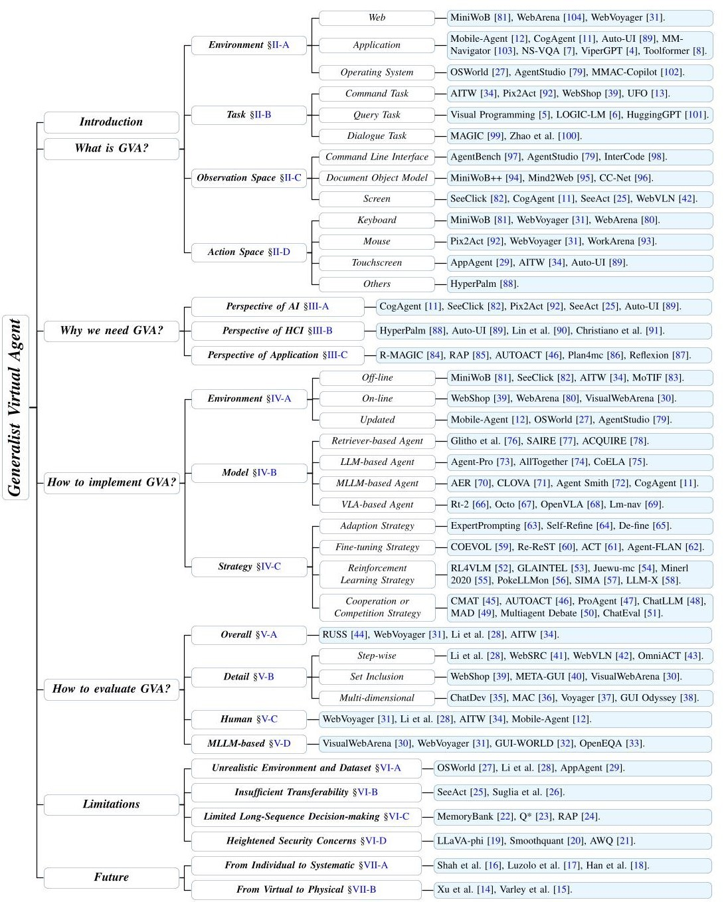
  
<small><b>图1</b> 本文的整体框架及代表性研究成果概览。</small>

# 第一章 引言

GVA 的发展标志着人工智能向人类级智能迈出了重要一步。现代大模型具备组合推理和工具使用能力，为 GVA 的开发奠定了理想基础。

Agent 这一概念源自哲学思想，在计算机科学中演变为能够代替用户自主执行任务的智能体。早期的智能助手（如 Siri 和 Cortana）仍局限于基于 API 的简单交互，但理想的 GVA 应该能够像人类一样通过观察 GUI 并推理下一步行动来处理各种任务。

近年来，基于大语言模型（LLM）和视觉语言模型（VLM）的智能体取得了显著进展，它们能够理解结构化文本和图像，并在数字环境中执行复杂任务。这些进展促使需要一个全面的调查研究来总结当前工作并指导未来发展。

  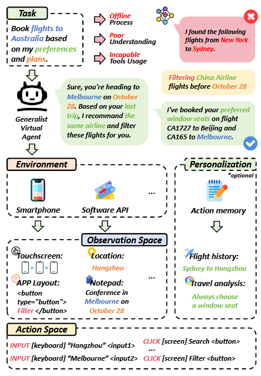
  
<small><b>图2</b> MLLMs和GVAs之间的对比：MLLMs在理解意图和使用工具方面能力有限。相反，GVAs可以系统地利用资源，并做出准确的回应。</small>

这篇综述主要探讨了四个核心问题：

- **GVA是什么？**
- **为什么需要GVA？**
- **如何实现GVA？**
- **GVA的局限性和未来前景？**

文章认为，更接近真实环境的GVA更可能展现人类般的智能。但目前的 GVA 过度依赖大模型，未来可能需要探索其他途径，如发展智能体系统或突破到具身智能领域。

# 第二章 GVA 是什么？

我们首先回顾几个现有的 Agent 相关的定义：Google提出的 Generalist Agent 专注于从机械臂操作到图像描述的多样化能力；IBM 定义的 Virtual Agent 整合了自然语言处理、智能搜索和机器人流程自动化；OpenAI 将 Agent 定义为利用大语言模型进行规划、记忆和工具使用的通用问题解决器。但这些定义都存在一定的局限性：要么忽视了数字设备环境，要么缺乏对通用任务的泛化考虑，或者在多模态感知能力方面有所不足。

针对这些局限，我们提出了<b>通用型虚拟智能体（GVA）</b>的概念，它能够利用多模态数据在虚拟环境中自主决策和完成任务。我们将GVA的构成要素归纳为**四个核心部分**：环境、任务、观察空间以及动作空间。

  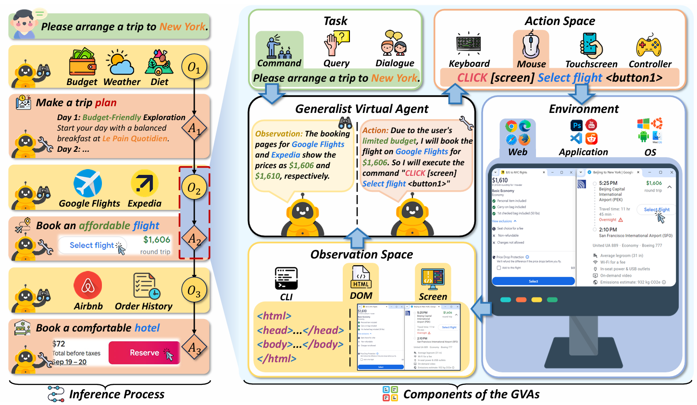
  
<small><b>图3</b> GVA 根据用户指令安排旅游行程的图示。推理过程（左）展示了 GVA 逐步制定的决策，结合用户的偏好来制定旅行计划、选择航班和预订酒店。组成部分（右）展示了任务、动作空间、观察空间和环境之间的关系。</small>

## **2.1 环境**

我们将GVA的运行环境分为**三类**：Web 环境、应用程序环境和操作系统环境。这种分类涵盖了当前研究中讨论的主要环境类型。

**Web 环境**主要在浏览器中执行任务，具有标准化的内容结构（如 HTML 和 XML）。早期研究使用简化的模拟环境（如 MiniWoB），而近期的研究（如 WorkArena、Mind2Web）转向使用真实网站进行测试，为 GVA 提供了更真实的训练场景。

**应用程序环境**则专注于特定领域的任务训练，如图像编辑和代码生成。在这种环境中，GVA 需要整合专业知识并使用特定工具来完成任务。比如 AppAgent 和 Mobile-Agent 可以管理多个应用程序，而 AITW 提供了包含大量应用和网站的基准测试集。

**操作系统环境**赋予了 GVA 更广泛的权限，使其能够在开发环境中操作、切换应用程序并促进跨应用协作。像 OSWORLD 和 AgentStudio 这样的平台为 Agent-OS 交互提供了环境和基准，而 MMAC-Copilot 则通过团队协作框架增强了 agents 的操作系统交互能力。这种环境对于培养适应性强且熟练的 GVA 至关重要。

## **2.2 任务**

我们根据任务描述的清晰程度对GVA任务进行了分类，主要包括**三类**：指令任务、询问任务和对话任务。

在**指令任务**方面，我们进一步将其细分为三种类型：单条简单指令（如导航、发信息等基础任务）、单条详细指令（如多应用协调、在线购物等复杂任务）和多条渐进指令（需要参考历史交互的序列任务）。指令任务通常具有更丰富的可访问数据和更清晰的任务描述，有助于构建大规模指令数据集。

对于**询问任务**，我们将其分为单轮询问和多轮询问两类。单轮询问类似于视觉问答任务，要求 GVA 能够理解问题并在单次交互中提供满意答案。多轮询问则需要 GVA 具备支持大上下文窗口的架构，以保持多次交互中的信息连续性。询问任务的特点是任务描述相对模糊，需要自主收集信息。

在**对话任务**方面，我们强调了其与其他任务的区别在于需要进行更接近人类对话的多轮交互，涉及幽默、上下文理解、意图识别等复杂的人类交际特征。虽然目前已有一些成功案例，如 Microsoft 的 Copilot+PC 和 Apple Intelligence，但由于缺乏可量化的评估指标，该领域仍有待进一步探索。

  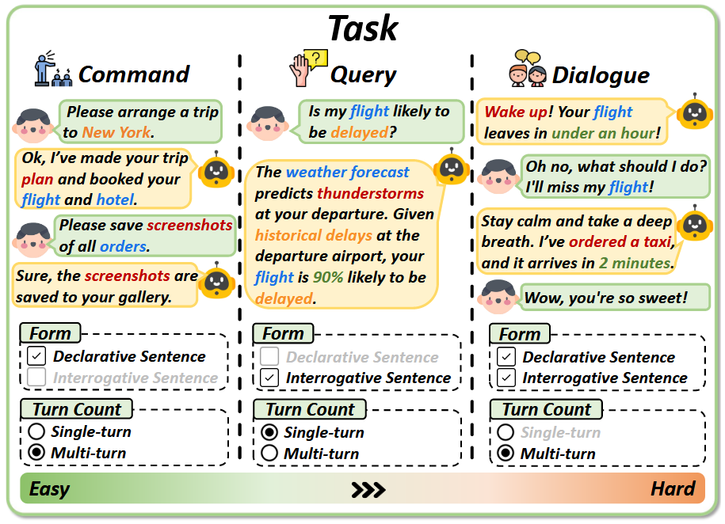
  
<small><b>图4</b> 根据描述的清晰度，我们将任务从易到难分为以下几种：1) 指令任务：任务描述清晰明确，表现为陈述句；2) 询问任务：没有步骤引导的询问，表现为疑问句；3) 对话任务：意图模糊的多轮对话。</small>

## **2.3 观察空间**

我们对 GVA 的观察空间进行了系统性总结，将其分为**三种主要形式**：命令行界面（CLI）、文档对象模型（DOM）和屏幕截图。

**CLI** 是一个基于文本的用户界面，使 GVA 能够观察到编译器输出和错误信息等实时反馈。虽然 CLI 提供了有价值的文本信息，但它无法描述元素之间的结构关系，这限制了精确的元素定位和层次化内容理解。

**DOM** 帮助 GVA 理解网页结构。一些系统使用特征映射和过滤技术来分析 DOM 结构。然而，在实际应用中，DOM 访问往往受到限制或被商业网站故意隐藏，这给数据提取和理解带来了挑战。此外，真实世界应用中 HTML 的长度经常超出标准语言模型的处理能力。

**屏幕截图**提供了视觉输入，使 GVA 能够充分利用多模态大语言模型进行更精确的感知。一些智能体可以仅使用截图就完成任务，无需结构化数据。屏幕观察与人类直觉相符，便于 GVA 与虚拟环境进行自然交互。获取屏幕观察也很简单，只需对当前屏幕状态进行截图即可，这为准确的元素定位和理解提供了丰富的视觉信息。

  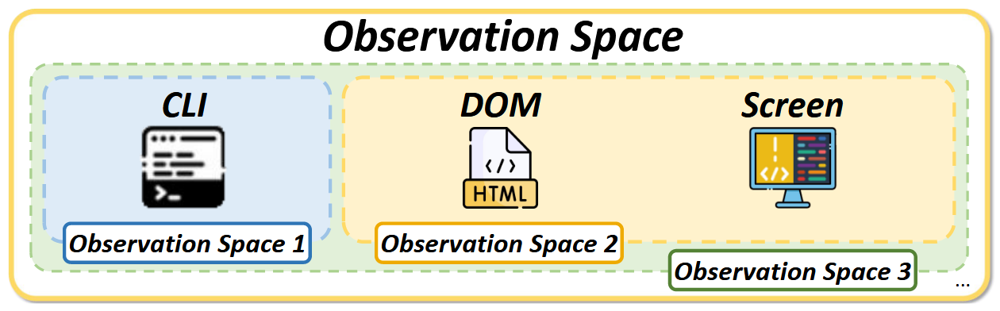
  
<small><b>图5</b> 观察空间是信息的单一或组合表示，即使是相同的环境信息，通过不同的观察空间呈现给 GVA 的效果也会不同。</small>

## **2.4 动作空间**

我们对 GVA 的动作空间进行了系统性的分类和总结。动作空间定义了 GVA 可用的交互方法，使其能够影响所处的环境。通过文献调研，我们将动作空间分为**四个主要类别**：键盘、鼠标、触摸屏和其他设备。

在**键盘**交互方面，从早期 MiniWoB 的单键输入发展到现在 Mind2Web、WebVoyager 等工作定义的多键同时输入，以及 WorkArena 引入的对于按压和释放的区分，GVA 使用键盘输入的效率得到了显著提升。

**鼠标**作为图形用户界面的核心交互设备，通过点击、拖拽、滚动等操作补全了键盘的功能。Pix2Act 将坐标离散化为 32×32 的网格，而 WebVoyager 等平台则将可点击位置限制在网页元素上，以提高准确性。

**触摸屏**操作的引入使 GVA 能够与移动设备交互。AppAgent 定义了点击、长按和滑动等操作，而 AITW 和 Auto-UI 则将拖拽和点击合并为双点手势。Mobile-Agent 还专门为 OCR 检测文本和图标检测定义了不同的点击操作。

在**其他设备**方面，我们还讨论了手柄、手势控制、语音命令接收器和脑机接口等特殊场景下的交互方式，这些扩展了 GVA 的操作域。随着技术的进步，我们预计未来的动作空间将变得更加丰富和智能，为 GVA 提供更直观的交互方式。

  
  
<small><b>表1</b> 对比不同智能体的组成部分以及复现性。</small>

  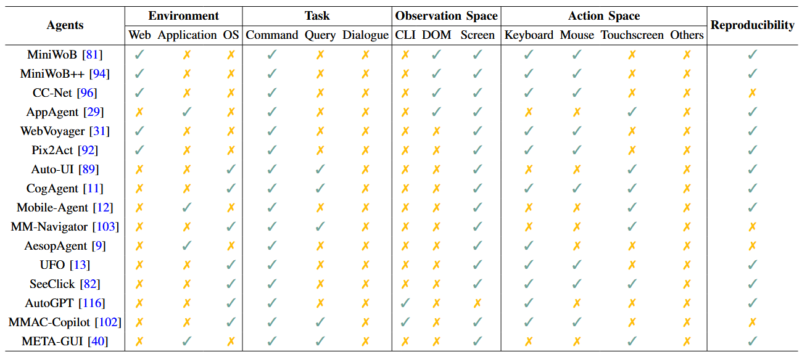

# 第三章 为什么需要 GVA？
我们认为 GVA 的重要性和影响力远超过其作为智能助手的基本角色。从人工智能、机器学习、人机交互以及实际应用等多个维度来看，GVA 都具有重要的研究价值和发展潜力。在这一章节中，我们将深入分析为什么当前急需发展 GVA 技术。

## **3.1 人工智能与机器学习**层面
GVA 在复杂动态环境中展现出的适应能力远超当前基于应用程序 API 的大模型。GVA 不仅能减轻人类的学习负担，还引入了"Grounded Language Learning"方法。与传统模型不同，GVA 通过实际观察和交互来学习，例如通过观察各种红色物体来理解"红色"的概念，这标志着机器学习从感知型向理解型的根本转变。

## **3.2 人机交互**层面
尽管目前人机交互模式已经从命令行发展到图形界面，但用户仍需要适应特定的设备界面。我们提出让机器从人类操作中学习的理念，通过 GVA 建立基于自然语言对话的新型人机交互范式。GVA 能够根据个人偏好提供反馈和建议，使人机交互更加直观自然。

## **3.3 实际应用**层面
我们发现专业工具虽然能高效执行基础任务，但缺乏跨域整合能力。具体表现在：缺乏协同组合能力、实时感知能力不足，以及学习门槛过高。因此，我们急需具备规划能力、能够实时自我更新、且用户友好的 GVA 来解决这些问题。

# 第四章 如何实现 GVA？

我们在前文讨论了 GVA 的重要性，强调了它在开拓机器学习新领域、推进自然语言交互模式以及提升效率方面的价值。尽管 GVA 意义重大，但目前很少有文献详细介绍 GVA 的具体实现方法，我们从三个核心方面阐述了 GVA 的实现框架：环境（GVA 可感知和影响的虚拟空间）、模型（作为 GVA 的大脑，负责观察环境并输出行动）以及策略（用于训练和整合模型以获得最佳性能的方法论）。这个框架全面涵盖了从零开始实现 GVA 的完整过程。

## **4.1 环境**

我们根据环境的真实程度将GVA的运行环境分为**三类**：离线环境、在线环境和动态更新环境。

**离线环境**主要由缓存的网页和静态数据集构成。虽然这类环境在真实性和可探索性方面存在局限，但它能帮助我们高效地收集大量训练数据，从而提升 GVA 的 instruction-following 能力。MiniWoB、SeeClick 和 Mind2Web 等工作都采用了这种环境进行研究。然而，由于 GVA 只能访问预先保存的状态，这种环境也存在明显缺陷：当遇到预期之外的操作时会导致任务失败，而且任务解决方案往往过于单一。

**在线环境**相比离线环境更加真实，允许 GVA 和环境自由交互并尝试不同策略。如 WebShop 模拟了包含118万个真实商品的购物网站，WebArena 则模拟了购物、内容管理、社交论坛和协作开发等多种类型的网站。这种环境有助于 GVA 提升生成多样化的解决方案的能力。

**动态更新环境**则是最接近真实场景的环境，包含了真实的网站和应用程序。如 WorkArena 基于 ServiceNow 网站，WebVoyager 包含了 Google、Arxiv 等15个真实网站，而 AppAgent 和 Mobile-Agent 则通过 ADB 工具控制真实的 Android 设备。这类环境中的广告、弹窗、验证码等意外情况都会考验 GVA 的泛化能力。我们认为，在这种真实环境中培养 GVA 的鲁棒性是未来研究的重要方向，这不仅是技术突破，也是推进 AI 向更高级智能体发展的关键一步。

  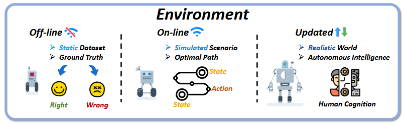
  
<small><b>图6</b> 我们根据环境与现实的相似程度将其分为三种类型：1) 离线：静态数据集环境，学习目标是拟合 ground truth；2) 在线：模拟的可交互环境，目标是学习最优路径；3) 动态更新：真实世界环境，学习目标与人类认知对齐。</small>

## **4.2 模型**
作为一个自主智能体，GVA 需要一个多功能的"核心大脑"来理解指令和做出决策。我们将GVA的核心模型分为**四类**：检索器型、基于大语言模型、基于多模态大语言模型和基于视觉-语言-动作模型。每种模型都具有其独特的特点和优势，适用于不同的交互和需求。

**检索器型**智能体主要依赖先进的检索系统，能够从大型数据库中高效提取和处理信息。虽然在实时查询管理方面表现出色，但其推理和个性化能力有限。随着大语言模型的兴起，检索器已经逐渐转向辅助角色。

**基于大语言模型**的智能体因其卓越的自然语言处理能力而受到青睐，能够理解复杂的语言结构并生成连贯的响应。然而，其以文本为中心的特性限制了与人类直观交互的能力。

**基于多模态大语言模型**的智能体通过处理多种数据模态，增强了与用户的交互能力，能够在多样化的上下文中处理输入并生成跨模态输出。这种多模态能力使得智能体在数字环境中更接近人类的交互方式。

**基于视觉-语言-动作模型**的智能体结合了视觉处理、语言理解和动作决策，能够在复杂环境中高效适应和响应。它们在服务机器人、自动驾驶和交互系统中展现出强大的感知和响应能力，推动了具身智能体的发展。

  
<small><b>表2</b> GVA 模型类别及其各自的基础模型。</small>

  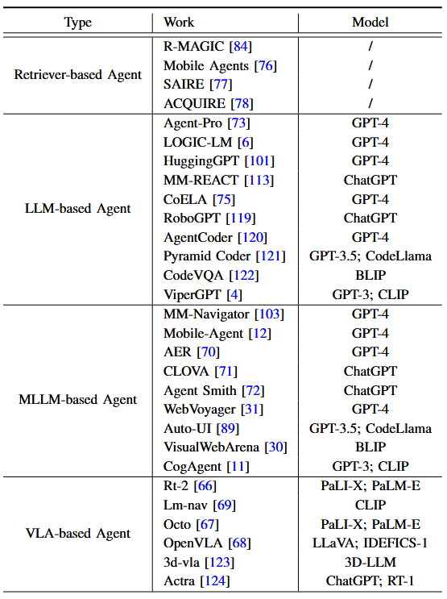

## **4.3 策略**
我们将 GVA 的策略分为**四大类**：适应策略、微调策略、强化学习策略以及合作竞争策略。

**适应策略**不需要整体模型训练，主要包括提示策略、反馈策略和记忆策略。提示策略通过详细的任务描述或上下文示例来引导模型行为；反馈策略整合自身或其他智能体的输出来优化初始响应；记忆策略则通过"存储-处理-行动"机制来管理信息。这种策略的优势在于简单直接，无需重新训练，但需要清晰的任务描述。

**微调策略**从预训练模型开始，通过在特定小数据集上进行额外训练来调整模型参数。这种方法需要高质量的数据支持，目前主要关注如何提升学习样本质量。虽然微调策略在特定任务上表现优异，但存在过拟合风险。

**强化学习策略**特别适用于个性化场景，通过设计合理的奖励函数来指导模型探索环境并找到最优行动序列。这种方法让智能体能够通过试错来优化行为，减少对专家知识的依赖。

**合作竞争策略**则关注多智能体系统中的交互和沟通。智能体可以通过辩论和竞争来提升能力，或者通过协作来完成复杂任务。这种策略模仿了人类社会中的分工协作模式，为未来 GVA 研究指明了方向。

  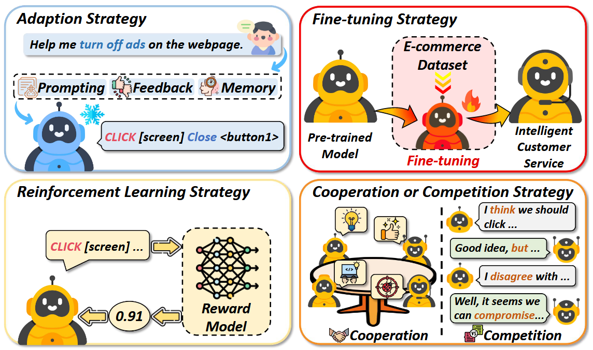
  
<small><b>图7</b> 四种各具特色的 GVA 实现策略。</small>

# 第五章 如何评估 GVA？

我们注意到，随着 GVA 能力的不断扩展，其评估方法也需要相应发展以全面评估其推理、规划和工具使用等多方面能力。虽然现有研究提供了多种评估策略，但这些研究往往局限于特定任务或步骤，缺乏对智能体系统性和综合性表现的标准化评估指南。

针对这一问题，我们提出了一个通用的 GVA 评估框架，包含**四个主要维度**：整体评估、细节评估、人工评估和基于多模态大语言模型的评估。整体评估主要通过与标准答案的对比进行粗粒度的定量评估；细节评估则针对过程和模块进行细粒度的多维度定量评估；人工评估基于高质量的人工监督进行直接的定性评估；而基于多模态大语言模型的评估则提供了一种高效的定性评估方法。

  
<small><b>表3</b> 我们列举了定量和定性评估方法，并在表格中列出了每种方法的代表性评价指标名称。对于名称相同但含义不同的指标，我们用星号（*）加以区分。</small>

  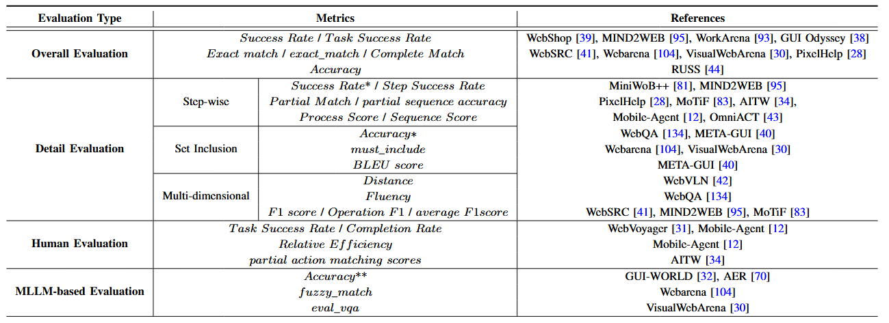

## **5.1 整体评估**
我们将 GVA 的整体评估定义为一种粗粒度的二元分类方法，主要通过将输出与标准答案进行对比来进行评估。这种方法简单直观，适用于任务完成度或基准测试等一般场景，能够直接告知用户智能体是否完成了任务。
在具体实践中，我们主要使用任务完成的成功率（Success Rate, SR）作为评估指标，其计算公式为：
$$
SR=\frac{1}{N}\sum^N_{i=1}\mathbb{I}[a_i=\hat a_i]
$$
其中 N 为问题数量，$a_i$表示第 i 个问题的标准答案，$\hat a_i$表示智能体的输出结果。指示函数$\mathbb{I}[]$在括号内元素相等时返回1，否则返回0。

然而，这种整体评估方法存在局限性：评分为1并不一定意味着高效完成任务，因为智能体可能消耗了过多的时间和资源；评分为0也不代表完全失败，因为它可以帮助识别需要改进的领域。因此，我们认为不应该仅依赖这种评估方法，而是需要更详细和全面的评估方法。

## **5.2 细节评估**

我们将 GVA 的细节评估分为三个主要方面：步骤评估、集合包含评估和多维度评估。这种细粒度的评估方法能够更全面地衡量智能体的任务完成过程和具体模块表现。

在**步骤评估**方面，我们主要关注智能体完成任务的顺序动作步骤。基本评分公式为：
$$
StepScore_{div}=\frac{Num_{mat}}{Num_{sum}}
$$
其中$Num_{mat}$是正确执行的步骤数，$Num_{sum}$是总步骤数。某些研究还引入了序列评分：
$$
SeqScore_i=\begin{cases} \beta_1+\beta_2(s-1), & \text{如果所有动作匹配} \\ 0, & \text{其他情况}\end{cases}
$$

在**集合包含评估**方面，我们将智能体视为模块集合或将输出结果视为属性集合进行评估。例如，WebShop 设计了一个奖励函数来评估产品购买的符合度：
$$
r=r_{type}\cdot\frac{|U_{att}\cap Y_{att}|+|U_{opt}\cap Y_{opt}|+1[y_{price}\leq u_{price}]}{|U_{att}|+|U_{opt}|+1}
$$
在**多维度评估**方面，我们总结了四个关键维度：效率指标（关注最短路径、资源消耗等）、人类相似度指标（评估与人类行为的相似程度）、有害性指标（评估交互的安全性和适当性）以及统计参考指标（如 F1 分数等统计指标）。这种多维度评估方法为智能体性能提供了更全面的评估视角，但目前仍缺乏统一的评估标准。

  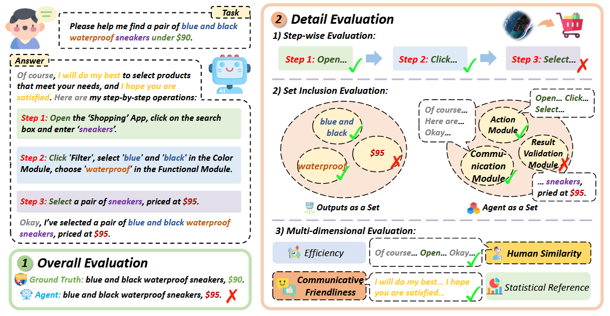
  
<small><b>图8</b> 我们说明了定量任务中使用的两种评估方法之间的区别：1) 整体评估：粗粒度的二元分类，将输出与 ground truth 进行比较；2) 细节评估：对过程和模块进行细粒度、多维度的评估。此外，本示例还展示了用于细节评估的三种不同方法。</small>

## **5.3 人工评估**
我们认为人工评估对于评价自动化工具难以准确评估的方面（如图灵测试场景中的人类相似度）至关重要。这种基于高质量人工监督的方法为评估 GVA 提供了直观可靠的途径，能够提供个性化的定性评估，深入洞察智能体模仿人类行为和交互的能力。

在具体实践中，我们发现一些研究已经开展了有意义的尝试。例如 WebVoyager 使用二元分类来判断任务完成情况，AITW 在移动应用场景中评估逐步操作的准确性，而 Mobile-Agent 则引入了"相对效率"指标来比较智能体与人工操作的步骤，以衡量其人性化程度。

然而，我们也注意到人工评估面临着成本高、效率低和评估者偏差等挑战。手动评估过程增加了人力成本并降低了处理速度，而不同评估者可能带来的认知偏差则影响了结果的可复现性和可比性。

## **5.4 基于多模态大语言模型的评估**
基于多模态大语言模型的评估方法可以应对传统评估方法的局限性。这种方法使用 GPT-4 和 BLIP-2 等先进模型代替人工监督，标志着评估方法的重要转变。这些拥有万亿参数的智能 MLLM 具备强大的理解能力，能够处理各种复杂问题。

我们发现，像 VisualWebArena 和 WebVoyager 这样的工作已经开始使用这些模型来评估智能体输出与标准答案之间的相似度和任务完成情况。GUI-WORLD 等研究通过让 MLLM 对开放式回答和对话进行评分，验证了 MLLM 评估方法与人工评估的一致性，证明了它们在处理传统需要人工监督的评估任务时的效率和准确性。

当 MLLM 评估与人工评估相结合时，可以充分发挥两者的优势：MLLM 的快速分析能力和人类评估者的细致理解能力。这种组合提供了更全面和精确的评估方法，同时也实现了成本效益和便利性的平衡。

  
  
<small><b>图9</b> 在定性评估中，人工评估往往是高质量和不可复现的。与之相对地，基于 MLLM 的评估则具有较差的可解释性和良好的一致性。</small>

# 第六章 GVA 的局限性
我们总结了 GVA 发展过程中面临的**四个主要局限性**。尽管智能体社区取得了实质性进展，但在一些特定场景（如不熟悉的任务、在线支付等）中仍需要人工干预。

## **6.1 不真实的环境和数据集**
尽管智能体在学术界备受关注，但其实际表现仍未达到预期水平。这主要是因为当前的操作环境缺乏足够的真实性，数据集也不够全面，无法有效模拟真实世界中无数的状态和场景，因此难以培养出在各个领域都精通的通用型智能体。

## **6.2 迁移性不足**
我们发现 GVA 在迁移性方面存在明显不足。例如，同一个智能体在 Google Maps 上表现出色，但在 Apple Maps 上却可能表现欠佳。这种差异可能源于过度拟合或平台逻辑的差异，表明当前的 GVA 往往只是机械地执行操作程序，而没有真正掌握任务的核心原理。

## **6.3 长序列决策能力有限**
我们发现智能体在处理"回滚"等操作时往往力不从心，这主要是由于缺乏内部世界模型，无法有效预测环境条件和模拟长期结果。这种缺陷限制了智能体像人类一样进行规划和适应的能力，特别是在需要迭代改进和探索不同推理路径的场景中。

## **6.4 安全性问题**
我们指出了 GVA 在运行过程中需要大量系统权限，这带来了显著的安全和隐私风险。特别是在提供个性化服务时，智能体需要访问大量用户数据，这加剧了个性化服务和隐私保护之间的矛盾。

# 第七章 GVA 的未来展望
我们认为 GVA 的未来发展将呈现**两个主要趋势**：从单一智能体向多智能体协同系统发展，以及从虚拟世界向物理世界延伸。

## **7.1 系统化**
人工智能领域正在经历从部署独立智能体向采用系统性智能体框架的重要范式转变。"系统化"不仅仅意味着增加智能体数量，更重要的是开发一个专门的层级来无缝集成用户和操作系统之间的所有操作。这个层级将复杂的底层进程委托给专门的智能体，类似于操作系统革新了软硬件资源的协调和分配方式。目前的计算产业发展已经反映出这一趋势：内容平台上的智能体协助用户生成和修改内容；在操作系统层面，苹果公司推出的 Apple Intelligence 实现了系统级别的智能体能力整合；在硬件方面，各种张量处理单元（TPUs）的设计都是为了支持基于智能体的模型计算需求。

## **7.2 实体化**
我们正在突破纯软件系统的限制，将物理实体化作为提升智能系统适应性和功能性的新途径。这种转变不仅仅是向现有算法添加物理组件，更是将智能重新定义为智能体与环境之间动态互动的产物。配备传感器和执行器的具身智能体不再是预编程指令的被动接收者，而是环境中的主动参与者。具身智能作为一种新兴的研究视角和方法论，正在重塑我们对智能体本质和发展的理解。通过这样的系统，机器人能够更深入地理解物理世界并与之进行更有效的互动，从而实现更自然和高效的服务与协作。

# 第八章 总结
在这篇综述中，我们对<b>通用型虚拟智能体（GVA）</b>进行了全面回顾。GVA 作为一种新型智能体范式，能够利用多模态数据在虚拟环境中自主运行。通过系统性研究分析，我们发现在更接近真实世界的环境中运行的 GVA 更可能表现出人类水平的智能。然而，我们也注意到当前研究过度依赖大模型，这可能会在模型发展遇到瓶颈时带来风险。因此，我们建议 GVA 应该从传统工具向复杂的智能体系统演进，以增强人机交互能力。同时，我们也提倡突破数字领域的限制，向具身智能方向发展。这种方法可能会显著扩展 GVA 的能力和应用范围，从根本上改变其在技术和社会中的角色。