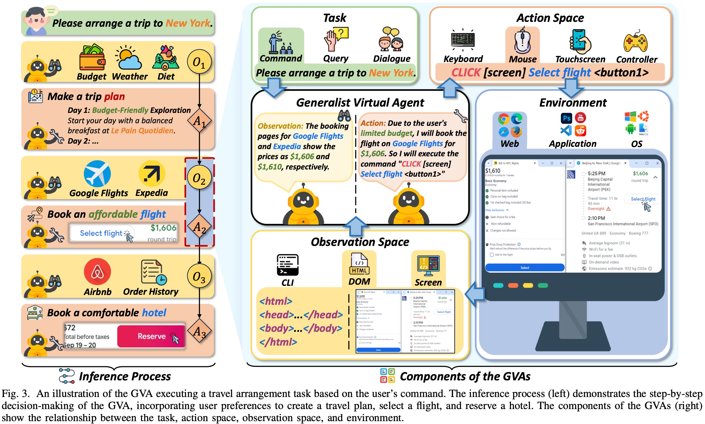

<div align="center"><h2>Generalist Virtual Agents: A Survey on Autonomous Agents Across Digital Platforms</h2></div>

<p align="center">
    <!-- arxiv badges -->
    <a href="https://arxiv.org/abs/2411.10943">
        
    </a>
    <!-- Chinese Version -->
    <a href="./CN_survey.md">
        
    </a>
    <!-- Github -->
    <a href="https://github.com/wendell0218/GVA-Survey">
        
    </a>
    <!-- HuggingFace -->
    <!-- <a href="https://huggingface.co/papers/2411.10943">
        
    </a> -->
    <!-- Last commit -->
    
</p>

<div align="center">
    <p>
        <a href="https://scholar.google.com/citations?user=xMORwU8AAAAJ">Minghe Gao</a><sup>1</sup>, 
        <a>Wendong Bu</a><sup>1</sup>, 
        <a>Bingchen Miao</a><sup>1</sup>,
        <a>Yang Wu</a><sup>2</sup>, 
        <a>Yunfei Li</a><sup>2</sup>, <br>
        <a href="https://scholar.google.com/citations?user=lm9s-QgAAAAJ">Juncheng Li</a><sup>1†</sup>,
        <a href="https://scholar.google.com/citations?user=8e7H3PcAAAAJ">Siliang Tang</a><sup>1</sup>,
        <a href="https://scholar.google.com/citations?user=aKXe1FEAAAAJ">Qi Wu</a><sup>3</sup>,
        <a href="https://scholar.google.com/citations?user=1RD7UJAAAAAJ">Yueting Zhuang</a><sup>1</sup>,
        <a href="https://scholar.google.com/citations?user=rHagaaIAAAAJ">Meng Wang</a><sup>4</sup>
    </p>
    <p>
        <sup>1</sup><a href="https://www.zju.edu.cn">Zhejiang University, Hangzhou, China</a> <br>
        <sup>2</sup><a href="https://www.antgroup.com">Antgroup, China</a> <br>
        <sup>3</sup><a href="https://www.adelaide.edu.au">The University of Adelaide, Adelaide, Australia</a> <br>
        <sup>4</sup><a href="https://www.hfut.edu.cn">Hefei University of Technology, Hefei, China</a>
    </p>
</div>

<div align="center"><small><sup>†</sup>Corresponding author: Juncheng Li (<a href="mailto:junchengli@zju.edu.cn">junchengli@zju.edu.cn</a>)</small></div>

## 🔥 News
- **[December 7, 2024]** We have released a Chinese version of the survey, please click [中文版综述](./CN_survey.md) to access!
- **[November 17, 2024]** Our survey paper is available on the arXiv platform: https://arxiv.org/abs/2411.10943

## 📖 Table of Content
- [Introduction](#-introduction)

- [Paper List](#-paper-list)

- [How to Contribute](#-how-to-contribute)

- [Citation](#-citation)

## 🤖 Introduction

Welcome to the GitHub repository for our survey paper titled *"Generalist Virtual Agents: A Survey on Autonomous Agents Across Digital Platforms"*. This repository includes all the resources, code, and references related to the paper. Our objective is to provide a comprehensive overview of **Generalist Virtual Agents (GVAs)**, covering their definition, necessity, implementation approaches, evaluation methods, limitations and future directions. We aim to bridge the gap between theory and practice in GVA research, providing a systematic framework for future development in this field.

<div align="center">
  
</div>

## 📚 Paper List


## 💪 How to Contribute
If you have a paper or are aware of relevant research that should be incorporated, please contribute via pull requests, issues, email, or other suitable methods.


## 📝 Citation
If you find this survey useful, please cite our paper:
```
@article{gao2024generalist,
  title={Generalist virtual agents: A survey on autonomous agents across digital platforms},
  author={Gao, Minghe and Bu, Wendong and Miao, Bingchen and Wu, Yang and Li, Yunfei and Li, Juncheng and Tang, Siliang and Wu, Qi and Zhuang, Yueting and Wang, Meng},
  journal={arXiv preprint arXiv:2411.10943},
  year={2024}
}
```
