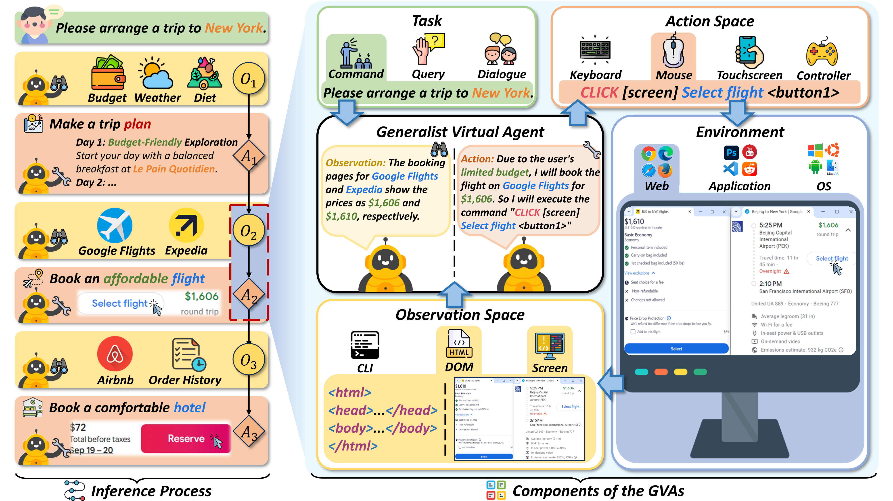
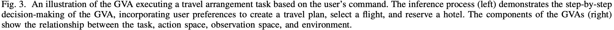
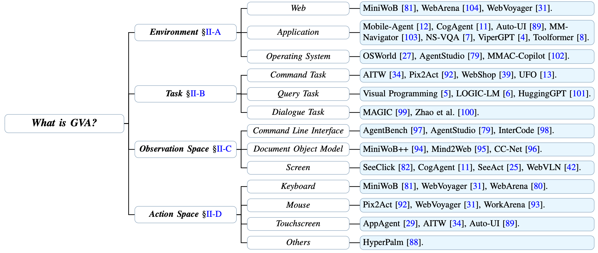
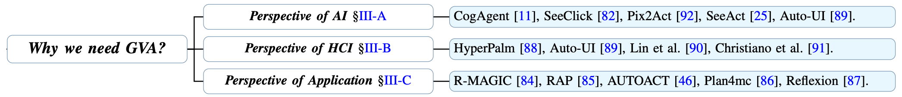
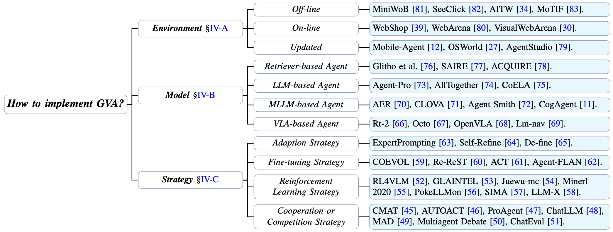
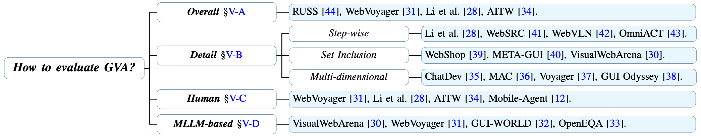
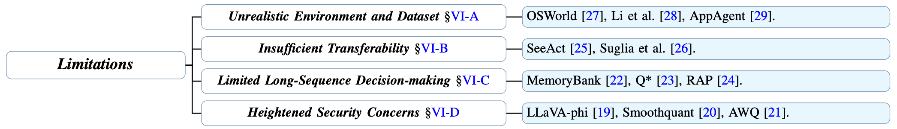

<div align="center"><h2>Generalist Virtual Agents: A Survey on Autonomous Agents Across Digital Platforms</h2></div>

<p align="center">
  <!-- arxiv badges -->
  <a href="https://arxiv.org/abs/2411.10943">
    
  </a>
  <!-- Chinese Version -->
  <a href="./CN_survey.md">
    
  </a>
  <!-- Github -->
  <a href="https://github.com/wendell0218/GVA-Survey">
    
  </a>
  <!-- HuggingFace -->
  <!-- <a href="https://huggingface.co/papers/2411.10943">
    
  </a> -->
  <!-- Last commit -->
  
</p>

<div align="center">
  <p>
    <a href="https://scholar.google.com/citations?user=xMORwU8AAAAJ">Minghe Gao</a><sup>1</sup>, 
    <a>Wendong Bu</a><sup>1</sup>, 
    <a>Bingchen Miao</a><sup>1</sup>,
    <a>Yang Wu</a><sup>2</sup>, 
    <a>Yunfei Li</a><sup>2</sup>, <br>
    <a href="https://scholar.google.com/citations?user=lm9s-QgAAAAJ">Juncheng Li</a><sup>1†</sup>,
    <a href="https://scholar.google.com/citations?user=8e7H3PcAAAAJ">Siliang Tang</a><sup>1</sup>,
    <a href="https://scholar.google.com/citations?user=aKXe1FEAAAAJ">Qi Wu</a><sup>3</sup>,
    <a href="https://scholar.google.com/citations?user=1RD7UJAAAAAJ">Yueting Zhuang</a><sup>1</sup>,
    <a href="https://scholar.google.com/citations?user=rHagaaIAAAAJ">Meng Wang</a><sup>4</sup>
  </p>
  <p>
    <sup>1</sup><a href="https://www.zju.edu.cn">Zhejiang University, Hangzhou, China</a> <br>
    <sup>2</sup><a href="https://www.antgroup.com">Antgroup, China</a> <br>
    <sup>3</sup><a href="https://www.adelaide.edu.au">The University of Adelaide, Adelaide, Australia</a> <br>
    <sup>4</sup><a href="https://www.hfut.edu.cn">Hefei University of Technology, Hefei, China</a>
  </p>
</div>

<div align="center"><small><sup>†</sup>Corresponding author: Juncheng Li (<a href="mailto:junchengli@zju.edu.cn">junchengli@zju.edu.cn</a>)</small></div>

## 🔥 News

- **[December 10, 2024]** We have developed an agent that automatically collects and analyzes the latest papers in the GVA field. It will update the [Related Papers](#-related-papers) daily at 0:30 AM UTC+8.

- **[December 7, 2024]** We have released a Chinese version of the survey, please click [中文版综述](./CN_survey.md) to access!

- **[November 17, 2024]** Our survey is available on the arXiv platform: https://arxiv.org/abs/2411.10943

## 📖 Table of Content
- [Introduction](#-introduction)

- [Cited Papers](#-cited-papers)

- [Related Papers](#-related-papers)

- [How to Contribute](#-how-to-contribute)

- [Citation](#-citation)

## 🤖 Introduction

Welcome to the GitHub repository for our survey paper titled *"Generalist Virtual Agents: A Survey on Autonomous Agents Across Digital Platforms"*. This repository includes all the resources, code, and references related to the paper. Our objective is to provide a comprehensive overview of **Generalist Virtual Agents (GVAs)**, covering their definition, necessity, implementation approaches, evaluation methods, limitations and future directions. We aim to bridge the gap between theory and practice in GVA research, providing a systematic framework for future development in this field.

<div align="center">
   <br>
  
</div>

## 📚 Cited Papers

Here we list the most important references cited in our survey, organized by different sections. We particularly focus on works that have made substantial impact or proposed innovative methodologies.

Additionally, we note that some papers may be cited across multiple sections. For the convenience of researchers, we provide complete citation information under each section. 

### Section II: What is GVA?


#### Environment - Web

- **World of bits: an open-domain platform for web-based agents**
  
  OpenAI, ICML, 2017
  [](http://proceedings.mlr.press/v70/shi17a)

- **Reinforcement Learning on Web Interfaces using Workflow-Guided Exploration**
  
  Stanford University, ICLR, 2018
  [](https://arxiv.org/pdf/1802.08802)
  [](https://github.com/stanfordnlp/wge)

- **WebShop: Towards Scalable Real-World Web Interaction with Grounded Language Agents**
  
  Department of Computer Science, Princeton University, NeurIPS, 2022
  [](https://arxiv.org/pdf/2207.01206)
  [](https://webshop-pnlp.github.io)

- **WebArena: A Realistic Web Environment for Building Autonomous Agents**
  
  Carnegie Mellon University, ICLR, 2024
  [](https://arxiv.org/pdf/2307.13854)
  [](https://webarena.dev/)

- **VisualWebArena: Evaluating Multimodal Agents on Realistic Visual Web Tasks**
  
  Carnegie Mellon University, arXiv preprint arXiv:2401.13649, 2024
  [](https://arxiv.org/pdf/2401.13649)

- **WorkArena: How Capable Are Web Agents at Solving Common Knowledge Work Tasks?**
  
  ServiceNow Research, arXiv preprint arXiv:2403.07718, 2024
  [](https://arxiv.org/pdf/2403.07718)
  [](https://github.com/ServiceNow/WorkArena)

- **Mind2Web: Towards a Generalist Agent for the Web**
  
  The Ohio State University, NeurIPS, 2023
  [](https://arxiv.org/pdf/2306.06070)
  [](https://github.com/OSU-NLP-Group/Mind2Web)
  [](https://osu-nlp-group.github.io/Mind2Web)

- **WebVLN: Vision-and-Language Navigation on Websites**
  
  Australian Institute for Machine Learning, The University of Adelaide, AAAI, 2024
  [](https://arxiv.org/pdf/2312.15820)
  [](https://github.com/WebVLN/WebVLN)

#### Environment - Application
- **AppAgent: Multimodal Agents as Smartphone Users**
  
  Tencent, arXiv preprint arXiv:2312.13771, 2023
  [](https://arxiv.org/pdf/2312.13771)
  [](https://appagent-official.github.io/)

- **Mobile-Agent: Autonomous Multi-Modal Mobile Device Agent with Visual Perception**
  
  Beijing Jiaotong University, arXiv preprint arXiv:2401.16158, 2024
  [](https://arxiv.org/pdf/2401.16158)
  [](https://github.com/X-PLUG/MobileAgent)

- **A Dataset for Interactive Vision Language Navigation with Unknown Command Feasibility**
  
  Boston University, ECCV, 2022
  [](https://arxiv.org/pdf/2202.02312)

- **AndroidInTheWild: A Large-Scale Dataset For Android Device Control**
  
  DeepMind, NeurIPS, 2023
  [](https://arxiv.org/pdf/2307.10088)

- **Logic-LM: Empowering Large Language Models with Symbolic Solvers for Faithful Logical Reasoning**
  
  University of California, Santa Barbara, EMNLP, 2023
  [](https://arxiv.org/pdf/2305.12295)
  [](https://github.com/teacherpeterpan/Logic-LLM)

- **Neural-Symbolic VQA: Disentangling Reasoning from Vision and Language Understanding**
  
  Harvard University, NeurIPS, 2018
  [](https://arxiv.org/pdf/1810.02338)

- **Visual Programming: Compositional visual reasoning without training**
  
  PRIOR @ Allen Institute for AI, CVPR, 2023
  [](https://arxiv.org/pdf/2211.11559)

- **Toolformer: Language Models Can Teach Themselves to Use Tools**
  
  Meta AI Research, NeurIPS, 2023
  [](https://arxiv.org/pdf/2302.04761)

- **AesopAgent: Agent-driven Evolutionary System on Story-to-Video Production**
  
  DAMO Academy, Alibaba Group, arXiv preprint arXiv:2403.07952, 2024
  [](https://arxiv.org/pdf/2403.07952)
  [](https://aesopai.github.io/)

#### Environment - Operating System
- **OSWorld: Benchmarking Multimodal Agents for Open-Ended Tasks in Real Computer Environments**

  The University of Hong Kong, arXiv preprint arXiv:2404.07972, 2024
  [](https://arxiv.org/pdf/2404.07972)
  [](https://github.com/xlang-ai/OSWorld)
  [](https://os-world.github.io)

- **AgentStudio: A Toolkit for Building General Virtual Agents**

  NTU, Singapore, arXiv preprint arXiv:2403.17918, 2024
  [](https://arxiv.org/pdf/2403.17918)
  [](https://computer-agents.github.io/agent-studio)

- **MMAC-Copilot: Multi-modal Agent Collaboration Operating System Copilot**

  University of Technology Sydney, arXiv preprint arXiv:2404.18074, 2024
  [](https://arxiv.org/pdf/2404.18074)

- **UFO: A UI-Focused Agent for Windows OS Interaction**

  Microsoft, arXiv preprint arXiv:2402.07939, 2024
  [](https://arxiv.org/pdf/2402.07939)
  [](https://github.com/microsoft/UFO)

#### Task - Command Task
- **AppAgent: Multimodal Agents as Smartphone Users**

  Tencent, arXiv preprint arXiv:2312.13771, 2023
  [](https://arxiv.org/pdf/2312.13771)
  [](https://appagent-official.github.io/)

- **Android In The Wild: A Large-Scale Dataset For Android Device Control**

  DeepMind, NeurIPS, 2023
  [](https://arxiv.org/pdf/2307.10088)

- **UFO: A UI-Focused Agent for Windows OS Interaction**

  Microsoft, arXiv preprint arXiv:2402.07939, 2024
  [](https://arxiv.org/pdf/2402.07939)
  [](https://github.com/microsoft/UFO)

- **From Pixels to UI Actions: Learning to Follow Instructions via Graphical User Interfaces**

  Google DeepMind, NeurIPS, 2023
  [](https://arxiv.org/pdf/2306.00245)
  [](https://github.com/google-deepmind/pix2act)

- **WebShop: Towards Scalable Real-World Web Interaction with Grounded Language Agents**

  Department of Computer Science, Princeton University, NeurIPS, 2022
  [](https://arxiv.org/pdf/2207.01206)
  [](https://webshop-pnlp.github.io)

#### Task - Query Task
- **ViperGPT: Visual Inference via Python Execution for Reasoning**

  Columbia University, ICCV, 2023
  [](https://arxiv.org/pdf/2303.08128)

- **Visual Programming: Compositional visual reasoning without training**

  PRIOR @ Allen Institute for AI, CVPR, 2023
  [](https://arxiv.org/pdf/2211.11559)

- **Logic-LM: Empowering Large Language Models with Symbolic Solvers for Faithful Logical Reasoning**

  University of California, Santa Barbara, EMNLP, 2023
  [](https://arxiv.org/pdf/2305.12295)
  [](https://github.com/teacherpeterpan/Logic-LLM)

- **HuggingGPT: Solving AI Tasks with ChatGPT and its Friends in Hugging Face**

  Zhejiang University, NeurIPS, 2023
  [](https://arxiv.org/pdf/2303.17580)
  [](https://github.com/microsoft/JARVIS)

- **Mm-react: Prompting chatgpt for multimodal reasoning and action**

  Microsoft Azure AI, arXiv preprint arXiv:2303.11381, 2023
  [](https://arxiv.org/pdf/2303.11381)
  [](https://multimodal-react.github.io/)

- **WebVLN: Vision-and-Language Navigation on Websites**

  Australian Institute for Machine Learning, The University of Adelaide, AAAI, 2024
  [](https://arxiv.org/pdf/2312.15820)
  [](https://github.com/WebVLN/WebVLN)

#### Task - Dialogue Task
- **Windows Copilot Plus for PCs**

  Microsoft, 2024
  [](https://www.microsoft.com/en-us/windows/copilot-plus-pcs)

- **Apple Intelligence Overview**

  Apple, 2024
  [](https://www.apple.com/apple-intelligence)

- **NICE: Neural Image Commenting with Empathy**

  Microsoft, EMNLP, 2021
  [](https://aclanthology.org/2021.findings-emnlp.380.pdf)

- **Is ChatGPT Equipped with Emotional Dialogue Capabilities?**

  Harbin Institute of Technology, China, arXiv preprint arXiv:2304.09582, 2023
  [](https://arxiv.org/pdf/2304.09582)

#### Observation Space - Command Line Interface
- **AutoGPT**

  OpenAI, 2024
  [](https://github.com/Significant-Gravitas/AutoGPT)

- **OSWorld: Benchmarking Multimodal Agents for Open-Ended Tasks in Real Computer Environments**

  The University of Hong Kong, arXiv preprint arXiv:2404.07972, 2024
  [](https://arxiv.org/pdf/2404.07972)
  [](https://github.com/xlang-ai/OSWorld)
  [](https://os-world.github.io)

- **AgentBench: Evaluating LLMs as Agents**

  Tsinghua University, ICLR, 2024
  [](https://arxiv.org/pdf/2308.03688)
  [](https://github.com/THUDM/AgentBench)
  [](https://llmbench.ai/agent)

- **AgentStudio: A Toolkit for Building General Virtual Agents**

  NTU, Singapore, arXiv preprint arXiv:2403.17918, 2024
  [](https://arxiv.org/pdf/2403.17918)
  [](https://computer-agents.github.io/agent-studio)

- **InterCode: Standardizing and Benchmarking Interactive Coding with Execution Feedback**

  Department of Computer Science, Princeton University, NeurIPS, 2023
  [](https://arxiv.org/pdf/2306.14898)
  [](https://github.com/princeton-nlp/intercode)
  [](https://intercode-benchmark.github.io/)

#### Observation Space - Document Object Model
- **World of bits: an open-domain platform for web-based agents**

  OpenAI, ICML, 2017
  [](http://proceedings.mlr.press/v70/shi17a)

- **Reinforcement Learning on Web Interfaces using Workflow-Guided Exploration**

  Stanford University, ICLR, 2018
  [](https://arxiv.org/pdf/1802.08802)
  [](https://github.com/stanfordnlp/wge)

- **WebShop: Towards Scalable Real-World Web Interaction with Grounded Language Agents**

  Department of Computer Science, Princeton University, NeurIPS, 2022
  [](https://arxiv.org/pdf/2207.01206)
  [](https://webshop-pnlp.github.io)

- **Mind2Web: Towards a Generalist Agent for the Web**

  The Ohio State University, NeurIPS, 2023
  [](https://arxiv.org/pdf/2306.06070)
  [](https://github.com/OSU-NLP-Group/Mind2Web)
  [](https://osu-nlp-group.github.io/Mind2Web)

- **AppAgent: Multimodal Agents as Smartphone Users**

  Tencent, arXiv preprint arXiv:2312.13771, 2023
  [](https://arxiv.org/pdf/2312.13771)
  [](https://appagent-official.github.io/)

- **A data-driven approach for learning to control computers**

  DeepMind, London, United Kingdom, ICML, 2022
  [](https://arxiv.org/pdf/2202.08137)

#### Observation Space - Screen
- **You Only Look at Screens: Multimodal Chain-of-Action Agents**

  School of Electronic Information and Electrical Engineering, Shanghai Jiao Tong University, arXiv preprint arXiv:2309.11436, 2024
  [](https://arxiv.org/pdf/2309.11436)
  [](https://github.com/cooelf/Auto-GUI)

- **SeeClick: Harnessing GUI Grounding for Advanced Visual GUI Agents**

  Department of Computer Science and Technology, Nanjing University, arXiv preprint arXiv:2401.10935, 2024
  [](https://arxiv.org/pdf/2401.10935)
  [](https://github.com/njucckevin/SeeClick)

- **WebVLN: Vision-and-Language Navigation on Websites**

  Australian Institute for Machine Learning, The University of Adelaide, AAAI, 2024
  [](https://arxiv.org/pdf/2312.15820)
  [](https://github.com/WebVLN/WebVLN)

- **From Pixels to UI Actions: Learning to Follow Instructions via Graphical User Interfaces**

  Google DeepMind, NeurIPS, 2023
  [](https://arxiv.org/pdf/2306.00245)
  [](https://github.com/google-deepmind/pix2act)

- **GPT-4V(ision) is a Generalist Web Agent, if Grounded**

  The Ohio State University, arXiv preprint arXiv:2401.01614, 2024
  [](https://arxiv.org/pdf/2401.01614)
  [](https://github.com/OSU-NLP-Group/SeeAct)
  [](https://osu-nlp-group.github.io/SeeAct)

- **UFO: A UI-Focused Agent for Windows OS Interaction**

  Microsoft, arXiv preprint arXiv:2402.07939, 2024
  [](https://arxiv.org/pdf/2402.07939)
  [](https://github.com/microsoft/UFO)

- **GPT-4V in Wonderland: Large Multimodal Models for Zero-Shot Smartphone GUI Navigation**

  UC San Diego, arXiv preprint arXiv:2311.07562, 2023
  [](https://arxiv.org/pdf/2311.07562)
  [](https://github.com/zzxslp/MM-Navigator)

- **Mobile-Agent: Autonomous Multi-Modal Mobile Device Agent with Visual Perception**

  Beijing Jiaotong University, arXiv preprint arXiv:2401.16158, 2024
  [](https://arxiv.org/pdf/2401.16158)
  [](https://github.com/X-PLUG/MobileAgent)

#### Action Space - Keyboard
- **World of bits: an open-domain platform for web-based agents**

  OpenAI, ICML, 2017
  [](http://proceedings.mlr.press/v70/shi17a)

- **Mind2Web: Towards a Generalist Agent for the Web**

  The Ohio State University, NeurIPS, 2023
  [](https://arxiv.org/pdf/2306.06070)
  [](https://github.com/OSU-NLP-Group/Mind2Web)
  [](https://osu-nlp-group.github.io/Mind2Web)

- **WebVoyager: Building an End-to-End Web Agent with Large Multimodal Models**

  Zhejiang University, arXiv preprint arXiv:2401.13919, 2024
  [](https://arxiv.org/pdf/2401.13919)
  [](https://github.com/MinorJerry/WebVoyager2023)

- **WebArena: A Realistic Web Environment for Building Autonomous Agents**

  Carnegie Mellon University, ICLR, 2024
  [](https://arxiv.org/pdf/2307.13854)
  [](https://webarena.dev/)

- **WorkArena: How Capable Are Web Agents at Solving Common Knowledge Work Tasks?**

  ServiceNow Research, arXiv preprint arXiv:2403.07718, 2024
  [](https://arxiv.org/pdf/2403.07718)
  [](https://github.com/ServiceNow/WorkArena)

#### Action Space - Mouse
- **World of bits: an open-domain platform for web-based agents**

  OpenAI, ICML, 2017
  [](http://proceedings.mlr.press/v70/shi17a)

- **From Pixels to UI Actions: Learning to Follow Instructions via Graphical User Interfaces**

  Google DeepMind, NeurIPS, 2023
  [](https://arxiv.org/pdf/2306.00245)
  [](https://github.com/google-deepmind/pix2act)

- **WebVoyager: Building an End-to-End Web Agent with Large Multimodal Models**

  Zhejiang University, arXiv preprint arXiv:2401.13919, 2024
  [](https://arxiv.org/pdf/2401.13919)
  [](https://github.com/MinorJerry/WebVoyager2023)

- **WebArena: A Realistic Web Environment for Building Autonomous Agents**

  Carnegie Mellon University, ICLR, 2024
  [](https://arxiv.org/pdf/2307.13854)
  [](https://webarena.dev/)

- **Mind2Web: Towards a Generalist Agent for the Web**

  The Ohio State University, NeurIPS, 2023
  [](https://arxiv.org/pdf/2306.06070)
  [](https://github.com/OSU-NLP-Group/Mind2Web)
  [](https://osu-nlp-group.github.io/Mind2Web)

- **WorkArena: How Capable Are Web Agents at Solving Common Knowledge Work Tasks?**

  ServiceNow Research, arXiv preprint arXiv:2403.07718, 2024
  [](https://arxiv.org/pdf/2403.07718)
  [](https://github.com/ServiceNow/WorkArena)

#### Action Space - Touchscreen
- **AppAgent: Multimodal Agents as Smartphone Users**

  Tencent, arXiv preprint arXiv:2312.13771, 2023
  [](https://arxiv.org/pdf/2312.13771)
  [](https://appagent-official.github.io/)

- **AndroidInTheWild: A Large-Scale Dataset For Android Device Control**

  DeepMind, NeurIPS, 2023
  [](https://arxiv.org/pdf/2307.10088)

- **You Only Look at Screens: Multimodal Chain-of-Action Agents**

  School of Electronic Information and Electrical Engineering, Shanghai Jiao Tong University, arXiv preprint arXiv:2309.11436, 2024
  [](https://arxiv.org/pdf/2309.11436)
  [](https://github.com/cooelf/Auto-GUI)

- **Mobile-Agent: Autonomous Multi-Modal Mobile Device Agent with Visual Perception**

  Beijing Jiaotong University, arXiv preprint arXiv:2401.16158, 2024
  [](https://arxiv.org/pdf/2401.16158)
  [](https://github.com/X-PLUG/MobileAgent)

#### Action Space - Others
- **HyperPalm: DNN-based hand gesture recognition interface for intelligent communication with quadruped robot in 3D space**

  Intelligent Space Robotics Laboratory, Skoltech, SMC, 2022
  [](https://arxiv.org/pdf/2209.09937)


### Section III: Why we need GVA?


#### Perspective of AI and Machine Learning
- **CogAgent: A Visual Language Model for GUI Agents**

  Tsinghua University, arXiv preprint arXiv:2312.08914, 2023
  [](https://arxiv.org/pdf/2312.08914)
  [](https://github.com/THUDM/CogVLM)

- **You Only Look at Screens: Multimodal Chain-of-Action Agents**

  School of Electronic Information and Electrical Engineering, Shanghai Jiao Tong University, arXiv preprint arXiv:2309.11436, 2024
  [](https://arxiv.org/pdf/2309.11436)
  [](https://github.com/cooelf/Auto-GUI)

- **SeeClick: Harnessing GUI Grounding for Advanced Visual GUI Agents**

  Department of Computer Science and Technology, Nanjing University, arXiv preprint arXiv:2401.10935, 2024
  [](https://arxiv.org/pdf/2401.10935)
  [](https://github.com/njucckevin/SeeClick)

- **From Pixels to UI Actions: Learning to Follow Instructions via Graphical User Interfaces**

  Google DeepMind, NeurIPS, 2023
  [](https://arxiv.org/pdf/2306.00245)
  [](https://github.com/google-deepmind/pix2act)

- **GPT-4V(ision) is a Generalist Web Agent, if Grounded**

  The Ohio State University, arXiv preprint arXiv:2401.01614, 2024
  [](https://arxiv.org/pdf/2401.01614)
  [](https://github.com/OSU-NLP-Group/SeeAct)
  [](https://osu-nlp-group.github.io/SeeAct)

- **Mobile-Agent: Autonomous Multi-Modal Mobile Device Agent with Visual Perception**

  Beijing Jiaotong University, arXiv preprint arXiv:2401.16158, 2024
  [](https://arxiv.org/pdf/2401.16158)
  [](https://github.com/X-PLUG/MobileAgent)


#### Perspective of Interaction
- **Inferring Rewards from Language in Context**

  University of California, Berkeley, ACL, 2022
  [](https://arxiv.org/pdf/2204.02515)

- **Deep Reinforcement Learning from Human Preferences**

  OpenAI, NeurIPS, 2017
  [](https://arxiv.org/pdf/1706.03741)

- **Apple Intelligence Overview**

  Apple, 2024
  [](https://www.apple.com/apple-intelligence)

#### Perspective of Agent Applications
- **Distributed and reactive query planning in R-MAGIC: an agent-based multimedia retrieval system**

  IEEE Transactions on Knowledge and Data Engineering, 2004
  [](https://ieeexplore.ieee.org/abstract/document/1316836)

- **Rap: Retrieval-augmented planning with contextual memory for multimodal llm agents**

  Panasonic Connect Co., Ltd., Japan, arXiv preprint arXiv:2402.03610, 2024
  [](https://arxiv.org/pdf/2402.03610)

- **Plan4mc: Skill reinforcement learning and planning for open-world minecraft tasks**

  School of Computer Science, Peking University, arXiv preprint arXiv:2303.16563, 2023
  [](https://arxiv.org/pdf/2303.16563)
  [](https://sites.google.com/view/plan4mc)

- **Autoact: Automatic agent learning from scratch via self-planning**

  Zhejiang University, arXiv preprint arXiv:2401.05268, 2024
  [](https://arxiv.org/pdf/2401.05268)
  [](https://github.com/zjunlp/AutoAct)

- **Self-Refine: Iterative Refinement with Self-Feedback**

  Language Technologies Institute, Carnegie Mellon University, NeurIPS, 2023
  [](https://arxiv.org/pdf/2303.17651)
  [](https://selfrefine.info/)

- **Reflexion: language agents with verbal reinforcement learning**

  Northeastern University, NeurIPS, 2023
  [](https://arxiv.org/pdf/2303.11366)
  [](https://github.com/noahshinn024/reflexion)

- **Eureka: Human-Level Reward Design via Coding Large Language Models**

  NVIDIA, ICLR, 2024
  [](https://arxiv.org/pdf/2310.12931)
  [](https://eureka-research.github.io)

- **WorkArena: How Capable Are Web Agents at Solving Common Knowledge Work Tasks?**

  ServiceNow Research, arXiv preprint arXiv:2403.07718, 2024
  [](https://arxiv.org/pdf/2403.07718)
  [](https://github.com/ServiceNow/WorkArena)

- **AesopAgent: Agent-driven Evolutionary System on Story-to-Video Production**

  DAMO Academy, Alibaba Group, arXiv preprint arXiv:2403.07952, 2024
  [](https://arxiv.org/pdf/2403.07952)
  [](https://aesopai.github.io/)

### Section IV: How to implement GVA?


#### Environment - Off-line

- **World of bits: an open-domain platform for web-based agents**

  OpenAI, ICML, 2017
  [](http://proceedings.mlr.press/v70/shi17a)

- **Reinforcement Learning on Web Interfaces using Workflow-Guided Exploration**

  Stanford University, ICLR, 2018
  [](https://arxiv.org/pdf/1802.08802)
  [](https://github.com/stanfordnlp/wge)

- **SeeClick: Harnessing GUI Grounding for Advanced Visual GUI Agents**

  Department of Computer Science and Technology, Nanjing University, arXiv preprint arXiv:2401.10935, 2024
  [](https://arxiv.org/pdf/2401.10935)
  [](https://github.com/njucckevin/SeeClick)

- **AndroidInTheWild: A Large-Scale Dataset For Android Device Control**

  DeepMind, NeurIPS, 2023
  [](https://arxiv.org/pdf/2307.10088)

- **Mind2Web: Towards a Generalist Agent for the Web**

  The Ohio State University, NeurIPS, 2023
  [](https://arxiv.org/pdf/2306.06070)
  [](https://github.com/OSU-NLP-Group/Mind2Web)
  [](https://osu-nlp-group.github.io/Mind2Web)

- **A Dataset for Interactive Vision Language Navigation with Unknown Command Feasibility**

  Boston University, ECCV, 2022
  [](https://arxiv.org/pdf/2202.02312)

- **META-GUI: Towards Multi-modal Conversational Agents on Mobile GUI**

  Shanghai Jiao Tong University, EMNLP, 2022
  [](https://arxiv.org/pdf/2205.11029)
  [](https://x-lance.github.io/META-GUI-Leaderboard/)

#### Environment - On-line

- **WebShop: Towards Scalable Real-World Web Interaction with Grounded Language Agents**

  Department of Computer Science, Princeton University, NeurIPS, 2022
  [](https://arxiv.org/pdf/2207.01206)
  [](https://webshop-pnlp.github.io)

- **WebArena: A Realistic Web Environment for Building Autonomous Agents**

  Carnegie Mellon University, ICLR, 2024
  [](https://arxiv.org/pdf/2307.13854)
  [](https://webarena.dev/)

- **VisualWebArena: Evaluating Multimodal Agents on Realistic Visual Web Tasks**

  Carnegie Mellon University, arXiv preprint arXiv:2401.13649, 2024
  [](https://arxiv.org/pdf/2401.13649)

#### Environment - Updated

- **WorkArena: How Capable Are Web Agents at Solving Common Knowledge Work Tasks?**

  ServiceNow Research, arXiv preprint arXiv:2403.07718, 2024
  [](https://arxiv.org/pdf/2403.07718)
  [](https://github.com/ServiceNow/WorkArena)

- **WebVoyager: Building an End-to-End Web Agent with Large Multimodal Models**

  Zhejiang University, arXiv preprint arXiv:2401.13919, 2024
  [](https://arxiv.org/pdf/2401.13919)
  [](https://github.com/MinorJerry/WebVoyager2023)

- **AppAgent: Multimodal Agents as Smartphone Users**

  Tencent, arXiv preprint arXiv:2312.13771, 2023
  [](https://arxiv.org/pdf/2312.13771)
  [](https://appagent-official.github.io/)

- **Mobile-Agent: Autonomous Multi-Modal Mobile Device Agent with Visual Perception**

  Beijing Jiaotong University, arXiv preprint arXiv:2401.16158, 2024
  [](https://arxiv.org/pdf/2401.16158)
  [](https://github.com/X-PLUG/MobileAgent)

- **OSWorld: Benchmarking Multimodal Agents for Open-Ended Tasks in Real Computer Environments**

  The University of Hong Kong, arXiv preprint arXiv:2404.07972, 2024
  [](https://arxiv.org/pdf/2404.07972)
  [](https://github.com/xlang-ai/OSWorld)
  [](https://os-world.github.io)

- **AgentStudio: A Toolkit for Building General Virtual Agents**

  NTU, Singapore, arXiv preprint arXiv:2403.17918, 2024
  [](https://arxiv.org/pdf/2403.17918)
  [](https://computer-agents.github.io/agent-studio)

- **UFO: A UI-Focused Agent for Windows OS Interaction**

  Microsoft, arXiv preprint arXiv:2402.07939, 2024
  [](https://arxiv.org/pdf/2402.07939)
  [](https://github.com/microsoft/UFO)

#### Model - Retriever-based Agent

- **Distributed and reactive query planning in R-MAGIC: an agent-based multimedia retrieval system**

  nan, IEEE Transactions on Knowledge and Data Engineering, 2004
  [](https://ieeexplore.ieee.org/abstract/document/1316836)

- **Mobile agents and their use for information retrieval: a brief overview and an elaborate case study**

  nan, IEEE Network, 2002
  [](https://ieeexplore.ieee.org/abstract/document/980543)

- **SAIRE—a scalable agent-based information retrieval engine**

  nan, Proceedings of the first international conference on Autonomous agents, 1997
  [](https://dl.acm.org/doi/pdf/10.1145/267658.267731)

- **ACQUIRE: agent-based complex query and information retrieval engine**

  nan, Proceedings of the first international joint conference on Autonomous agents and multiagent systems: part 2, 2002
  [](https://dl.acm.org/doi/abs/10.1145/544862.544891)

- **Thought-retriever: Don’t just retrieve raw data, retrieve thoughts**

  University of Illinois at Urbana-Champaign, ICLR Workshop, 2024
  [](https://openreview.net/pdf?id=sOSAu0XQcI)

#### Model - LLM-based Agent

- **Agent-pro: Learning to evolve via policy-level reflection and optimization**

  Zhejiang University, arXiv preprint arXiv:2402.17574, 2024
  [](https://arxiv.org/pdf/2402.17574)
  [](https://github.com/zwq2018/Agent-Pro)

- **Logic-LM: Empowering Large Language Models with Symbolic Solvers for Faithful Logical Reasoning**

  University of California, Santa Barbara, EMNLP, 2023
  [](https://arxiv.org/pdf/2305.12295)
  [](https://github.com/teacherpeterpan/Logic-LLM)

- **HuggingGPT: Solving AI Tasks with ChatGPT and its Friends in Hugging Face**

  Zhejiang University, NeurIPS, 2023
  [](https://arxiv.org/pdf/2303.17580)
  [](https://github.com/microsoft/JARVIS)

- **Mm-react: Prompting chatgpt for multimodal reasoning and action**

  Microsoft Azure AI, arXiv preprint arXiv:2303.11381, 2023
  [](https://arxiv.org/pdf/2303.11381)
  [](https://multimodal-react.github.io/)

- **Mind2Web: Towards a Generalist Agent for the Web**

  The Ohio State University, NeurIPS, 2023
  [](https://arxiv.org/pdf/2306.06070)
  [](https://github.com/OSU-NLP-Group/Mind2Web)
  [](https://osu-nlp-group.github.io/Mind2Web)

- **AllTogether: Investigating the Efficacy of Spliced Prompt for Web Navigation using Large Language Models**

  nan, arXiv preprint arXiv:2310.18331, 2023
  [](https://arxiv.org/pdf/2310.18331)

- **Building Cooperative Embodied Agents Modularly with Large Language Models**

  University of Massachusetts Amherst, ICLR, 2024
  [](https://arxiv.org/pdf/2307.02485)
  [](https://vis-www.cs.umass.edu/Co-LLM-Agents/)

- **RoboGPT: an intelligent agent of making embodied long-term decisions for daily instruction tasks**

  State Key Laboratory of Multimodal Artificial Intelligence Systems, Institute of Automation, Chinese Academy of Sciences, Beijing, China, arXiv preprint arXiv:2311.15649, 2024
  [](https://arxiv.org/pdf/2311.15649)

- **AgentCoder: Multi-Agent-based Code Generation with Iterative Testing and Optimisation**

  University of Hong Kong, arXiv preprint arXiv:2312.13010, 2024
  [](https://arxiv.org/pdf/2312.13010)

- **Pyramid Coder: Hierarchical Code Generator for Compositional Visual Question Answering**

  Tokyo Institute of Technology, arXiv preprint arXiv:2407.20563, 2024
  [](https://arxiv.org/pdf/2407.20563)

- **Modular Visual Question Answering via Code Generation**

  UC Berkeley, ACL, 2023
  [](https://arxiv.org/pdf/2306.05392)
  [](https://github.com/sanjayss34/codevqa)

- **ViperGPT: Visual Inference via Python Execution for Reasoning**

  Columbia University, ICCV, 2023
  [](https://arxiv.org/pdf/2303.08128)

#### Model - MLLM-based Agent

- **GPT-4V in Wonderland: Large Multimodal Models for Zero-Shot Smartphone GUI Navigation**

  UC San Diego, arXiv preprint arXiv:2311.07562, 2023
  [](https://arxiv.org/pdf/2311.07562)
  [](https://github.com/zzxslp/MM-Navigator)

- **Mobile-Agent: Autonomous Multi-Modal Mobile Device Agent with Visual Perception**

  Beijing Jiaotong University, arXiv preprint arXiv:2401.16158, 2024
  [](https://arxiv.org/pdf/2401.16158)
  [](https://github.com/X-PLUG/MobileAgent)

- **Autonomous Evaluation and Refinement of Digital Agents**

  UC Berkeley, arXiv preprint arXiv:2404.06474, 2024
  [](https://arxiv.org/pdf/2404.06474)
  [](https://github.com/Berkeley-NLP/Agent-Eval-Refine)

- **Clova: A closed-loop visual assistant with tool usage and update**

  Peking University, CVPR, 2024
  [](https://arxiv.org/pdf/2312.10908)
  [](https://clova-tool.github.io)

- **Agent smith: A single image can jailbreak one million multimodal llm agents exponentially fast**

  Sea AI Lab, arXiv preprint arXiv:2402.08567, 2024
  [](https://arxiv.org/pdf/2402.08567)
  [](https://github.com/sail-sg/Agent-Smith)

- **WebVoyager: Building an End-to-End Web Agent with Large Multimodal Models**

  Zhejiang University, arXiv preprint arXiv:2401.13919, 2024
  [](https://arxiv.org/pdf/2401.13919)
  [](https://github.com/MinorJerry/WebVoyager2023)

- **You Only Look at Screens: Multimodal Chain-of-Action Agents**

  School of Electronic Information and Electrical Engineering, Shanghai Jiao Tong University, arXiv preprint arXiv:2309.11436, 2024
  [](https://arxiv.org/pdf/2309.11436)
  [](https://github.com/cooelf/Auto-GUI)

- **VisualWebArena: Evaluating Multimodal Agents on Realistic Visual Web Tasks**

  Carnegie Mellon University, arXiv preprint arXiv:2401.13649, 2024
  [](https://arxiv.org/pdf/2401.13649)

- **CogAgent: A Visual Language Model for GUI Agents**

  Tsinghua University, arXiv preprint arXiv:2312.08914, 2023
  [](https://arxiv.org/pdf/2312.08914)
  [](https://github.com/THUDM/CogVLM)

#### Model - VLA-based Agent

- **Rt-2: Vision-language-action models transfer web knowledge to robotic control**

  Google DeepMind, arXiv preprint arXiv:2307.15818, 2023
  [](https://arxiv.org/pdf/2307.15818)
  [](https://robotics-transformer2.github.io)

- **Lm-nav: Robotic navigation with large pre-trained models of language, vision, and action**

  UC Berkeley, Conference on robot learning, 2023
  [](https://arxiv.org/pdf/2207.04429)

- **Octo: An open-source generalist robot policy**

  UC Berkeley, arXiv preprint arXiv:2405.12213, 2024
  [](https://arxiv.org/pdf/2405.12213)
  [](https://octo-models.github.io)

- **OpenVLA: An Open-Source Vision-Language-Action Model**

  Stanford University, arXiv preprint arXiv:2406.09246, 2024
  [](https://arxiv.org/pdf/2406.09246)
  [](https://openvla.github.io)

- **3d-vla: A 3d vision-language-action generative world model**

  University of Massachusetts Amherst, arXiv preprint arXiv:2403.09631, 2024
  [](https://arxiv.org/pdf/2403.09631)
  [](https://vis-www.cs.umass.edu/3dvla)

- **Palm-e: An embodied multimodal language model**

  Robotics at Google, arXiv preprint arXiv:2303.03378, 2023
  [](https://arxiv.org/pdf/2303.03378)
  [](https://palm-e.github.io)

- **Actra: Optimized Transformer Architecture for Vision-Language-Action Models in Robot Learning**

  The Chinese University of Hong Kong, arXiv preprint arXiv:2408.01147, 2024
  [](https://arxiv.org/pdf/2408.01147)

#### Strategy - Adaption Strategy

- **Mm-react: Prompting chatgpt for multimodal reasoning and action**

  Microsoft Azure AI, arXiv preprint arXiv:2303.11381, 2023
  [](https://arxiv.org/pdf/2303.11381)
  [](https://multimodal-react.github.io/)

- **Plan-and-solve prompting: Improving zero-shot chain-of-thought reasoning by large language models**

  Singapore Management University, arXiv preprint arXiv:2305.04091, 2023
  [](https://arxiv.org/pdf/2305.04091)
  [](https://github.com/AGI-Edgerunners/Plan-and-Solve-Prompting)

- **Expertprompting: Instructing large language models to be distinguished experts**

  University of Science and Technology of China, arXiv preprint arXiv:2305.14688, 2023
  [](https://arxiv.org/pdf/2305.14688)
  [](https://github.com/OFA-Sys/ExpertLLaMA)

- **Self-refine: Iterative refinement with self-feedback**

  Language Technologies Institute, Carnegie Mellon University, NeurIPS, 2024
  [](https://arxiv.org/pdf/2303.17651)
  [](https://selfrefine.info/)

- **Pangu-coder2: Boosting large language models for code with ranking feedback**

  Huawei Cloud Co., Ltd., arXiv preprint arXiv:2307.14936, 2023
  [](https://arxiv.org/pdf/2307.14936)

- **De-fine: Decomposing and refining visual programs with auto-feedback**

  Zhejiang University, arXiv preprint arXiv:2311.12890, 2023
  [](https://arxiv.org/pdf/2311.12890)

- **A survey on the memory mechanism of large language model based agents**

  Gaoling School of Artificial Intelligence, Renmin University of China, arXiv preprint arXiv:2404.13501, 2024
  [](https://arxiv.org/pdf/2404.13501)
  [](https://github.com/nuster1128/LLM_Agent_Memory_Survey)

- **Rap: Retrieval-augmented planning with contextual memory for multimodal llm agents**

  Panasonic Connect Co., Ltd., Japan, arXiv preprint arXiv:2402.03610, 2024
  [](https://arxiv.org/pdf/2402.03610)

- **Chatdb: Augmenting llms with databases as their symbolic memory**

  Tsinghua University, arXiv preprint arXiv:2306.03901, 2023
  [](https://arxiv.org/pdf/2306.03901)
  [](https://chatdatabase.github.io/)

- **Memorybank: Enhancing large language models with long-term memory**

  Sun Yat-Sen University, AAAI, 2024
  [](https://arxiv.org/pdf/2305.10250)
  [](https://github.com/zhongwanjun/MemoryBank-SiliconFriend)

#### Strategy - Fine-tuning Strategy

- **CoEvol: Constructing Better Responses for Instruction Finetuning through Multi-Agent Cooperation**

  University of Macau, arXiv preprint arXiv:2406.07054, 2024
  [](https://arxiv.org/pdf/2406.07054)
  [](https://github.com/lirenhao1997/CoEvol)

- **Reflection-Reinforced Self-Training for Language Agents**

  University of California, Los Angeles, arXiv preprint arXiv:2406.01495, 2024
  [](https://arxiv.org/pdf/2406.01495)
  [](https://github.com/PlusLabNLP/Re-ReST)

- **Learning to Clarify: Multi-turn Conversations with Action-Based Contrastive Self-Training**

  Columbia University, arXiv preprint arXiv:2406.00222, 2024
  [](https://arxiv.org/pdf/2406.00222)

- **Enhancing the General Agent Capabilities of Low-Parameter LLMs through Tuning and Multi-Branch Reasoning**

  Huazhong University of Science and Technology, arXiv preprint arXiv:2403.19962, 2024
  [](https://arxiv.org/pdf/2403.19962)

- **Agent-FLAN: Designing Data and Methods of Effective Agent Tuning for Large Language Models**

  Department of Automation, University of Science and Technology of China, arXiv preprint arXiv:2403.12881, 2024
  [](https://arxiv.org/pdf/2403.12881)
  [](https://github.com/InternLM/Agent-FLAN)

#### Strategy - Reinforcement Learning Strategy

- **Fine-Tuning Large Vision-Language Models as Decision-Making Agents via Reinforcement Learning**

  UC Berkeley, arXiv preprint arXiv:2405.10292, 2024
  [](https://arxiv.org/pdf/2405.10292)
  [](https://rl4vlm.github.io/)

- **Search Beyond Queries: Training Smaller Language Models for Web Interactions via Reinforcement Learning**

  University of Kentucky, arXiv preprint arXiv:2404.10887, 2024
  [](https://arxiv.org/pdf/2404.10887)

- **Juewu-mc: Playing minecraft with sample-efficient hierarchical reinforcement learning**

  Tencent AI Lab, Shenzhen, China, arXiv preprint arXiv:2112.04907, 2021
  [](https://arxiv.org/pdf/2112.04907)

- **Towards robust and domain agnostic reinforcement learning competitions: MineRL 2020**

  CMU, NeurIPS, 2021
  [](http://proceedings.mlr.press/v133/guss21a/guss21a.pdf)

- **Plan4mc: Skill reinforcement learning and planning for open-world minecraft tasks**

  School of Computer Science, Peking University, arXiv preprint arXiv:2303.16563, 2023
  [](https://arxiv.org/pdf/2303.16563)
  [](https://sites.google.com/view/plan4mc)

- **Pok\'eLLMon: A Human-Parity Agent for Pok\'emon Battles with Large Language Models**

  Georgia Institute of Technology, arXiv preprint arXiv:2402.01118, 2024
  [](https://arxiv.org/pdf/2402.01118)
  [](https://github.com/git-disl/PokeLLMon)
  [](https://poke-llm-on.github.io/)

- **Scaling instructable agents across many simulated worlds**

  Google DeepMind, arXiv preprint arXiv:2404.10179, 2024
  [](https://arxiv.org/pdf/2404.10179)

- **Mental Modeling of Reinforcement Learning Agents by Language Models**

  University of Hamburg, arXiv preprint arXiv:2406.18505, 2024
  [](https://arxiv.org/pdf/2406.18505)
  [](https://github.com/LukasWill/LLM-X)

- **LLMSat: A Large Language Model-Based Goal-Oriented Agent for Autonomous Space Exploration**

  University of Toronto, arXiv preprint arXiv:2405.01392, 2024
  [](https://arxiv.org/pdf/2405.01392)


#### Strategy - Cooperation or Competition Strategy

- **CMAT: A Multi-Agent Collaboration Tuning Framework for Enhancing Small Language Models**

  East China Jiaotong University, arXiv preprint arXiv:2404.01663, 2024
  [](https://arxiv.org/pdf/2404.01663)
  [](https://github.com/heimy2000/CMAT/tree/master)

- **Autoact: Automatic agent learning from scratch via self-planning**

  Zhejiang University, arXiv preprint arXiv:2401.05268, 2024
  [](https://arxiv.org/pdf/2401.05268)
  [](https://github.com/zjunlp/AutoAct)

- **ProAgent: building proactive cooperative agents with large language models**

  The Chinese University of Hong Kong, Shenzhen, AAAI, 2024
  [](https://arxiv.org/pdf/2308.11339)
  [](https://pku-proagent.github.io)

- **Chatllm network: More brains, more intelligence**

  Beijing University of Posts and Telecommunications, arXiv preprint arXiv:2304.12998, 2023
  [](https://arxiv.org/pdf/2304.12998)

- **Encouraging divergent thinking in large language models through multi-agent debate**

  Tsinghua University, arXiv preprint arXiv:2305.19118, 2023
  [](https://arxiv.org/pdf/2305.19118)
  [](https://github.com/Skytliang/Multi-Agents-Debate)

- **Improving factuality and reasoning in language models through multiagent debate**

  MIT CSAIL, arXiv preprint arXiv:2305.14325, 2023
  [](https://arxiv.org/pdf/2305.14325)
  [](https://composable-models.github.io/llm_debate/)

- **Chateval: Towards better llm-based evaluators through multi-agent debate**

  Tsinghua University, arXiv preprint arXiv:2308.07201, 2023
  [](https://arxiv.org/pdf/2308.07201)
  [](https://github.com/chanchimin/ChatEval)

- **How susceptible are llms to logical fallacies?**

  Department of Computer Science, George Mason University, arXiv preprint arXiv:2308.09853, 2023
  [](https://arxiv.org/pdf/2308.09853)
  [](https://github.com/Amir-pyh/LOGICOM)

### Section V: How to evaluate GVA?


#### Overall Evaluation

- **WebShop: Towards Scalable Real-World Web Interaction with Grounded Language Agents**

  Department of Computer Science, Princeton University, NeurIPS, 2022
  [](https://arxiv.org/pdf/2207.01206)
  [](https://webshop-pnlp.github.io)

- **Mind2Web: Towards a Generalist Agent for the Web**

  The Ohio State University, NeurIPS, 2023
  [](https://arxiv.org/pdf/2306.06070)
  [](https://github.com/OSU-NLP-Group/Mind2Web)
  [](https://osu-nlp-group.github.io/Mind2Web)

- **WorkArena: How Capable Are Web Agents at Solving Common Knowledge Work Tasks?**

  ServiceNow Research, arXiv preprint arXiv:2403.07718, 2024
  [](https://arxiv.org/pdf/2403.07718)
  [](https://github.com/ServiceNow/WorkArena)

- **GUI Odyssey: A Comprehensive Dataset for Cross-App GUI Navigation on Mobile Devices**

  OpenGVLab, Shanghai AI Laboratory, arXiv preprint arXiv:2406.08451, 2024
  [](https://arxiv.org/pdf/2406.08451)
  [](https://github.com/OpenGVLab/GUI-Odyssey)

- **WebSRC: A Dataset for Web-Based Structural Reading Comprehension**

  Shanghai Jiao Tong University, EMNLP, 2021
  [](https://arxiv.org/pdf/2101.09465)
  [](https://x-lance.github.io/WebSRC/)

- **WebArena: A Realistic Web Environment for Building Autonomous Agents**

  Carnegie Mellon University, ICLR, 2024
  [](https://arxiv.org/pdf/2307.13854)
  [](https://webarena.dev/)

- **VisualWebArena: Evaluating Multimodal Agents on Realistic Visual Web Tasks**

  Carnegie Mellon University, arXiv preprint arXiv:2401.13649, 2024
  [](https://arxiv.org/pdf/2401.13649)

- **Mapping Natural Language Instructions to Mobile UI Action Sequences**

  Google Research, Mountain View, CA, 94043, ACL, 2020
  [](https://arxiv.org/pdf/2005.03776)
  [](https://github.com/google-research/google-research/tree/master/seq2act)

- **Grounding Open-Domain Instructions to Automate Web Support Tasks**

  Stanford University, NAACL, 2021
  [](https://arxiv.org/pdf/2103.16057)
  [](https://github.com/xnancy/russ)

#### Detail Evaluation - Step-wise Evaluation

- **World of bits: an open-domain platform for web-based agents**

  OpenAI, ICML, 2017
  [](http://proceedings.mlr.press/v70/shi17a)

- **Mind2Web: Towards a Generalist Agent for the Web**

  The Ohio State University, NeurIPS, 2023
  [](https://arxiv.org/pdf/2306.06070)
  [](https://github.com/OSU-NLP-Group/Mind2Web)
  [](https://osu-nlp-group.github.io/Mind2Web)

- **Mapping Natural Language Instructions to Mobile UI Action Sequences**

  Google Research, Mountain View, CA, 94043, ACL, 2020
  [](https://arxiv.org/pdf/2005.03776)
  [](https://github.com/google-research/google-research/tree/master/seq2act)

- **META-GUI: Towards Multi-modal Conversational Agents on Mobile GUI**

  Shanghai Jiao Tong University, EMNLP, 2022
  [](https://arxiv.org/pdf/2205.11029)
  [](https://x-lance.github.io/META-GUI-Leaderboard/)

- **AndroidInTheWild: A Large-Scale Dataset For Android Device Control**

  DeepMind, NeurIPS, 2023
  [](https://arxiv.org/pdf/2307.10088)

- **Mobile-Agent: Autonomous Multi-Modal Mobile Device Agent with Visual Perception**

  Beijing Jiaotong University, arXiv preprint arXiv:2401.16158, 2024
  [](https://arxiv.org/pdf/2401.16158)
  [](https://github.com/X-PLUG/MobileAgent)

- **WebSRC: A Dataset for Web-Based Structural Reading Comprehension**

  Shanghai Jiao Tong University, EMNLP, 2021
  [](https://arxiv.org/pdf/2101.09465)
  [](https://x-lance.github.io/WebSRC/)

- **WebVLN: Vision-and-Language Navigation on Websites**

  Australian Institute for Machine Learning, The University of Adelaide, AAAI, 2024
  [](https://arxiv.org/pdf/2312.15820)
  [](https://github.com/WebVLN/WebVLN)

- **Room2Room: Enabling Life-Size Telepresence in a Projected Augmented Reality Environment**

  Microsoft, CSCW, 2016
  [](https://dl.acm.org/doi/abs/10.1145/2818048.2819965)

- **OmniACT: A Dataset and Benchmark for Enabling Multimodal Generalist Autonomous Agents for Desktop and Web**

  Carnegie Mellon University, arXiv preprint arXiv:2402.17553, 2024
  [](https://arxiv.org/pdf/2402.17553)
  [](https://huggingface.co/datasets/Writer/omniact)

#### Detail Evaluation - Set Inclusion Evaluation

- **Grounding Open-Domain Instructions to Automate Web Support Tasks**

  Stanford University, NAACL, 2021
  [](https://arxiv.org/pdf/2103.16057)
  [](https://github.com/xnancy/russ)

- **META-GUI: Towards Multi-modal Conversational Agents on Mobile GUI**

  Shanghai Jiao Tong University, EMNLP, 2022
  [](https://arxiv.org/pdf/2205.11029)
  [](https://x-lance.github.io/META-GUI-Leaderboard/)

- **VisualWebArena: Evaluating Multimodal Agents on Realistic Visual Web Tasks**

  Carnegie Mellon University, arXiv preprint arXiv:2401.13649, 2024
  [](https://arxiv.org/pdf/2401.13649)

- **WebQA: Multihop and Multimodal QA**

  Carnegie Mellon University, CVPR, 2022
  [](https://arxiv.org/pdf/2109.00590)
  [](https://webqna.github.io)

- **WebShop: Towards Scalable Real-World Web Interaction with Grounded Language Agents**

  Department of Computer Science, Princeton University, NeurIPS, 2022
  [](https://arxiv.org/pdf/2207.01206)
  [](https://webshop-pnlp.github.io)

- **Sequence to sequence learning with neural networks**

  Google, NeurIPS, 2014
  [](https://jeremy-su1.github.io/images/2024-07-08-Seq2Seq-Learning/1409.3215v3.pdf)

- **A Dataset for Interactive Vision Language Navigation with Unknown Command Feasibility**

  Boston University, ECCV, 2022
  [](https://arxiv.org/pdf/2202.02312)

#### Detail Evaluation - Multi-dimensional Evaluation

- **OSWorld: Benchmarking Multimodal Agents for Open-Ended Tasks in Real Computer Environments**

  The University of Hong Kong, arXiv preprint arXiv:2404.07972, 2024
  [](https://arxiv.org/pdf/2404.07972)
  [](https://github.com/xlang-ai/OSWorld)
  [](https://os-world.github.io)

- **WebVLN: Vision-and-Language Navigation on Websites**

  Australian Institute for Machine Learning, The University of Adelaide, AAAI, 2024
  [](https://arxiv.org/pdf/2312.15820)
  [](https://github.com/WebVLN/WebVLN)

- **ChatDev: Communicative Agents for Software Development**

  Tsinghua University, arXiv preprint arXiv:2307.07924, 2023
  [](https://arxiv.org/pdf/2307.07924)
  [](https://github.com/OpenBMB/ChatDev)

- **Online Adaptation of Language Models with a Memory of Amortized Contexts**

  KAIST, arXiv preprint arXiv:2403.04317, 2024
  [](https://arxiv.org/pdf/2403.04317)
  [](https://github.com/jihoontack/MAC)

- **Voyager: An Open-Ended Embodied Agent with Large Language Models**

  NVIDIA, arXiv preprint arXiv:2305.16291, 2023
  [](https://arxiv.org/pdf/2305.16291)
  [](https://voyager.minedojo.org)

- **GUI Odyssey: A Comprehensive Dataset for Cross-App GUI Navigation on Mobile Devices**

  OpenGVLab, Shanghai AI Laboratory, arXiv preprint arXiv:2406.08451, 2024
  [](https://arxiv.org/pdf/2406.08451)
  [](https://github.com/OpenGVLab/GUI-Odyssey)

- **Using Large Language Models to Simulate Multiple Humans and Replicate Human Subject Studies**

  Olin College of Engineering, ICML, 2023
  [](https://arxiv.org/pdf/2208.10264)

- **MemoChat: Tuning LLMs to Use Memos for Consistent Long-Range Open-Domain Conversation**

  University of Warwick, arXiv preprint arXiv:2308.08239, 2023
  [](https://arxiv.org/pdf/2308.08239)
  [](https://github.com/LuJunru/MemoChat)

- **Secrets of RLHF in Large Language Models Part I: PPO**

  Fudan NLP Group, arXiv preprint arXiv:2307.04964, 2023
  [](https://arxiv.org/pdf/2307.04964)
  [](https://github.com/OpenLMLab/MOSS-RLHF)

- **WebSRC: A Dataset for Web-Based Structural Reading Comprehension**

  Shanghai Jiao Tong University, EMNLP, 2021
  [](https://arxiv.org/pdf/2101.09465)
  [](https://x-lance.github.io/WebSRC/)

- **A Dataset for Interactive Vision Language Navigation with Unknown Command Feasibility**

  Boston University, ECCV, 2022
  [](https://arxiv.org/pdf/2202.02312)

#### Human Evaluation

- **WebVoyager: Building an End-to-End Web Agent with Large Multimodal Models**

  Zhejiang University, arXiv preprint arXiv:2401.13919, 2024
  [](https://arxiv.org/pdf/2401.13919)
  [](https://github.com/MinorJerry/WebVoyager2023)

- **AndroidInTheWild: A Large-Scale Dataset For Android Device Control**

  DeepMind, NeurIPS, 2023
  [](https://arxiv.org/pdf/2307.10088)

- **Mobile-Agent: Autonomous Multi-Modal Mobile Device Agent with Visual Perception**

  Beijing Jiaotong University, arXiv preprint arXiv:2401.16158, 2024
  [](https://arxiv.org/pdf/2401.16158)
  [](https://github.com/X-PLUG/MobileAgent)

#### MLLM-based Evaluation

- **Gpt-4 technical report**

  OpenAI, arXiv preprint arXiv:2303.08774, 2023
  [](https://arxiv.org/pdf/2303.08774)

- **VisualWebArena: Evaluating Multimodal Agents on Realistic Visual Web Tasks**

  Carnegie Mellon University, arXiv preprint arXiv:2401.13649, 2024
  [](https://arxiv.org/pdf/2401.13649)

- **WebVoyager: Building an End-to-End Web Agent with Large Multimodal Models**

  Zhejiang University, arXiv preprint arXiv:2401.13919, 2024
  [](https://arxiv.org/pdf/2401.13919)
  [](https://github.com/MinorJerry/WebVoyager2023)

- **GUI-WORLD: A Dataset for GUI-oriented Multimodal LLM-based Agents**

  Huazhong University of Science and Technology, arXiv preprint arXiv:2406.10819, 2024
  [](https://arxiv.org/pdf/2406.10819)
  [](https://gui-world.github.io/)

### Section VI: Limitations


#### Unrealistic Environment and Dataset

- **OSWorld: Benchmarking Multimodal Agents for Open-Ended Tasks in Real Computer Environments**

  The University of Hong Kong, arXiv preprint arXiv:2404.07972, 2024
  [](https://arxiv.org/pdf/2404.07972)
  [](https://github.com/xlang-ai/OSWorld)
  [](https://os-world.github.io)

- **Mapping Natural Language Instructions to Mobile UI Action Sequences**

  Google Research, Mountain View, CA, 94043, ACL, 2020
  [](https://arxiv.org/pdf/2005.03776)
  [](https://github.com/google-research/google-research/tree/master/seq2act)

- **AppAgent: Multimodal Agents as Smartphone Users**

  Tencent, arXiv preprint arXiv:2312.13771, 2023
  [](https://arxiv.org/pdf/2312.13771)
  [](https://appagent-official.github.io/)

#### Insufficient Transferability

- **GPT-4V(ision) is a Generalist Web Agent, if Grounded**

  The Ohio State University, arXiv preprint arXiv:2401.01614, 2024
  [](https://arxiv.org/pdf/2401.01614)
  [](https://github.com/OSU-NLP-Group/SeeAct)
  [](https://osu-nlp-group.github.io/SeeAct)

- **Visually Grounded Language Learning: a review of language games, datasets, tasks, and models**

  Heriot-Watt University, Journal of Artificial Intelligence Research, 2024
  [](https://arxiv.org/pdf/2312.02431)

#### Limited Long-Sequence Decision-Making

- **Memorybank: Enhancing large language models with long-term memory**

  Sun Yat-Sen University, AAAI, 2024
  [](https://arxiv.org/pdf/2305.10250)
  [](https://github.com/zhongwanjun/MemoryBank-SiliconFriend)

- <b>Q*: Improving Multi-step Reasoning for LLMs with Deliberative Planning</b>

  Skywork AI, arXiv preprint arXiv:2406.14283, 2024
  [](https://arxiv.org/pdf/2406.14283)

- **Reasoning with language model is planning with world model**

  UC San Diego, arXiv preprint arXiv:2305.14992, 2023
  [](https://arxiv.org/pdf/2305.14992)
  [](https://github.com/Ber666/llm-reasoners)

#### Heightened Security Concerns

- **LLaVA-phi: Efficient Multi-Modal Assistant with Small Language Model**

  Midea Group, arXiv preprint arXiv:2401.02330, 2024
  [](https://arxiv.org/pdf/2401.02330)
  [](https://github.com/zhuyiche/llava-phi)

- **Smoothquant: Accurate and efficient post-training quantization for large language models**

  Massachusetts Institute of Technology, ICML, 2023
  [](https://arxiv.org/pdf/2211.10438)
  [](https://github.com/mit-han-lab/smoothquant)

- **AWQ: Activation-aware Weight Quantization for On-Device LLM Compression and Acceleration**

  MIT, Proceedings of Machine Learning and Systems, 2024
  [](https://arxiv.org/pdf/2306.00978)

### Section VII: Future


#### From Individual to Systematic

- **LLM multi-agent systems: Challenges and open problems**

  University of California, Irvine, arXiv preprint arXiv:2402.03578, 2024
  [](https://arxiv.org/pdf/2402.03578)

- **Combining multi-agent systems and Artificial Intelligence of Things: Technical challenges and gains**

  Belfort Montbeliard University of Technology, Internet of Things, 2024
  [](https://www.sciencedirect.com/science/article/abs/pii/S2542660524003056)

- **Multi-agent systems in Peer-to-Peer energy trading: A comprehensive survey**

  University of Galway, Engineering Applications of Artificial Intelligence, 2024
  [](https://www.sciencedirect.com/science/article/abs/pii/S0952197624000058)

#### From Virtual to Physical

- **A survey on robotics with foundation models: toward embodied ai**

  Midea Group, arXiv preprint arXiv:2402.02385, 2024
  [](https://arxiv.org/pdf/2402.02385)

- **Embodied AI with Two Arms: Zero-shot Learning, Safety and Modularity**

  Google Deep Mind Robotics, arXiv preprint arXiv:2404.03570, 2024
  [](https://arxiv.org/pdf/2404.03570)

## 🔍 Related Papers

We are committed to offering researchers the latest advancements in the field. By regularly reviewing and evaluating recent research studies, we ensure that the list of papers stays up-to-date.

⚠️ **The paper analysis may not be accurate and is for reference only!**

<table style="width: 100%;">
  <tr>
    <td><strong>Date</strong></td>
    <td><strong>Paper</strong></td>
    <td><strong>Environment</strong></td>
    <td><strong>Contribution</strong></td>
    <td><strong>Available Link</strong></td>
  </tr>
  <tr>
    <td rowspan="2" style="width: 15%;">Mar 2025</td>
    <td style="width: 40%;"><strong>AutoEval: A Practical Framework for Autonomous Evaluation of Mobile Agents</strong></td>
    <td style="width: 15%;">
      <a></a><br>
    </td>
    <td style="width: 15%;">
      <a></a><br>
    </td>
    <td style="width: 15%;">
      <a href="https://arxiv.org/pdf/2503.02403"></a><br>
    </td>
  </tr>
  <tr>
    <td colspan="4">
      • Affiliation: Shanghai Jiao Tong University<br>
      • Benchmark Name: AutoEval, Task Number: 93, Dataset Source: existing mobile agent benchmarks<br>
    </td>
  </tr>

  <tr>
    <td rowspan="2" style="width: 15%;">Mar 2025</td>
    <td style="width: 40%;"><strong>AppAgentX: Evolving GUI Agents as Proficient Smartphone Users</strong></td>
    <td style="width: 15%;">
      <a></a><br>
    </td>
    <td style="width: 15%;">
      <a></a><br>
    </td>
    <td style="width: 15%;">
      <a href="https://arxiv.org/pdf/2503.02268"></a><br>
      <a href="https://appagentx.github.io/"></a><br>
    </td>
  </tr>
  <tr>
    <td colspan="4">
      • Affiliation: Westlake University<br>
      • Agent Name: AppAgentX, Base Model: GPT-4o, Strategy: Evolutionary Mechanism<br>
    </td>
  </tr>

  <tr>
    <td rowspan="2" style="width: 15%;">Mar 2025</td>
    <td style="width: 40%;"><strong>Interactive Debugging and Steering of Multi-Agent AI Systems</strong></td>
    <td style="width: 15%;">
      <a></a><br>
    </td>
    <td style="width: 15%;">
      <a></a><br>
    </td>
    <td style="width: 15%;">
      <a href="https://arxiv.org/pdf/2503.02068"></a><br>
      <a href="https://github.com/microsoft/agdebugger"></a><br>
    </td>
  </tr>
  <tr>
    <td colspan="4">
      • Affiliation: Carnegie Mellon University<br>
    </td>
  </tr>

  <tr>
    <td rowspan="2" style="width: 15%;">Mar 2025</td>
    <td style="width: 40%;"><strong>Towards Enterprise-Ready Computer Using Generalist Agent</strong></td>
    <td style="width: 15%;">
      <a></a><br>
    </td>
    <td style="width: 15%;">
      <a></a><br>
    </td>
    <td style="width: 15%;">
      <a href="https://arxiv.org/pdf/2503.01861"></a><br>
      <a href="https://cuga.dev/"></a><br>
    </td>
  </tr>
  <tr>
    <td colspan="4">
      • Affiliation: IBM Research<br>
      • Agent Name: IBM CUGA, Base Model: , Strategy: <br>
    </td>
  </tr>

  <tr>
    <td rowspan="2" style="width: 15%;">Mar 2025</td>
    <td style="width: 40%;"><strong>Evaluation and Facilitation of Online Discussions in the LLM Era: A Survey</strong></td>
    <td style="width: 15%;">
    </td>
    <td style="width: 15%;">
      <a></a><br>
    </td>
    <td style="width: 15%;">
      <a href="https://arxiv.org/pdf/2503.01513"></a><br>
    </td>
  </tr>
  <tr>
    <td colspan="4">
      • Affiliation: Archimedes/Athena RC, Greece<br>
      • Paper Number: 100<br>
    </td>
  </tr>

  <tr>
    <td rowspan="2" style="width: 15%;">Mar 2025</td>
    <td style="width: 40%;"><strong>Smoothing Grounding and Reasoning for MLLM-Powered GUI Agents with Query-Oriented Pivot Tasks</strong></td>
    <td style="width: 15%;">
      <a></a><br>
    </td>
    <td style="width: 15%;">
      <a></a><br>
    </td>
    <td style="width: 15%;">
      <a href="https://arxiv.org/pdf/2503.00401"></a><br>
      <a href="https://github.com/ZrW00/GUIPivot"></a><br>
    </td>
  </tr>
  <tr>
    <td colspan="4">
      • Affiliation: Shanghai Jiao Tong University<br>
      • Agent Name: query inference, Base Model: Qwen2-VL-7B-Instruct, Strategy: SFT<br>
    </td>
  </tr>

  <tr>
    <td rowspan="2" style="width: 15%;">Feb 2025</td>
    <td style="width: 40%;"><strong>Why Are Web AI Agents More Vulnerable Than Standalone LLMs? A Security Analysis</strong></td>
    <td style="width: 15%;">
      <a></a><br>
    </td>
    <td style="width: 15%;">
      <a></a><br>
      <a></a><br>
    </td>
    <td style="width: 15%;">
      <a href="https://arxiv.org/pdf/2502.20383"></a><br>
      <a href="https://vulnerable-ai-agents.github.io"></a><br>
    </td>
  </tr>
  <tr>
    <td colspan="4">
      • Affiliation: University of Maryland<br>
    </td>
  </tr>

  <tr>
    <td rowspan="2" style="width: 15%;">Feb 2025</td>
    <td style="width: 40%;"><strong>VEM: Environment-Free Exploration for Training GUI Agent with Value Environment Model</strong></td>
    <td style="width: 15%;">
      <a></a><br>
    </td>
    <td style="width: 15%;">
      <a></a><br>
    </td>
    <td style="width: 15%;">
      <a href="https://arxiv.org/pdf/2502.18906"></a><br>
      <a href="https://github.com/microsoft/GUI-Agent-RL"></a><br>
    </td>
  </tr>
  <tr>
    <td colspan="4">
      • Affiliation: Peking University<br>
      • Agent Name: VEM, Base Model: Qwen2VL, Strategy: PPO<br>
    </td>
  </tr>

  <tr>
    <td rowspan="2" style="width: 15%;">Feb 2025</td>
    <td style="width: 40%;"><strong>AgentSociety Challenge: Designing LLM Agents for User Modeling and Recommendation on Web Platforms</strong></td>
    <td style="width: 15%;">
      <a></a><br>
    </td>
    <td style="width: 15%;">
      <a></a><br>
    </td>
    <td style="width: 15%;">
      <a href="https://arxiv.org/pdf/2502.18754"></a><br>
      <a href="https://github.com/tsinghua-fib-lab/AgentSocietyChallenge/tree/main/GTsimulation"></a><br>
      <a href="https://tsinghua-fib-lab.github.io/AgentSocietyChallenge"></a><br>
    </td>
  </tr>
  <tr>
    <td colspan="4">
      • Affiliation: Tsinghua University<br>
      • Benchmark Name: AgentSociety Challenge, Task Number: None, Dataset Source: None<br>
    </td>
  </tr>

  <tr>
    <td rowspan="2" style="width: 15%;">Feb 2025</td>
    <td style="width: 40%;"><strong>ARACNE: An LLM-Based Autonomous Shell Pentesting Agent</strong></td>
    <td style="width: 15%;">
      <a></a><br>
    </td>
    <td style="width: 15%;">
      <a></a><br>
    </td>
    <td style="width: 15%;">
      <a href="https://arxiv.org/pdf/2502.18528"></a><br>
    </td>
  </tr>
  <tr>
    <td colspan="4">
      • Affiliation: Colegio Nacional de Buenos Aires<br>
      • Agent Name: ARACNE, Base Model: GPT-O3-mini, Strategy: Jailbreak<br>
    </td>
  </tr>

  <tr>
    <td rowspan="2" style="width: 15%;">Feb 2025</td>
    <td style="width: 40%;"><strong>WebGames: Challenging General-Purpose Web-Browsing AI Agents</strong></td>
    <td style="width: 15%;">
      <a></a><br>
    </td>
    <td style="width: 15%;">
      <a></a><br>
    </td>
    <td style="width: 15%;">
      <a href="https://arxiv.org/pdf/2502.18356"></a><br>
      <a href="https://github.com/convergence-ai/webgames"></a><br>
      <a href="https://webgames.convergence.ai"></a><br>
    </td>
  </tr>
  <tr>
    <td colspan="4">
      • Affiliation: Convergence Labs Ltd.<br>
      • Benchmark Name: WebGames, Task Number: 50+, Dataset Source: <br>
    </td>
  </tr>

  <tr>
    <td rowspan="2" style="width: 15%;">Feb 2025</td>
    <td style="width: 40%;"><strong>Carbon and Silicon, Coexist or Compete? A Survey on Human-AI Interactions in Agent-based Modeling and Simulation</strong></td>
    <td style="width: 15%;">
    </td>
    <td style="width: 15%;">
      <a></a><br>
    </td>
    <td style="width: 15%;">
      <a href="https://arxiv.org/pdf/2502.18145"></a><br>
    </td>
  </tr>
  <tr>
    <td colspan="4">
      • Affiliation: Fudan University<br>
      • Paper Number: 97<br>
    </td>
  </tr>

  <tr>
    <td rowspan="2" style="width: 15%;">Feb 2025</td>
    <td style="width: 40%;"><strong>Survey on Strategic Mining in Blockchain: A Reinforcement Learning Approach</strong></td>
    <td style="width: 15%;">
    </td>
    <td style="width: 15%;">
      <a></a><br>
    </td>
    <td style="width: 15%;">
      <a href="https://arxiv.org/pdf/2502.17307"></a><br>
    </td>
  </tr>
  <tr>
    <td colspan="4">
      • Affiliation: Zhongguancun Laboratory<br>
      • Paper Number: 100<br>
    </td>
  </tr>

  <tr>
    <td rowspan="2" style="width: 15%;">Feb 2025</td>
    <td style="width: 40%;"><strong>Mobile-Agent-V: Learning Mobile Device Operation Through Video-Guided Multi-Agent Collaboration</strong></td>
    <td style="width: 15%;">
      <a></a><br>
    </td>
    <td style="width: 15%;">
      <a></a><br>
      <a></a><br>
    </td>
    <td style="width: 15%;">
      <a href="https://arxiv.org/pdf/2502.17110"></a><br>
      <a href="https://github.com/X-PLUG/MobileAgent"></a><br>
    </td>
  </tr>
  <tr>
    <td colspan="4">
      • Affiliation: Beijing Jiaotong University<br>
      • Agent Name: Mobile-Agent-V, Base Model: GPT-4o, Strategy: multi-agent collaboration<br>
      • Benchmark Name: Mobile-Agent-V Benchmark, Task Number: 3, Dataset Source: human demonstration<br>
    </td>
  </tr>

  <tr>
    <td rowspan="2" style="width: 15%;">Feb 2025</td>
    <td style="width: 40%;"><strong>Generative Models in Decision Making: A Survey</strong></td>
    <td style="width: 15%;">
    </td>
    <td style="width: 15%;">
      <a></a><br>
    </td>
    <td style="width: 15%;">
      <a href="https://arxiv.org/pdf/2502.17100"></a><br>
    </td>
  </tr>
  <tr>
    <td colspan="4">
      • Affiliation: Huawei Noah’s Ark Lab, China<br>
      • Paper Number: 100<br>
    </td>
  </tr>

  <tr>
    <td rowspan="2" style="width: 15%;">Feb 2025</td>
    <td style="width: 40%;"><strong>Multi-Agent Autonomous Driving Systems with Large Language Models: A Survey of Recent Advances</strong></td>
    <td style="width: 15%;">
    </td>
    <td style="width: 15%;">
      <a></a><br>
    </td>
    <td style="width: 15%;">
      <a href="https://arxiv.org/pdf/2502.16804"></a><br>
      <a href="https://anonymous.4open.science/r/LLM-based_Multi-agent_ADS-3A5C/README.md"></a><br>
    </td>
  </tr>
  <tr>
    <td colspan="4">
      • Affiliation: The University of Tokyo<br>
      • Paper Number: 100<br>
    </td>
  </tr>

  <tr>
    <td rowspan="2" style="width: 15%;">Feb 2025</td>
    <td style="width: 40%;"><strong>MobileSteward: Integrating Multiple App-Oriented Agents with Self-Evolution to Automate Cross-App Instructions</strong></td>
    <td style="width: 15%;">
      <a></a><br>
    </td>
    <td style="width: 15%;">
      <a></a><br>
      <a></a><br>
    </td>
    <td style="width: 15%;">
      <a href="https://arxiv.org/pdf/2502.16796"></a><br>
    </td>
  </tr>
  <tr>
    <td colspan="4">
      • Affiliation: Gaoling School of Artificial Intelligence, Renmin University of China<br>
      • Agent Name: MobileSteward, Base Model: GPT-4v, Strategy: Prompt<br>
      • Benchmark Name: CAPBench, Task Number: 500, Dataset Source: LLM synthesis<br>
    </td>
  </tr>

  <tr>
    <td rowspan="2" style="width: 15%;">Feb 2025</td>
    <td style="width: 40%;"><strong>A Contemporary Survey on Semantic Communications:Theory of Mind, Generative AI, and Deep Joint Source-Channel Coding</strong></td>
    <td style="width: 15%;">
    </td>
    <td style="width: 15%;">
      <a></a><br>
    </td>
    <td style="width: 15%;">
      <a href="https://arxiv.org/pdf/2502.16468"></a><br>
    </td>
  </tr>
  <tr>
    <td colspan="4">
      • Affiliation: Kyung Hee University<br>
      • Paper Number: 201<br>
    </td>
  </tr>

  <tr>
    <td rowspan="2" style="width: 15%;">Feb 2025</td>
    <td style="width: 40%;"><strong>Statistical Inference in Reinforcement Learning: A Selective Survey</strong></td>
    <td style="width: 15%;">
    </td>
    <td style="width: 15%;">
      <a></a><br>
    </td>
    <td style="width: 15%;">
      <a href="https://arxiv.org/pdf/2502.16195"></a><br>
    </td>
  </tr>
  <tr>
    <td colspan="4">
      • Affiliation: Department of Statistics, London School of Economics and Political Science, London WC2A 2AE, U.K.<br>
      • Paper Number: 100<br>
    </td>
  </tr>

  <tr>
    <td rowspan="2" style="width: 15%;">Feb 2025</td>
    <td style="width: 40%;"><strong>Digi-Q: Learning Q-Value Functions for Training Device-Control Agents</strong></td>
    <td style="width: 15%;">
      <a></a><br>
    </td>
    <td style="width: 15%;">
      <a></a><br>
    </td>
    <td style="width: 15%;">
      <a href="https://arxiv.org/pdf/2502.15760"></a><br>
      <a href="https://github.com/DigiRL-agent/digiq"></a><br>
    </td>
  </tr>
  <tr>
    <td colspan="4">
      • Affiliation: UC Berkeley<br>
      • Agent Name: Digi-Q, Base Model: VLM, Strategy: TD-learning<br>
    </td>
  </tr>

  <tr>
    <td rowspan="2" style="width: 15%;">Feb 2025</td>
    <td style="width: 40%;"><strong>Level-Navi Agent: A Framework and benchmark for Chinese Web Search Agents</strong></td>
    <td style="width: 15%;">
      <a></a><br>
    </td>
    <td style="width: 15%;">
      <a></a><br>
      <a></a><br>
    </td>
    <td style="width: 15%;">
      <a href="https://arxiv.org/pdf/2502.15690"></a><br>
      <a href="https://github.com/showlab/assistgui"></a><br>
    </td>
  </tr>
  <tr>
    <td colspan="4">
      • Affiliation: 360 AI Research<br>
      • Agent Name: Level-Navi Agent, Base Model: , Strategy: <br>
      • Benchmark Name: Web24, Task Number: , Dataset Source: <br>
    </td>
  </tr>

  <tr>
    <td rowspan="2" style="width: 15%;">Feb 2025</td>
    <td style="width: 40%;"><strong>XPath Agent: An Efficient XPath Programming Agent Based on LLM for Web Crawler</strong></td>
    <td style="width: 15%;">
      <a></a><br>
    </td>
    <td style="width: 15%;">
      <a></a><br>
    </td>
    <td style="width: 15%;">
      <a href="https://arxiv.org/pdf/2502.15688"></a><br>
      <a href="https://github.com/eavae/feilian"></a><br>
    </td>
  </tr>
  <tr>
    <td colspan="4">
      • Affiliation: lijingyu68@gmail.com<br>
      • Agent Name: XPath Agent, Base Model: LLM, Strategy: Two-stage pipeline<br>
    </td>
  </tr>

  <tr>
    <td rowspan="2" style="width: 15%;">Feb 2025</td>
    <td style="width: 40%;"><strong>Construction and Evaluation of LLM-based agents for Semi-Autonomous penetration testing</strong></td>
    <td style="width: 15%;">
      <a></a><br>
    </td>
    <td style="width: 15%;">
      <a></a><br>
    </td>
    <td style="width: 15%;">
      <a href="https://arxiv.org/pdf/2502.15506"></a><br>
    </td>
  </tr>
  <tr>
    <td colspan="4">
      • Affiliation: Meiji University<br>
      • Agent Name: LLM-based agent system, Base Model: GPT-4, Strategy: Prompt<br>
    </td>
  </tr>

  <tr>
    <td rowspan="2" style="width: 15%;">Feb 2025</td>
    <td style="width: 40%;"><strong>Auto-Bench: An Automated Benchmark for Scientific Discovery in LLMs</strong></td>
    <td style="width: 15%;">
    </td>
    <td style="width: 15%;">
      <a></a><br>
    </td>
    <td style="width: 15%;">
      <a href="https://arxiv.org/pdf/2502.15224"></a><br>
    </td>
  </tr>
  <tr>
    <td colspan="4">
      • Affiliation: National University of Singapore<br>
      • Benchmark Name: Auto-Bench, Task Number: None, Dataset Source: None<br>
    </td>
  </tr>

  <tr>
    <td rowspan="2" style="width: 15%;">Feb 2025</td>
    <td style="width: 40%;"><strong>The Evolving Landscape of LLM- and VLM-Integrated Reinforcement Learning</strong></td>
    <td style="width: 15%;">
    </td>
    <td style="width: 15%;">
      <a></a><br>
    </td>
    <td style="width: 15%;">
      <a href="https://arxiv.org/pdf/2502.15214"></a><br>
    </td>
  </tr>
  <tr>
    <td colspan="4">
      • Affiliation: University of Alberta<br>
      • Paper Number: 100<br>
    </td>
  </tr>

  <tr>
    <td rowspan="2" style="width: 15%;">Feb 2025</td>
    <td style="width: 40%;"><strong>Why do Experts Disagree on Existential Risk and P(doom)? A Survey of AI Experts</strong></td>
    <td style="width: 15%;">
    </td>
    <td style="width: 15%;">
      <a></a><br>
    </td>
    <td style="width: 15%;">
      <a href="https://arxiv.org/pdf/2502.14870"></a><br>
    </td>
  </tr>
  <tr>
    <td colspan="4">
      • Affiliation: Cambridge ERA:AI Fellowship, Cambridge, UK.<br>
      • Paper Number: 18<br>
    </td>
  </tr>

  <tr>
    <td rowspan="2" style="width: 15%;">Feb 2025</td>
    <td style="width: 40%;"><strong>Enhancing Language Multi-Agent Learning with Multi-Agent Credit Re-Assignment for Interactive Environment Generalization</strong></td>
    <td style="width: 15%;">
      <a></a><br>
    </td>
    <td style="width: 15%;">
      <a></a><br>
    </td>
    <td style="width: 15%;">
      <a href="https://arxiv.org/pdf/2502.14496"></a><br>
      <a href="https://github.com/THUNLP-MT/CollabUIAgents"></a><br>
    </td>
  </tr>
  <tr>
    <td colspan="4">
      • Affiliation: Hong Kong University of Science and Technology<br>
      • Agent Name: CollabUIAgents, Base Model: Qwen2 7B, Strategy: DPO<br>
    </td>
  </tr>

  <tr>
    <td rowspan="2" style="width: 15%;">Feb 2025</td>
    <td style="width: 40%;"><strong>Beyond Self-Talk: A Communication-Centric Survey of LLM-Based Multi-Agent Systems</strong></td>
    <td style="width: 15%;">
    </td>
    <td style="width: 15%;">
      <a></a><br>
    </td>
    <td style="width: 15%;">
      <a href="https://arxiv.org/pdf/2502.14321"></a><br>
    </td>
  </tr>
  <tr>
    <td colspan="4">
      • Affiliation: Beihang University<br>
      • Paper Number: 100<br>
    </td>
  </tr>

  <tr>
    <td rowspan="2" style="width: 15%;">Feb 2025</td>
    <td style="width: 40%;"><strong>Qwen2.5-VL Technical Report</strong></td>
    <td style="width: 15%;">
      <a></a><br>
    </td>
    <td style="width: 15%;">
      <a></a><br>
    </td>
    <td style="width: 15%;">
      <a href="https://arxiv.org/pdf/2502.13923"></a><br>
      <a href="https://github.com/QwenLM/Qwen2.5-VL"></a><br>
      <a href="https://chat.qwenlm.ai"></a><br>
    </td>
  </tr>
  <tr>
    <td colspan="4">
      • Affiliation: Alibaba Group<br>
      • Agent Name: Qwen2.5-VL, Base Model: Qwen2.5 LLM, Strategy: SFT, DPO<br>
    </td>
  </tr>

  <tr>
    <td rowspan="2" style="width: 15%;">Feb 2025</td>
    <td style="width: 40%;"><strong>Magma: A Foundation Model for Multimodal AI Agents</strong></td>
    <td style="width: 15%;">
      <a></a><br>
    </td>
    <td style="width: 15%;">
      <a></a><br>
    </td>
    <td style="width: 15%;">
      <a href="https://arxiv.org/pdf/2502.13130"></a><br>
      <a href="https://microsoft.github.io/Magma"></a><br>
    </td>
  </tr>
  <tr>
    <td colspan="4">
      • Affiliation: Microsoft Research<br>
      • Agent Name: Magma, Base Model: LLaMA-3-8B, Strategy: SFT<br>
    </td>
  </tr>

  <tr>
    <td rowspan="2" style="width: 15%;">Feb 2025</td>
    <td style="width: 40%;"><strong>Towards a Design Guideline for RPA Evaluation: A Survey of Large Language Model-Based Role-Playing Agents</strong></td>
    <td style="width: 15%;">
    </td>
    <td style="width: 15%;">
      <a></a><br>
    </td>
    <td style="width: 15%;">
      <a href="https://arxiv.org/pdf/2502.13012"></a><br>
      <a href="https://github.com/CRChenND/LLM_roleplay_agent_eval_survey"></a><br>
    </td>
  </tr>
  <tr>
    <td colspan="4">
      • Affiliation: University of Notre Dame<br>
      • Paper Number: 1676<br>
    </td>
  </tr>

  <tr>
    <td rowspan="2" style="width: 15%;">Feb 2025</td>
    <td style="width: 40%;"><strong>A Survey on DRL based UAV Communications and Networking: DRL Fundamentals, Applications and Implementations</strong></td>
    <td style="width: 15%;">
    </td>
    <td style="width: 15%;">
      <a></a><br>
    </td>
    <td style="width: 15%;">
      <a href="https://arxiv.org/pdf/2502.12875"></a><br>
    </td>
  </tr>
  <tr>
    <td colspan="4">
      • Affiliation: Anhui University of Technology<br>
      • Paper Number: 124<br>
    </td>
  </tr>

  <tr>
    <td rowspan="2" style="width: 15%;">Feb 2025</td>
    <td style="width: 40%;"><strong>UXAgent: An LLM Agent-Based Usability Testing Framework for Web Design</strong></td>
    <td style="width: 15%;">
      <a></a><br>
    </td>
    <td style="width: 15%;">
      <a></a><br>
    </td>
    <td style="width: 15%;">
      <a href="https://arxiv.org/pdf/2502.12561"></a><br>
      <a href="https://github.com/neuhai/UXAgent"></a><br>
    </td>
  </tr>
  <tr>
    <td colspan="4">
      • Affiliation: Northeastern University<br>
      • Agent Name: UXAgent, Base Model: LLM, Strategy: Simulated Interaction<br>
    </td>
  </tr>

  <tr>
    <td rowspan="2" style="width: 15%;">Feb 2025</td>
    <td style="width: 40%;"><strong>A Survey of Automatic Prompt Engineering: An Optimization Perspective</strong></td>
    <td style="width: 15%;">
    </td>
    <td style="width: 15%;">
      <a></a><br>
    </td>
    <td style="width: 15%;">
      <a href="https://arxiv.org/pdf/2502.11560"></a><br>
    </td>
  </tr>
  <tr>
    <td colspan="4">
      • Affiliation: Tongji University<br>
      • Paper Number: 100<br>
    </td>
  </tr>

  <tr>
    <td rowspan="2" style="width: 15%;">Feb 2025</td>
    <td style="width: 40%;"><strong>A Survey of Personalized Large Language Models: Progress and Future Directions</strong></td>
    <td style="width: 15%;">
    </td>
    <td style="width: 15%;">
      <a></a><br>
    </td>
    <td style="width: 15%;">
      <a href="https://arxiv.org/pdf/2502.11528"></a><br>
    </td>
  </tr>
  <tr>
    <td colspan="4">
      • Affiliation: The Chinese University of Hong Kong<br>
      • Paper Number: 100<br>
    </td>
  </tr>

  <tr>
    <td rowspan="2" style="width: 15%;">Feb 2025</td>
    <td style="width: 40%;"><strong>AGrail: A Lifelong Agent Guardrail with Effective and Adaptive Safety Detection</strong></td>
    <td style="width: 15%;">
      <a></a><br>
      <a></a><br>
    </td>
    <td style="width: 15%;">
      <a></a><br>
      <a></a><br>
    </td>
    <td style="width: 15%;">
      <a href="https://arxiv.org/pdf/2502.11448"></a><br>
      <a href="https://eddyluo1232.github.io/AGrail/"></a><br>
    </td>
  </tr>
  <tr>
    <td colspan="4">
      • Affiliation: The Ohio State University<br>
      • Agent Name: AGrail, Base Model: Claude-3.5-Sonnet, Strategy: Test-time adaptation<br>
      • Benchmark Name: Safe-OS, Task Number: 3, Dataset Source: carefully designed<br>
    </td>
  </tr>

  <tr>
    <td rowspan="2" style="width: 15%;">Feb 2025</td>
    <td style="width: 40%;"><strong>Explorer: Scaling Exploration-driven Web Trajectory Synthesis for Multimodal Web Agents</strong></td>
    <td style="width: 15%;">
      <a></a><br>
    </td>
    <td style="width: 15%;">
      <a></a><br>
      <a></a><br>
    </td>
    <td style="width: 15%;">
      <a href="https://arxiv.org/pdf/2502.11357"></a><br>
    </td>
  </tr>
  <tr>
    <td colspan="4">
      • Affiliation: The Ohio State University<br>
      • Agent Name: Explorer, Base Model: GPT-4, Strategy: Exploration-driven synthesis<br>
      • Benchmark Name: Explorer, Task Number: 94K, Dataset Source: LLM synthesis<br>
    </td>
  </tr>

  <tr>
    <td rowspan="2" style="width: 15%;">Feb 2025</td>
    <td style="width: 40%;"><strong>PlanGenLLMs: A Modern Survey of LLM Planning Capabilities</strong></td>
    <td style="width: 15%;">
    </td>
    <td style="width: 15%;">
      <a></a><br>
    </td>
    <td style="width: 15%;">
      <a href="https://arxiv.org/pdf/2502.11221"></a><br>
    </td>
  </tr>
  <tr>
    <td colspan="4">
      • Affiliation: University of California, Merced<br>
      • Paper Number: 200<br>
    </td>
  </tr>

  <tr>
    <td rowspan="2" style="width: 15%;">Feb 2025</td>
    <td style="width: 40%;"><strong>A Survey of LLM-based Agents in Medicine: How far are we from Baymax?</strong></td>
    <td style="width: 15%;">
    </td>
    <td style="width: 15%;">
      <a></a><br>
    </td>
    <td style="width: 15%;">
      <a href="https://arxiv.org/pdf/2502.11211"></a><br>
    </td>
  </tr>
  <tr>
    <td colspan="4">
      • Affiliation: The Chinese University of Hong Kong<br>
      • Paper Number: 60<br>
    </td>
  </tr>

  <tr>
    <td rowspan="2" style="width: 15%;">Feb 2025</td>
    <td style="width: 40%;"><strong>Reinforcement Learning in Strategy-Based and Atari Games: A Review of Google DeepMinds Innovations</strong></td>
    <td style="width: 15%;">
    </td>
    <td style="width: 15%;">
      <a></a><br>
    </td>
    <td style="width: 15%;">
      <a href="https://arxiv.org/pdf/2502.10303"></a><br>
    </td>
  </tr>
  <tr>
    <td colspan="4">
      • Affiliation: Egypt Japan University of Science and Technology<br>
      • Paper Number: 25<br>
    </td>
  </tr>

  <tr>
    <td rowspan="2" style="width: 15%;">Feb 2025</td>
    <td style="width: 40%;"><strong>A Survey on LLM-powered Agents for Recommender Systems</strong></td>
    <td style="width: 15%;">
    </td>
    <td style="width: 15%;">
      <a></a><br>
    </td>
    <td style="width: 15%;">
      <a href="https://arxiv.org/pdf/2502.10050"></a><br>
    </td>
  </tr>
  <tr>
    <td colspan="4">
      • Affiliation: Tianjin University<br>
      • Paper Number: 100<br>
    </td>
  </tr>

  <tr>
    <td rowspan="2" style="width: 15%;">Feb 2025</td>
    <td style="width: 40%;"><strong>Human-Centric Foundation Models: Perception, Generation and Agentic Modeling</strong></td>
    <td style="width: 15%;">
    </td>
    <td style="width: 15%;">
      <a></a><br>
    </td>
    <td style="width: 15%;">
      <a href="https://arxiv.org/pdf/2502.08556"></a><br>
    </td>
  </tr>
  <tr>
    <td colspan="4">
      • Affiliation: The Chinese University of Hong Kong<br>
      • Paper Number: 100<br>
    </td>
  </tr>

  <tr>
    <td rowspan="2" style="width: 15%;">Feb 2025</td>
    <td style="width: 40%;"><strong>TRISHUL: Towards Region Identification and Screen Hierarchy Understanding for Large VLM based GUI Agents</strong></td>
    <td style="width: 15%;">
      <a></a><br>
      <a></a><br>
      <a></a><br>
      <a></a><br>
      <a></a><br>
    </td>
    <td style="width: 15%;">
      <a></a><br>
    </td>
    <td style="width: 15%;">
      <a href="https://arxiv.org/pdf/2502.08226"></a><br>
    </td>
  </tr>
  <tr>
    <td colspan="4">
      • Affiliation: Fractal AI Research, India<br>
      • Agent Name: TRISHUL, Base Model: GPT-4V, Strategy: Prompt<br>
    </td>
  </tr>

  <tr>
    <td rowspan="2" style="width: 15%;">Feb 2025</td>
    <td style="width: 40%;"><strong>WorldGUI: Dynamic Testing for Comprehensive Desktop GUI Automation</strong></td>
    <td style="width: 15%;">
      <a></a><br>
    </td>
    <td style="width: 15%;">
      <a></a><br>
      <a></a><br>
    </td>
    <td style="width: 15%;">
      <a href="https://arxiv.org/pdf/2502.08047"></a><br>
    </td>
  </tr>
  <tr>
    <td colspan="4">
      • Affiliation: National University of Singapore<br>
      • Agent Name: GUI-Thinker, Base Model: GPT-4o, Strategy: critical thinking philosophy<br>
      • Benchmark Name: WorldGUI, Task Number: 315, Dataset Source: human demonstration<br>
    </td>
  </tr>

  <tr>
    <td rowspan="2" style="width: 15%;">Feb 2025</td>
    <td style="width: 40%;"><strong>A Survey of In-Context Reinforcement Learning</strong></td>
    <td style="width: 15%;">
    </td>
    <td style="width: 15%;">
      <a></a><br>
    </td>
    <td style="width: 15%;">
      <a href="https://arxiv.org/pdf/2502.07978"></a><br>
    </td>
  </tr>
  <tr>
    <td colspan="4">
      • Affiliation: University of Virginia<br>
      • Paper Number: 100<br>
    </td>
  </tr>

  <tr>
    <td rowspan="2" style="width: 15%;">Feb 2025</td>
    <td style="width: 40%;"><strong>VSC-RL: Advancing Autonomous Vision-Language Agents with Variational Subgoal-Conditioned Reinforcement Learning</strong></td>
    <td style="width: 15%;">
      <a></a><br>
    </td>
    <td style="width: 15%;">
      <a></a><br>
    </td>
    <td style="width: 15%;">
      <a href="https://arxiv.org/pdf/2502.07949"></a><br>
      <a href="https://ai-agents-2030.github.io/VSC-RL"></a><br>
    </td>
  </tr>
  <tr>
    <td colspan="4">
      • Affiliation: University of Liverpool<br>
      • Agent Name: VSC-RL, Base Model: Gemini-1.5-Pro, Strategy: Variational Subgoal-Conditioned Reinforcement Learning<br>
    </td>
  </tr>

  <tr>
    <td rowspan="2" style="width: 15%;">Feb 2025</td>
    <td style="width: 40%;"><strong>Symbiotic Cooperation for Web Agents: Harnessing Complementary Strengths of Large and Small LLMs</strong></td>
    <td style="width: 15%;">
      <a></a><br>
    </td>
    <td style="width: 15%;">
      <a></a><br>
    </td>
    <td style="width: 15%;">
      <a href="https://arxiv.org/pdf/2502.07942"></a><br>
    </td>
  </tr>
  <tr>
    <td colspan="4">
      • Affiliation: University of North Carolina at Chapel Hill<br>
      • Agent Name: AgentSymbiotic, Base Model: Claude-3.5, Strategy: Speculative Data Synthesis<br>
    </td>
  </tr>

  <tr>
    <td rowspan="2" style="width: 15%;">Feb 2025</td>
    <td style="width: 40%;"><strong>Fairness in Multi-Agent AI: A Unified Framework for Ethical and Equitable Autonomous Systems</strong></td>
    <td style="width: 15%;">
    </td>
    <td style="width: 15%;">
      <a></a><br>
    </td>
    <td style="width: 15%;">
      <a href="https://arxiv.org/pdf/2502.07254"></a><br>
    </td>
  </tr>
  <tr>
    <td colspan="4">
      • Affiliation: Carnegie Mellon University<br>
      • Paper Number: 100<br>
    </td>
  </tr>

  <tr>
    <td rowspan="2" style="width: 15%;">Feb 2025</td>
    <td style="width: 40%;"><strong>Task Offloading in Vehicular Edge Computing using Deep Reinforcement Learning: A Survey</strong></td>
    <td style="width: 15%;">
    </td>
    <td style="width: 15%;">
      <a></a><br>
    </td>
    <td style="width: 15%;">
      <a href="https://arxiv.org/pdf/2502.06963"></a><br>
    </td>
  </tr>
  <tr>
    <td colspan="4">
      • Affiliation: University of Windsor<br>
      • Paper Number: 136<br>
    </td>
  </tr>

  <tr>
    <td rowspan="2" style="width: 15%;">Feb 2025</td>
    <td style="width: 40%;"><strong>Towards Internet-Scale Training For Agents</strong></td>
    <td style="width: 15%;">
      <a></a><br>
    </td>
    <td style="width: 15%;">
      <a></a><br>
      <a></a><br>
    </td>
    <td style="width: 15%;">
      <a href="https://arxiv.org/pdf/2502.06776"></a><br>
      <a href="https://data-for-agents.github.io"></a><br>
    </td>
  </tr>
  <tr>
    <td colspan="4">
      • Affiliation: Carnegie Mellon University<br>
      • Benchmark Name: InSTA, Task Number: 150000, Dataset Source: LLM synthesis<br>
    </td>
  </tr>

  <tr>
    <td rowspan="2" style="width: 15%;">Feb 2025</td>
    <td style="width: 40%;"><strong>AppVLM: A Lightweight Vision Language Model for Online App Control</strong></td>
    <td style="width: 15%;">
      <a></a><br>
    </td>
    <td style="width: 15%;">
      <a></a><br>
    </td>
    <td style="width: 15%;">
      <a href="https://arxiv.org/pdf/2502.06395"></a><br>
    </td>
  </tr>
  <tr>
    <td colspan="4">
      • Affiliation: Huawei Noah’s Ark Lab<br>
      • Agent Name: AppVLM, Base Model: Paligemma-3B-896, Strategy: SFT<br>
    </td>
  </tr>

  <tr>
    <td rowspan="2" style="width: 15%;">Feb 2025</td>
    <td style="width: 40%;"><strong>MetaChain: A Fully-Automated and Zero-Code Framework for LLM Agents</strong></td>
    <td style="width: 15%;">
      <a></a><br>
    </td>
    <td style="width: 15%;">
      <a></a><br>
    </td>
    <td style="width: 15%;">
      <a href="https://arxiv.org/pdf/2502.05957"></a><br>
      <a href="https://github.com/HKUDS/MetaChain"></a><br>
    </td>
  </tr>
  <tr>
    <td colspan="4">
      • Affiliation: The University of Hong Kong<br>
      • Agent Name: MetaChain, Base Model: , Strategy: <br>
    </td>
  </tr>

  <tr>
    <td rowspan="2" style="width: 15%;">Feb 2025</td>
    <td style="width: 40%;"><strong>Amorphous Fortress Online: Collaboratively Designing Open-Ended Multi-Agent AI and Game Environments</strong></td>
    <td style="width: 15%;">
      <a></a><br>
    </td>
    <td style="width: 15%;">
      <a></a><br>
    </td>
    <td style="width: 15%;">
      <a href="https://arxiv.org/pdf/2502.05632"></a><br>
      <a href="http://amorphous-fortress.xyz/"></a><br>
    </td>
  </tr>
  <tr>
    <td colspan="4">
      • Affiliation: Game Innovation Lab, New York University<br>
      • Benchmark Name: Amorphous Fortress Online, Task Number: , Dataset Source: <br>
    </td>
  </tr>

  <tr>
    <td rowspan="2" style="width: 15%;">Feb 2025</td>
    <td style="width: 40%;"><strong>Safety at Scale: A Comprehensive Survey of Large Model Safety</strong></td>
    <td style="width: 15%;">
    </td>
    <td style="width: 15%;">
      <a></a><br>
    </td>
    <td style="width: 15%;">
      <a href="https://arxiv.org/pdf/2502.05206"></a><br>
    </td>
  </tr>
  <tr>
    <td colspan="4">
      • Affiliation: Fudan University<br>
      • Paper Number: 390<br>
    </td>
  </tr>

  <tr>
    <td rowspan="2" style="width: 15%;">Feb 2025</td>
    <td style="width: 40%;"><strong>Every Software as an Agent: Blueprint and Case Study</strong></td>
    <td style="width: 15%;">
      <a></a><br>
    </td>
    <td style="width: 15%;">
      <a></a><br>
    </td>
    <td style="width: 15%;">
      <a href="https://arxiv.org/pdf/2502.04747"></a><br>
    </td>
  </tr>
  <tr>
    <td colspan="4">
      • Affiliation: Beiing University of Posts and Telecommunications<br>
      • Agent Name: JiT-Codegen, Base Model: Claude-3.5, Strategy: Code Generation<br>
    </td>
  </tr>

  <tr>
    <td rowspan="2" style="width: 15%;">Feb 2025</td>
    <td style="width: 40%;"><strong>VTutor: An Open-Source SDK for Generative AI-Powered Animated Pedagogical Agents with Multi-Media Output</strong></td>
    <td style="width: 15%;">
      <a></a><br>
    </td>
    <td style="width: 15%;">
      <a></a><br>
    </td>
    <td style="width: 15%;">
      <a href="https://arxiv.org/pdf/2502.04103"></a><br>
      <a href="https://github.com/VTutorTools"></a><br>
      <a href="https://vtutor.tools"></a><br>
    </td>
  </tr>
  <tr>
    <td colspan="4">
      • Affiliation: Carnegie Mellon University<br>
      • Agent Name: VTutor, Base Model: , Strategy: <br>
    </td>
  </tr>

  <tr>
    <td rowspan="2" style="width: 15%;">Feb 2025</td>
    <td style="width: 40%;"><strong>Large Language Models for Multi-Robot Systems: A Survey</strong></td>
    <td style="width: 15%;">
    </td>
    <td style="width: 15%;">
      <a></a><br>
    </td>
    <td style="width: 15%;">
      <a href="https://arxiv.org/pdf/2502.03814"></a><br>
    </td>
  </tr>
  <tr>
    <td colspan="4">
      • Affiliation: Drexel University<br>
      • Paper Number: 98<br>
    </td>
  </tr>

  <tr>
    <td rowspan="2" style="width: 15%;">Feb 2025</td>
    <td style="width: 40%;"><strong>FedMobileAgent: Training Mobile Agents Using Decentralized Self-Sourced Data from Diverse Users</strong></td>
    <td style="width: 15%;">
      <a></a><br>
    </td>
    <td style="width: 15%;">
      <a></a><br>
      <a></a><br>
    </td>
    <td style="width: 15%;">
      <a href="https://arxiv.org/pdf/2502.02982"></a><br>
      <a href="https://anonymous.4open.science/r/FedMobileAgent-2816"></a><br>
    </td>
  </tr>
  <tr>
    <td colspan="4">
      • Affiliation: Zhejiang University<br>
      • Agent Name: FedMobileAgent, Base Model: Qwen2-VL-7B, Strategy: Federated Learning<br>
      • Benchmark Name: FedMobileAgent Benchmark, Task Number: Not specified, Dataset Source: self-sourced data from diverse users<br>
    </td>
  </tr>

  <tr>
    <td rowspan="2" style="width: 15%;">Feb 2025</td>
    <td style="width: 40%;"><strong>ReachAgent: Enhancing Mobile Agent via Page Reaching and Operation</strong></td>
    <td style="width: 15%;">
      <a></a><br>
    </td>
    <td style="width: 15%;">
      <a></a><br>
      <a></a><br>
    </td>
    <td style="width: 15%;">
      <a href="https://arxiv.org/pdf/2502.02955"></a><br>
    </td>
  </tr>
  <tr>
    <td colspan="4">
      • Affiliation: XiaoMi AI Lab<br>
      • Agent Name: ReachAgent, Base Model: MobileVLM, Strategy: SFT, DPO<br>
      • Benchmark Name: MobileReach, Task Number: 3, Dataset Source: Mobile3M<br>
    </td>
  </tr>

  <tr>
    <td rowspan="2" style="width: 15%;">Feb 2025</td>
    <td style="width: 40%;"><strong>Doing More with Less -- Implementing Routing Strategies in Large Language Model-Based Systems: An Extended Survey</strong></td>
    <td style="width: 15%;">
    </td>
    <td style="width: 15%;">
      <a></a><br>
    </td>
    <td style="width: 15%;">
      <a href="https://arxiv.org/pdf/2502.00409"></a><br>
    </td>
  </tr>
  <tr>
    <td colspan="4">
      • Affiliation: Wikit, Lyon, France<br>
      • Paper Number: 127<br>
    </td>
  </tr>

  <tr>
    <td rowspan="2" style="width: 15%;">Feb 2025</td>
    <td style="width: 40%;"><strong>Embodied Intelligence for 3D Understanding: A Survey on 3D Scene Question Answering</strong></td>
    <td style="width: 15%;">
    </td>
    <td style="width: 15%;">
      <a></a><br>
    </td>
    <td style="width: 15%;">
      <a href="https://arxiv.org/pdf/2502.00342"></a><br>
    </td>
  </tr>
  <tr>
    <td colspan="4">
      • Affiliation: Hunan University<br>
      • Paper Number: 100<br>
    </td>
  </tr>

  <tr>
    <td rowspan="2" style="width: 15%;">Jan 2025</td>
    <td style="width: 40%;"><strong>Context is Key for Agent Security</strong></td>
    <td style="width: 15%;">
      <a></a><br>
    </td>
    <td style="width: 15%;">
      <a></a><br>
    </td>
    <td style="width: 15%;">
      <a href="https://arxiv.org/pdf/2501.17070"></a><br>
    </td>
  </tr>
  <tr>
    <td colspan="4">
      • Affiliation: Google, Inc.<br>
      • Agent Name: Conseca, Base Model: Gemini 1.5 Pro, Strategy: Deterministic Policy Enforcement<br>
    </td>
  </tr>

  <tr>
    <td rowspan="2" style="width: 15%;">Jan 2025</td>
    <td style="width: 40%;"><strong>CowPilot: A Framework for Autonomous and Human-Agent Collaborative Web Navigation</strong></td>
    <td style="width: 15%;">
      <a></a><br>
    </td>
    <td style="width: 15%;">
      <a></a><br>
    </td>
    <td style="width: 15%;">
      <a href="https://arxiv.org/pdf/2501.16609"></a><br>
      <a href="https://oaishi.github.io/cowpilot.html"></a><br>
    </td>
  </tr>
  <tr>
    <td colspan="4">
      • Affiliation: School of Computer Science, Carnegie Mellon University<br>
      • Agent Name: COWPILOT, Base Model: LLM, Strategy: Human-Agent Collaboration<br>
    </td>
  </tr>

  <tr>
    <td rowspan="2" style="width: 15%;">Jan 2025</td>
    <td style="width: 40%;"><strong>AI Agents for Computer Use: A Review of Instruction-based Computer Control, GUI Automation, and Operator Assistants</strong></td>
    <td style="width: 15%;">
    </td>
    <td style="width: 15%;">
      <a></a><br>
    </td>
    <td style="width: 15%;">
      <a href="https://arxiv.org/pdf/2501.16150"></a><br>
    </td>
  </tr>
  <tr>
    <td colspan="4">
      • Affiliation: Zurich University of Applied Sciences<br>
      • Paper Number: 86<br>
    </td>
  </tr>

  <tr>
    <td rowspan="2" style="width: 15%;">Jan 2025</td>
    <td style="width: 40%;"><strong>Audio-Language Models for Audio-Centric Tasks: A survey</strong></td>
    <td style="width: 15%;">
    </td>
    <td style="width: 15%;">
      <a></a><br>
    </td>
    <td style="width: 15%;">
      <a href="https://arxiv.org/pdf/2501.15177"></a><br>
    </td>
  </tr>
  <tr>
    <td colspan="4">
      • Affiliation: National University of Defense Technology<br>
      • Paper Number: 169<br>
    </td>
  </tr>

  <tr>
    <td rowspan="2" style="width: 15%;">Jan 2025</td>
    <td style="width: 40%;"><strong>GUI-Bee: Align GUI Action Grounding to Novel Environments via Autonomous Exploration</strong></td>
    <td style="width: 15%;">
      <a></a><br>
    </td>
    <td style="width: 15%;">
      <a></a><br>
      <a></a><br>
    </td>
    <td style="width: 15%;">
      <a href="https://arxiv.org/pdf/2501.13896"></a><br>
      <a href="https://gui-bee.github.io"></a><br>
    </td>
  </tr>
  <tr>
    <td colspan="4">
      • Affiliation: University of California, Santa Cruz<br>
      • Agent Name: GUI-Bee, Base Model: GPT-4o, Strategy: Q-value-Incentive In-Context Reinforcement Learning (Q-ICRL)<br>
      • Benchmark Name: NovelScreenSpot, Task Number: 5, Dataset Source: human-collected queries<br>
    </td>
  </tr>

  <tr>
    <td rowspan="2" style="width: 15%;">Jan 2025</td>
    <td style="width: 40%;"><strong>Mutation-Guided LLM-based Test Generation at Meta</strong></td>
    <td style="width: 15%;">
      <a></a><br>
    </td>
    <td style="width: 15%;">
      <a></a><br>
    </td>
    <td style="width: 15%;">
      <a href="https://arxiv.org/pdf/2501.12862"></a><br>
    </td>
  </tr>
  <tr>
    <td colspan="4">
      • Affiliation: Meta Platforms<br>
      • Agent Name: ACH, Base Model: Llama 3.1 70Bn, Strategy: Mutation-Guided Test Generation<br>
    </td>
  </tr>

  <tr>
    <td rowspan="2" style="width: 15%;">Jan 2025</td>
    <td style="width: 40%;"><strong>R2D2: Remembering, Reflecting and Dynamic Decision Making for Web Agents</strong></td>
    <td style="width: 15%;">
      <a></a><br>
    </td>
    <td style="width: 15%;">
      <a></a><br>
    </td>
    <td style="width: 15%;">
      <a href="https://arxiv.org/pdf/2501.12485"></a><br>
    </td>
  </tr>
  <tr>
    <td colspan="4">
      • Affiliation: University of Southern California<br>
      • Agent Name: R2D2, Base Model: , Strategy: <br>
    </td>
  </tr>

  <tr>
    <td rowspan="2" style="width: 15%;">Jan 2025</td>
    <td style="width: 40%;"><strong>UI-TARS: Pioneering Automated GUI Interaction with Native Agents</strong></td>
    <td style="width: 15%;">
      <a></a><br>
      <a></a><br>
    </td>
    <td style="width: 15%;">
      <a></a><br>
    </td>
    <td style="width: 15%;">
      <a href="https://arxiv.org/pdf/2501.12326"></a><br>
      <a href="https://github.com/bytedance/UI-TARS"></a><br>
    </td>
  </tr>
  <tr>
    <td colspan="4">
      • Affiliation: ByteDance Seed<br>
      • Agent Name: UI-TARS, Base Model: Qwen-2-VL, Strategy: SFT, DPO<br>
    </td>
  </tr>

  <tr>
    <td rowspan="2" style="width: 15%;">Jan 2025</td>
    <td style="width: 40%;"><strong>Mobile-Agent-E: Self-Evolving Mobile Assistant for Complex Tasks</strong></td>
    <td style="width: 15%;">
      <a></a><br>
    </td>
    <td style="width: 15%;">
      <a></a><br>
      <a></a><br>
    </td>
    <td style="width: 15%;">
      <a href="https://arxiv.org/pdf/2501.11733"></a><br>
      <a href="https://x-plug.github.io/MobileAgent"></a><br>
    </td>
  </tr>
  <tr>
    <td colspan="4">
      • Affiliation: University of Illinois Urbana-Champaign<br>
      • Agent Name: Mobile-Agent-E, Base Model: GPT-4o, Strategy: Hierarchical multi-agent framework<br>
      • Benchmark Name: Mobile-Eval-E, Task Number: 25, Dataset Source: manually crafted<br>
    </td>
  </tr>

  <tr>
    <td rowspan="2" style="width: 15%;">Jan 2025</td>
    <td style="width: 40%;"><strong>Towards Advancing Code Generation with Large Language Models: A Research Roadmap</strong></td>
    <td style="width: 15%;">
    </td>
    <td style="width: 15%;">
      <a></a><br>
    </td>
    <td style="width: 15%;">
      <a href="https://arxiv.org/pdf/2501.11354"></a><br>
    </td>
  </tr>
  <tr>
    <td colspan="4">
      • Affiliation: University of Sydney<br>
      • Paper Number: 46<br>
    </td>
  </tr>

  <tr>
    <td rowspan="2" style="width: 15%;">Jan 2025</td>
    <td style="width: 40%;"><strong>A Survey of World Models for Autonomous Driving</strong></td>
    <td style="width: 15%;">
    </td>
    <td style="width: 15%;">
      <a></a><br>
    </td>
    <td style="width: 15%;">
      <a href="https://arxiv.org/pdf/2501.11260"></a><br>
    </td>
  </tr>
  <tr>
    <td colspan="4">
      • Affiliation: University of Technology Sydney<br>
      • Paper Number: 166<br>
    </td>
  </tr>

  <tr>
    <td rowspan="2" style="width: 15%;">Jan 2025</td>
    <td style="width: 40%;"><strong>Learn-by-interact: A Data-Centric Framework for Self-Adaptive Agents in Realistic Environments</strong></td>
    <td style="width: 15%;">
      <a></a><br>
    </td>
    <td style="width: 15%;">
      <a></a><br>
    </td>
    <td style="width: 15%;">
      <a href="https://arxiv.org/pdf/2501.10893"></a><br>
    </td>
  </tr>
  <tr>
    <td colspan="4">
      • Affiliation: Google<br>
      • Agent Name: Learn-by-interact, Base Model: Claude-3.5, Strategy: Backward Construction<br>
    </td>
  </tr>

  <tr>
    <td rowspan="2" style="width: 15%;">Jan 2025</td>
    <td style="width: 40%;"><strong>A Survey on LLM Test-Time Compute via Search: Tasks, LLM Profiling, Search Algorithms, and Relevant Frameworks</strong></td>
    <td style="width: 15%;">
    </td>
    <td style="width: 15%;">
      <a></a><br>
    </td>
    <td style="width: 15%;">
      <a href="https://arxiv.org/pdf/2501.10069"></a><br>
      <a href="https://github.com/xinzhel/LLM-Agent-Survey/blob/main/search.md"></a><br>
    </td>
  </tr>
  <tr>
    <td colspan="4">
      • Affiliation: nan<br>
      • Paper Number: 100<br>
    </td>
  </tr>

  <tr>
    <td rowspan="2" style="width: 15%;">Jan 2025</td>
    <td style="width: 40%;"><strong>A Survey on Multi-Turn Interaction Capabilities of Large Language Models</strong></td>
    <td style="width: 15%;">
    </td>
    <td style="width: 15%;">
      <a></a><br>
    </td>
    <td style="width: 15%;">
      <a href="https://arxiv.org/pdf/2501.09959"></a><br>
    </td>
  </tr>
  <tr>
    <td colspan="4">
      • Affiliation: Huawei Noah’s Ark Lab<br>
      • Paper Number: 150<br>
    </td>
  </tr>

  <tr>
    <td rowspan="2" style="width: 15%;">Jan 2025</td>
    <td style="width: 40%;"><strong>Agentic Retrieval-Augmented Generation: A Survey on Agentic RAG</strong></td>
    <td style="width: 15%;">
    </td>
    <td style="width: 15%;">
      <a></a><br>
    </td>
    <td style="width: 15%;">
      <a href="https://arxiv.org/pdf/2501.09136"></a><br>
      <a href="https://github.com/asinghcsu/AgenticRAG-Survey"></a><br>
    </td>
  </tr>
  <tr>
    <td colspan="4">
      • Affiliation: Cleveland State University<br>
      • Paper Number: 100<br>
    </td>
  </tr>

  <tr>
    <td rowspan="2" style="width: 15%;">Jan 2025</td>
    <td style="width: 40%;"><strong>WebWalker: Benchmarking LLMs in Web Traversal</strong></td>
    <td style="width: 15%;">
      <a></a><br>
    </td>
    <td style="width: 15%;">
      <a></a><br>
      <a></a><br>
    </td>
    <td style="width: 15%;">
      <a href="https://arxiv.org/pdf/2501.07572"></a><br>
    </td>
  </tr>
  <tr>
    <td colspan="4">
      • Affiliation: Alibaba Group<br>
      • Agent Name: WebWalker, Base Model: various mainstream LLMs, Strategy: multi-agent framework<br>
      • Benchmark Name: WebWalkerQA, Task Number: 680, Dataset Source: LLM-based and human annotation<br>
    </td>
  </tr>

  <tr>
    <td rowspan="2" style="width: 15%;">Jan 2025</td>
    <td style="width: 40%;"><strong>Lifelong Learning of Large Language Model based Agents: A Roadmap</strong></td>
    <td style="width: 15%;">
    </td>
    <td style="width: 15%;">
      <a></a><br>
    </td>
    <td style="width: 15%;">
      <a href="https://arxiv.org/pdf/2501.07278"></a><br>
      <a href="https://github.com/qianlima-lab/awesome-lifelong-llm-agent"></a><br>
    </td>
  </tr>
  <tr>
    <td colspan="4">
      • Affiliation: South China University of Technology<br>
      • Paper Number: 360<br>
    </td>
  </tr>

  <tr>
    <td rowspan="2" style="width: 15%;">Jan 2025</td>
    <td style="width: 40%;"><strong>Multi-Agent Collaboration Mechanisms: A Survey of LLMs</strong></td>
    <td style="width: 15%;">
    </td>
    <td style="width: 15%;">
      <a></a><br>
    </td>
    <td style="width: 15%;">
      <a href="https://arxiv.org/pdf/2501.06322"></a><br>
    </td>
  </tr>
  <tr>
    <td colspan="4">
      • Affiliation: University College Cork<br>
      • Paper Number: 166<br>
    </td>
  </tr>

  <tr>
    <td rowspan="2" style="width: 15%;">Jan 2025</td>
    <td style="width: 40%;"><strong>Semantic Mapping in Indoor Embodied AI -- A Comprehensive Survey and Future Directions</strong></td>
    <td style="width: 15%;">
    </td>
    <td style="width: 15%;">
      <a></a><br>
    </td>
    <td style="width: 15%;">
      <a href="https://arxiv.org/pdf/2501.05750"></a><br>
    </td>
  </tr>
  <tr>
    <td colspan="4">
      • Affiliation: Simon Fraser University<br>
      • Paper Number: 100<br>
    </td>
  </tr>

  <tr>
    <td rowspan="2" style="width: 15%;">Jan 2025</td>
    <td style="width: 40%;"><strong>How to Enable Effective Cooperation Between Humans and NLP Models: A Survey of Principles, Formalizations, and Beyond</strong></td>
    <td style="width: 15%;">
    </td>
    <td style="width: 15%;">
      <a></a><br>
    </td>
    <td style="width: 15%;">
      <a href="https://arxiv.org/pdf/2501.05714"></a><br>
    </td>
  </tr>
  <tr>
    <td colspan="4">
      • Affiliation: Sichuan University<br>
      • Paper Number: 147<br>
    </td>
  </tr>

  <tr>
    <td rowspan="2" style="width: 15%;">Jan 2025</td>
    <td style="width: 40%;"><strong>NSChat: A Chatbot System To Rule Them All</strong></td>
    <td style="width: 15%;">
      <a></a><br>
    </td>
    <td style="width: 15%;">
      <a></a><br>
    </td>
    <td style="width: 15%;">
      <a href="https://arxiv.org/pdf/2501.05541"></a><br>
    </td>
  </tr>
  <tr>
    <td colspan="4">
      • Affiliation: University of Strathclyde<br>
      • Agent Name: NSChat, Base Model: , Strategy: <br>
    </td>
  </tr>

  <tr>
    <td rowspan="2" style="width: 15%;">Jan 2025</td>
    <td style="width: 40%;"><strong>InfiGUIAgent: A Multimodal Generalist GUI Agent with Native Reasoning and Reflection</strong></td>
    <td style="width: 15%;">
      <a></a><br>
      <a></a><br>
      <a></a><br>
      <a></a><br>
      <a></a><br>
    </td>
    <td style="width: 15%;">
      <a></a><br>
    </td>
    <td style="width: 15%;">
      <a href="https://arxiv.org/pdf/2501.04575"></a><br>
      <a href="https://github.com/Reallm-Labs/InfiGUIAgent"></a><br>
    </td>
  </tr>
  <tr>
    <td colspan="4">
      • Affiliation: Zhejiang University<br>
      • Agent Name: InfiGUIAgent, Base Model: Qwen2-VL-2B, Strategy: SFT<br>
    </td>
  </tr>

  <tr>
    <td rowspan="2" style="width: 15%;">Jan 2025</td>
    <td style="width: 40%;"><strong>Large language models for artificial general intelligence (AGI): A survey of foundational principles and approaches</strong></td>
    <td style="width: 15%;">
    </td>
    <td style="width: 15%;">
      <a></a><br>
    </td>
    <td style="width: 15%;">
      <a href="https://arxiv.org/pdf/2501.03151"></a><br>
    </td>
  </tr>
  <tr>
    <td colspan="4">
      • Affiliation: Cape Coast Technical University<br>
      • Paper Number: 570<br>
    </td>
  </tr>

  <tr>
    <td rowspan="2" style="width: 15%;">Jan 2025</td>
    <td style="width: 40%;"><strong>Benchmark Evaluations, Applications, and Challenges of Large Vision Language Models: A Survey</strong></td>
    <td style="width: 15%;">
    </td>
    <td style="width: 15%;">
      <a></a><br>
    </td>
    <td style="width: 15%;">
      <a href="https://arxiv.org/pdf/2501.02189"></a><br>
      <a href="https://github.com/zli12321/Awesome-VLM-Papers-And-Models.git"></a><br>
    </td>
  </tr>
  <tr>
    <td colspan="4">
      • Affiliation: University of Maryland<br>
      • Paper Number: 308<br>
    </td>
  </tr>

  <tr>
    <td rowspan="2" style="width: 15%;">Jan 2025</td>
    <td style="width: 40%;"><strong>A3: Android Agent Arena for Mobile GUI Agents</strong></td>
    <td style="width: 15%;">
      <a></a><br>
    </td>
    <td style="width: 15%;">
      <a></a><br>
    </td>
    <td style="width: 15%;">
      <a href="https://arxiv.org/pdf/2501.01149"></a><br>
      <a href="https://yuxiangchai.github.io/Android-Agent-Arena/"></a><br>
    </td>
  </tr>
  <tr>
    <td colspan="4">
      • Affiliation: MMLab @ CUHK<br>
      • Benchmark Name: Android Agent Arena (A3), Task Number: 201, Dataset Source: <br>
    </td>
  </tr>

  <tr>
    <td rowspan="2" style="width: 15%;">Dec 2024</td>
    <td style="width: 40%;"><strong>OS Agents: A Survey on MLLM-based Agents for General Computing Devices Use</strong></td>
    <td style="width: 15%;">
    </td>
    <td style="width: 15%;">
      <a></a><br>
    </td>
    <td style="width: 15%;">
      <a href="https://github.com/OS-Agent-Survey/OS-Agent-Survey/blob/main/paper.pdf"></a><br>
      <a href="https://github.com/OS-Agent-Survey/OS-Agent-Survey"></a><br>
    </td>
  </tr>
  <tr>
    <td colspan="4">
      • Affiliation: Zhejiang University<br>
      • Paper Number: 255<br>
    </td>
  </tr>

  <tr>
    <td rowspan="2" style="width: 15%;">Dec 2024</td>
    <td style="width: 40%;"><strong>OneKE: A Dockerized Schema-Guided LLM Agent-based Knowledge Extraction System</strong></td>
    <td style="width: 15%;">
      <a></a><br>
    </td>
    <td style="width: 15%;">
      <a></a><br>
    </td>
    <td style="width: 15%;">
      <a href="https://arxiv.org/pdf/2412.20005"></a><br>
      <a href="https://github.com/zjunlp/OneKE"></a><br>
      <a href="http://oneke.openkg.cn/demo.mp4"></a><br>
    </td>
  </tr>
  <tr>
    <td colspan="4">
      • Affiliation: Zhejiang University<br>
      • Agent Name: OneKE, Base Model: LLaMA, Strategy: Schema-guided<br>
    </td>
  </tr>

  <tr>
    <td rowspan="2" style="width: 15%;">Dec 2024</td>
    <td style="width: 40%;"><strong>OS-Genesis: Automating GUI Agent Trajectory Construction via Reverse Task Synthesis</strong></td>
    <td style="width: 15%;">
      <a></a><br>
      <a></a><br>
    </td>
    <td style="width: 15%;">
      <a></a><br>
    </td>
    <td style="width: 15%;">
      <a href="https://arxiv.org/pdf/2412.19723"></a><br>
    </td>
  </tr>
  <tr>
    <td colspan="4">
      • Affiliation: Shanghai AI Laboratory<br>
      • Agent Name: OS-Genesis, Base Model: GPT-4o, Strategy: SFT<br>
    </td>
  </tr>

  <tr>
    <td rowspan="2" style="width: 15%;">Dec 2024</td>
    <td style="width: 40%;"><strong>GUI Testing Arena: A Unified Benchmark for Advancing Autonomous GUI Testing Agent</strong></td>
    <td style="width: 15%;">
      <a></a><br>
    </td>
    <td style="width: 15%;">
      <a></a><br>
    </td>
    <td style="width: 15%;">
      <a href="https://arxiv.org/pdf/2412.18426"></a><br>
      <a href="https://github.com/ZJU-ACES-ISE/ChatUITest"></a><br>
    </td>
  </tr>
  <tr>
    <td colspan="4">
      • Affiliation: Zhejiang University<br>
      • Benchmark Name: GTArena, Task Number: 3, Dataset Source: real mobile applications, mobile applications with artificially injected defects, and synthetic data<br>
    </td>
  </tr>

  <tr>
    <td rowspan="2" style="width: 15%;">Dec 2024</td>
    <td style="width: 40%;"><strong>AutoDroid-V2: Boosting SLM-based GUI Agents via Code Generation</strong></td>
    <td style="width: 15%;">
      <a></a><br>
    </td>
    <td style="width: 15%;">
      <a></a><br>
    </td>
    <td style="width: 15%;">
      <a href="https://arxiv.org/pdf/2412.18116"></a><br>
    </td>
  </tr>
  <tr>
    <td colspan="4">
      • Affiliation: Institute for AI Industry Research (AIR), Tsinghua University<br>
      • Agent Name: AutoDroid-V2, Base Model: Llama-3.1-8B, Strategy: Script-based<br>
    </td>
  </tr>

  <tr>
    <td rowspan="2" style="width: 15%;">Dec 2024</td>
    <td style="width: 40%;"><strong>Large Language Model Safety: A Holistic Survey</strong></td>
    <td style="width: 15%;">
    </td>
    <td style="width: 15%;">
      <a></a><br>
    </td>
    <td style="width: 15%;">
      <a href="https://arxiv.org/pdf/2412.17686"></a><br>
      <a href="https://github.com/tjunlp-lab/Awesome-LLM-Safety-Papers"></a><br>
    </td>
  </tr>
  <tr>
    <td colspan="4">
      • Affiliation: TJUNLP Lab, Tianjin University<br>
      • Paper Number: 100<br>
    </td>
  </tr>

  <tr>
    <td rowspan="2" style="width: 15%;">Dec 2024</td>
    <td style="width: 40%;"><strong>PC Agent: While You Sleep, AI Works -- A Cognitive Journey into Digital World</strong></td>
    <td style="width: 15%;">
      <a></a><br>
    </td>
    <td style="width: 15%;">
      <a></a><br>
    </td>
    <td style="width: 15%;">
      <a href="https://arxiv.org/pdf/2412.17589"></a><br>
      <a href="https://gair-nlp.github.io/PC-Agent/"></a><br>
    </td>
  </tr>
  <tr>
    <td colspan="4">
      • Affiliation: Shanghai Jiao Tong University<br>
      • Agent Name: PC Agent, Base Model: Qwen2-VL-72B-Instruct, Strategy: SFT<br>
    </td>
  </tr>

  <tr>
    <td rowspan="2" style="width: 15%;">Dec 2024</td>
    <td style="width: 40%;"><strong>A Survey on Multi-Generative Agent System: Recent Advances and New Frontiers</strong></td>
    <td style="width: 15%;">
    </td>
    <td style="width: 15%;">
      <a></a><br>
    </td>
    <td style="width: 15%;">
      <a href="https://arxiv.org/pdf/2412.17481"></a><br>
      <a href="https://github.com/bianhua-12/Multi-generative_Agent_System_survey"></a><br>
    </td>
  </tr>
  <tr>
    <td colspan="4">
      • Affiliation: Harbin Institute of Technology, China<br>
      • Paper Number: 125<br>
    </td>
  </tr>

  <tr>
    <td rowspan="2" style="width: 15%;">Dec 2024</td>
    <td style="width: 40%;"><strong>Aria-UI: Visual Grounding for GUI Instructions</strong></td>
    <td style="width: 15%;">
      <a></a><br>
      <a></a><br>
    </td>
    <td style="width: 15%;">
      <a></a><br>
    </td>
    <td style="width: 15%;">
      <a href="https://arxiv.org/pdf/2412.16256"></a><br>
      <a href="https://ariaui.github.io"></a><br>
    </td>
  </tr>
  <tr>
    <td colspan="4">
      • Affiliation: University of Hong Kong<br>
      • Agent Name: Aria-UI, Base Model: Aria, Strategy: Pure-vision approach<br>
    </td>
  </tr>

  <tr>
    <td rowspan="2" style="width: 15%;">Dec 2024</td>
    <td style="width: 40%;"><strong>WebLLM: A High-Performance In-Browser LLM Inference Engine</strong></td>
    <td style="width: 15%;">
      <a></a><br>
    </td>
    <td style="width: 15%;">
      <a></a><br>
    </td>
    <td style="width: 15%;">
      <a href="https://arxiv.org/pdf/2412.15803"></a><br>
      <a href="https://github.com/mlc-ai/web-llm"></a><br>
    </td>
  </tr>
  <tr>
    <td colspan="4">
      • Affiliation: Carnegie Mellon University<br>
      • Agent Name: WebLLM, Base Model: , Strategy: <br>
    </td>
  </tr>

  <tr>
    <td rowspan="2" style="width: 15%;">Dec 2024</td>
    <td style="width: 40%;"><strong>A Survey on Large Language Model-based Agents for Statistics and Data Science</strong></td>
    <td style="width: 15%;">
    </td>
    <td style="width: 15%;">
      <a></a><br>
    </td>
    <td style="width: 15%;">
      <a href="https://arxiv.org/pdf/2412.14222"></a><br>
    </td>
  </tr>
  <tr>
    <td colspan="4">
      • Affiliation: The Hong Kong Polytechnic University<br>
      • Paper Number: 100<br>
    </td>
  </tr>

  <tr>
    <td rowspan="2" style="width: 15%;">Dec 2024</td>
    <td style="width: 40%;"><strong>TheAgentCompany: Benchmarking LLM Agents on Consequential Real World Tasks</strong></td>
    <td style="width: 15%;">
      <a></a><br>
    </td>
    <td style="width: 15%;">
      <a></a><br>
    </td>
    <td style="width: 15%;">
      <a href="https://arxiv.org/pdf/2412.14161"></a><br>
      <a href="https://github.com/TheAgentCompany/TheAgentCompany"></a><br>
      <a href="https://the-agent-company.com"></a><br>
    </td>
  </tr>
  <tr>
    <td colspan="4">
      • Affiliation: Carnegie Mellon University<br>
      • Benchmark Name: TheAgentCompany, Task Number: 175, Dataset Source: <br>
    </td>
  </tr>

  <tr>
    <td rowspan="2" style="width: 15%;">Dec 2024</td>
    <td style="width: 40%;"><strong>A2H: A UI Converter from Android to HarmonyOS Platform</strong></td>
    <td style="width: 15%;">
      <a></a><br>
    </td>
    <td style="width: 15%;">
      <a></a><br>
    </td>
    <td style="width: 15%;">
      <a href="https://arxiv.org/pdf/2412.13693"></a><br>
      <a href="http://124.70.54.129:37860/"></a><br>
    </td>
  </tr>
  <tr>
    <td colspan="4">
      • Affiliation: Nanjing University of Aeronautics and Astronautics<br>
      • Agent Name: A2H Converter, Base Model: DeepSeek (V2.5), Strategy: multi-agent reflective collaboration<br>
    </td>
  </tr>

  <tr>
    <td rowspan="2" style="width: 15%;">Dec 2024</td>
    <td style="width: 40%;"><strong>GUI Agents: A Survey</strong></td>
    <td style="width: 15%;">
    </td>
    <td style="width: 15%;">
      <a></a><br>
    </td>
    <td style="width: 15%;">
      <a href="https://arxiv.org/pdf/2412.13501"></a><br>
    </td>
  </tr>
  <tr>
    <td colspan="4">
      • Affiliation: University of Maryland<br>
      • Paper Number: 150<br>
    </td>
  </tr>

  <tr>
    <td rowspan="2" style="width: 15%;">Dec 2024</td>
    <td style="width: 40%;"><strong>Deploying Foundation Model Powered Agent Services: A Survey</strong></td>
    <td style="width: 15%;">
    </td>
    <td style="width: 15%;">
      <a></a><br>
    </td>
    <td style="width: 15%;">
      <a href="https://arxiv.org/pdf/2412.13437"></a><br>
    </td>
  </tr>
  <tr>
    <td colspan="4">
      • Affiliation: The Hong Kong Polytechnic University<br>
      • Paper Number: 331<br>
    </td>
  </tr>

  <tr>
    <td rowspan="2" style="width: 15%;">Dec 2024</td>
    <td style="width: 40%;"><strong>Proposer-Agent-Evaluator(PAE): Autonomous Skill Discovery For Foundation Model Internet Agents</strong></td>
    <td style="width: 15%;">
      <a></a><br>
    </td>
    <td style="width: 15%;">
      <a></a><br>
    </td>
    <td style="width: 15%;">
      <a href="https://arxiv.org/pdf/2412.13194"></a><br>
      <a href="https://yanqval.github.io/PAE/"></a><br>
    </td>
  </tr>
  <tr>
    <td colspan="4">
      • Affiliation: University of California, Berkeley<br>
      • Agent Name: Proposer-Agent-Evaluator (PAE), Base Model: LLaVa-1.6, Strategy: RL<br>
    </td>
  </tr>

  <tr>
    <td rowspan="2" style="width: 15%;">Dec 2024</td>
    <td style="width: 40%;"><strong>Virtual Agent-Based Communication Skills Training to Facilitate Health Persuasion Among Peers</strong></td>
    <td style="width: 15%;">
      <a></a><br>
    </td>
    <td style="width: 15%;">
      <a></a><br>
    </td>
    <td style="width: 15%;">
      <a href="https://arxiv.org/pdf/2412.12061"></a><br>
    </td>
  </tr>
  <tr>
    <td colspan="4">
      • Affiliation: Northeastern University, USA<br>
    </td>
  </tr>

  <tr>
    <td rowspan="2" style="width: 15%;">Dec 2024</td>
    <td style="width: 40%;"><strong>WEPO: Web Element Preference Optimization for LLM-based Web Navigation</strong></td>
    <td style="width: 15%;">
      <a></a><br>
    </td>
    <td style="width: 15%;">
      <a></a><br>
    </td>
    <td style="width: 15%;">
      <a href="https://arxiv.org/pdf/2412.10742"></a><br>
    </td>
  </tr>
  <tr>
    <td colspan="4">
      • Affiliation: State Key Laboratory of Networking and Switching Technology, Beijing University of Posts and Telecommunications, Beijing 100876, China<br>
      • Agent Name: WEPO, Base Model: LLM, Strategy: DPO<br>
    </td>
  </tr>

  <tr>
    <td rowspan="2" style="width: 15%;">Dec 2024</td>
    <td style="width: 40%;"><strong>A systematic review of norm emergence in multi-agent systems</strong></td>
    <td style="width: 15%;">
    </td>
    <td style="width: 15%;">
      <a></a><br>
    </td>
    <td style="width: 15%;">
      <a href="https://arxiv.org/pdf/2412.10609"></a><br>
    </td>
  </tr>
  <tr>
    <td colspan="4">
      • Affiliation: Valencian Research Institute for Artificial Intelligence (VRAIN). Universitat Politècnica de València, Valencia, Spain<br>
      • Paper Number: 216<br>
    </td>
  </tr>

  <tr>
    <td rowspan="2" style="width: 15%;">Dec 2024</td>
    <td style="width: 40%;"><strong>Motion Generation Review: Exploring Deep Learning for Lifelike Animation with Manifold</strong></td>
    <td style="width: 15%;">
    </td>
    <td style="width: 15%;">
      <a></a><br>
    </td>
    <td style="width: 15%;">
      <a href="https://arxiv.org/pdf/2412.10458"></a><br>
    </td>
  </tr>
  <tr>
    <td colspan="4">
      • Affiliation: Beijing Institute of Technology<br>
      • Paper Number: 77<br>
    </td>
  </tr>

  <tr>
    <td rowspan="2" style="width: 15%;">Dec 2024</td>
    <td style="width: 40%;"><strong>Iris: Breaking GUI Complexity with Adaptive Focus and Self-Refining</strong></td>
    <td style="width: 15%;">
      <a></a><br>
      <a></a><br>
    </td>
    <td style="width: 15%;">
      <a></a><br>
    </td>
    <td style="width: 15%;">
      <a href="https://arxiv.org/pdf/2412.10342"></a><br>
    </td>
  </tr>
  <tr>
    <td colspan="4">
      • Affiliation: Zhejiang University<br>
      • Agent Name: Iris, Base Model: Qwen-VL, Strategy: Self-Refining Dual Learning<br>
    </td>
  </tr>

  <tr>
    <td rowspan="2" style="width: 15%;">Dec 2024</td>
    <td style="width: 40%;"><strong>You Name It, I Run It: An LLM Agent to Execute Tests of Arbitrary Projects</strong></td>
    <td style="width: 15%;">
      <a></a><br>
    </td>
    <td style="width: 15%;">
      <a></a><br>
    </td>
    <td style="width: 15%;">
      <a href="https://arxiv.org/pdf/2412.10133"></a><br>
    </td>
  </tr>
  <tr>
    <td colspan="4">
      • Affiliation: University of Stuttgart, Germany<br>
      • Agent Name: ExecutionAgent, Base Model: GPT-4o-mini, Strategy: Meta-prompting<br>
    </td>
  </tr>

  <tr>
    <td rowspan="2" style="width: 15%;">Dec 2024</td>
    <td style="width: 40%;"><strong>Large Action Models: From Inception to Implementation</strong></td>
    <td style="width: 15%;">
      <a></a><br>
    </td>
    <td style="width: 15%;">
      <a></a><br>
    </td>
    <td style="width: 15%;">
      <a href="https://arxiv.org/pdf/2412.10047"></a><br>
      <a href="https://github.com/microsoft/UFO/tree/main/dataflow"></a><br>
      <a href="https://microsoft.github.io/UFO/dataflow/overview/"></a><br>
    </td>
  </tr>
  <tr>
    <td colspan="4">
      • Affiliation: Microsoft<br>
      • Agent Name: UFO, Base Model: Mistral-7B, Strategy: SFT<br>
    </td>
  </tr>

  <tr>
    <td rowspan="2" style="width: 15%;">Dec 2024</td>
    <td style="width: 40%;"><strong>ProxyLLM : LLM-Driven Framework for Customer Support Through Text-Style Transfer</strong></td>
    <td style="width: 15%;">
      <a></a><br>
    </td>
    <td style="width: 15%;">
      <a></a><br>
    </td>
    <td style="width: 15%;">
      <a href="https://arxiv.org/pdf/2412.09916"></a><br>
      <a href="https://github.com/sayjoupstack/Proxy-LLM"></a><br>
    </td>
  </tr>
  <tr>
    <td colspan="4">
      • Affiliation: University of Colorado Boulder<br>
      • Agent Name: ProxyLLM, Base Model: Llama 3.1 8B, Strategy: Prompt<br>
    </td>
  </tr>

  <tr>
    <td rowspan="2" style="width: 15%;">Dec 2024</td>
    <td style="width: 40%;"><strong>AgentTrek: Agent Trajectory Synthesis via Guiding Replay with Web Tutorials</strong></td>
    <td style="width: 15%;">
      <a></a><br>
    </td>
    <td style="width: 15%;">
      <a></a><br>
      <a></a><br>
    </td>
    <td style="width: 15%;">
      <a href="https://arxiv.org/pdf/2412.09605"></a><br>
      <a href="https://agenttrek.github.io"></a><br>
    </td>
  </tr>
  <tr>
    <td colspan="4">
      • Affiliation: University of Hong Kong<br>
      • Agent Name: AgentTrek, Base Model: GPT-4, Strategy: Guided Replay<br>
      • Benchmark Name: AgentTrek Dataset, Task Number: 10398, Dataset Source: LLM synthesis<br>
    </td>
  </tr>

  <tr>
    <td rowspan="2" style="width: 15%;">Dec 2024</td>
    <td style="width: 40%;"><strong>Falcon-UI: Understanding GUI Before Following User Instructions</strong></td>
    <td style="width: 15%;">
      <a></a><br>
      <a></a><br>
      <a></a><br>
      <a></a><br>
    </td>
    <td style="width: 15%;">
      <a></a><br>
      <a></a><br>
    </td>
    <td style="width: 15%;">
      <a href="https://arxiv.org/pdf/2412.09362"></a><br>
    </td>
  </tr>
  <tr>
    <td colspan="4">
      • Affiliation: Institute of Information Engineering, Chinese Academy of Sciences<br>
      • Agent Name: Falcon-UI, Base Model: Qwen2-VL-7B, Strategy: Pretraining and fine-tuning<br>
      • Benchmark Name: Insight-UI Dataset, Task Number: 434K, Dataset Source: Common Crawl corpus<br>
    </td>
  </tr>

  <tr>
    <td rowspan="2" style="width: 15%;">Dec 2024</td>
    <td style="width: 40%;"><strong>A Systematic Review of Knowledge Tracing and Large Language Models in Education: Opportunities, Issues, and Future Research</strong></td>
    <td style="width: 15%;">
    </td>
    <td style="width: 15%;">
      <a></a><br>
    </td>
    <td style="width: 15%;">
      <a href="https://arxiv.org/pdf/2412.09248"></a><br>
    </td>
  </tr>
  <tr>
    <td colspan="4">
      • Affiliation: Kalamazoo College<br>
      • Paper Number: 68<br>
    </td>
  </tr>

  <tr>
    <td rowspan="2" style="width: 15%;">Dec 2024</td>
    <td style="width: 40%;"><strong>Automated Soap Opera Testing Directed by LLMs and Scenario Knowledge: Feasibility, Challenges, and Road Ahead</strong></td>
    <td style="width: 15%;">
      <a></a><br>
    </td>
    <td style="width: 15%;">
      <a></a><br>
    </td>
    <td style="width: 15%;">
      <a href="https://arxiv.org/pdf/2412.08581"></a><br>
    </td>
  </tr>
  <tr>
    <td colspan="4">
      • Affiliation: The Australian National University<br>
      • Agent Name: multi-agent system, Base Model: multi-modal LLMs, Strategy: not explicitly mentioned<br>
    </td>
  </tr>

  <tr>
    <td rowspan="2" style="width: 15%;">Dec 2024</td>
    <td style="width: 40%;"><strong>PAFFA: Premeditated Actions For Fast Agents</strong></td>
    <td style="width: 15%;">
      <a></a><br>
    </td>
    <td style="width: 15%;">
      <a></a><br>
    </td>
    <td style="width: 15%;">
      <a href="https://arxiv.org/pdf/2412.07958"></a><br>
    </td>
  </tr>
  <tr>
    <td colspan="4">
      • Affiliation: University of Massachusetts Amherst<br>
      • Agent Name: PAFFA, Base Model: Sonnet 3.5-v2, Strategy: Pre-computed Action APIs<br>
    </td>
  </tr>

  <tr>
    <td rowspan="2" style="width: 15%;">Dec 2024</td>
    <td style="width: 40%;"><strong>In-Application Defense Against Evasive Web Scans through Behavioral Analysis</strong></td>
    <td style="width: 15%;">
      <a></a><br>
    </td>
    <td style="width: 15%;">
      <a></a><br>
    </td>
    <td style="width: 15%;">
      <a href="https://arxiv.org/pdf/2412.07005"></a><br>
      <a href="https://github.com/multimodalforensics/webguard"></a><br>
    </td>
  </tr>
  <tr>
    <td colspan="4">
      • Affiliation: Florida International University<br>
      • Agent Name: WebGuard, Base Model: , Strategy: <br>
    </td>
  </tr>

  <tr>
    <td rowspan="2" style="width: 15%;">Dec 2024</td>
    <td style="width: 40%;"><strong>The BrowserGym Ecosystem for Web Agent Research</strong></td>
    <td style="width: 15%;">
      <a></a><br>
    </td>
    <td style="width: 15%;">
      <a></a><br>
    </td>
    <td style="width: 15%;">
      <a href="https://arxiv.org/pdf/2412.05467"></a><br>
      <a href="https://github.com/ServiceNow/BrowserGym"></a><br>
    </td>
  </tr>
  <tr>
    <td colspan="4">
      • Affiliation: ServiceNow Research<br>
      • Benchmark Name: BrowserGym, Task Number: None, Dataset Source: None<br>
    </td>
  </tr>

  <tr>
    <td rowspan="2" style="width: 15%;">Dec 2024</td>
    <td style="width: 40%;"><strong>MageBench: Bridging Large Multimodal Models to Agents</strong></td>
    <td style="width: 15%;">
      <a></a><br>
    </td>
    <td style="width: 15%;">
      <a></a><br>
    </td>
    <td style="width: 15%;">
      <a href="https://arxiv.org/pdf/2412.04531"></a><br>
      <a href="https://github.com/microsoft/MageBench"></a><br>
    </td>
  </tr>
  <tr>
    <td colspan="4">
      • Affiliation: Southeast University<br>
      • Benchmark Name: MageBench, Task Number: 483, Dataset Source: <br>
    </td>
  </tr>

  <tr>
    <td rowspan="2" style="width: 15%;">Dec 2024</td>
    <td style="width: 40%;"><strong>Aguvis: Unified Pure Vision Agents for Autonomous GUI Interaction</strong></td>
    <td style="width: 15%;">
      <a></a><br>
      <a></a><br>
      <a></a><br>
    </td>
    <td style="width: 15%;">
      <a></a><br>
      <a></a><br>
    </td>
    <td style="width: 15%;">
      <a href="https://arxiv.org/pdf/2412.04454"></a><br>
      <a href="https://aguvis-project.github.io"></a><br>
    </td>
  </tr>
  <tr>
    <td colspan="4">
      • Affiliation: University of Hong Kong<br>
      • Agent Name: AGUVIS, Base Model: Qwen2-VL, Strategy: Two-stage training<br>
      • Benchmark Name: THE AGUVIS COLLECTION, Task Number: 35K, Dataset Source: VLM-augmented<br>
    </td>
  </tr>

  <tr>
    <td rowspan="2" style="width: 15%;">Dec 2024</td>
    <td style="width: 40%;"><strong>A Survey on Large Language Model-Based Social Agents in Game-Theoretic Scenarios</strong></td>
    <td style="width: 15%;">
    </td>
    <td style="width: 15%;">
      <a></a><br>
    </td>
    <td style="width: 15%;">
      <a href="https://arxiv.org/pdf/2412.03920"></a><br>
    </td>
  </tr>
  <tr>
    <td colspan="4">
      • Affiliation: The University of Hong Kong<br>
      • Paper Number: 100<br>
    </td>
  </tr>

  <tr>
    <td rowspan="2" style="width: 15%;">Dec 2024</td>
    <td style="width: 40%;"><strong>Hacking CTFs with Plain Agents</strong></td>
    <td style="width: 15%;">
      <a></a><br>
    </td>
    <td style="width: 15%;">
      <a></a><br>
    </td>
    <td style="width: 15%;">
      <a href="https://arxiv.org/pdf/2412.02776"></a><br>
      <a href="https://github.com/palisaderesearch/intercode"></a><br>
    </td>
  </tr>
  <tr>
    <td colspan="4">
      • Affiliation: Palisade Research<br>
      • Agent Name: ReAct&Plan, Base Model: GPT-4o, Strategy: ReAct&Plan prompting strategy<br>
    </td>
  </tr>

  <tr>
    <td rowspan="2" style="width: 15%;">Dec 2024</td>
    <td style="width: 40%;"><strong>Large Multimodal Agents for Accurate Phishing Detection with Enhanced Token Optimization and Cost Reduction</strong></td>
    <td style="width: 15%;">
      <a></a><br>
    </td>
    <td style="width: 15%;">
      <a></a><br>
    </td>
    <td style="width: 15%;">
      <a href="https://arxiv.org/pdf/2412.02301"></a><br>
    </td>
  </tr>
  <tr>
    <td colspan="4">
      • Affiliation: American University of Beirut<br>
      • Agent Name: Agentic Approach, Base Model: Gemini 1.5 Flash and GPT-4o mini, Strategy: Two-tiered agentic approach<br>
    </td>
  </tr>

  <tr>
    <td rowspan="2" style="width: 15%;">Dec 2024</td>
    <td style="width: 40%;"><strong>BOTracle: A framework for Discriminating Bots and Humans</strong></td>
    <td style="width: 15%;">
      <a></a><br>
    </td>
    <td style="width: 15%;">
      <a></a><br>
    </td>
    <td style="width: 15%;">
      <a href="https://arxiv.org/pdf/2412.02266"></a><br>
    </td>
  </tr>
  <tr>
    <td colspan="4">
      • Affiliation: Adobe Inc.<br>
      • Agent Name: BOTracle, Base Model: , Strategy: <br>
    </td>
  </tr>

  <tr>
    <td rowspan="2" style="width: 15%;">Dec 2024</td>
    <td style="width: 40%;"><strong>HackSynth: LLM Agent and Evaluation Framework for Autonomous Penetration Testing</strong></td>
    <td style="width: 15%;">
      <a></a><br>
    </td>
    <td style="width: 15%;">
      <a></a><br>
      <a></a><br>
    </td>
    <td style="width: 15%;">
      <a href="https://arxiv.org/pdf/2412.01778"></a><br>
      <a href="https://github.com/aielte-research/HackSynth"></a><br>
    </td>
  </tr>
  <tr>
    <td colspan="4">
      • Affiliation: Eötvös Loránd University<br>
      • Agent Name: HackSynth, Base Model: GPT-4o, Strategy: Prompt<br>
      • Benchmark Name: PicoCTF Benchmark, Task Number: 120, Dataset Source: CTF challenges<br>
      • Benchmark Name: OverTheWire Benchmark, Task Number: 80, Dataset Source: CTF challenges<br>
    </td>
  </tr>

  <tr>
    <td rowspan="2" style="width: 15%;">Dec 2024</td>
    <td style="width: 40%;"><strong>Ponder & Press: Advancing Visual GUI Agent towards General Computer Control</strong></td>
    <td style="width: 15%;">
      <a></a><br>
      <a></a><br>
      <a></a><br>
      <a></a><br>
    </td>
    <td style="width: 15%;">
      <a></a><br>
    </td>
    <td style="width: 15%;">
      <a href="https://arxiv.org/pdf/2412.01268"></a><br>
    </td>
  </tr>
  <tr>
    <td colspan="4">
      • Affiliation: Shenzhen International Graduate School, Tsinghua University<br>
      • Agent Name: Ponder & Press, Base Model: Qwen2-VL, Strategy: Divide-and-conquer<br>
    </td>
  </tr>

  <tr>
    <td rowspan="2" style="width: 15%;">Dec 2024</td>
    <td style="width: 40%;"><strong>DroidCall: A Dataset for LLM-powered Android Intent Invocation</strong></td>
    <td style="width: 15%;">
      <a></a><br>
    </td>
    <td style="width: 15%;">
      <a></a><br>
    </td>
    <td style="width: 15%;">
      <a href="https://arxiv.org/pdf/2412.00402"></a><br>
      <a href="https://github.com/UbiquitousLearning/DroidCall"></a><br>
    </td>
  </tr>
  <tr>
    <td colspan="4">
      • Affiliation: Beijing University of Posts and Telecommunications (BUPT), China<br>
      • Benchmark Name: DroidCall, Task Number: 10000, Dataset Source: LLM synthesis<br>
    </td>
  </tr>

  <tr>
    <td rowspan="2" style="width: 15%;">Nov 2024</td>
    <td style="width: 40%;"><strong>Large Language Model-Brained GUI Agents: A Survey</strong></td>
    <td style="width: 15%;">
    </td>
    <td style="width: 15%;">
      <a></a><br>
    </td>
    <td style="width: 15%;">
      <a href="https://arxiv.org/pdf/2411.18279"></a><br>
      <a href="https://github.com/vyokky/LLM-Brained-GUI-Agents-Survey"></a><br>
      <a href="https://aka.ms/gui-agent"></a><br>
    </td>
  </tr>
  <tr>
    <td colspan="4">
      • Affiliation: Microsoft<br>
      • Paper Number: 374<br>
    </td>
  </tr>

  <tr>
    <td rowspan="2" style="width: 15%;">Nov 2024</td>
    <td style="width: 40%;"><strong>ShowUI: One Vision-Language-Action Model for GUI Visual Agent</strong></td>
    <td style="width: 15%;">
      <a></a><br>
      <a></a><br>
    </td>
    <td style="width: 15%;">
      <a></a><br>
    </td>
    <td style="width: 15%;">
      <a href="https://arxiv.org/pdf/2411.17465"></a><br>
      <a href="https://github.com/showlab/ShowUI"></a><br>
    </td>
  </tr>
  <tr>
    <td colspan="4">
      • Affiliation: Show Lab, National University of Singapore<br>
      • Agent Name: ShowUI, Base Model: Qwen2-VL-2B, Strategy: UI-Guided Visual Token Selection<br>
    </td>
  </tr>

  <tr>
    <td rowspan="2" style="width: 15%;">Nov 2024</td>
    <td style="width: 40%;"><strong>Generative Context Distillation</strong></td>
    <td style="width: 15%;">
      <a></a><br>
      <a></a><br>
    </td>
    <td style="width: 15%;">
      <a></a><br>
    </td>
    <td style="width: 15%;">
      <a href="https://arxiv.org/pdf/2411.15927"></a><br>
    </td>
  </tr>
  <tr>
    <td colspan="4">
      • Affiliation: KAIST AI<br>
      • Agent Name: Generative Context Distillation, Base Model: LLaMA-3-8B-Instruct, Strategy: Prompt Generation Loss<br>
    </td>
  </tr>

  <tr>
    <td rowspan="2" style="width: 15%;">Nov 2024</td>
    <td style="width: 40%;"><strong>ScribeAgent: Towards Specialized Web Agents Using Production-Scale Workflow Data</strong></td>
    <td style="width: 15%;">
      <a></a><br>
    </td>
    <td style="width: 15%;">
      <a></a><br>
    </td>
    <td style="width: 15%;">
      <a href="https://arxiv.org/pdf/2411.15004"></a><br>
      <a href="https://github.com/colonylabs/ScribeAgent"></a><br>
    </td>
  </tr>
  <tr>
    <td colspan="4">
      • Affiliation: Machine Learning Department, CMU<br>
      • Agent Name: ScribeAgent, Base Model: Qwen2, Strategy: Fine-tuning<br>
    </td>
  </tr>

  <tr>
    <td rowspan="2" style="width: 15%;">Nov 2024</td>
    <td style="width: 40%;"><strong>AdaptAgent: Adapting Multimodal Web Agents with Few-Shot Learning from Human Demonstrations</strong></td>
    <td style="width: 15%;">
      <a></a><br>
    </td>
    <td style="width: 15%;">
      <a></a><br>
    </td>
    <td style="width: 15%;">
      <a href="https://arxiv.org/pdf/2411.13451"></a><br>
    </td>
  </tr>
  <tr>
    <td colspan="4">
      • Affiliation: Georgia Institute of Technology<br>
      • Agent Name: AdaptAgent, Base Model: GPT-4o, Strategy: In-context Learning<br>
    </td>
  </tr>

  <tr>
    <td rowspan="2" style="width: 15%;">Nov 2024</td>
    <td style="width: 40%;"><strong>A Survey On Enhancing Reinforcement Learning in Complex Environments: Insights from Human and LLM Feedback</strong></td>
    <td style="width: 15%;">
    </td>
    <td style="width: 15%;">
      <a></a><br>
    </td>
    <td style="width: 15%;">
      <a href="https://arxiv.org/pdf/2411.13410"></a><br>
    </td>
  </tr>
  <tr>
    <td colspan="4">
      • Affiliation: University of Tehran<br>
      • Paper Number: 83<br>
    </td>
  </tr>

  <tr>
    <td rowspan="2" style="width: 15%;">Nov 2024</td>
    <td style="width: 40%;"><strong>Generalist Virtual Agents: A Survey on Autonomous Agents Across Digital Platforms</strong></td>
    <td style="width: 15%;">
    </td>
    <td style="width: 15%;">
      <a></a><br>
    </td>
    <td style="width: 15%;">
      <a href="https://arxiv.org/pdf/2411.10943"></a><br>
    </td>
  </tr>
  <tr>
    <td colspan="4">
      • Affiliation: Zhejiang University<br>
      • Paper Number: 139<br>
    </td>
  </tr>

  <tr>
    <td rowspan="2" style="width: 15%;">Nov 2024</td>
    <td style="width: 40%;"><strong>The Dawn of GUI Agent: A Preliminary Case Study with Claude 3.5 Computer Use</strong></td>
    <td style="width: 15%;">
      <a></a><br>
      <a></a><br>
    </td>
    <td style="width: 15%;">
      <a></a><br>
      <a></a><br>
    </td>
    <td style="width: 15%;">
      <a href="https://arxiv.org/pdf/2411.10323"></a><br>
      <a href="https://github.com/showlab/computer_use_ootb"></a><br>
    </td>
  </tr>
  <tr>
    <td colspan="4">
      • Affiliation: National University of Singapore<br>
      • Agent Name: Claude 3.5 Computer Use, Base Model: Claude-3.5, Strategy: API-based GUI automation<br>
      • Benchmark Name: Computer Use Out-of-the-Box, Task Number: 20, Dataset Source: human evaluation<br>
    </td>
  </tr>

  <tr>
    <td rowspan="2" style="width: 15%;">Nov 2024</td>
    <td style="width: 40%;"><strong>World Models: The Safety Perspective</strong></td>
    <td style="width: 15%;">
    </td>
    <td style="width: 15%;">
      <a></a><br>
    </td>
    <td style="width: 15%;">
      <a href="https://arxiv.org/pdf/2411.07690"></a><br>
    </td>
  </tr>
  <tr>
    <td colspan="4">
      • Affiliation: Huawei Technologies Duesseldorf GmbH, RAMS Lab, Munich, Germany<br>
      • Paper Number: 79<br>
    </td>
  </tr>

  <tr>
    <td rowspan="2" style="width: 15%;">Nov 2024</td>
    <td style="width: 40%;"><strong>Is Your LLM Secretly a World Model of the Internet? Model-Based Planning for Web Agents</strong></td>
    <td style="width: 15%;">
      <a></a><br>
    </td>
    <td style="width: 15%;">
      <a></a><br>
    </td>
    <td style="width: 15%;">
      <a href="https://arxiv.org/pdf/2411.06559"></a><br>
      <a href="https://github.com/OSU-NLP-Group/WebDreamer"></a><br>
    </td>
  </tr>
  <tr>
    <td colspan="4">
      • Affiliation: The Ohio State University<br>
      • Agent Name: WEB-DREAMER, Base Model: LLMs, Strategy: Model-based planning<br>
    </td>
  </tr>

  <tr>
    <td rowspan="2" style="width: 15%;">Nov 2024</td>
    <td style="width: 40%;"><strong>Do you want to play a game? Learning to play Tic-Tac-Toe in Hypermedia Environments</strong></td>
    <td style="width: 15%;">
      <a></a><br>
    </td>
    <td style="width: 15%;">
      <a></a><br>
    </td>
    <td style="width: 15%;">
      <a href="https://arxiv.org/pdf/2411.06398"></a><br>
      <a href="https://gitlab.com/mams-ucd/examples/HyperTicTacToe"></a><br>
    </td>
  </tr>
  <tr>
    <td colspan="4">
      • Affiliation: University College Dublin<br>
    </td>
  </tr>

  <tr>
    <td rowspan="2" style="width: 15%;">Nov 2024</td>
    <td style="width: 40%;"><strong>Alopex: A Computational Framework for Enabling On-Device Function Calls with LLMs</strong></td>
    <td style="width: 15%;">
      <a></a><br>
    </td>
    <td style="width: 15%;">
      <a></a><br>
    </td>
    <td style="width: 15%;">
      <a href="https://arxiv.org/pdf/2411.05209"></a><br>
    </td>
  </tr>
  <tr>
    <td colspan="4">
      • Affiliation: TensorOpera Inc.<br>
      • Agent Name: Alopex, Base Model: Fox LLM, Strategy: fine-tuning with description-question-output format<br>
    </td>
  </tr>

  <tr>
    <td rowspan="2" style="width: 15%;">Nov 2024</td>
    <td style="width: 40%;"><strong>GUI Agents with Foundation Models: A Comprehensive Survey</strong></td>
    <td style="width: 15%;">
    </td>
    <td style="width: 15%;">
      <a></a><br>
    </td>
    <td style="width: 15%;">
      <a href="https://arxiv.org/pdf/2411.04890"></a><br>
    </td>
  </tr>
  <tr>
    <td colspan="4">
      • Affiliation: Huawei Noah’s Ark Lab<br>
      • Paper Number: 100<br>
    </td>
  </tr>

  <tr>
    <td rowspan="2" style="width: 15%;">Nov 2024</td>
    <td style="width: 40%;"><strong>GUI Agents with Foundation Models: A Comprehensive Survey</strong></td>
    <td style="width: 15%;">
    </td>
    <td style="width: 15%;">
      <a></a><br>
    </td>
    <td style="width: 15%;">
      <a href="https://arxiv.org/pdf/2411.04890"></a><br>
    </td>
  </tr>
  <tr>
    <td colspan="4">
      • Affiliation: Huawei Noah’s Ark Lab<br>
      • Paper Number: 100<br>
    </td>
  </tr>

  <tr>
    <td rowspan="2" style="width: 15%;">Nov 2024</td>
    <td style="width: 40%;"><strong>CUIfy the XR: An Open-Source Package to Embed LLM-powered Conversational Agents in XR</strong></td>
    <td style="width: 15%;">
      <a></a><br>
      <a></a><br>
      <a></a><br>
    </td>
    <td style="width: 15%;">
      <a></a><br>
    </td>
    <td style="width: 15%;">
      <a href="https://arxiv.org/pdf/2411.04671"></a><br>
      <a href="https://gitlab.lrz.de/hctl/cuify"></a><br>
    </td>
  </tr>
  <tr>
    <td colspan="4">
      • Affiliation: Technical University of Munich (TUM), Munich, Germany<br>
      • Agent Name: CUIfy, Base Model: Various LLMs, Strategy: Integration of STT, LLM, and TTS models<br>
    </td>
  </tr>

  <tr>
    <td rowspan="2" style="width: 15%;">Nov 2024</td>
    <td style="width: 40%;"><strong>Magentic-One: A Generalist Multi-Agent System for Solving Complex Tasks</strong></td>
    <td style="width: 15%;">
      <a></a><br>
    </td>
    <td style="width: 15%;">
      <a></a><br>
      <a></a><br>
    </td>
    <td style="width: 15%;">
      <a href="https://arxiv.org/pdf/2411.04468"></a><br>
      <a href="https://github.com/microsoft/autogen"></a><br>
      <a href="https://aka.ms/magentic-one"></a><br>
    </td>
  </tr>
  <tr>
    <td colspan="4">
      • Affiliation: Microsoft Research AI Frontiers<br>
      • Agent Name: Magentic-One, Base Model: GPT-4o, Strategy: Multi-agent system<br>
      • Benchmark Name: AutoGenBench, Task Number: 3, Dataset Source: LLM synthesis<br>
    </td>
  </tr>

  <tr>
    <td rowspan="2" style="width: 15%;">Nov 2024</td>
    <td style="width: 40%;"><strong>WebRL: Training LLM Web Agents via Self-Evolving Online Curriculum Reinforcement Learning</strong></td>
    <td style="width: 15%;">
      <a></a><br>
    </td>
    <td style="width: 15%;">
      <a></a><br>
      <a></a><br>
    </td>
    <td style="width: 15%;">
      <a href="https://arxiv.org/pdf/2411.02337"></a><br>
      <a href="https://github.com/THUDM/WebRL"></a><br>
    </td>
  </tr>
  <tr>
    <td colspan="4">
      • Affiliation: Tsinghua University<br>
      • Agent Name: WEBRL, Base Model: Llama-3.1, Strategy: Reinforcement Learning<br>
      • Benchmark Name: WebArena-Lite, Task Number: 165, Dataset Source: human demonstration<br>
    </td>
  </tr>

  <tr>
    <td rowspan="2" style="width: 15%;">Nov 2024</td>
    <td style="width: 40%;"><strong>Foundations and Recent Trends in Multimodal Mobile Agents: A Survey</strong></td>
    <td style="width: 15%;">
    </td>
    <td style="width: 15%;">
      <a></a><br>
    </td>
    <td style="width: 15%;">
      <a href="https://arxiv.org/pdf/2411.02006"></a><br>
      <a href="https://github.com/aialt/awesome-mobile-agents"></a><br>
    </td>
  </tr>
  <tr>
    <td colspan="4">
      • Affiliation: Australian Artificial Intelligence Institute, Sydney, Australia<br>
      • Paper Number: 100<br>
    </td>
  </tr>

  <tr>
    <td rowspan="2" style="width: 15%;">Nov 2024</td>
    <td style="width: 40%;"><strong>AutoPT: How Far Are We from the End2End Automated Web Penetration Testing?</strong></td>
    <td style="width: 15%;">
      <a></a><br>
    </td>
    <td style="width: 15%;">
      <a></a><br>
      <a></a><br>
    </td>
    <td style="width: 15%;">
      <a href="https://arxiv.org/pdf/2411.01236"></a><br>
      <a href="https://github.com/Dizzy-K/AutoPT"></a><br>
    </td>
  </tr>
  <tr>
    <td colspan="4">
      • Affiliation: University of Science and Technology of China<br>
      • Agent Name: AutoPT, Base Model: GPT-4o, Strategy: Finite State Machine (FSM)<br>
      • Benchmark Name: end-to-end penetration testing benchmark, Task Number: 20, Dataset Source: Vulhub<br>
    </td>
  </tr>

  <tr>
    <td rowspan="2" style="width: 15%;">Nov 2024</td>
    <td style="width: 40%;"><strong>ReSpAct: Harmonizing Reasoning, Speaking, and Acting Towards Building Large Language Model-Based Conversational AI Agents</strong></td>
    <td style="width: 15%;">
      <a></a><br>
    </td>
    <td style="width: 15%;">
      <a></a><br>
    </td>
    <td style="width: 15%;">
      <a href="https://arxiv.org/pdf/2411.00927"></a><br>
    </td>
  </tr>
  <tr>
    <td colspan="4">
      • Affiliation: University of Illinois Urbana-Champaign<br>
      • Agent Name: ReSpAct, Base Model: GPT-4, Strategy: Prompt<br>
    </td>
  </tr>

  <tr>
    <td rowspan="2" style="width: 15%;">Nov 2024</td>
    <td style="width: 40%;"><strong>AutoGLM: Autonomous Foundation Agents for GUIs</strong></td>
    <td style="width: 15%;">
      <a></a><br>
      <a></a><br>
    </td>
    <td style="width: 15%;">
      <a></a><br>
    </td>
    <td style="width: 15%;">
      <a href="https://arxiv.org/pdf/2411.00820"></a><br>
      <a href="https://github.com/THUDM/AutoGLM"></a><br>
      <a href="https://xiao9905.github.io/AutoGLM"></a><br>
    </td>
  </tr>
  <tr>
    <td colspan="4">
      • Affiliation: Zhipu AI<br>
      • Agent Name: AUTOGLM, Base Model: ChatGLM, Strategy: Self-evolving Online Curriculum RL<br>
    </td>
  </tr>

  <tr>
    <td rowspan="2" style="width: 15%;">Nov 2024</td>
    <td style="width: 40%;"><strong>AutoGLM: Autonomous Foundation Agents for GUIs</strong></td>
    <td style="width: 15%;">
      <a></a><br>
      <a></a><br>
    </td>
    <td style="width: 15%;">
      <a></a><br>
    </td>
    <td style="width: 15%;">
      <a href="https://arxiv.org/pdf/2411.00820"></a><br>
      <a href="https://github.com/THUDM/AutoGLM"></a><br>
      <a href="https://xiao9905.github.io/AutoGLM"></a><br>
    </td>
  </tr>
  <tr>
    <td colspan="4">
      • Affiliation: Zhipu AI<br>
      • Agent Name: AUTOGLM, Base Model: ChatGLM, Strategy: Self-Evolving Online Curriculum RL<br>
    </td>
  </tr>

  <tr>
    <td rowspan="2" style="width: 15%;">Oct 2024</td>
    <td style="width: 40%;"><strong>AndroidLab: Training and Systematic Benchmarking of Android Autonomous Agents</strong></td>
    <td style="width: 15%;">
      <a></a><br>
    </td>
    <td style="width: 15%;">
      <a></a><br>
    </td>
    <td style="width: 15%;">
      <a href="https://arxiv.org/pdf/2410.24024"></a><br>
      <a href="https://github.com/THUDM/Android-Lab"></a><br>
    </td>
  </tr>
  <tr>
    <td colspan="4">
      • Affiliation: Tsinghua University<br>
      • Benchmark Name: ANDROID LAB, Task Number: 138, Dataset Source: human demonstration<br>
    </td>
  </tr>

  <tr>
    <td rowspan="2" style="width: 15%;">Oct 2024</td>
    <td style="width: 40%;"><strong>From Context to Action: Analysis of the Impact of State Representation and Context on the Generalization of Multi-Turn Web Navigation Agents</strong></td>
    <td style="width: 15%;">
      <a></a><br>
    </td>
    <td style="width: 15%;">
      <a></a><br>
    </td>
    <td style="width: 15%;">
      <a href="https://arxiv.org/pdf/2410.23555"></a><br>
    </td>
  </tr>
  <tr>
    <td colspan="4">
      • Affiliation: Department of Computer Science, University of Illinois-Urbana Champaign<br>
    </td>
  </tr>

  <tr>
    <td rowspan="2" style="width: 15%;">Oct 2024</td>
    <td style="width: 40%;"><strong>Evaluating Cultural and Social Awareness of LLM Web Agents</strong></td>
    <td style="width: 15%;">
      <a></a><br>
    </td>
    <td style="width: 15%;">
      <a></a><br>
    </td>
    <td style="width: 15%;">
      <a href="https://arxiv.org/pdf/2410.23252"></a><br>
    </td>
  </tr>
  <tr>
    <td colspan="4">
      • Affiliation: University of California, Los Angeles<br>
      • Benchmark Name: CASA, Task Number: 2, Dataset Source: <br>
    </td>
  </tr>

  <tr>
    <td rowspan="2" style="width: 15%;">Oct 2024</td>
    <td style="width: 40%;"><strong>OS-ATLAS: A Foundation Action Model for Generalist GUI Agents</strong></td>
    <td style="width: 15%;">
      <a></a><br>
      <a></a><br>
      <a></a><br>
      <a></a><br>
      <a></a><br>
    </td>
    <td style="width: 15%;">
      <a></a><br>
      <a></a><br>
    </td>
    <td style="width: 15%;">
      <a href="https://arxiv.org/pdf/2410.23218"></a><br>
      <a href="https://osatlas.github.io/"></a><br>
    </td>
  </tr>
  <tr>
    <td colspan="4">
      • Affiliation: Shanghai AI Laboratory<br>
      • Agent Name: OS-Atlas, Base Model: InternVL-2-4B, Strategy: SFT<br>
      • Agent Name: OS-Atlas, Base Model: Qwen2-VL-7B, Strategy: SFT<br>
    </td>
  </tr>

  <tr>
    <td rowspan="2" style="width: 15%;">Oct 2024</td>
    <td style="width: 40%;"><strong>Explainable Behavior Cloning: Teaching Large Language Model Agents through Learning by Demonstration</strong></td>
    <td style="width: 15%;">
      <a></a><br>
    </td>
    <td style="width: 15%;">
      <a></a><br>
    </td>
    <td style="width: 15%;">
      <a href="https://arxiv.org/pdf/2410.22916"></a><br>
    </td>
  </tr>
  <tr>
    <td colspan="4">
      • Affiliation: Ant Group<br>
      • Agent Name: EBC-LLMAgent, Base Model: LLM, Strategy: Behavior Cloning<br>
    </td>
  </tr>

  <tr>
    <td rowspan="2" style="width: 15%;">Oct 2024</td>
    <td style="width: 40%;"><strong>Auto-Intent: Automated Intent Discovery and Self-Exploration for Large Language Model Web Agents</strong></td>
    <td style="width: 15%;">
      <a></a><br>
    </td>
    <td style="width: 15%;">
      <a></a><br>
    </td>
    <td style="width: 15%;">
      <a href="https://arxiv.org/pdf/2410.22552"></a><br>
    </td>
  </tr>
  <tr>
    <td colspan="4">
      • Affiliation: LG AI Research<br>
      • Agent Name: Auto-Intent, Base Model: GPT-3.5, Strategy: Self-Exploration<br>
    </td>
  </tr>

  <tr>
    <td rowspan="2" style="width: 15%;">Oct 2024</td>
    <td style="width: 40%;"><strong>Vision Search Assistant: Empower Vision-Language Models as Multimodal Search Engines</strong></td>
    <td style="width: 15%;">
      <a></a><br>
    </td>
    <td style="width: 15%;">
      <a></a><br>
    </td>
    <td style="width: 15%;">
      <a href="https://arxiv.org/pdf/2410.21220"></a><br>
      <a href="https://github.com/cnzzx/VSA"></a><br>
    </td>
  </tr>
  <tr>
    <td colspan="4">
      • Affiliation: MMLab, CUHK<br>
      • Agent Name: Vision Search Assistant, Base Model: LLaVA-1.6-7B, Strategy: Retrieval-Augmented Generation<br>
    </td>
  </tr>

  <tr>
    <td rowspan="2" style="width: 15%;">Oct 2024</td>
    <td style="width: 40%;"><strong>Vision Search Assistant: Empower Vision-Language Models as Multimodal Search Engines</strong></td>
    <td style="width: 15%;">
      <a></a><br>
    </td>
    <td style="width: 15%;">
      <a></a><br>
    </td>
    <td style="width: 15%;">
      <a href="https://arxiv.org/pdf/2410.21220"></a><br>
      <a href="https://github.com/cnzzx/VSA"></a><br>
    </td>
  </tr>
  <tr>
    <td colspan="4">
      • Affiliation: MMLab, CUHK<br>
      • Agent Name: Vision Search Assistant, Base Model: LLaVA-1.6-7B, Strategy: Retrieval-Augmented Generation<br>
    </td>
  </tr>

  <tr>
    <td rowspan="2" style="width: 15%;">Oct 2024</td>
    <td style="width: 40%;"><strong>OpenWebVoyager: Building Multimodal Web Agents via Iterative Real-World Exploration, Feedback and Optimization</strong></td>
    <td style="width: 15%;">
      <a></a><br>
    </td>
    <td style="width: 15%;">
      <a></a><br>
    </td>
    <td style="width: 15%;">
      <a href="https://arxiv.org/pdf/2410.19609"></a><br>
      <a href="https://github.com/MinorJerry/OpenWebVoyager"></a><br>
    </td>
  </tr>
  <tr>
    <td colspan="4">
      • Affiliation: Zhejiang University<br>
      • Agent Name: OpenWebVoyager, Base Model: Idefics2-8b-instruct, Strategy: Imitation Learning<br>
    </td>
  </tr>

  <tr>
    <td rowspan="2" style="width: 15%;">Oct 2024</td>
    <td style="width: 40%;"><strong>EDGE: Enhanced Grounded GUI Understanding with Enriched Multi-Granularity Synthetic Data</strong></td>
    <td style="width: 15%;">
      <a></a><br>
      <a></a><br>
      <a></a><br>
    </td>
    <td style="width: 15%;">
      <a></a><br>
      <a></a><br>
    </td>
    <td style="width: 15%;">
      <a href="https://arxiv.org/pdf/2410.19461"></a><br>
      <a href="https://anonymous.4open.science/r/EDGE-1CDB"></a><br>
    </td>
  </tr>
  <tr>
    <td colspan="4">
      • Affiliation: Fudan University<br>
      • Agent Name: EDGE, Base Model: Monkey, Strategy: Data Synthesis<br>
    </td>
  </tr>

  <tr>
    <td rowspan="2" style="width: 15%;">Oct 2024</td>
    <td style="width: 40%;"><strong>VideoWebArena: Evaluating Long Context Multimodal Agents with Video Understanding Web Tasks</strong></td>
    <td style="width: 15%;">
      <a></a><br>
    </td>
    <td style="width: 15%;">
      <a></a><br>
    </td>
    <td style="width: 15%;">
      <a href="https://arxiv.org/pdf/2410.19100"></a><br>
      <a href="https://github.com/ljang0/videowebarena"></a><br>
      <a href="https://videowebarena.github.io"></a><br>
    </td>
  </tr>
  <tr>
    <td colspan="4">
      • Affiliation: Carnegie Mellon University<br>
      • Benchmark Name: VideoWebArena, Task Number: 2021, Dataset Source: manually crafted video tutorials<br>
    </td>
  </tr>

  <tr>
    <td rowspan="2" style="width: 15%;">Oct 2024</td>
    <td style="width: 40%;"><strong>VideoWebArena: Evaluating Long Context Multimodal Agents with Video Understanding Web Tasks</strong></td>
    <td style="width: 15%;">
      <a></a><br>
    </td>
    <td style="width: 15%;">
      <a></a><br>
    </td>
    <td style="width: 15%;">
      <a href="https://arxiv.org/pdf/2410.19100"></a><br>
      <a href="https://github.com/ljang0/videowebarena"></a><br>
      <a href="https://videowebarena.github.io"></a><br>
    </td>
  </tr>
  <tr>
    <td colspan="4">
      • Affiliation: Carnegie Mellon University<br>
      • Benchmark Name: VideoWebArena, Task Number: 2021, Dataset Source: manually crafted video tutorials<br>
    </td>
  </tr>

  <tr>
    <td rowspan="2" style="width: 15%;">Oct 2024</td>
    <td style="width: 40%;"><strong>Infogent: An Agent-Based Framework for Web Information Aggregation</strong></td>
    <td style="width: 15%;">
      <a></a><br>
    </td>
    <td style="width: 15%;">
      <a></a><br>
    </td>
    <td style="width: 15%;">
      <a href="https://arxiv.org/pdf/2410.19054"></a><br>
      <a href="https://github.com/gangiswag/infogent"></a><br>
    </td>
  </tr>
  <tr>
    <td colspan="4">
      • Affiliation: University of Illinois at Urbana-Champaign<br>
      • Agent Name: INFOGENT, Base Model: , Strategy: <br>
    </td>
  </tr>

  <tr>
    <td rowspan="2" style="width: 15%;">Oct 2024</td>
    <td style="width: 40%;"><strong>OSCAR: Operating System Control via State-Aware Reasoning and Re-Planning</strong></td>
    <td style="width: 15%;">
      <a></a><br>
      <a></a><br>
    </td>
    <td style="width: 15%;">
      <a></a><br>
    </td>
    <td style="width: 15%;">
      <a href="https://arxiv.org/pdf/2410.18963"></a><br>
    </td>
  </tr>
  <tr>
    <td colspan="4">
      • Affiliation: Universit é de Montr éal<br>
      • Agent Name: OSCAR, Base Model: GPT-4, Strategy: Task-driven Re-planning<br>
    </td>
  </tr>

  <tr>
    <td rowspan="2" style="width: 15%;">Oct 2024</td>
    <td style="width: 40%;"><strong>AgentStore: Scalable Integration of Heterogeneous Agents As Specialized Generalist Computer Assistant</strong></td>
    <td style="width: 15%;">
      <a></a><br>
      <a></a><br>
    </td>
    <td style="width: 15%;">
      <a></a><br>
      <a></a><br>
    </td>
    <td style="width: 15%;">
      <a href="https://arxiv.org/pdf/2410.18603"></a><br>
      <a href="https://chengyou-jia.github.io/AgentStore-Home"></a><br>
    </td>
  </tr>
  <tr>
    <td colspan="4">
      • Affiliation: Xi’an Jiaotong University<br>
      • Agent Name: MetaAgent, Base Model: InternVL2-8B, Strategy: AgentToken<br>
      • Benchmark Name: OSWorld, Task Number: 369, Dataset Source: human demonstration<br>
    </td>
  </tr>

  <tr>
    <td rowspan="2" style="width: 15%;">Oct 2024</td>
    <td style="width: 40%;"><strong>PRACT: Optimizing Principled Reasoning and Acting of LLM Agent</strong></td>
    <td style="width: 15%;">
      <a></a><br>
    </td>
    <td style="width: 15%;">
      <a></a><br>
    </td>
    <td style="width: 15%;">
      <a href="https://arxiv.org/pdf/2410.18528"></a><br>
    </td>
  </tr>
  <tr>
    <td colspan="4">
      • Affiliation: Salesforce AI Research, USA<br>
      • Agent Name: PRAct, Base Model: GPT-3.5-Turbo, Strategy: Reflective Principle Optimization (RPO)<br>
    </td>
  </tr>

  <tr>
    <td rowspan="2" style="width: 15%;">Oct 2024</td>
    <td style="width: 40%;"><strong>Countering Autonomous Cyber Threats</strong></td>
    <td style="width: 15%;">
      <a></a><br>
    </td>
    <td style="width: 15%;">
      <a></a><br>
    </td>
    <td style="width: 15%;">
      <a href="https://arxiv.org/pdf/2410.18312"></a><br>
      <a href="https://github.com/kmheckel/HeckelMLMIThesis"></a><br>
    </td>
  </tr>
  <tr>
    <td colspan="4">
      • Affiliation: University of Cambridge<br>
      • Agent Name: ReAct agent, Base Model: Llama3-405B, Strategy: ReAct<br>
    </td>
  </tr>

  <tr>
    <td rowspan="2" style="width: 15%;">Oct 2024</td>
    <td style="width: 40%;"><strong>Lightweight Neural App Control</strong></td>
    <td style="width: 15%;">
      <a></a><br>
    </td>
    <td style="width: 15%;">
      <a></a><br>
    </td>
    <td style="width: 15%;">
      <a href="https://arxiv.org/pdf/2410.17883"></a><br>
    </td>
  </tr>
  <tr>
    <td colspan="4">
      • Affiliation: Huawei Noah’s Ark Lab<br>
      • Agent Name: LiMAC, Base Model: Florence2, Strategy: Fine-tuning<br>
    </td>
  </tr>

  <tr>
    <td rowspan="2" style="width: 15%;">Oct 2024</td>
    <td style="width: 40%;"><strong>MobileSafetyBench: Evaluating Safety of Autonomous Agents in Mobile Device Control</strong></td>
    <td style="width: 15%;">
      <a></a><br>
    </td>
    <td style="width: 15%;">
      <a></a><br>
    </td>
    <td style="width: 15%;">
      <a href="https://arxiv.org/pdf/2410.17520"></a><br>
      <a href="https://mobilesafetybench.github.io/"></a><br>
    </td>
  </tr>
  <tr>
    <td colspan="4">
      • Affiliation: KAIST<br>
      • Benchmark Name: MobileSafetyBench, Task Number: 100, Dataset Source: <br>
    </td>
  </tr>

  <tr>
    <td rowspan="2" style="width: 15%;">Oct 2024</td>
    <td style="width: 40%;"><strong>MobileSafetyBench: Evaluating Safety of Autonomous Agents in Mobile Device Control</strong></td>
    <td style="width: 15%;">
      <a></a><br>
    </td>
    <td style="width: 15%;">
      <a></a><br>
    </td>
    <td style="width: 15%;">
      <a href="https://arxiv.org/pdf/2410.17520"></a><br>
      <a href="https://mobilesafetybench.github.io/"></a><br>
    </td>
  </tr>
  <tr>
    <td colspan="4">
      • Affiliation: KAIST<br>
      • Benchmark Name: MobileSafetyBench, Task Number: 100, Dataset Source: <br>
    </td>
  </tr>

  <tr>
    <td rowspan="2" style="width: 15%;">Oct 2024</td>
    <td style="width: 40%;"><strong>AdvWeb: Controllable Black-box Attacks on VLM-powered Web Agents</strong></td>
    <td style="width: 15%;">
      <a></a><br>
    </td>
    <td style="width: 15%;">
      <a></a><br>
    </td>
    <td style="width: 15%;">
      <a href="https://arxiv.org/pdf/2410.17401"></a><br>
      <a href="https://ai-secure.github.io/AdvWeb/"></a><br>
    </td>
  </tr>
  <tr>
    <td colspan="4">
      • Affiliation: University of Illinois Urbana-Champaign<br>
    </td>
  </tr>

  <tr>
    <td rowspan="2" style="width: 15%;">Oct 2024</td>
    <td style="width: 40%;"><strong>Large Language Models Empowered Personalized Web Agents</strong></td>
    <td style="width: 15%;">
      <a></a><br>
    </td>
    <td style="width: 15%;">
      <a></a><br>
      <a></a><br>
    </td>
    <td style="width: 15%;">
      <a href="https://arxiv.org/pdf/2410.17236"></a><br>
      <a href="https://github.com/showlab/assistgui"></a><br>
    </td>
  </tr>
  <tr>
    <td colspan="4">
      • Affiliation: National University of Singapore<br>
      • Agent Name: PUMA, Base Model: LLM, Strategy: SFT, DPO<br>
      • Benchmark Name: PersonalWAB, Task Number: 3, Dataset Source: Amazon review dataset<br>
    </td>
  </tr>

  <tr>
    <td rowspan="2" style="width: 15%;">Oct 2024</td>
    <td style="width: 40%;"><strong>CoPS: Empowering LLM Agents with Provable Cross-Task Experience Sharing</strong></td>
    <td style="width: 15%;">
      <a></a><br>
    </td>
    <td style="width: 15%;">
      <a></a><br>
    </td>
    <td style="width: 15%;">
      <a href="https://arxiv.org/pdf/2410.16670"></a><br>
      <a href="https://github.com/uclaml/COPS"></a><br>
    </td>
  </tr>
  <tr>
    <td colspan="4">
      • Affiliation: Department of Computer Science, Indiana University Bloomington, IN 47408, USA<br>
      • Agent Name: CoPS, Base Model: Llama 3.1, Strategy: Pessimism-based strategy<br>
    </td>
  </tr>

  <tr>
    <td rowspan="2" style="width: 15%;">Oct 2024</td>
    <td style="width: 40%;"><strong>Beyond Browsing: API-Based Web Agents</strong></td>
    <td style="width: 15%;">
      <a></a><br>
    </td>
    <td style="width: 15%;">
      <a></a><br>
    </td>
    <td style="width: 15%;">
      <a href="https://arxiv.org/pdf/2410.16464"></a><br>
      <a href="https://github.com/yueqis/API-Based-Agent"></a><br>
      <a href="https://yueqis.github.io/API-Based-Agent/"></a><br>
    </td>
  </tr>
  <tr>
    <td colspan="4">
      • Affiliation: Carnegie Mellon University<br>
      • Agent Name: API-calling agent, Base Model: GPT-4o, Strategy: API calling<br>
      • Agent Name: Hybrid Agent, Base Model: GPT-4o, Strategy: API calling and web browsing<br>
    </td>
  </tr>

  <tr>
    <td rowspan="2" style="width: 15%;">Oct 2024</td>
    <td style="width: 40%;"><strong>Sketch2Code: Evaluating Vision-Language Models for Interactive Web Design Prototyping</strong></td>
    <td style="width: 15%;">
      <a></a><br>
    </td>
    <td style="width: 15%;">
      <a></a><br>
    </td>
    <td style="width: 15%;">
      <a href="https://arxiv.org/pdf/2410.16232"></a><br>
      <a href="https://salt-nlp.github.io/Sketch2Code-Project-Page/"></a><br>
    </td>
  </tr>
  <tr>
    <td colspan="4">
      • Affiliation: Stanford University<br>
      • Benchmark Name: Sketch2Code, Task Number: , Dataset Source: <br>
    </td>
  </tr>

  <tr>
    <td rowspan="2" style="width: 15%;">Oct 2024</td>
    <td style="width: 40%;"><strong>Contextual Augmented Multi-Model Programming (CAMP): A Hybrid Local-Cloud Copilot Framework</strong></td>
    <td style="width: 15%;">
      <a></a><br>
    </td>
    <td style="width: 15%;">
      <a></a><br>
    </td>
    <td style="width: 15%;">
      <a href="https://arxiv.org/pdf/2410.15285"></a><br>
    </td>
  </tr>
  <tr>
    <td colspan="4">
      • Affiliation: Zhejiang University<br>
      • Agent Name: Copilot for Xcode, Base Model: OpenAI GPT series, Strategy: Retrieval-Augmented Generation (RAG)<br>
    </td>
  </tr>

  <tr>
    <td rowspan="2" style="width: 15%;">Oct 2024</td>
    <td style="width: 40%;"><strong>AutoFLUKA: A Large Language Model Based Framework for Automating Monte Carlo Simulations in FLUKA</strong></td>
    <td style="width: 15%;">
      <a></a><br>
      <a></a><br>
    </td>
    <td style="width: 15%;">
      <a></a><br>
    </td>
    <td style="width: 15%;">
      <a href="https://arxiv.org/pdf/2410.15222"></a><br>
    </td>
  </tr>
  <tr>
    <td colspan="4">
      • Affiliation: Department of Nuclear Engineering, Texas A&M University, United States<br>
      • Agent Name: AutoFLUKA, Base Model: gpt-4o, Strategy: LangChain<br>
    </td>
  </tr>

  <tr>
    <td rowspan="2" style="width: 15%;">Oct 2024</td>
    <td style="width: 40%;"><strong>SPA-Bench: A Comprehensive Benchmark for SmartPhone Agent Evaluation</strong></td>
    <td style="width: 15%;">
      <a></a><br>
    </td>
    <td style="width: 15%;">
      <a></a><br>
    </td>
    <td style="width: 15%;">
      <a href="https://arxiv.org/pdf/2410.15164"></a><br>
    </td>
  </tr>
  <tr>
    <td colspan="4">
      • Affiliation: Huawei Noah’s Ark Lab<br>
      • Benchmark Name: SPA-BENCH, Task Number: 340, Dataset Source: human demonstration<br>
    </td>
  </tr>

  <tr>
    <td rowspan="2" style="width: 15%;">Oct 2024</td>
    <td style="width: 40%;"><strong>DistRL: An Asynchronous Distributed Reinforcement Learning Framework for On-Device Control Agents</strong></td>
    <td style="width: 15%;">
      <a></a><br>
    </td>
    <td style="width: 15%;">
      <a></a><br>
      <a></a><br>
    </td>
    <td style="width: 15%;">
      <a href="https://arxiv.org/pdf/2410.14803"></a><br>
    </td>
  </tr>
  <tr>
    <td colspan="4">
      • Affiliation: University of Cambridge<br>
      • Agent Name: DISTRL, Base Model: T5-based multimodal generation architecture, Strategy: Reinforcement Learning<br>
      • Benchmark Name: AitW, Task Number: 128, Dataset Source: expert-curated task sets<br>
    </td>
  </tr>

  <tr>
    <td rowspan="2" style="width: 15%;">Oct 2024</td>
    <td style="width: 40%;"><strong>When LLMs Go Online: The Emerging Threat of Web-Enabled LLMs</strong></td>
    <td style="width: 15%;">
      <a></a><br>
    </td>
    <td style="width: 15%;">
      <a></a><br>
    </td>
    <td style="width: 15%;">
      <a href="https://arxiv.org/pdf/2410.14569"></a><br>
    </td>
  </tr>
  <tr>
    <td colspan="4">
      • Affiliation: KAIST<br>
    </td>
  </tr>

  <tr>
    <td rowspan="2" style="width: 15%;">Oct 2024</td>
    <td style="width: 40%;"><strong>Refusal-Trained LLMs Are Easily Jailbroken As Browser Agents</strong></td>
    <td style="width: 15%;">
      <a></a><br>
    </td>
    <td style="width: 15%;">
      <a></a><br>
    </td>
    <td style="width: 15%;">
      <a href="https://arxiv.org/pdf/2410.13886"></a><br>
    </td>
  </tr>
  <tr>
    <td colspan="4">
      • Affiliation: Carnegie Mellon University<br>
      • Benchmark Name: BrowserART, Task Number: 100, Dataset Source: HarmBench, AirBench 2024, and original behaviors<br>
    </td>
  </tr>

  <tr>
    <td rowspan="2" style="width: 15%;">Oct 2024</td>
    <td style="width: 40%;"><strong>AgentOccam: A Simple Yet Strong Baseline for LLM-Based Web Agents</strong></td>
    <td style="width: 15%;">
      <a></a><br>
    </td>
    <td style="width: 15%;">
      <a></a><br>
    </td>
    <td style="width: 15%;">
      <a href="https://arxiv.org/pdf/2410.13825"></a><br>
    </td>
  </tr>
  <tr>
    <td colspan="4">
      • Affiliation: University of Illinois Urbana-Champaign<br>
      • Agent Name: AGENT OCCAM, Base Model: GPT-4-turbo, Strategy: Observation and Action Space Alignment<br>
    </td>
  </tr>

  <tr>
    <td rowspan="2" style="width: 15%;">Oct 2024</td>
    <td style="width: 40%;"><strong>Harnessing Webpage UIs for Text-Rich Visual Understanding</strong></td>
    <td style="width: 15%;">
      <a></a><br>
    </td>
    <td style="width: 15%;">
      <a></a><br>
    </td>
    <td style="width: 15%;">
      <a href="https://arxiv.org/pdf/2410.13824"></a><br>
      <a href="https://neulab.github.io/MultiUI/"></a><br>
    </td>
  </tr>
  <tr>
    <td colspan="4">
      • Affiliation: Carnegie Mellon University<br>
      • Benchmark Name: MultiUI, Task Number: 9, Dataset Source: LLM synthesis<br>
    </td>
  </tr>

  <tr>
    <td rowspan="2" style="width: 15%;">Oct 2024</td>
    <td style="width: 40%;"><strong>MobA: A Two-Level Agent System for Efficient Mobile Task Automation</strong></td>
    <td style="width: 15%;">
      <a></a><br>
    </td>
    <td style="width: 15%;">
      <a></a><br>
      <a></a><br>
    </td>
    <td style="width: 15%;">
      <a href="https://arxiv.org/pdf/2410.13757"></a><br>
    </td>
  </tr>
  <tr>
    <td colspan="4">
      • Affiliation: Shanghai Jiao Tong University<br>
      • Agent Name: MobA, Base Model: multimodal large language models, Strategy: two-level agent architecture<br>
      • Benchmark Name: MobBench, Task Number: 50, Dataset Source: real-life tasks<br>
    </td>
  </tr>

  <tr>
    <td rowspan="2" style="width: 15%;">Oct 2024</td>
    <td style="width: 40%;"><strong>Web Agents with World Models: Learning and Leveraging Environment Dynamics in Web Navigation</strong></td>
    <td style="width: 15%;">
      <a></a><br>
    </td>
    <td style="width: 15%;">
      <a></a><br>
    </td>
    <td style="width: 15%;">
      <a href="https://arxiv.org/pdf/2410.13232"></a><br>
      <a href="https://github.com/kyle8581/WMA-Agents"></a><br>
    </td>
  </tr>
  <tr>
    <td colspan="4">
      • Affiliation: Yonsei University<br>
      • Agent Name: World-Model-Augmented (WMA) web agent, Base Model: Llama-3.1-8B-Instruct, Strategy: Policy optimization with world model<br>
    </td>
  </tr>

  <tr>
    <td rowspan="2" style="width: 15%;">Oct 2024</td>
    <td style="width: 40%;"><strong>ClickAgent: Enhancing UI Location Capabilities of Autonomous Agents</strong></td>
    <td style="width: 15%;">
      <a></a><br>
    </td>
    <td style="width: 15%;">
      <a></a><br>
    </td>
    <td style="width: 15%;">
      <a href="https://arxiv.org/pdf/2410.11872"></a><br>
      <a href="https://github.com/Samsung/ClickAgent"></a><br>
    </td>
  </tr>
  <tr>
    <td colspan="4">
      • Affiliation: Warsaw University of Technology<br>
      • Agent Name: ClickAgent, Base Model: InternVL2.0, Strategy: Hybrid approach with UI location model<br>
    </td>
  </tr>

  <tr>
    <td rowspan="2" style="width: 15%;">Oct 2024</td>
    <td style="width: 40%;"><strong>TinyClick: Single-Turn Agent for Empowering GUI Automation</strong></td>
    <td style="width: 15%;">
      <a></a><br>
      <a></a><br>
    </td>
    <td style="width: 15%;">
      <a></a><br>
    </td>
    <td style="width: 15%;">
      <a href="https://arxiv.org/pdf/2410.11871"></a><br>
    </td>
  </tr>
  <tr>
    <td colspan="4">
      • Affiliation: Samsung R&D Poland<br>
      • Agent Name: TinyClick, Base Model: Florence-2-Base, Strategy: Multitask Training<br>
    </td>
  </tr>

  <tr>
    <td rowspan="2" style="width: 15%;">Oct 2024</td>
    <td style="width: 40%;"><strong>From Interaction to Impact: Towards Safer AI Agents Through Understanding and Evaluating UI Operation Impacts</strong></td>
    <td style="width: 15%;">
      <a></a><br>
    </td>
    <td style="width: 15%;">
      <a></a><br>
    </td>
    <td style="width: 15%;">
      <a href="https://arxiv.org/pdf/2410.09006"></a><br>
    </td>
  </tr>
  <tr>
    <td colspan="4">
      • Affiliation: University of Washington<br>
      • Benchmark Name: Impact Actions Dataset, Task Number: 250, Dataset Source: crowdsourcing<br>
    </td>
  </tr>

  <tr>
    <td rowspan="2" style="width: 15%;">Oct 2024</td>
    <td style="width: 40%;"><strong>Agent S: An Open Agentic Framework that Uses Computers Like a Human</strong></td>
    <td style="width: 15%;">
      <a></a><br>
      <a></a><br>
    </td>
    <td style="width: 15%;">
      <a></a><br>
      <a></a><br>
    </td>
    <td style="width: 15%;">
      <a href="https://arxiv.org/pdf/2410.08164"></a><br>
      <a href="https://github.com/simular-ai/Agent-S"></a><br>
    </td>
  </tr>
  <tr>
    <td colspan="4">
      • Affiliation: Simular Research<br>
      • Agent Name: Agent S, Base Model: GPT-4o, Strategy: Experience-Augmented Hierarchical Planning<br>
      • Benchmark Name: OSWorld, Task Number: 369, Dataset Source: not specified<br>
      • Benchmark Name: WindowsAgentArena, Task Number: 154, Dataset Source: not specified<br>
    </td>
  </tr>

  <tr>
    <td rowspan="2" style="width: 15%;">Oct 2024</td>
    <td style="width: 40%;"><strong>SoundScape: A Human-AI Co-Creation System Making Your Memories Heard</strong></td>
    <td style="width: 15%;">
      <a></a><br>
    </td>
    <td style="width: 15%;">
      <a></a><br>
    </td>
    <td style="width: 15%;">
      <a href="https://arxiv.org/pdf/2410.08136"></a><br>
    </td>
  </tr>
  <tr>
    <td colspan="4">
      • Affiliation: Zhejiang University<br>
      • Agent Name: SoundScape, Base Model: ChatGPT, Strategy: Conversational Agent<br>
    </td>
  </tr>

  <tr>
    <td rowspan="2" style="width: 15%;">Oct 2024</td>
    <td style="width: 40%;"><strong>DA-Code: Agent Data Science Code Generation Benchmark for Large Language Models</strong></td>
    <td style="width: 15%;">
      <a></a><br>
    </td>
    <td style="width: 15%;">
      <a></a><br>
    </td>
    <td style="width: 15%;">
      <a href="https://arxiv.org/pdf/2410.07331"></a><br>
      <a href="https://da-code-bench.github.io"></a><br>
    </td>
  </tr>
  <tr>
    <td colspan="4">
      • Affiliation: The Key Laboratory of Cognition and Decision Intelligence for Complex Systems, Institute of Automation, Chinese Academy of Sciences<br>
      • Benchmark Name: DA-Code, Task Number: 500, Dataset Source: real, challenging data analysis tasks<br>
    </td>
  </tr>

  <tr>
    <td rowspan="2" style="width: 15%;">Oct 2024</td>
    <td style="width: 40%;"><strong>ST-WebAgentBench: A Benchmark for Evaluating Safety and Trustworthiness in Web Agents</strong></td>
    <td style="width: 15%;">
      <a></a><br>
    </td>
    <td style="width: 15%;">
      <a></a><br>
    </td>
    <td style="width: 15%;">
      <a href="https://arxiv.org/pdf/2410.06703"></a><br>
      <a href="https://sites.google.com/view/st-webagentbench/home"></a><br>
    </td>
  </tr>
  <tr>
    <td colspan="4">
      • Affiliation: IBM Research<br>
      • Benchmark Name: ST-WebAgentBench, Task Number: 234, Dataset Source: <br>
    </td>
  </tr>

  <tr>
    <td rowspan="2" style="width: 15%;">Oct 2024</td>
    <td style="width: 40%;"><strong>AgentSquare: Automatic LLM Agent Search in Modular Design Space</strong></td>
    <td style="width: 15%;">
      <a></a><br>
    </td>
    <td style="width: 15%;">
      <a></a><br>
      <a></a><br>
    </td>
    <td style="width: 15%;">
      <a href="https://arxiv.org/pdf/2410.06153"></a><br>
      <a href="https://github.com/tsinghua-fib-lab/AgentSquare"></a><br>
    </td>
  </tr>
  <tr>
    <td colspan="4">
      • Affiliation: Department of Electronic Engineering, Tsinghua University<br>
      • Agent Name: AgentSquare, Base Model: LLM, Strategy: module evolution and recombination<br>
    </td>
  </tr>

  <tr>
    <td rowspan="2" style="width: 15%;">Oct 2024</td>
    <td style="width: 40%;"><strong>Better than Your Teacher: LLM Agents that learn from Privileged AI Feedback</strong></td>
    <td style="width: 15%;">
      <a></a><br>
    </td>
    <td style="width: 15%;">
      <a></a><br>
      <a></a><br>
    </td>
    <td style="width: 15%;">
      <a href="https://arxiv.org/pdf/2410.05434"></a><br>
      <a href="https://leap-llm.github.io"></a><br>
    </td>
  </tr>
  <tr>
    <td colspan="4">
      • Affiliation: Cornell University<br>
      • Agent Name: LEAP, Base Model: Llama3-8B, Strategy: SFT<br>
    </td>
  </tr>

  <tr>
    <td rowspan="2" style="width: 15%;">Oct 2024</td>
    <td style="width: 40%;"><strong>Navigating the Digital World as Humans Do: Universal Visual Grounding for GUI Agents</strong></td>
    <td style="width: 15%;">
      <a></a><br>
      <a></a><br>
      <a></a><br>
    </td>
    <td style="width: 15%;">
      <a></a><br>
      <a></a><br>
    </td>
    <td style="width: 15%;">
      <a href="https://arxiv.org/pdf/2410.05243"></a><br>
      <a href="https://osu-nlp-group.github.io/UGround/"></a><br>
    </td>
  </tr>
  <tr>
    <td colspan="4">
      • Affiliation: The Ohio State University<br>
      • Agent Name: UGround, Base Model: LLaV A, Strategy: Slight adaptation<br>
      • Benchmark Name: ScreenSpot, Task Number: 1272, Dataset Source: web-based synthetic data<br>
    </td>
  </tr>

  <tr>
    <td rowspan="2" style="width: 15%;">Oct 2024</td>
    <td style="width: 40%;"><strong>AutoPenBench: Benchmarking Generative Agents for Penetration Testing</strong></td>
    <td style="width: 15%;">
      <a></a><br>
    </td>
    <td style="width: 15%;">
      <a></a><br>
    </td>
    <td style="width: 15%;">
      <a href="https://arxiv.org/pdf/2410.03225"></a><br>
      <a href="https://github.com/lucagioacchini/auto-pen-bench"></a><br>
    </td>
  </tr>
  <tr>
    <td colspan="4">
      • Affiliation: Politecnico di Torino<br>
      • Benchmark Name: AUTOPENBENCH, Task Number: 33, Dataset Source: <br>
    </td>
  </tr>

  <tr>
    <td rowspan="2" style="width: 15%;">Oct 2024</td>
    <td style="width: 40%;"><strong>NNetscape Navigator: Complex Demonstrations for Web Agents Without a Demonstrator</strong></td>
    <td style="width: 15%;">
      <a></a><br>
    </td>
    <td style="width: 15%;">
      <a></a><br>
    </td>
    <td style="width: 15%;">
      <a href="https://arxiv.org/pdf/2410.02907"></a><br>
    </td>
  </tr>
  <tr>
    <td colspan="4">
      • Affiliation: Stanford University<br>
      • Agent Name: NNetscape Navigator, Base Model: GPT-4o-mini, Strategy: Supervised Fine-Tuning<br>
    </td>
  </tr>

  <tr>
    <td rowspan="2" style="width: 15%;">Oct 2024</td>
    <td style="width: 40%;"><strong>ExACT: Teaching AI Agents to Explore with Reflective-MCTS and Exploratory Learning</strong></td>
    <td style="width: 15%;">
      <a></a><br>
    </td>
    <td style="width: 15%;">
      <a></a><br>
    </td>
    <td style="width: 15%;">
      <a href="https://arxiv.org/pdf/2410.02052"></a><br>
      <a href="https://aka.ms/ExACT"></a><br>
    </td>
  </tr>
  <tr>
    <td colspan="4">
      • Affiliation: Columbia University<br>
      • Agent Name: R-MCTS, Base Model: GPT-4o, Strategy: Reflective Monte Carlo Tree Search<br>
    </td>
  </tr>

  <tr>
    <td rowspan="2" style="width: 15%;">Oct 2024</td>
    <td style="width: 40%;"><strong>CALF: Benchmarking Evaluation of LFQA Using Chinese Examinations</strong></td>
    <td style="width: 15%;">
    </td>
    <td style="width: 15%;">
      <a></a><br>
    </td>
    <td style="width: 15%;">
      <a href="https://arxiv.org/pdf/2410.01945"></a><br>
      <a href="https://github.com/showlab/assistgui"></a><br>
    </td>
  </tr>
  <tr>
    <td colspan="4">
      • Affiliation: Beijing University of Posts and Telecommunications<br>
      • Benchmark Name: CALF, Task Number: 1476, Dataset Source: Chinese examination questions<br>
    </td>
  </tr>

  <tr>
    <td rowspan="2" style="width: 15%;">Oct 2024</td>
    <td style="width: 40%;"><strong>Multimodal Auto Validation For Self-Refinement in Web Agents</strong></td>
    <td style="width: 15%;">
      <a></a><br>
    </td>
    <td style="width: 15%;">
      <a></a><br>
    </td>
    <td style="width: 15%;">
      <a href="https://arxiv.org/pdf/2410.00689"></a><br>
      <a href="https://anonymous.4open.science/r/Agent-E-7E43"></a><br>
    </td>
  </tr>
  <tr>
    <td colspan="4">
      • Affiliation: University of Illinois<br>
      • Agent Name: Agent-E, Base Model: GPT-4-Turbo, Strategy: Self-Refinement<br>
    </td>
  </tr>

  <tr>
    <td rowspan="2" style="width: 15%;">Oct 2024</td>
    <td style="width: 40%;"><strong>Dynamic Planning for LLM-based Graphical User Interface Automation</strong></td>
    <td style="width: 15%;">
      <a></a><br>
    </td>
    <td style="width: 15%;">
      <a></a><br>
    </td>
    <td style="width: 15%;">
      <a href="https://arxiv.org/pdf/2410.00467"></a><br>
      <a href="https://github.com/sqzhang-lazy/D-PoT"></a><br>
    </td>
  </tr>
  <tr>
    <td colspan="4">
      • Affiliation: School of Computer Science and Technology, Harbin Institute of Technology, China<br>
      • Agent Name: Dynamic Planning of Thoughts (D-PoT), Base Model: GPT-4V, Strategy: Dynamic Planning<br>
    </td>
  </tr>

  <tr>
    <td rowspan="2" style="width: 15%;">Sep 2024</td>
    <td style="width: 40%;"><strong>Turn Every Application into an Agent: Towards Efficient Human-Agent-Computer Interaction with API-First LLM-Based Agents</strong></td>
    <td style="width: 15%;">
      <a></a><br>
    </td>
    <td style="width: 15%;">
      <a></a><br>
    </td>
    <td style="width: 15%;">
      <a href="https://arxiv.org/pdf/2409.17140"></a><br>
    </td>
  </tr>
  <tr>
    <td colspan="4">
      • Affiliation: Peking University<br>
      • Agent Name: AXIS, Base Model: LLM, Strategy: API-first approach<br>
    </td>
  </tr>

  <tr>
    <td rowspan="2" style="width: 15%;">Sep 2024</td>
    <td style="width: 40%;"><strong>EnIGMA: Enhanced Interactive Generative Model Agent for CTF Challenges</strong></td>
    <td style="width: 15%;">
      <a></a><br>
    </td>
    <td style="width: 15%;">
      <a></a><br>
      <a></a><br>
    </td>
    <td style="width: 15%;">
      <a href="https://arxiv.org/pdf/2409.16165"></a><br>
      <a href="https://github.com/princeton-nlp/SWE-agent"></a><br>
    </td>
  </tr>
  <tr>
    <td colspan="4">
      • Affiliation: Tel-Aviv University<br>
      • Agent Name: EnIGMA, Base Model: GPT-4 Turbo, Strategy: Prompt<br>
      • Benchmark Name: NYU CTF Benchmark, Task Number: 200, Dataset Source: public and open source CTF challenges<br>
    </td>
  </tr>

  <tr>
    <td rowspan="2" style="width: 15%;">Sep 2024</td>
    <td style="width: 40%;"><strong>Synatra: Turning Indirect Knowledge into Direct Demonstrations for Digital Agents at Scale</strong></td>
    <td style="width: 15%;">
      <a></a><br>
    </td>
    <td style="width: 15%;">
      <a></a><br>
    </td>
    <td style="width: 15%;">
      <a href="https://arxiv.org/pdf/2409.15637"></a><br>
      <a href="https://oootttyyy.github.io/synatra"></a><br>
    </td>
  </tr>
  <tr>
    <td colspan="4">
      • Affiliation: Carnegie Mellon University<br>
      • Agent Name: Synatra-CodeLlama, Base Model: CodeLlama, Strategy: finetuning<br>
    </td>
  </tr>

  <tr>
    <td rowspan="2" style="width: 15%;">Sep 2024</td>
    <td style="width: 40%;"><strong>Towards a Realistic Long-Term Benchmark for Open-Web Research Agents</strong></td>
    <td style="width: 15%;">
      <a></a><br>
    </td>
    <td style="width: 15%;">
      <a></a><br>
    </td>
    <td style="width: 15%;">
      <a href="https://arxiv.org/pdf/2409.14913"></a><br>
    </td>
  </tr>
  <tr>
    <td colspan="4">
      • Affiliation: FutureSearch AI<br>
      • Benchmark Name: Realistic Long-Term Benchmark for Open-Web Research Agents, Task Number: not specified, Dataset Source: not specified<br>
    </td>
  </tr>

  <tr>
    <td rowspan="2" style="width: 15%;">Sep 2024</td>
    <td style="width: 40%;"><strong>MobileVLM: A Vision-Language Model for Better Intra- and Inter-UI Understanding</strong></td>
    <td style="width: 15%;">
      <a></a><br>
    </td>
    <td style="width: 15%;">
      <a></a><br>
      <a></a><br>
    </td>
    <td style="width: 15%;">
      <a href="https://arxiv.org/pdf/2409.14818"></a><br>
      <a href="https://github.com/XiaoMi/mobilevlm"></a><br>
    </td>
  </tr>
  <tr>
    <td colspan="4">
      • Affiliation: XiaoMi AI Lab<br>
      • Agent Name: MobileVLM, Base Model: Qwen-VL-Chat, Strategy: Pre-training and fine-tuning<br>
      • Benchmark Name: Mobile3M, Task Number: 4, Dataset Source: real-world interactions<br>
    </td>
  </tr>

  <tr>
    <td rowspan="2" style="width: 15%;">Sep 2024</td>
    <td style="width: 40%;"><strong>Large Model Agents: State-of-the-Art, Cooperation Paradigms, Security and Privacy, and Future Trends</strong></td>
    <td style="width: 15%;">
    </td>
    <td style="width: 15%;">
      <a></a><br>
    </td>
    <td style="width: 15%;">
      <a href="https://arxiv.org/pdf/2409.14457"></a><br>
    </td>
  </tr>
  <tr>
    <td colspan="4">
      • Affiliation: Xi’an Jiaotong University<br>
      • Paper Number: 231<br>
    </td>
  </tr>

  <tr>
    <td rowspan="2" style="width: 15%;">Sep 2024</td>
    <td style="width: 40%;"><strong>WebQuest: A Benchmark for Multimodal QA on Web Page Sequences</strong></td>
    <td style="width: 15%;">
      <a></a><br>
    </td>
    <td style="width: 15%;">
      <a></a><br>
    </td>
    <td style="width: 15%;">
      <a href="https://arxiv.org/pdf/2409.13711"></a><br>
    </td>
  </tr>
  <tr>
    <td colspan="4">
      • Affiliation: Google DeepMind, USA<br>
      • Benchmark Name: WebQuest, Task Number: 3, Dataset Source: <br>
    </td>
  </tr>

  <tr>
    <td rowspan="2" style="width: 15%;">Sep 2024</td>
    <td style="width: 40%;"><strong>The Impact of Element Ordering on LM Agent Performance</strong></td>
    <td style="width: 15%;">
      <a></a><br>
      <a></a><br>
    </td>
    <td style="width: 15%;">
      <a></a><br>
      <a></a><br>
    </td>
    <td style="width: 15%;">
      <a href="https://arxiv.org/pdf/2409.12089"></a><br>
      <a href="https://github.com/waynchi/gui-agent"></a><br>
    </td>
  </tr>
  <tr>
    <td colspan="4">
      • Affiliation: Carnegie Mellon University<br>
    </td>
  </tr>

  <tr>
    <td rowspan="2" style="width: 15%;">Sep 2024</td>
    <td style="width: 40%;"><strong>EIA: Environmental Injection Attack on Generalist Web Agents for Privacy Leakage</strong></td>
    <td style="width: 15%;">
      <a></a><br>
    </td>
    <td style="width: 15%;">
      <a></a><br>
    </td>
    <td style="width: 15%;">
      <a href="https://arxiv.org/pdf/2409.11295"></a><br>
      <a href="https://github.com/OSU-NLP-Group/EIA_against_webagent"></a><br>
    </td>
  </tr>
  <tr>
    <td colspan="4">
      • Affiliation: The Ohio State University<br>
    </td>
  </tr>

  <tr>
    <td rowspan="2" style="width: 15%;">Sep 2024</td>
    <td style="width: 40%;"><strong>Cognitive Kernel: An Open-source Agent System towards Generalist Autopilots</strong></td>
    <td style="width: 15%;">
      <a></a><br>
    </td>
    <td style="width: 15%;">
      <a></a><br>
    </td>
    <td style="width: 15%;">
      <a href="https://arxiv.org/pdf/2409.10277"></a><br>
      <a href="https://github.com/tencent-ailab/CogKernel"></a><br>
    </td>
  </tr>
  <tr>
    <td colspan="4">
      • Affiliation: Tencent AI Lab, Seattle<br>
      • Agent Name: Cognitive Kernel, Base Model: LLama3, Strategy: fine-tuning<br>
    </td>
  </tr>

  <tr>
    <td rowspan="2" style="width: 15%;">Sep 2024</td>
    <td style="width: 40%;"><strong>Cognitive Kernel: An Open-source Agent System towards Generalist Autopilots</strong></td>
    <td style="width: 15%;">
      <a></a><br>
    </td>
    <td style="width: 15%;">
      <a></a><br>
    </td>
    <td style="width: 15%;">
      <a href="https://arxiv.org/pdf/2409.10277"></a><br>
      <a href="https://github.com/tencent-ailab/CogKernel"></a><br>
    </td>
  </tr>
  <tr>
    <td colspan="4">
      • Affiliation: Tencent AI Lab, Seattle<br>
      • Agent Name: Cognitive Kernel, Base Model: LLama3, Strategy: fine-tuning<br>
    </td>
  </tr>

  <tr>
    <td rowspan="2" style="width: 15%;">Sep 2024</td>
    <td style="width: 40%;"><strong>PeriGuru: A Peripheral Robotic Mobile App Operation Assistant based on GUI Image Understanding and Prompting with LLM</strong></td>
    <td style="width: 15%;">
      <a></a><br>
      <a></a><br>
    </td>
    <td style="width: 15%;">
      <a></a><br>
    </td>
    <td style="width: 15%;">
      <a href="https://arxiv.org/pdf/2409.09354"></a><br>
      <a href="https://github.com/Z2sJ4t/PeriGuru"></a><br>
    </td>
  </tr>
  <tr>
    <td colspan="4">
      • Affiliation: School of Computer Science, Peking University, China<br>
      • Agent Name: PeriGuru, Base Model: LLM, Strategy: Prompt<br>
    </td>
  </tr>

  <tr>
    <td rowspan="2" style="width: 15%;">Sep 2024</td>
    <td style="width: 40%;"><strong>Enhancing Decision-Making for LLM Agents via Step-Level Q-Value Models</strong></td>
    <td style="width: 15%;">
      <a></a><br>
    </td>
    <td style="width: 15%;">
      <a></a><br>
    </td>
    <td style="width: 15%;">
      <a href="https://arxiv.org/pdf/2409.09345"></a><br>
    </td>
  </tr>
  <tr>
    <td colspan="4">
      • Affiliation: National University of Defense Technology<br>
      • Agent Name: LLM Agent with Q-value Model, Base Model: Phi-3-mini-4k-instruct, Strategy: DPO<br>
    </td>
  </tr>

  <tr>
    <td rowspan="2" style="width: 15%;">Sep 2024</td>
    <td style="width: 40%;"><strong>ELMS: Elasticized Large Language Models On Mobile Devices</strong></td>
    <td style="width: 15%;">
      <a></a><br>
    </td>
    <td style="width: 15%;">
      <a></a><br>
    </td>
    <td style="width: 15%;">
      <a href="https://arxiv.org/pdf/2409.09071"></a><br>
    </td>
  </tr>
  <tr>
    <td colspan="4">
      • Affiliation: Key Lab of High Confidence Software Technologies (Peking University), Beijing, China<br>
      • Agent Name: ELMS, Base Model: , Strategy: <br>
    </td>
  </tr>

  <tr>
    <td rowspan="2" style="width: 15%;">Sep 2024</td>
    <td style="width: 40%;"><strong>Windows Agent Arena: Evaluating Multi-Modal OS Agents at Scale</strong></td>
    <td style="width: 15%;">
      <a></a><br>
    </td>
    <td style="width: 15%;">
      <a></a><br>
      <a></a><br>
    </td>
    <td style="width: 15%;">
      <a href="https://arxiv.org/pdf/2409.08264"></a><br>
      <a href="https://github.com/microsoft/WindowsAgentArena"></a><br>
      <a href="https://microsoft.github.io/WindowsAgentArena"></a><br>
    </td>
  </tr>
  <tr>
    <td colspan="4">
      • Affiliation: Microsoft<br>
      • Agent Name: Navi, Base Model: GPT-4V-1106, Strategy: Set-of-Marks prompting<br>
      • Benchmark Name: WINDOWS AGENT ARENA, Task Number: 154, Dataset Source: automatic execution-based evaluation<br>
    </td>
  </tr>

  <tr>
    <td rowspan="2" style="width: 15%;">Sep 2024</td>
    <td style="width: 40%;"><strong>Agent Workflow Memory</strong></td>
    <td style="width: 15%;">
      <a></a><br>
    </td>
    <td style="width: 15%;">
      <a></a><br>
    </td>
    <td style="width: 15%;">
      <a href="https://arxiv.org/pdf/2409.07429"></a><br>
      <a href="https://github.com/zorazrw/agent-workflow-memory"></a><br>
    </td>
  </tr>
  <tr>
    <td colspan="4">
      • Affiliation: Carnegie Mellon University<br>
      • Agent Name: Agent Workflow Memory (AWM), Base Model: GPT-4, Strategy: Workflow Induction<br>
    </td>
  </tr>

  <tr>
    <td rowspan="2" style="width: 15%;">Sep 2024</td>
    <td style="width: 40%;"><strong>Here's Charlie! Realising the Semantic Web vision of Agents in the age of LLMs</strong></td>
    <td style="width: 15%;">
      <a></a><br>
    </td>
    <td style="width: 15%;">
      <a></a><br>
    </td>
    <td style="width: 15%;">
      <a href="https://arxiv.org/pdf/2409.04465"></a><br>
      <a href="https://github.com/jeswr/phd-language-dialogue-experiment"></a><br>
    </td>
  </tr>
  <tr>
    <td colspan="4">
      • Affiliation: University of Oxford<br>
      • Agent Name: Charlie, Base Model: LLM, Strategy: Dialogue<br>
    </td>
  </tr>

  <tr>
    <td rowspan="2" style="width: 15%;">Sep 2024</td>
    <td style="width: 40%;"><strong>MATWA: A Web Toolkit for Matching under Preferences</strong></td>
    <td style="width: 15%;">
      <a></a><br>
    </td>
    <td style="width: 15%;">
      <a></a><br>
    </td>
    <td style="width: 15%;">
      <a href="https://arxiv.org/pdf/2409.04402"></a><br>
      <a href="https://matwa.optimalmatching.com"></a><br>
    </td>
  </tr>
  <tr>
    <td colspan="4">
      • Affiliation: University of Glasgow<br>
      • Benchmark Name: MATWA, Task Number: None, Dataset Source: None<br>
    </td>
  </tr>

  <tr>
    <td rowspan="2" style="width: 15%;">Sep 2024</td>
    <td style="width: 40%;"><strong>BreachSeek: A Multi-Agent Automated Penetration Tester</strong></td>
    <td style="width: 15%;">
      <a></a><br>
    </td>
    <td style="width: 15%;">
      <a></a><br>
    </td>
    <td style="width: 15%;">
      <a href="https://arxiv.org/pdf/2409.03789"></a><br>
      <a href="https://github.com/snow10100/pena/"></a><br>
    </td>
  </tr>
  <tr>
    <td colspan="4">
      • Affiliation: King Fahd University of Petroleum and Minerals (KFUPM)<br>
      • Agent Name: BreachSeek, Base Model: Claude 3.5 Sonnet, Strategy: <br>
    </td>
  </tr>

  <tr>
    <td rowspan="2" style="width: 15%;">Sep 2024</td>
    <td style="width: 40%;"><strong>From Grounding to Planning: Benchmarking Bottlenecks in Web Agents</strong></td>
    <td style="width: 15%;">
      <a></a><br>
    </td>
    <td style="width: 15%;">
      <a></a><br>
      <a></a><br>
    </td>
    <td style="width: 15%;">
      <a href="https://arxiv.org/pdf/2409.01927"></a><br>
    </td>
  </tr>
  <tr>
    <td colspan="4">
      • Affiliation: IBM Research - Israel<br>
      • Agent Name: WebNaviX, Base Model: GPT-4o, Strategy: Prompt<br>
      • Benchmark Name: Mind2Web, Task Number: 777, Dataset Source: human demonstration<br>
    </td>
  </tr>

  <tr>
    <td rowspan="2" style="width: 15%;">Sep 2024</td>
    <td style="width: 40%;"><strong>TinyAgent: Function Calling at the Edge</strong></td>
    <td style="width: 15%;">
      <a></a><br>
    </td>
    <td style="width: 15%;">
      <a></a><br>
    </td>
    <td style="width: 15%;">
      <a href="https://arxiv.org/pdf/2409.00608"></a><br>
      <a href="https://github.com/SqueezeAILab/TinyAgent"></a><br>
    </td>
  </tr>
  <tr>
    <td colspan="4">
      • Affiliation: UC Berkeley<br>
      • Agent Name: TinyAgent, Base Model: TinyLlama-1.1B, Strategy: Fine-tuning<br>
    </td>
  </tr>

  <tr>
    <td rowspan="2" style="width: 15%;">Sep 2024</td>
    <td style="width: 40%;"><strong>Web Retrieval Agents for Evidence-Based Misinformation Detection</strong></td>
    <td style="width: 15%;">
      <a></a><br>
    </td>
    <td style="width: 15%;">
      <a></a><br>
    </td>
    <td style="width: 15%;">
      <a href="https://arxiv.org/pdf/2409.00009"></a><br>
      <a href="https://github.com/ComplexData-MILA/webretrieval"></a><br>
    </td>
  </tr>
  <tr>
    <td colspan="4">
      • Affiliation: McGill<br>
    </td>
  </tr>

  <tr>
    <td rowspan="2" style="width: 15%;">Aug 2024</td>
    <td style="width: 40%;"><strong>An Extremely Data-efficient and Generative LLM-based Reinforcement Learning Agent for Recommenders</strong></td>
    <td style="width: 15%;">
      <a></a><br>
    </td>
    <td style="width: 15%;">
      <a></a><br>
    </td>
    <td style="width: 15%;">
      <a href="https://arxiv.org/pdf/2408.16032"></a><br>
      <a href="https://github.com/fengshuang-coding/KDD2024"></a><br>
    </td>
  </tr>
  <tr>
    <td colspan="4">
      • Affiliation: Stanford University SCPD<br>
      • Agent Name: DPO agent, Base Model: BERT, Strategy: DPO<br>
    </td>
  </tr>

  <tr>
    <td rowspan="2" style="width: 15%;">Aug 2024</td>
    <td style="width: 40%;"><strong>WebPilot: A Versatile and Autonomous Multi-Agent System for Web Task Execution with Strategic Exploration</strong></td>
    <td style="width: 15%;">
      <a></a><br>
    </td>
    <td style="width: 15%;">
      <a></a><br>
    </td>
    <td style="width: 15%;">
      <a href="https://arxiv.org/pdf/2408.15978"></a><br>
      <a href="https://github.com/WebPilot"></a><br>
    </td>
  </tr>
  <tr>
    <td colspan="4">
      • Affiliation: LMU Munich<br>
      • Agent Name: WebPilot, Base Model: GPT-4, Strategy: Monte Carlo Tree Search (MCTS)<br>
    </td>
  </tr>

  <tr>
    <td rowspan="2" style="width: 15%;">Aug 2024</td>
    <td style="width: 40%;"><strong>AppAgent v2: Advanced Agent for Flexible Mobile Interactions</strong></td>
    <td style="width: 15%;">
      <a></a><br>
    </td>
    <td style="width: 15%;">
      <a></a><br>
    </td>
    <td style="width: 15%;">
      <a href="https://arxiv.org/pdf/2408.11824"></a><br>
    </td>
  </tr>
  <tr>
    <td colspan="4">
      • Affiliation: University of Technology Sydney<br>
      • Agent Name: AppAgent v2, Base Model: GPT-4, Strategy: RAG technology<br>
    </td>
  </tr>

  <tr>
    <td rowspan="2" style="width: 15%;">Aug 2024</td>
    <td style="width: 40%;"><strong>PhishAgent: A Robust Multimodal Agent for Phishing Webpage Detection</strong></td>
    <td style="width: 15%;">
      <a></a><br>
    </td>
    <td style="width: 15%;">
      <a></a><br>
    </td>
    <td style="width: 15%;">
      <a href="https://arxiv.org/pdf/2408.10738"></a><br>
    </td>
  </tr>
  <tr>
    <td colspan="4">
      • Affiliation: National University of Singapore<br>
      • Agent Name: PhishAgent, Base Model: MLLMs, Strategy: Multimodal information retrieval framework<br>
    </td>
  </tr>

  <tr>
    <td rowspan="2" style="width: 15%;">Aug 2024</td>
    <td style="width: 40%;"><strong>Cybench: A Framework for Evaluating Cybersecurity Capabilities and Risks of Language Models</strong></td>
    <td style="width: 15%;">
      <a></a><br>
    </td>
    <td style="width: 15%;">
      <a></a><br>
    </td>
    <td style="width: 15%;">
      <a href="https://arxiv.org/pdf/2408.08926"></a><br>
      <a href="https://cybench.github.io"></a><br>
    </td>
  </tr>
  <tr>
    <td colspan="4">
      • Affiliation: Stanford University<br>
      • Benchmark Name: Cybench, Task Number: 40, Dataset Source: <br>
    </td>
  </tr>

  <tr>
    <td rowspan="2" style="width: 15%;">Aug 2024</td>
    <td style="width: 40%;"><strong>WeKnow-RAG: An Adaptive Approach for Retrieval-Augmented Generation Integrating Web Search and Knowledge Graphs</strong></td>
    <td style="width: 15%;">
      <a></a><br>
    </td>
    <td style="width: 15%;">
      <a></a><br>
    </td>
    <td style="width: 15%;">
      <a href="https://arxiv.org/pdf/2408.07611"></a><br>
    </td>
  </tr>
  <tr>
    <td colspan="4">
      • Affiliation: Ping An Bank Co., Ltd.<br>
      • Agent Name: WeKnow-RAG, Base Model: , Strategy: <br>
    </td>
  </tr>

  <tr>
    <td rowspan="2" style="width: 15%;">Aug 2024</td>
    <td style="width: 40%;"><strong>Agent Q: Advanced Reasoning and Learning for Autonomous AI Agents</strong></td>
    <td style="width: 15%;">
      <a></a><br>
    </td>
    <td style="width: 15%;">
      <a></a><br>
    </td>
    <td style="width: 15%;">
      <a href="https://arxiv.org/pdf/2408.07199"></a><br>
    </td>
  </tr>
  <tr>
    <td colspan="4">
      • Affiliation: The AGI Company (MultiOn)<br>
      • Agent Name: Agent Q, Base Model: LLaMA-3 70B, Strategy: DPO<br>
    </td>
  </tr>

  <tr>
    <td rowspan="2" style="width: 15%;">Aug 2024</td>
    <td style="width: 40%;"><strong>Retrieval-Augmented Hierarchical in-Context Reinforcement Learning and Hindsight Modular Reflections for Task Planning with LLMs</strong></td>
    <td style="width: 15%;">
      <a></a><br>
    </td>
    <td style="width: 15%;">
      <a></a><br>
    </td>
    <td style="width: 15%;">
      <a href="https://arxiv.org/pdf/2408.06520"></a><br>
    </td>
  </tr>
  <tr>
    <td colspan="4">
      • Affiliation: Rutgers University–New Brunswick<br>
      • Agent Name: RAHL, Base Model: GPT-3.5-turbo, Strategy: Hierarchical Reinforcement Learning<br>
    </td>
  </tr>

  <tr>
    <td rowspan="2" style="width: 15%;">Aug 2024</td>
    <td style="width: 40%;"><strong>VisualAgentBench: Towards Large Multimodal Models as Visual Foundation Agents</strong></td>
    <td style="width: 15%;">
      <a></a><br>
      <a></a><br>
    </td>
    <td style="width: 15%;">
      <a></a><br>
    </td>
    <td style="width: 15%;">
      <a href="https://arxiv.org/pdf/2408.06327"></a><br>
      <a href="https://github.com/THUDM/VisualAgentBench"></a><br>
    </td>
  </tr>
  <tr>
    <td colspan="4">
      • Affiliation: Tsinghua University<br>
      • Benchmark Name: VisualAgentBench, Task Number: 5, Dataset Source: human demonstration<br>
    </td>
  </tr>

  <tr>
    <td rowspan="2" style="width: 15%;">Aug 2024</td>
    <td style="width: 40%;"><strong>Automated Code Fix Suggestions for Accessibility Issues in Mobile Apps</strong></td>
    <td style="width: 15%;">
      <a></a><br>
    </td>
    <td style="width: 15%;">
      <a></a><br>
    </td>
    <td style="width: 15%;">
      <a href="https://arxiv.org/pdf/2408.03827"></a><br>
    </td>
  </tr>
  <tr>
    <td colspan="4">
      • Affiliation: Apple<br>
      • Agent Name: FixAlly, Base Model: GPT-4o, Strategy: multi-agent LLM architecture<br>
    </td>
  </tr>

  <tr>
    <td rowspan="2" style="width: 15%;">Aug 2024</td>
    <td style="width: 40%;"><strong>Reinforcement Learning for an Efficient and Effective Malware Investigation during Cyber Incident Response</strong></td>
    <td style="width: 15%;">
      <a></a><br>
    </td>
    <td style="width: 15%;">
      <a></a><br>
      <a></a><br>
    </td>
    <td style="width: 15%;">
      <a href="https://arxiv.org/pdf/2408.01999"></a><br>
    </td>
  </tr>
  <tr>
    <td colspan="4">
      • Affiliation: London Metropolitan University<br>
      • Agent Name: Reinforcement Learning Post-Incident Malware Investigation Model, Base Model: , Strategy: Q-learning<br>
      • Benchmark Name: Unified Markov Decision Process (MDP) Model, Task Number: , Dataset Source: <br>
    </td>
  </tr>

  <tr>
    <td rowspan="2" style="width: 15%;">Aug 2024</td>
    <td style="width: 40%;"><strong>OmniParser for Pure Vision Based GUI Agent</strong></td>
    <td style="width: 15%;">
      <a></a><br>
      <a></a><br>
      <a></a><br>
      <a></a><br>
      <a></a><br>
    </td>
    <td style="width: 15%;">
      <a></a><br>
    </td>
    <td style="width: 15%;">
      <a href="https://arxiv.org/pdf/2408.00203"></a><br>
    </td>
  </tr>
  <tr>
    <td colspan="4">
      • Affiliation: Microsoft Research<br>
      • Agent Name: OMNIPARSER, Base Model: GPT-4V, Strategy: fine-tuning<br>
    </td>
  </tr>

  <tr>
    <td rowspan="2" style="width: 15%;">Jul 2024</td>
    <td style="width: 40%;"><strong>MindSearch: Mimicking Human Minds Elicits Deep AI Searcher</strong></td>
    <td style="width: 15%;">
      <a></a><br>
    </td>
    <td style="width: 15%;">
      <a></a><br>
    </td>
    <td style="width: 15%;">
      <a href="https://arxiv.org/pdf/2407.20183"></a><br>
      <a href="https://github.com/InternLM/MindSearch"></a><br>
      <a href="https://mindsearch.netlify.app"></a><br>
    </td>
  </tr>
  <tr>
    <td colspan="4">
      • Affiliation: University of Science and Technology of China<br>
      • Agent Name: MindSearch, Base Model: GPT-4o, Strategy: multi-agent framework<br>
    </td>
  </tr>

  <tr>
    <td rowspan="2" style="width: 15%;">Jul 2024</td>
    <td style="width: 40%;"><strong>The Emerged Security and Privacy of LLM Agent: A Survey with Case Studies</strong></td>
    <td style="width: 15%;">
    </td>
    <td style="width: 15%;">
      <a></a><br>
    </td>
    <td style="width: 15%;">
      <a href="https://arxiv.org/pdf/2407.19354"></a><br>
    </td>
  </tr>
  <tr>
    <td colspan="4">
      • Affiliation: University of Technology Sydney<br>
      • Paper Number: 135<br>
    </td>
  </tr>

  <tr>
    <td rowspan="2" style="width: 15%;">Jul 2024</td>
    <td style="width: 40%;"><strong>AMEX: Android Multi-annotation Expo Dataset for Mobile GUI Agents</strong></td>
    <td style="width: 15%;">
      <a></a><br>
    </td>
    <td style="width: 15%;">
      <a></a><br>
    </td>
    <td style="width: 15%;">
      <a href="https://arxiv.org/pdf/2407.17490"></a><br>
      <a href="https://yuxiangchai.github.io/AMEX/"></a><br>
    </td>
  </tr>
  <tr>
    <td colspan="4">
      • Affiliation: MMLab, CUHK<br>
      • Benchmark Name: AMEX, Task Number: 2946, Dataset Source: human demonstration<br>
    </td>
  </tr>

  <tr>
    <td rowspan="2" style="width: 15%;">Jul 2024</td>
    <td style="width: 40%;"><strong>OpenHands: An Open Platform for AI Software Developers as Generalist Agents</strong></td>
    <td style="width: 15%;">
      <a></a><br>
      <a></a><br>
    </td>
    <td style="width: 15%;">
      <a></a><br>
      <a></a><br>
    </td>
    <td style="width: 15%;">
      <a href="https://arxiv.org/pdf/2407.16741"></a><br>
      <a href="https://github.com/All-Hands-AI/OpenHands"></a><br>
    </td>
  </tr>
  <tr>
    <td colspan="4">
      • Affiliation: UIUC<br>
      • Agent Name: OpenHands, Base Model: CodeAct, Strategy: Prompt<br>
      • Benchmark Name: OpenHands Evaluation, Task Number: 15, Dataset Source: not specified<br>
    </td>
  </tr>

  <tr>
    <td rowspan="2" style="width: 15%;">Jul 2024</td>
    <td style="width: 40%;"><strong>TaskGen: A Task-Based, Memory-Infused Agentic Framework using StrictJSON</strong></td>
    <td style="width: 15%;">
      <a></a><br>
    </td>
    <td style="width: 15%;">
      <a></a><br>
    </td>
    <td style="width: 15%;">
      <a href="https://arxiv.org/pdf/2407.15734"></a><br>
      <a href="https://github.com/simbianai/taskgen"></a><br>
    </td>
  </tr>
  <tr>
    <td colspan="4">
      • Affiliation: Simbian AI<br>
      • Agent Name: TaskGen, Base Model: LLM, Strategy: StrictJSON<br>
    </td>
  </tr>

  <tr>
    <td rowspan="2" style="width: 15%;">Jul 2024</td>
    <td style="width: 40%;"><strong>AssistantBench: Can Web Agents Solve Realistic and Time-Consuming Tasks?</strong></td>
    <td style="width: 15%;">
      <a></a><br>
    </td>
    <td style="width: 15%;">
      <a></a><br>
      <a></a><br>
    </td>
    <td style="width: 15%;">
      <a href="https://arxiv.org/pdf/2407.15711"></a><br>
      <a href="https://assistantbench.github.io"></a><br>
    </td>
  </tr>
  <tr>
    <td colspan="4">
      • Affiliation: Tel Aviv University<br>
      • Agent Name: SEEPLANACT (SPA), Base Model: GPT-4-Turbo, Strategy: Prompt<br>
      • Benchmark Name: ASSISTANT BENCH, Task Number: 214, Dataset Source: human demonstration<br>
    </td>
  </tr>

  <tr>
    <td rowspan="2" style="width: 15%;">Jul 2024</td>
    <td style="width: 40%;"><strong>Using LLMs to Automate Threat Intelligence Analysis Workflows in Security Operation Centers</strong></td>
    <td style="width: 15%;">
      <a></a><br>
    </td>
    <td style="width: 15%;">
      <a></a><br>
    </td>
    <td style="width: 15%;">
      <a href="https://arxiv.org/pdf/2407.13093"></a><br>
    </td>
  </tr>
  <tr>
    <td colspan="4">
      • Affiliation: Penn State University<br>
      • Agent Name: AI agent for CTI analysis, Base Model: GPT-4, Strategy: Not explicitly mentioned<br>
    </td>
  </tr>

  <tr>
    <td rowspan="2" style="width: 15%;">Jul 2024</td>
    <td style="width: 40%;"><strong>Agent-E: From Autonomous Web Navigation to Foundational Design Principles in Agentic Systems</strong></td>
    <td style="width: 15%;">
      <a></a><br>
    </td>
    <td style="width: 15%;">
      <a></a><br>
    </td>
    <td style="width: 15%;">
      <a href="https://arxiv.org/pdf/2407.13032"></a><br>
      <a href="https://github.com/EmergenceAI/Agent-E"></a><br>
    </td>
  </tr>
  <tr>
    <td colspan="4">
      • Affiliation: Emergence AI<br>
      • Agent Name: Agent-E, Base Model: GPT-4-Turbo, Strategy: Hierarchical Architecture<br>
    </td>
  </tr>

  <tr>
    <td rowspan="2" style="width: 15%;">Jul 2024</td>
    <td style="width: 40%;"><strong>InferAct: Inferring Safe Actions for LLM-Based Agents Through Preemptive Evaluation and Human Feedback</strong></td>
    <td style="width: 15%;">
      <a></a><br>
    </td>
    <td style="width: 15%;">
      <a></a><br>
    </td>
    <td style="width: 15%;">
      <a href="https://arxiv.org/pdf/2407.11843"></a><br>
    </td>
  </tr>
  <tr>
    <td colspan="4">
      • Affiliation: Ubiquitous Knowledge Processing Lab (UKP Lab), Department of Computer Science and Hessian Center for AI (hessian.AI), Technical University of Darmstadt, Germany<br>
      • Agent Name: InferAct, Base Model: GPT-4, Strategy: Belief Reasoning<br>
    </td>
  </tr>

  <tr>
    <td rowspan="2" style="width: 15%;">Jul 2024</td>
    <td style="width: 40%;"><strong>Spider2-V: How Far Are Multimodal Agents From Automating Data Science and Engineering Workflows?</strong></td>
    <td style="width: 15%;">
      <a></a><br>
    </td>
    <td style="width: 15%;">
      <a></a><br>
    </td>
    <td style="width: 15%;">
      <a href="https://arxiv.org/pdf/2407.10956"></a><br>
      <a href="https://github.com/xlang-ai/Spider2-V"></a><br>
      <a href="https://spider2-v.github.io/"></a><br>
    </td>
  </tr>
  <tr>
    <td colspan="4">
      • Affiliation: The University of Hong Kong<br>
      • Benchmark Name: Spider2-V, Task Number: 494, Dataset Source: real-world tasks<br>
    </td>
  </tr>

  <tr>
    <td rowspan="2" style="width: 15%;">Jul 2024</td>
    <td style="width: 40%;"><strong>Sibyl: Simple yet Effective Agent Framework for Complex Real-world Reasoning</strong></td>
    <td style="width: 15%;">
      <a></a><br>
    </td>
    <td style="width: 15%;">
      <a></a><br>
    </td>
    <td style="width: 15%;">
      <a href="https://arxiv.org/pdf/2407.10718"></a><br>
      <a href="https://github.com/Ag2S1/Sibyl-System"></a><br>
    </td>
  </tr>
  <tr>
    <td colspan="4">
      • Affiliation: Baichuan Inc.<br>
      • Agent Name: Sibyl, Base Model: GPT-4, Strategy: multi-agent debate-based jury<br>
    </td>
  </tr>

  <tr>
    <td rowspan="2" style="width: 15%;">Jul 2024</td>
    <td style="width: 40%;"><strong>Security Matrix for Multimodal Agents on Mobile Devices: A Systematic and Proof of Concept Study</strong></td>
    <td style="width: 15%;">
      <a></a><br>
      <a></a><br>
    </td>
    <td style="width: 15%;">
      <a></a><br>
    </td>
    <td style="width: 15%;">
      <a href="https://arxiv.org/pdf/2407.09295"></a><br>
    </td>
  </tr>
  <tr>
    <td colspan="4">
      • Affiliation: School of Cyber Science and Engineering, Xi’an Jiaotong University<br>
      • Benchmark Name: mobile agent security matrix, Task Number: 8, Dataset Source: <br>
    </td>
  </tr>

  <tr>
    <td rowspan="2" style="width: 15%;">Jul 2024</td>
    <td style="width: 40%;"><strong>AUITestAgent: Automatic Requirements Oriented GUI Function Testing</strong></td>
    <td style="width: 15%;">
      <a></a><br>
    </td>
    <td style="width: 15%;">
      <a></a><br>
    </td>
    <td style="width: 15%;">
      <a href="https://arxiv.org/pdf/2407.09018"></a><br>
      <a href="https://github.com/bz-lab/AUITestAgent"></a><br>
    </td>
  </tr>
  <tr>
    <td colspan="4">
      • Affiliation: School of Computer Science, Fudan University<br>
      • Agent Name: AUITestAgent, Base Model: GPT-4o, Strategy: multi-dimensional data extraction<br>
    </td>
  </tr>

  <tr>
    <td rowspan="2" style="width: 15%;">Jul 2024</td>
    <td style="width: 40%;"><strong>WorkArena++: Towards Compositional Planning and Reasoning-based Common Knowledge Work Tasks</strong></td>
    <td style="width: 15%;">
      <a></a><br>
    </td>
    <td style="width: 15%;">
      <a></a><br>
    </td>
    <td style="width: 15%;">
      <a href="https://arxiv.org/pdf/2407.05291"></a><br>
      <a href="https://github.com/ServiceNow/WorkArena/tree/workarena-plus-plus"></a><br>
    </td>
  </tr>
  <tr>
    <td colspan="4">
      • Affiliation: ServiceNow Research<br>
      • Benchmark Name: WorkArena++, Task Number: 682, Dataset Source: <br>
    </td>
  </tr>

  <tr>
    <td rowspan="2" style="width: 15%;">Jul 2024</td>
    <td style="width: 40%;"><strong>MobileFlow: A Multimodal LLM For Mobile GUI Agent</strong></td>
    <td style="width: 15%;">
      <a></a><br>
    </td>
    <td style="width: 15%;">
      <a></a><br>
    </td>
    <td style="width: 15%;">
      <a href="https://arxiv.org/pdf/2407.04346"></a><br>
    </td>
  </tr>
  <tr>
    <td colspan="4">
      • Affiliation: Ant Group<br>
      • Agent Name: MobileFlow, Base Model: Qwen-VL-Chat, Strategy: Mixture of Experts (MoE)<br>
    </td>
  </tr>

  <tr>
    <td rowspan="2" style="width: 15%;">Jul 2024</td>
    <td style="width: 40%;"><strong>MobileExperts: A Dynamic Tool-Enabled Agent Team in Mobile Devices</strong></td>
    <td style="width: 15%;">
      <a></a><br>
    </td>
    <td style="width: 15%;">
      <a></a><br>
      <a></a><br>
    </td>
    <td style="width: 15%;">
      <a href="https://arxiv.org/pdf/2407.03913"></a><br>
    </td>
  </tr>
  <tr>
    <td colspan="4">
      • Affiliation: AI Lab at Lenovo Research<br>
      • Agent Name: MobileExperts, Base Model: LLM/VLM, Strategy: Code Combination Based Tool Formulation<br>
      • Benchmark Name: Expert-Eval, Task Number: 28, Dataset Source: <br>
    </td>
  </tr>

  <tr>
    <td rowspan="2" style="width: 15%;">Jul 2024</td>
    <td style="width: 40%;"><strong>Seeing is Believing: Vision-driven Non-crash Functional Bug Detection for Mobile Apps</strong></td>
    <td style="width: 15%;">
      <a></a><br>
    </td>
    <td style="width: 15%;">
      <a></a><br>
    </td>
    <td style="width: 15%;">
      <a href="https://arxiv.org/pdf/2407.03037"></a><br>
      <a href="https://github.com/testtest2024-art/Trident"></a><br>
    </td>
  </tr>
  <tr>
    <td colspan="4">
      • Affiliation: State Key Laboratory of Intelligent Game, Institute of Software Chinese Academy of Sciences, University of Chinese Academy of Sciences, Beijing, China<br>
      • Agent Name: Trident, Base Model: GPT-4 Vision, Strategy: Prompt<br>
    </td>
  </tr>

  <tr>
    <td rowspan="2" style="width: 15%;">Jul 2024</td>
    <td style="width: 40%;"><strong>CRAB: Cross-environment Agent Benchmark for Multimodal Language Model Agents</strong></td>
    <td style="width: 15%;">
      <a></a><br>
      <a></a><br>
    </td>
    <td style="width: 15%;">
      <a></a><br>
    </td>
    <td style="width: 15%;">
      <a href="https://arxiv.org/pdf/2407.01511"></a><br>
    </td>
  </tr>
  <tr>
    <td colspan="4">
      • Affiliation: KAUST<br>
      • Benchmark Name: Crab Benchmark-v0, Task Number: 120, Dataset Source: sub-task composition<br>
    </td>
  </tr>

  <tr>
    <td rowspan="2" style="width: 15%;">Jul 2024</td>
    <td style="width: 40%;"><strong>AI Agents That Matter</strong></td>
    <td style="width: 15%;">
      <a></a><br>
    </td>
    <td style="width: 15%;">
      <a></a><br>
    </td>
    <td style="width: 15%;">
      <a href="https://arxiv.org/pdf/2407.01502"></a><br>
    </td>
  </tr>
  <tr>
    <td colspan="4">
      • Affiliation: Princeton University<br>
      • Benchmark Name: WebArena, Task Number: 812, Dataset Source: <br>
    </td>
  </tr>

  <tr>
    <td rowspan="2" style="width: 15%;">Jul 2024</td>
    <td style="width: 40%;"><strong>Tree Search for Language Model Agents</strong></td>
    <td style="width: 15%;">
      <a></a><br>
    </td>
    <td style="width: 15%;">
      <a></a><br>
    </td>
    <td style="width: 15%;">
      <a href="https://arxiv.org/pdf/2407.01476"></a><br>
      <a href="https://jykoh.com/search-agents"></a><br>
    </td>
  </tr>
  <tr>
    <td colspan="4">
      • Affiliation: Carnegie Mellon University<br>
    </td>
  </tr>

  <tr>
    <td rowspan="2" style="width: 15%;">Jul 2024</td>
    <td style="width: 40%;"><strong>Mobile-Bench: An Evaluation Benchmark for LLM-based Mobile Agents</strong></td>
    <td style="width: 15%;">
      <a></a><br>
    </td>
    <td style="width: 15%;">
      <a></a><br>
    </td>
    <td style="width: 15%;">
      <a href="https://arxiv.org/pdf/2407.00993"></a><br>
      <a href="https://github.com/XiaoMi/MobileBench"></a><br>
    </td>
  </tr>
  <tr>
    <td colspan="4">
      • Affiliation: University of Electronic Science and Technology of China<br>
      • Benchmark Name: Mobile-Bench, Task Number: 832, Dataset Source: LLM synthesis<br>
    </td>
  </tr>

  <tr>
    <td rowspan="2" style="width: 15%;">Jun 2024</td>
    <td style="width: 40%;"><strong>Read Anywhere Pointed: Layout-aware GUI Screen Reading with Tree-of-Lens Grounding</strong></td>
    <td style="width: 15%;">
      <a></a><br>
      <a></a><br>
    </td>
    <td style="width: 15%;">
      <a></a><br>
      <a></a><br>
    </td>
    <td style="width: 15%;">
      <a href="https://arxiv.org/pdf/2406.19263"></a><br>
      <a href="https://screen-point-and-read.github.io"></a><br>
    </td>
  </tr>
  <tr>
    <td colspan="4">
      • Affiliation: University of California, Santa Cruz<br>
      • Agent Name: Tree-of-Lens (ToL) agent, Base Model: GPT-4o, Strategy: Multi-lens Prompting<br>
      • Benchmark Name: Screen Point-and-Read (ScreenPR) benchmark, Task Number: 1500, Dataset Source: manually annotated<br>
    </td>
  </tr>

  <tr>
    <td rowspan="2" style="width: 15%;">Jun 2024</td>
    <td style="width: 40%;"><strong>VLM Agents Generate Their Own Memories: Distilling Experience into Embodied Programs of Thought</strong></td>
    <td style="width: 15%;">
      <a></a><br>
    </td>
    <td style="width: 15%;">
      <a></a><br>
      <a></a><br>
    </td>
    <td style="width: 15%;">
      <a href="https://arxiv.org/pdf/2406.14596"></a><br>
      <a href="https://ical-learning.github.io"></a><br>
    </td>
  </tr>
  <tr>
    <td colspan="4">
      • Affiliation: Carnegie Mellon University<br>
      • Agent Name: ICAL, Base Model: GPT-4V, Strategy: In-Context Abstraction Learning<br>
    </td>
  </tr>

  <tr>
    <td rowspan="2" style="width: 15%;">Jun 2024</td>
    <td style="width: 40%;"><strong>Identifying User Goals from UI Trajectories</strong></td>
    <td style="width: 15%;">
      <a></a><br>
      <a></a><br>
    </td>
    <td style="width: 15%;">
      <a></a><br>
    </td>
    <td style="width: 15%;">
      <a href="https://arxiv.org/pdf/2406.14314"></a><br>
    </td>
  </tr>
  <tr>
    <td colspan="4">
      • Affiliation: Google Research<br>
      • Benchmark Name: Goal Identification from UI Trajectories, Task Number: , Dataset Source: <br>
    </td>
  </tr>

  <tr>
    <td rowspan="2" style="width: 15%;">Jun 2024</td>
    <td style="width: 40%;"><strong>GUI Action Narrator: Where and When Did That Action Take Place?</strong></td>
    <td style="width: 15%;">
      <a></a><br>
    </td>
    <td style="width: 15%;">
      <a></a><br>
    </td>
    <td style="width: 15%;">
      <a href="https://arxiv.org/pdf/2406.13719"></a><br>
      <a href="https://showlab.github.io/GUI-Narrator"></a><br>
    </td>
  </tr>
  <tr>
    <td colspan="4">
      • Affiliation: Show Lab, National University of Singapore<br>
      • Benchmark Name: Act2Cap, Task Number: 4189, Dataset Source: human demonstration<br>
    </td>
  </tr>

  <tr>
    <td rowspan="2" style="width: 15%;">Jun 2024</td>
    <td style="width: 40%;"><strong>CoAct: A Global-Local Hierarchy for Autonomous Agent Collaboration</strong></td>
    <td style="width: 15%;">
      <a></a><br>
    </td>
    <td style="width: 15%;">
      <a></a><br>
    </td>
    <td style="width: 15%;">
      <a href="https://arxiv.org/pdf/2406.13381"></a><br>
      <a href="https://github.com/xmhou2002/CoAct"></a><br>
    </td>
  </tr>
  <tr>
    <td colspan="4">
      • Affiliation: Gaoling School of Artificial Intelligence, Renmin University of China<br>
      • Agent Name: CoAct, Base Model: gpt-3.5-turbo-16K-0613, Strategy: Hierarchical Planning<br>
    </td>
  </tr>

  <tr>
    <td rowspan="2" style="width: 15%;">Jun 2024</td>
    <td style="width: 40%;"><strong>WONDERBREAD: A Benchmark for Evaluating Multimodal Foundation Models on Business Process Management Tasks</strong></td>
    <td style="width: 15%;">
      <a></a><br>
    </td>
    <td style="width: 15%;">
      <a></a><br>
    </td>
    <td style="width: 15%;">
      <a href="https://arxiv.org/pdf/2406.13264"></a><br>
      <a href="https://github.com/HazyResearch/wonderbread"></a><br>
    </td>
  </tr>
  <tr>
    <td colspan="4">
      • Affiliation: Stanford University<br>
      • Benchmark Name: WONDERBREAD, Task Number: 6, Dataset Source: human demonstration<br>
    </td>
  </tr>

  <tr>
    <td rowspan="2" style="width: 15%;">Jun 2024</td>
    <td style="width: 40%;"><strong>Adversarial Attacks on Multimodal Agents</strong></td>
    <td style="width: 15%;">
      <a></a><br>
    </td>
    <td style="width: 15%;">
      <a></a><br>
    </td>
    <td style="width: 15%;">
      <a href="https://arxiv.org/pdf/2406.12814"></a><br>
      <a href="https://github.com/ChenWu98/agent-attack"></a><br>
      <a href="https://chenwu.io/attack-agent"></a><br>
    </td>
  </tr>
  <tr>
    <td colspan="4">
      • Affiliation: Carnegie Mellon University<br>
      • Benchmark Name: VisualWebArena-Adv, Task Number: 200, Dataset Source: <br>
    </td>
  </tr>

  <tr>
    <td rowspan="2" style="width: 15%;">Jun 2024</td>
    <td style="width: 40%;"><strong>WebCanvas: Benchmarking Web Agents in Online Environments</strong></td>
    <td style="width: 15%;">
      <a></a><br>
    </td>
    <td style="width: 15%;">
      <a></a><br>
    </td>
    <td style="width: 15%;">
      <a href="https://arxiv.org/pdf/2406.12373"></a><br>
      <a href="https://www.imean.ai/web-canvas"></a><br>
    </td>
  </tr>
  <tr>
    <td colspan="4">
      • Affiliation: iMean AI<br>
      • Benchmark Name: WebCanvas, Task Number: 542, Dataset Source: human demonstration<br>
    </td>
  </tr>

  <tr>
    <td rowspan="2" style="width: 15%;">Jun 2024</td>
    <td style="width: 40%;"><strong>Socially Interactive Agents for Robotic Neurorehabilitation Training: Conceptualization and Proof-of-concept Study</strong></td>
    <td style="width: 15%;">
      <a></a><br>
    </td>
    <td style="width: 15%;">
      <a></a><br>
    </td>
    <td style="width: 15%;">
      <a href="https://arxiv.org/pdf/2406.12035"></a><br>
    </td>
  </tr>
  <tr>
    <td colspan="4">
      • Affiliation: German Research Center for Artificial Intelligence, Saarbrücken, Germany<br>
      • Agent Name: Lydia, Base Model: , Strategy: <br>
    </td>
  </tr>

  <tr>
    <td rowspan="2" style="width: 15%;">Jun 2024</td>
    <td style="width: 40%;"><strong>DigiRL: Training In-The-Wild Device-Control Agents with Autonomous Reinforcement Learning</strong></td>
    <td style="width: 15%;">
      <a></a><br>
    </td>
    <td style="width: 15%;">
      <a></a><br>
      <a></a><br>
    </td>
    <td style="width: 15%;">
      <a href="https://arxiv.org/pdf/2406.11896"></a><br>
      <a href="https://github.com/DigiRL-agent/digirl"></a><br>
      <a href="https://digirl-agent.github.io/"></a><br>
    </td>
  </tr>
  <tr>
    <td colspan="4">
      • Affiliation: UC Berkeley<br>
      • Agent Name: DigiRL, Base Model: VLM, Strategy: Advantage-Weighted Regression<br>
      • Benchmark Name: Android-in-the-Wild (AitW), Task Number: not specified, Dataset Source: not specified<br>
    </td>
  </tr>

  <tr>
    <td rowspan="2" style="width: 15%;">Jun 2024</td>
    <td style="width: 40%;"><strong>GUICourse: From General Vision Language Models to Versatile GUI Agents</strong></td>
    <td style="width: 15%;">
      <a></a><br>
      <a></a><br>
    </td>
    <td style="width: 15%;">
      <a></a><br>
      <a></a><br>
    </td>
    <td style="width: 15%;">
      <a href="https://arxiv.org/pdf/2406.11317"></a><br>
      <a href="https://github.com/yiye3/GUICourse"></a><br>
    </td>
  </tr>
  <tr>
    <td colspan="4">
      • Affiliation: Renmin University of China<br>
      • Agent Name: Qwen-GUI, Base Model: Qwen-VL, Strategy: SFT<br>
      • Agent Name: Fuyu-GUI, Base Model: Fuyu-8B, Strategy: SFT<br>
      • Agent Name: MiniCPM-GUI, Base Model: MiniCPM-V, Strategy: SFT<br>
      • Benchmark Name: GUICourse, Task Number: 3, Dataset Source: LLM synthesis<br>
    </td>
  </tr>

  <tr>
    <td rowspan="2" style="width: 15%;">Jun 2024</td>
    <td style="width: 40%;"><strong>Watch Every Step! LLM Agent Learning via Iterative Step-Level Process Refinement</strong></td>
    <td style="width: 15%;">
      <a></a><br>
    </td>
    <td style="width: 15%;">
      <a></a><br>
    </td>
    <td style="width: 15%;">
      <a href="https://arxiv.org/pdf/2406.11176"></a><br>
      <a href="https://github.com/WeiminXiong/IPR"></a><br>
    </td>
  </tr>
  <tr>
    <td colspan="4">
      • Affiliation: State Key Laboratory of Multimedia Information Processing School of Computer Science, Peking University<br>
      • Agent Name: IPR, Base Model: Llama-2-7B, Strategy: SFT, DPO<br>
    </td>
  </tr>

  <tr>
    <td rowspan="2" style="width: 15%;">Jun 2024</td>
    <td style="width: 40%;"><strong>GUI-WORLD: A Dataset for GUI-oriented Multimodal LLM-based Agents</strong></td>
    <td style="width: 15%;">
      <a></a><br>
      <a></a><br>
      <a></a><br>
      <a></a><br>
    </td>
    <td style="width: 15%;">
      <a></a><br>
    </td>
    <td style="width: 15%;">
      <a href="https://arxiv.org/pdf/2406.10819"></a><br>
      <a href="https://gui-world.github.io/"></a><br>
    </td>
  </tr>
  <tr>
    <td colspan="4">
      • Affiliation: Huazhong University of Science and Technology<br>
      • Benchmark Name: GUI-WORLD, Task Number: 7, Dataset Source: human demonstration<br>
    </td>
  </tr>

  <tr>
    <td rowspan="2" style="width: 15%;">Jun 2024</td>
    <td style="width: 40%;"><strong>GuardAgent: Safeguard LLM Agents by a Guard Agent via Knowledge-Enabled Reasoning</strong></td>
    <td style="width: 15%;">
      <a></a><br>
    </td>
    <td style="width: 15%;">
      <a></a><br>
      <a></a><br>
    </td>
    <td style="width: 15%;">
      <a href="https://arxiv.org/pdf/2406.09187"></a><br>
    </td>
  </tr>
  <tr>
    <td colspan="4">
      • Affiliation: UIUC<br>
      • Agent Name: GuardAgent, Base Model: GPT-4, Strategy: in-context learning<br>
      • Benchmark Name: EICU-AC, Task Number: 316, Dataset Source: EICU dataset<br>
      • Benchmark Name: Mind2Web-SC, Task Number: 200, Dataset Source: Mind2Web dataset<br>
    </td>
  </tr>

  <tr>
    <td rowspan="2" style="width: 15%;">Jun 2024</td>
    <td style="width: 40%;"><strong>GUI Odyssey: A Comprehensive Dataset for Cross-App GUI Navigation on Mobile Devices</strong></td>
    <td style="width: 15%;">
      <a></a><br>
    </td>
    <td style="width: 15%;">
      <a></a><br>
      <a></a><br>
    </td>
    <td style="width: 15%;">
      <a href="https://arxiv.org/pdf/2406.08451"></a><br>
      <a href="https://github.com/OpenGVLab/GUI-Odyssey"></a><br>
    </td>
  </tr>
  <tr>
    <td colspan="4">
      • Affiliation: OpenGVLab, Shanghai AI Laboratory<br>
      • Agent Name: OdysseyAgent, Base Model: Qwen-VL, Strategy: fine-tuning with a history resampling module<br>
      • Benchmark Name: GUI Odyssey, Task Number: 7735, Dataset Source: human demonstration<br>
    </td>
  </tr>

  <tr>
    <td rowspan="2" style="width: 15%;">Jun 2024</td>
    <td style="width: 40%;"><strong>MobileAgentBench: An Efficient and User-Friendly Benchmark for Mobile LLM Agents</strong></td>
    <td style="width: 15%;">
      <a></a><br>
    </td>
    <td style="width: 15%;">
      <a></a><br>
    </td>
    <td style="width: 15%;">
      <a href="https://arxiv.org/pdf/2406.08184"></a><br>
      <a href="https://MobileAgentBench.github.io"></a><br>
    </td>
  </tr>
  <tr>
    <td colspan="4">
      • Affiliation: Carnegie Mellon University<br>
      • Benchmark Name: MobileAgentBench, Task Number: 100, Dataset Source: <br>
    </td>
  </tr>

  <tr>
    <td rowspan="2" style="width: 15%;">Jun 2024</td>
    <td style="width: 40%;"><strong>Tell Me What's Next: Textual Foresight for Generic UI Representations</strong></td>
    <td style="width: 15%;">
      <a></a><br>
    </td>
    <td style="width: 15%;">
      <a></a><br>
    </td>
    <td style="width: 15%;">
      <a href="https://arxiv.org/pdf/2406.07822"></a><br>
      <a href="https://github.com/aburns4/textualforesight"></a><br>
    </td>
  </tr>
  <tr>
    <td colspan="4">
      • Affiliation: Boston University<br>
      • Benchmark Name: OpenApp, Task Number: 4, Dataset Source: newly constructed mobile app dataset<br>
    </td>
  </tr>

  <tr>
    <td rowspan="2" style="width: 15%;">Jun 2024</td>
    <td style="width: 40%;"><strong>CAAP: Context-Aware Action Planning Prompting to Solve Computer Tasks with Front-End UI Only</strong></td>
    <td style="width: 15%;">
      <a></a><br>
    </td>
    <td style="width: 15%;">
      <a></a><br>
    </td>
    <td style="width: 15%;">
      <a href="https://arxiv.org/pdf/2406.06947"></a><br>
      <a href="https://github.com/caap-agent/caap-agent"></a><br>
    </td>
  </tr>
  <tr>
    <td colspan="4">
      • Affiliation: Samsung SDS<br>
      • Agent Name: CAAP, Base Model: GPT-4, Strategy: Prompt<br>
    </td>
  </tr>

  <tr>
    <td rowspan="2" style="width: 15%;">Jun 2024</td>
    <td style="width: 40%;"><strong>A Review of Prominent Paradigms for LLM-Based Agents: Tool Use (Including RAG), Planning, and Feedback Learning</strong></td>
    <td style="width: 15%;">
    </td>
    <td style="width: 15%;">
      <a></a><br>
    </td>
    <td style="width: 15%;">
      <a href="https://arxiv.org/pdf/2406.05804"></a><br>
      <a href="https://github.com/xinzhel/LLM-Agent-Survey"></a><br>
    </td>
  </tr>
  <tr>
    <td colspan="4">
      • Affiliation: Independent Researcher<br>
      • Paper Number: 100<br>
    </td>
  </tr>

  <tr>
    <td rowspan="2" style="width: 15%;">Jun 2024</td>
    <td style="width: 40%;"><strong>AgentGym: Evolving Large Language Model-based Agents across Diverse Environments</strong></td>
    <td style="width: 15%;">
      <a></a><br>
    </td>
    <td style="width: 15%;">
      <a></a><br>
      <a></a><br>
    </td>
    <td style="width: 15%;">
      <a href="https://arxiv.org/pdf/2406.04151"></a><br>
      <a href="https://github.com/WooooDyy/AgentGym"></a><br>
      <a href="https://agentgym.github.io"></a><br>
    </td>
  </tr>
  <tr>
    <td colspan="4">
      • Affiliation: Fudan NLP Lab & Fudan Vision and Learning Lab<br>
      • Agent Name: AGENT EVOL, Base Model: Llama-2-Chat-7B, Strategy: Behavioral Cloning<br>
      • Benchmark Name: AGENT EVAL, Task Number: 89, Dataset Source: crowdsourcing and AI-based methods<br>
    </td>
  </tr>

  <tr>
    <td rowspan="2" style="width: 15%;">Jun 2024</td>
    <td style="width: 40%;"><strong>Mini Honor of Kings: A Lightweight Environment for Multi-Agent Reinforcement Learning</strong></td>
    <td style="width: 15%;">
      <a></a><br>
      <a></a><br>
    </td>
    <td style="width: 15%;">
      <a></a><br>
    </td>
    <td style="width: 15%;">
      <a href="https://arxiv.org/pdf/2406.03978"></a><br>
      <a href="https://github.com/tencent-ailab/mini-hok"></a><br>
    </td>
  </tr>
  <tr>
    <td colspan="4">
      • Affiliation: Tencent Timi Studio<br>
      • Benchmark Name: Mini Honor of Kings, Task Number: 7, Dataset Source: <br>
    </td>
  </tr>

  <tr>
    <td rowspan="2" style="width: 15%;">Jun 2024</td>
    <td style="width: 40%;"><strong>On the Effects of Data Scale on UI Control Agents</strong></td>
    <td style="width: 15%;">
      <a></a><br>
    </td>
    <td style="width: 15%;">
      <a></a><br>
    </td>
    <td style="width: 15%;">
      <a href="https://arxiv.org/pdf/2406.03679"></a><br>
      <a href="https://github.com/google-research/google-research/tree/master/android_control"></a><br>
    </td>
  </tr>
  <tr>
    <td colspan="4">
      • Affiliation: Google DeepMind<br>
      • Benchmark Name: ANDROID CONTROL, Task Number: 15283, Dataset Source: human demonstration<br>
    </td>
  </tr>

  <tr>
    <td rowspan="2" style="width: 15%;">Jun 2024</td>
    <td style="width: 40%;"><strong>BadAgent: Inserting and Activating Backdoor Attacks in LLM Agents</strong></td>
    <td style="width: 15%;">
      <a></a><br>
    </td>
    <td style="width: 15%;">
      <a></a><br>
    </td>
    <td style="width: 15%;">
      <a href="https://arxiv.org/pdf/2406.03007"></a><br>
      <a href="https://github.com/DPamK/BadAgent"></a><br>
    </td>
  </tr>
  <tr>
    <td colspan="4">
      • Affiliation: Zhengzhou University<br>
    </td>
  </tr>

  <tr>
    <td rowspan="2" style="width: 15%;">Jun 2024</td>
    <td style="width: 40%;"><strong>AI Agents Under Threat: A Survey of Key Security Challenges and Future Pathways</strong></td>
    <td style="width: 15%;">
    </td>
    <td style="width: 15%;">
      <a></a><br>
    </td>
    <td style="width: 15%;">
      <a href="https://arxiv.org/pdf/2406.02630"></a><br>
    </td>
  </tr>
  <tr>
    <td colspan="4">
      • Affiliation: Swinburne University of Technology<br>
      • Paper Number: 215<br>
    </td>
  </tr>

  <tr>
    <td rowspan="2" style="width: 15%;">Jun 2024</td>
    <td style="width: 40%;"><strong>Teams of LLM Agents can Exploit Zero-Day Vulnerabilities</strong></td>
    <td style="width: 15%;">
      <a></a><br>
    </td>
    <td style="width: 15%;">
      <a></a><br>
      <a></a><br>
    </td>
    <td style="width: 15%;">
      <a href="https://arxiv.org/pdf/2406.01637"></a><br>
    </td>
  </tr>
  <tr>
    <td colspan="4">
      • Affiliation: University of Illinois Urbana-Champaign<br>
      • Agent Name: HPTSA, Base Model: GPT-4, Strategy: Hierarchical Planning and Task-Specific Agents<br>
      • Benchmark Name: Benchmark of Zero-Day Vulnerabilities, Task Number: 15, Dataset Source: open-source software vulnerabilities<br>
    </td>
  </tr>

  <tr>
    <td rowspan="2" style="width: 15%;">Jun 2024</td>
    <td style="width: 40%;"><strong>WebSuite: Systematically Evaluating Why Web Agents Fail</strong></td>
    <td style="width: 15%;">
      <a></a><br>
    </td>
    <td style="width: 15%;">
      <a></a><br>
    </td>
    <td style="width: 15%;">
      <a href="https://arxiv.org/pdf/2406.01623"></a><br>
      <a href="https://github.com/erichli1/websuite"></a><br>
    </td>
  </tr>
  <tr>
    <td colspan="4">
      • Affiliation: Harvard University<br>
      • Benchmark Name: WebSuite, Task Number: None, Dataset Source: None<br>
    </td>
  </tr>

  <tr>
    <td rowspan="2" style="width: 15%;">Jun 2024</td>
    <td style="width: 40%;"><strong>Mobile-Agent-v2: Mobile Device Operation Assistant with Effective Navigation via Multi-Agent Collaboration</strong></td>
    <td style="width: 15%;">
      <a></a><br>
    </td>
    <td style="width: 15%;">
      <a></a><br>
    </td>
    <td style="width: 15%;">
      <a href="https://arxiv.org/pdf/2406.01014"></a><br>
      <a href="https://github.com/X-PLUG/MobileAgent"></a><br>
    </td>
  </tr>
  <tr>
    <td colspan="4">
      • Affiliation: Beijing Jiaotong University<br>
      • Agent Name: Mobile-Agent-v2, Base Model: GPT-4V, Strategy: Multi-agent collaboration<br>
    </td>
  </tr>

  <tr>
    <td rowspan="2" style="width: 15%;">Jun 2024</td>
    <td style="width: 40%;"><strong>Towards Rationality in Language and Multimodal Agents: A Survey</strong></td>
    <td style="width: 15%;">
    </td>
    <td style="width: 15%;">
      <a></a><br>
    </td>
    <td style="width: 15%;">
      <a href="https://arxiv.org/pdf/2406.00252"></a><br>
      <a href="https://github.com/bowen-upenn/Agent_Rationality"></a><br>
    </td>
  </tr>
  <tr>
    <td colspan="4">
      • Affiliation: University of Pennsylvania<br>
      • Paper Number: 200<br>
    </td>
  </tr>

  <tr>
    <td rowspan="2" style="width: 15%;">May 2024</td>
    <td style="width: 40%;"><strong>DepsRAG: Towards Agentic Reasoning and Planning for Software Dependency Management</strong></td>
    <td style="width: 15%;">
      <a></a><br>
    </td>
    <td style="width: 15%;">
      <a></a><br>
    </td>
    <td style="width: 15%;">
      <a href="https://arxiv.org/pdf/2405.20455"></a><br>
      <a href="https://github.com/Mohannadcse/DepsRAG"></a><br>
    </td>
  </tr>
  <tr>
    <td colspan="4">
      • Affiliation: University of Wisconsin-Madison<br>
      • Agent Name: DEPSRAG, Base Model: GPT-4-Turbo, Strategy: Retrieval-Augmented Generation (RAG)<br>
    </td>
  </tr>

  <tr>
    <td rowspan="2" style="width: 15%;">May 2024</td>
    <td style="width: 40%;"><strong>Large Language Models Can Self-Improve At Web Agent Tasks</strong></td>
    <td style="width: 15%;">
      <a></a><br>
    </td>
    <td style="width: 15%;">
      <a></a><br>
      <a></a><br>
    </td>
    <td style="width: 15%;">
      <a href="https://arxiv.org/pdf/2405.20309"></a><br>
    </td>
  </tr>
  <tr>
    <td colspan="4">
      • Affiliation: University of Pennsylvania<br>
    </td>
  </tr>

  <tr>
    <td rowspan="2" style="width: 15%;">May 2024</td>
    <td style="width: 40%;"><strong>Reverse Image Retrieval Cues Parametric Memory in Multimodal LLMs</strong></td>
    <td style="width: 15%;">
      <a></a><br>
    </td>
    <td style="width: 15%;">
      <a></a><br>
    </td>
    <td style="width: 15%;">
      <a href="https://arxiv.org/pdf/2405.18740"></a><br>
      <a href="https://github.com/mi92/reverse-image-rag"></a><br>
    </td>
  </tr>
  <tr>
    <td colspan="4">
      • Affiliation: Department of Computer Science, Stanford University<br>
      • Agent Name: RIR-augmented MLLM, Base Model: GPT-4, Strategy: Reverse Image Retrieval<br>
    </td>
  </tr>

  <tr>
    <td rowspan="2" style="width: 15%;">May 2024</td>
    <td style="width: 40%;"><strong>Devil's Advocate: Anticipatory Reflection for LLM Agents</strong></td>
    <td style="width: 15%;">
      <a></a><br>
    </td>
    <td style="width: 15%;">
      <a></a><br>
    </td>
    <td style="width: 15%;">
      <a href="https://arxiv.org/pdf/2405.16334"></a><br>
    </td>
  </tr>
  <tr>
    <td colspan="4">
      • Affiliation: UPenn<br>
      • Agent Name: DEVIL'S ADVOCATE, Base Model: GPT-4, Strategy: Introspective Reflection<br>
    </td>
  </tr>

  <tr>
    <td rowspan="2" style="width: 15%;">May 2024</td>
    <td style="width: 40%;"><strong>Knowledge-Informed Auto-Penetration Testing Based on Reinforcement Learning with Reward Machine</strong></td>
    <td style="width: 15%;">
      <a></a><br>
    </td>
    <td style="width: 15%;">
      <a></a><br>
    </td>
    <td style="width: 15%;">
      <a href="https://arxiv.org/pdf/2405.15908"></a><br>
    </td>
  </tr>
  <tr>
    <td colspan="4">
      • Affiliation: Concordia University<br>
      • Agent Name: DRLRM-PT, Base Model: , Strategy: Deep Q-learning with Reward Machine<br>
    </td>
  </tr>

  <tr>
    <td rowspan="2" style="width: 15%;">May 2024</td>
    <td style="width: 40%;"><strong>SWE-agent: Agent-Computer Interfaces Enable Automated Software Engineering</strong></td>
    <td style="width: 15%;">
      <a></a><br>
    </td>
    <td style="width: 15%;">
      <a></a><br>
      <a></a><br>
    </td>
    <td style="width: 15%;">
      <a href="https://arxiv.org/pdf/2405.15793"></a><br>
      <a href="https://github.com/princeton-nlp/SWE-bench"></a><br>
      <a href="https://swe-agent.com"></a><br>
    </td>
  </tr>
  <tr>
    <td colspan="4">
      • Affiliation: Princeton University<br>
      • Agent Name: SWE-agent, Base Model: GPT-4 Turbo, Strategy: ReAct<br>
      • Benchmark Name: SWE-bench, Task Number: 2294, Dataset Source: GitHub issues<br>
    </td>
  </tr>

  <tr>
    <td rowspan="2" style="width: 15%;">May 2024</td>
    <td style="width: 40%;"><strong>AndroidWorld: A Dynamic Benchmarking Environment for Autonomous Agents</strong></td>
    <td style="width: 15%;">
      <a></a><br>
    </td>
    <td style="width: 15%;">
      <a></a><br>
    </td>
    <td style="width: 15%;">
      <a href="https://arxiv.org/pdf/2405.14573"></a><br>
      <a href="https://github.com/google-research/android_world"></a><br>
    </td>
  </tr>
  <tr>
    <td colspan="4">
      • Affiliation: Google DeepMind<br>
      • Benchmark Name: ANDROID WORLD, Task Number: 116, Dataset Source: <br>
    </td>
  </tr>

  <tr>
    <td rowspan="2" style="width: 15%;">May 2024</td>
    <td style="width: 40%;"><strong>Latent State Estimation Helps UI Agents to Reason</strong></td>
    <td style="width: 15%;">
      <a></a><br>
    </td>
    <td style="width: 15%;">
      <a></a><br>
      <a></a><br>
    </td>
    <td style="width: 15%;">
      <a href="https://arxiv.org/pdf/2405.11120"></a><br>
    </td>
  </tr>
  <tr>
    <td colspan="4">
      • Affiliation: Google Research<br>
    </td>
  </tr>

  <tr>
    <td rowspan="2" style="width: 15%;">May 2024</td>
    <td style="width: 40%;"><strong>Agent Design Pattern Catalogue: A Collection of Architectural Patterns for Foundation Model based Agents</strong></td>
    <td style="width: 15%;">
    </td>
    <td style="width: 15%;">
      <a></a><br>
    </td>
    <td style="width: 15%;">
      <a href="https://arxiv.org/pdf/2405.10467"></a><br>
    </td>
  </tr>
  <tr>
    <td colspan="4">
      • Affiliation: Data61, CSIRO, Australia<br>
      • Paper Number: 79<br>
    </td>
  </tr>

  <tr>
    <td rowspan="2" style="width: 15%;">May 2024</td>
    <td style="width: 40%;"><strong>CRATOR: a Dark Web Crawler</strong></td>
    <td style="width: 15%;">
      <a></a><br>
    </td>
    <td style="width: 15%;">
      <a></a><br>
    </td>
    <td style="width: 15%;">
      <a href="https://arxiv.org/pdf/2405.06356"></a><br>
    </td>
  </tr>
  <tr>
    <td colspan="4">
      • Affiliation: Tilburg University - JADS<br>
      • Agent Name: CRATOR, Base Model: , Strategy: <br>
    </td>
  </tr>

  <tr>
    <td rowspan="2" style="width: 15%;">May 2024</td>
    <td style="width: 40%;"><strong>Unveiling Disparities in Web Task Handling Between Human and Web Agent</strong></td>
    <td style="width: 15%;">
      <a></a><br>
    </td>
    <td style="width: 15%;">
      <a></a><br>
    </td>
    <td style="width: 15%;">
      <a href="https://arxiv.org/pdf/2405.04497"></a><br>
    </td>
  </tr>
  <tr>
    <td colspan="4">
      • Affiliation: School of Computing, KAIST<br>
      • Paper Number: 17<br>
    </td>
  </tr>

  <tr>
    <td rowspan="2" style="width: 15%;">May 2024</td>
    <td style="width: 40%;"><strong>Automating the Enterprise with Foundation Models</strong></td>
    <td style="width: 15%;">
      <a></a><br>
    </td>
    <td style="width: 15%;">
      <a></a><br>
    </td>
    <td style="width: 15%;">
      <a href="https://arxiv.org/pdf/2405.03710"></a><br>
      <a href="https://github.com/HazyResearch/eclair-agents"></a><br>
    </td>
  </tr>
  <tr>
    <td colspan="4">
      • Affiliation: Stanford University<br>
      • Agent Name: ECLAIR, Base Model: GPT-4, Strategy: Prompt<br>
    </td>
  </tr>

  <tr>
    <td rowspan="2" style="width: 15%;">May 2024</td>
    <td style="width: 40%;"><strong>Prioritizing Software Requirements Using Large Language Models</strong></td>
    <td style="width: 15%;">
      <a></a><br>
    </td>
    <td style="width: 15%;">
      <a></a><br>
    </td>
    <td style="width: 15%;">
      <a href="https://arxiv.org/pdf/2405.01564"></a><br>
    </td>
  </tr>
  <tr>
    <td colspan="4">
      • Affiliation: Tampere University, Tampere, Finland.<br>
    </td>
  </tr>

  <tr>
    <td rowspan="2" style="width: 15%;">May 2024</td>
    <td style="width: 40%;"><strong>Navigating WebAI: Training Agents to Complete Web Tasks with Large Language Models and Reinforcement Learning</strong></td>
    <td style="width: 15%;">
      <a></a><br>
    </td>
    <td style="width: 15%;">
      <a></a><br>
    </td>
    <td style="width: 15%;">
      <a href="https://arxiv.org/pdf/2405.00516"></a><br>
    </td>
  </tr>
  <tr>
    <td colspan="4">
      • Affiliation: Maastricht University<br>
      • Agent Name: WebAI, Base Model: T5, Strategy: Behavioral Cloning<br>
    </td>
  </tr>

  <tr>
    <td rowspan="2" style="width: 15%;">Apr 2024</td>
    <td style="width: 40%;"><strong>Benchmarking Mobile Device Control Agents across Diverse Configurations</strong></td>
    <td style="width: 15%;">
      <a></a><br>
    </td>
    <td style="width: 15%;">
      <a></a><br>
    </td>
    <td style="width: 15%;">
      <a href="https://arxiv.org/pdf/2404.16660"></a><br>
      <a href="https://b-moca.github.io"></a><br>
    </td>
  </tr>
  <tr>
    <td colspan="4">
      • Affiliation: KAIST<br>
      • Benchmark Name: B-MoCA, Task Number: 131, Dataset Source: human demonstration<br>
    </td>
  </tr>

  <tr>
    <td rowspan="2" style="width: 15%;">Apr 2024</td>
    <td style="width: 40%;"><strong>LlamaTouch: A Faithful and Scalable Testbed for Mobile UI Task Automation</strong></td>
    <td style="width: 15%;">
      <a></a><br>
    </td>
    <td style="width: 15%;">
      <a></a><br>
    </td>
    <td style="width: 15%;">
      <a href="https://arxiv.org/pdf/2404.16054"></a><br>
      <a href="https://github.com/LlamaTouch/LlamaTouch"></a><br>
    </td>
  </tr>
  <tr>
    <td colspan="4">
      • Affiliation: State Key Laboratory of Networking and Switching Technology, Beijing University of Posts and Telecommunications<br>
      • Benchmark Name: LlamaTouch, Task Number: 496, Dataset Source: human annotation<br>
    </td>
  </tr>

  <tr>
    <td rowspan="2" style="width: 15%;">Apr 2024</td>
    <td style="width: 40%;"><strong>GeoLLM-Engine: A Realistic Environment for Building Geospatial Copilots</strong></td>
    <td style="width: 15%;">
      <a></a><br>
    </td>
    <td style="width: 15%;">
      <a></a><br>
    </td>
    <td style="width: 15%;">
      <a href="https://arxiv.org/pdf/2404.15500"></a><br>
    </td>
  </tr>
  <tr>
    <td colspan="4">
      • Affiliation: Microsoft Corporation, USA<br>
      • Benchmark Name: GeoLLM-Engine, Task Number: 500000, Dataset Source: LLM synthesis<br>
    </td>
  </tr>

  <tr>
    <td rowspan="2" style="width: 15%;">Apr 2024</td>
    <td style="width: 40%;"><strong>A Survey on the Memory Mechanism of Large Language Model based Agents</strong></td>
    <td style="width: 15%;">
    </td>
    <td style="width: 15%;">
      <a></a><br>
    </td>
    <td style="width: 15%;">
      <a href="https://arxiv.org/pdf/2404.13501"></a><br>
      <a href="https://github.com/nuster1128/LLM_Agent_Memory_Survey"></a><br>
    </td>
  </tr>
  <tr>
    <td colspan="4">
      • Affiliation: Renmin University of China<br>
      • Paper Number: 174<br>
    </td>
  </tr>

  <tr>
    <td rowspan="2" style="width: 15%;">Apr 2024</td>
    <td style="width: 40%;"><strong>AutoScraper: A Progressive Understanding Web Agent for Web Scraper Generation</strong></td>
    <td style="width: 15%;">
      <a></a><br>
    </td>
    <td style="width: 15%;">
      <a></a><br>
    </td>
    <td style="width: 15%;">
      <a href="https://arxiv.org/pdf/2404.12753"></a><br>
      <a href="https://github.com/EZ-hwh/AutoScraper"></a><br>
    </td>
  </tr>
  <tr>
    <td colspan="4">
      • Affiliation: Shanghai Key Laboratory of Data Science, School of Computer Science, Fudan University<br>
      • Agent Name: AUTOSCRAPER, Base Model: LLMs, Strategy: Progressive Understanding<br>
    </td>
  </tr>

  <tr>
    <td rowspan="2" style="width: 15%;">Apr 2024</td>
    <td style="width: 40%;"><strong>From Language Models to Practical Self-Improving Computer Agents</strong></td>
    <td style="width: 15%;">
      <a></a><br>
    </td>
    <td style="width: 15%;">
      <a></a><br>
    </td>
    <td style="width: 15%;">
      <a href="https://arxiv.org/pdf/2404.11964"></a><br>
    </td>
  </tr>
  <tr>
    <td colspan="4">
      • Affiliation: New York University<br>
      • Agent Name: LLM-powered general computer agent, Base Model: GPT-4, Strategy: Prompt<br>
    </td>
  </tr>

  <tr>
    <td rowspan="2" style="width: 15%;">Apr 2024</td>
    <td style="width: 40%;"><strong>The Landscape of Emerging AI Agent Architectures for Reasoning, Planning, and Tool Calling: A Survey</strong></td>
    <td style="width: 15%;">
    </td>
    <td style="width: 15%;">
      <a></a><br>
    </td>
    <td style="width: 15%;">
      <a href="https://arxiv.org/pdf/2404.11584"></a><br>
    </td>
  </tr>
  <tr>
    <td colspan="4">
      • Affiliation: Neudesic, an IBM Company<br>
      • Paper Number: 38<br>
    </td>
  </tr>

  <tr>
    <td rowspan="2" style="width: 15%;">Apr 2024</td>
    <td style="width: 40%;"><strong>AgentKit: Structured LLM Reasoning with Dynamic Graphs</strong></td>
    <td style="width: 15%;">
      <a></a><br>
    </td>
    <td style="width: 15%;">
      <a></a><br>
    </td>
    <td style="width: 15%;">
      <a href="https://arxiv.org/pdf/2404.11483"></a><br>
    </td>
  </tr>
  <tr>
    <td colspan="4">
      • Affiliation: Carnegie Mellon University<br>
      • Agent Name: AgentKit, Base Model: GPT-4, Strategy: Prompt<br>
    </td>
  </tr>

  <tr>
    <td rowspan="2" style="width: 15%;">Apr 2024</td>
    <td style="width: 40%;"><strong>Search Beyond Queries: Training Smaller Language Models for Web Interactions via Reinforcement Learning</strong></td>
    <td style="width: 15%;">
      <a></a><br>
    </td>
    <td style="width: 15%;">
      <a></a><br>
    </td>
    <td style="width: 15%;">
      <a href="https://arxiv.org/pdf/2404.10887"></a><br>
    </td>
  </tr>
  <tr>
    <td colspan="4">
      • Affiliation: University of Kentucky<br>
      • Agent Name: GLAINTEL, Base Model: Flan-T5, Strategy: Reinforcement Learning<br>
    </td>
  </tr>

  <tr>
    <td rowspan="2" style="width: 15%;">Apr 2024</td>
    <td style="width: 40%;"><strong>MMInA: Benchmarking Multihop Multimodal Internet Agents</strong></td>
    <td style="width: 15%;">
      <a></a><br>
    </td>
    <td style="width: 15%;">
      <a></a><br>
    </td>
    <td style="width: 15%;">
      <a href="https://arxiv.org/pdf/2404.09992"></a><br>
      <a href="https://mmina.cliangyu.com"></a><br>
    </td>
  </tr>
  <tr>
    <td colspan="4">
      • Affiliation: Nanyang Technological University<br>
      • Benchmark Name: MMInA, Task Number: 1050, Dataset Source: human-written tasks<br>
    </td>
  </tr>

  <tr>
    <td rowspan="2" style="width: 15%;">Apr 2024</td>
    <td style="width: 40%;"><strong>ChatShop: Interactive Information Seeking with Language Agents</strong></td>
    <td style="width: 15%;">
      <a></a><br>
    </td>
    <td style="width: 15%;">
      <a></a><br>
    </td>
    <td style="width: 15%;">
      <a href="https://arxiv.org/pdf/2404.09911"></a><br>
    </td>
  </tr>
  <tr>
    <td colspan="4">
      • Affiliation: Duke University<br>
      • Benchmark Name: ChatShop, Task Number: None, Dataset Source: None<br>
    </td>
  </tr>

  <tr>
    <td rowspan="2" style="width: 15%;">Apr 2024</td>
    <td style="width: 40%;"><strong>Enhancing Mobile "How-to" Queries with Automated Search Results Verification and Reranking</strong></td>
    <td style="width: 15%;">
      <a></a><br>
    </td>
    <td style="width: 15%;">
      <a></a><br>
      <a></a><br>
    </td>
    <td style="width: 15%;">
      <a href="https://arxiv.org/pdf/2404.08860"></a><br>
    </td>
  </tr>
  <tr>
    <td colspan="4">
      • Affiliation: University of California, Santa Cruz<br>
      • Agent Name: Action Prediction Model, Base Model: GPT4-V, Strategy: Prompt<br>
      • Benchmark Name: MagicWand, Task Number: None, Dataset Source: None<br>
    </td>
  </tr>

  <tr>
    <td rowspan="2" style="width: 15%;">Apr 2024</td>
    <td style="width: 40%;"><strong>Training a Vision Language Model as Smartphone Assistant</strong></td>
    <td style="width: 15%;">
      <a></a><br>
    </td>
    <td style="width: 15%;">
      <a></a><br>
    </td>
    <td style="width: 15%;">
      <a href="https://arxiv.org/pdf/2404.08755"></a><br>
    </td>
  </tr>
  <tr>
    <td colspan="4">
      • Affiliation: Agile Loop<br>
      • Agent Name: UI-VLM, Base Model: Qwen-VL, Strategy: next-token prediction and masked self-attention<br>
    </td>
  </tr>

  <tr>
    <td rowspan="2" style="width: 15%;">Apr 2024</td>
    <td style="width: 40%;"><strong>LLM Agents can Autonomously Exploit One-day Vulnerabilities</strong></td>
    <td style="width: 15%;">
      <a></a><br>
    </td>
    <td style="width: 15%;">
      <a></a><br>
      <a></a><br>
    </td>
    <td style="width: 15%;">
      <a href="https://arxiv.org/pdf/2404.08144"></a><br>
    </td>
  </tr>
  <tr>
    <td colspan="4">
      • Affiliation: Stanford University<br>
      • Agent Name: LLM CVE agent, Base Model: GPT-4, Strategy: ReAct agent framework<br>
      • Benchmark Name: Real-world one-day vulnerabilities, Task Number: 15, Dataset Source: CVE database and academic papers<br>
    </td>
  </tr>

  <tr>
    <td rowspan="2" style="width: 15%;">Apr 2024</td>
    <td style="width: 40%;"><strong>OSWorld: Benchmarking Multimodal Agents for Open-Ended Tasks in Real Computer Environments</strong></td>
    <td style="width: 15%;">
      <a></a><br>
      <a></a><br>
      <a></a><br>
    </td>
    <td style="width: 15%;">
      <a></a><br>
    </td>
    <td style="width: 15%;">
      <a href="https://arxiv.org/pdf/2404.07972"></a><br>
      <a href="https://github.com/os-world"></a><br>
      <a href="https://os-world.github.io"></a><br>
    </td>
  </tr>
  <tr>
    <td colspan="4">
      • Affiliation: The University of Hong Kong<br>
      • Benchmark Name: OSWORLD, Task Number: 369, Dataset Source: human demonstration<br>
    </td>
  </tr>

  <tr>
    <td rowspan="2" style="width: 15%;">Apr 2024</td>
    <td style="width: 40%;"><strong>Autonomous Evaluation and Refinement of Digital Agents</strong></td>
    <td style="width: 15%;">
      <a></a><br>
      <a></a><br>
      <a></a><br>
    </td>
    <td style="width: 15%;">
      <a></a><br>
    </td>
    <td style="width: 15%;">
      <a href="https://arxiv.org/pdf/2404.06474"></a><br>
      <a href="https://github.com/Berkeley-NLP/Agent-Eval-Refine"></a><br>
    </td>
  </tr>
  <tr>
    <td colspan="4">
      • Affiliation: UC Berkeley<br>
    </td>
  </tr>

  <tr>
    <td rowspan="2" style="width: 15%;">Apr 2024</td>
    <td style="width: 40%;"><strong>VisualWebBench: How Far Have Multimodal LLMs Evolved in Web Page Understanding and Grounding?</strong></td>
    <td style="width: 15%;">
      <a></a><br>
    </td>
    <td style="width: 15%;">
      <a></a><br>
    </td>
    <td style="width: 15%;">
      <a href="https://arxiv.org/pdf/2404.05955"></a><br>
      <a href="https://visualwebbench.github.io/"></a><br>
    </td>
  </tr>
  <tr>
    <td colspan="4">
      • Affiliation: The Chinese University of Hong Kong<br>
      • Benchmark Name: VisualWebBench, Task Number: 7, Dataset Source: human-curated instances<br>
    </td>
  </tr>

  <tr>
    <td rowspan="2" style="width: 15%;">Apr 2024</td>
    <td style="width: 40%;"><strong>WILBUR: Adaptive In-Context Learning for Robust and Accurate Web Agents</strong></td>
    <td style="width: 15%;">
      <a></a><br>
    </td>
    <td style="width: 15%;">
      <a></a><br>
    </td>
    <td style="width: 15%;">
      <a href="https://arxiv.org/pdf/2404.05902"></a><br>
    </td>
  </tr>
  <tr>
    <td colspan="4">
      • Affiliation: University of California Berkeley<br>
      • Agent Name: WILBUR, Base Model: LLM, Strategy: Adaptive In-Context Learning<br>
    </td>
  </tr>

  <tr>
    <td rowspan="2" style="width: 15%;">Apr 2024</td>
    <td style="width: 40%;"><strong>AI2Apps: A Visual IDE for Building LLM-based AI Agent Applications</strong></td>
    <td style="width: 15%;">
      <a></a><br>
    </td>
    <td style="width: 15%;">
      <a></a><br>
    </td>
    <td style="width: 15%;">
      <a href="https://arxiv.org/pdf/2404.04902"></a><br>
      <a href="https://github.com/Avdpro/ai2apps"></a><br>
      <a href="https://www.ai2apps.com"></a><br>
    </td>
  </tr>
  <tr>
    <td colspan="4">
      • Affiliation: Fudan University<br>
    </td>
  </tr>

  <tr>
    <td rowspan="2" style="width: 15%;">Apr 2024</td>
    <td style="width: 40%;"><strong>Exploring Autonomous Agents through the Lens of Large Language Models: A Review</strong></td>
    <td style="width: 15%;">
    </td>
    <td style="width: 15%;">
      <a></a><br>
    </td>
    <td style="width: 15%;">
      <a href="https://arxiv.org/pdf/2404.04442"></a><br>
    </td>
  </tr>
  <tr>
    <td colspan="4">
      • Affiliation: North South University<br>
      • Paper Number: 117<br>
    </td>
  </tr>

  <tr>
    <td rowspan="2" style="width: 15%;">Apr 2024</td>
    <td style="width: 40%;"><strong>AutoWebGLM: A Large Language Model-based Web Navigating Agent</strong></td>
    <td style="width: 15%;">
      <a></a><br>
    </td>
    <td style="width: 15%;">
      <a></a><br>
      <a></a><br>
    </td>
    <td style="width: 15%;">
      <a href="https://arxiv.org/pdf/2404.03648"></a><br>
      <a href="https://github.com/THUDM/AutoWebGLM"></a><br>
    </td>
  </tr>
  <tr>
    <td colspan="4">
      • Affiliation: Tsinghua University<br>
      • Agent Name: AutoWebGLM, Base Model: ChatGLM3-6B, Strategy: SFT, Reinforcement Learning, Rejection Sampling Finetuning<br>
      • Benchmark Name: AutoWebBench, Task Number: 50, Dataset Source: model-assisted and manual methods<br>
    </td>
  </tr>

  <tr>
    <td rowspan="2" style="width: 15%;">Apr 2024</td>
    <td style="width: 40%;"><strong>Measuring Social Norms of Large Language Models</strong></td>
    <td style="width: 15%;">
    </td>
    <td style="width: 15%;">
      <a></a><br>
    </td>
    <td style="width: 15%;">
      <a href="https://arxiv.org/pdf/2404.02491"></a><br>
      <a href="https://huggingface.co/datasets/socialnormdataset/social"></a><br>
    </td>
  </tr>
  <tr>
    <td colspan="4">
      • Affiliation: School of Computer Science, Peking University<br>
      • Benchmark Name: Social, Task Number: 12383, Dataset Source: <br>
    </td>
  </tr>

  <tr>
    <td rowspan="2" style="width: 15%;">Apr 2024</td>
    <td style="width: 40%;"><strong>PromptRPA: Generating Robotic Process Automation on Smartphones from Textual Prompts</strong></td>
    <td style="width: 15%;">
      <a></a><br>
    </td>
    <td style="width: 15%;">
      <a></a><br>
    </td>
    <td style="width: 15%;">
      <a href="https://arxiv.org/pdf/2404.02475"></a><br>
    </td>
  </tr>
  <tr>
    <td colspan="4">
      • Affiliation: Department of Computer Science and Technology, Tsinghua University, China<br>
      • Agent Name: PromptRPA, Base Model: GPT-4, Strategy: Prompt<br>
    </td>
  </tr>

  <tr>
    <td rowspan="2" style="width: 15%;">Apr 2024</td>
    <td style="width: 40%;"><strong>Octopus v2: On-device language model for super agent</strong></td>
    <td style="width: 15%;">
      <a></a><br>
    </td>
    <td style="width: 15%;">
      <a></a><br>
    </td>
    <td style="width: 15%;">
      <a href="https://arxiv.org/pdf/2404.01744"></a><br>
    </td>
  </tr>
  <tr>
    <td colspan="4">
      • Affiliation: Stanford University<br>
      • Agent Name: Octopus v2, Base Model: Gemma 2B, Strategy: Fine-tuning with functional tokens<br>
    </td>
  </tr>

  <tr>
    <td rowspan="2" style="width: 15%;">Mar 2024</td>
    <td style="width: 40%;"><strong>AgentStudio: A Toolkit for Building General Virtual Agents</strong></td>
    <td style="width: 15%;">
      <a></a><br>
      <a></a><br>
      <a></a><br>
    </td>
    <td style="width: 15%;">
      <a></a><br>
      <a></a><br>
    </td>
    <td style="width: 15%;">
      <a href="https://arxiv.org/pdf/2403.17918"></a><br>
      <a href="https://computer-agents.github.io/agent-studio"></a><br>
    </td>
  </tr>
  <tr>
    <td colspan="4">
      • Affiliation: NTU, Singapore<br>
      • Benchmark Name: AgentStudio, Task Number: 205, Dataset Source: human demonstration<br>
    </td>
  </tr>

  <tr>
    <td rowspan="2" style="width: 15%;">Mar 2024</td>
    <td style="width: 40%;"><strong>AgentStudio: A Toolkit for Building General Virtual Agents</strong></td>
    <td style="width: 15%;">
      <a></a><br>
      <a></a><br>
      <a></a><br>
    </td>
    <td style="width: 15%;">
      <a></a><br>
      <a></a><br>
    </td>
    <td style="width: 15%;">
      <a href="https://arxiv.org/pdf/2403.17918"></a><br>
      <a href="https://computer-agents.github.io/agent-studio"></a><br>
    </td>
  </tr>
  <tr>
    <td colspan="4">
      • Affiliation: NTU, Singapore<br>
      • Benchmark Name: AgentStudio overall benchmark tasks, Task Number: 205, Dataset Source: human demonstration<br>
      • Benchmark Name: GroundUI, Task Number: 18026, Dataset Source: existing datasets and AgentStudio-collected data<br>
      • Benchmark Name: IDMBench, Task Number: 345, Dataset Source: Mind2Web, Android in the Wild, VisualWebArena, and AgentStudio<br>
      • Benchmark Name: CriticBench, Task Number: 350, Dataset Source: Mind2Web, Android in the Wild, VisualWebArena, and AgentStudio<br>
    </td>
  </tr>

  <tr>
    <td rowspan="2" style="width: 15%;">Mar 2024</td>
    <td style="width: 40%;"><strong>ReAct Meets ActRe: When Language Agents Enjoy Training Data Autonomy</strong></td>
    <td style="width: 15%;">
      <a></a><br>
    </td>
    <td style="width: 15%;">
      <a></a><br>
    </td>
    <td style="width: 15%;">
      <a href="https://arxiv.org/pdf/2403.14589"></a><br>
    </td>
  </tr>
  <tr>
    <td colspan="4">
      • Affiliation: Tsinghua University<br>
      • Agent Name: A3T, Base Model: Mistral-7B-Instruct-v0.2, Strategy: Policy Gradient<br>
    </td>
  </tr>

  <tr>
    <td rowspan="2" style="width: 15%;">Mar 2024</td>
    <td style="width: 40%;"><strong>Tur[k]ingBench: A Challenge Benchmark for Web Agents</strong></td>
    <td style="width: 15%;">
      <a></a><br>
    </td>
    <td style="width: 15%;">
      <a></a><br>
    </td>
    <td style="width: 15%;">
      <a href="https://arxiv.org/pdf/2403.11905"></a><br>
      <a href="https://turkingbench.github.io"></a><br>
    </td>
  </tr>
  <tr>
    <td colspan="4">
      • Affiliation: Johns Hopkins University<br>
      • Benchmark Name: TURKING BENCH, Task Number: 158, Dataset Source: crowdsourcing tasks<br>
    </td>
  </tr>

  <tr>
    <td rowspan="2" style="width: 15%;">Mar 2024</td>
    <td style="width: 40%;"><strong>AUTONODE: A Neuro-Graphic Self-Learnable Engine for Cognitive GUI Automation</strong></td>
    <td style="width: 15%;">
      <a></a><br>
    </td>
    <td style="width: 15%;">
      <a></a><br>
    </td>
    <td style="width: 15%;">
      <a href="https://arxiv.org/pdf/2403.10171"></a><br>
    </td>
  </tr>
  <tr>
    <td colspan="4">
      • Affiliation: SuperAGI Research<br>
      • Agent Name: AUTONODE, Base Model: GPT-4V, Strategy: Neuro-graphic Operations<br>
    </td>
  </tr>

  <tr>
    <td rowspan="2" style="width: 15%;">Mar 2024</td>
    <td style="width: 40%;"><strong>AutoGuide: Automated Generation and Selection of Context-Aware Guidelines for Large Language Model Agents</strong></td>
    <td style="width: 15%;">
      <a></a><br>
    </td>
    <td style="width: 15%;">
      <a></a><br>
    </td>
    <td style="width: 15%;">
      <a href="https://arxiv.org/pdf/2403.08978"></a><br>
    </td>
  </tr>
  <tr>
    <td colspan="4">
      • Affiliation: University of Michigan<br>
      • Agent Name: AUTOGUIDE, Base Model: GPT-4-turbo, Strategy: Prompt<br>
    </td>
  </tr>

  <tr>
    <td rowspan="2" style="width: 15%;">Mar 2024</td>
    <td style="width: 40%;"><strong>CleanAgent: Automating Data Standardization with LLM-based Agents</strong></td>
    <td style="width: 15%;">
      <a></a><br>
    </td>
    <td style="width: 15%;">
      <a></a><br>
    </td>
    <td style="width: 15%;">
      <a href="https://arxiv.org/pdf/2403.08291"></a><br>
    </td>
  </tr>
  <tr>
    <td colspan="4">
      • Affiliation: Simon Fraser University<br>
      • Agent Name: CleanAgent, Base Model: LLM-based Agents, Strategy: Declarative API Calls<br>
    </td>
  </tr>

  <tr>
    <td rowspan="2" style="width: 15%;">Mar 2024</td>
    <td style="width: 40%;"><strong>BAGEL: Bootstrapping Agents by Guiding Exploration with Language</strong></td>
    <td style="width: 15%;">
      <a></a><br>
    </td>
    <td style="width: 15%;">
      <a></a><br>
    </td>
    <td style="width: 15%;">
      <a href="https://arxiv.org/pdf/2403.08140"></a><br>
    </td>
  </tr>
  <tr>
    <td colspan="4">
      • Affiliation: Department of Computer Science, Stanford University<br>
      • Agent Name: BAGEL, Base Model: PaLM-2, Strategy: Iterative relabeling with LM components<br>
    </td>
  </tr>

  <tr>
    <td rowspan="2" style="width: 15%;">Mar 2024</td>
    <td style="width: 40%;"><strong>WorkArena: How Capable Are Web Agents at Solving Common Knowledge Work Tasks?</strong></td>
    <td style="width: 15%;">
      <a></a><br>
    </td>
    <td style="width: 15%;">
      <a></a><br>
    </td>
    <td style="width: 15%;">
      <a href="https://arxiv.org/pdf/2403.07718"></a><br>
      <a href="https://github.com/ServiceNow/WorkArena"></a><br>
    </td>
  </tr>
  <tr>
    <td colspan="4">
      • Affiliation: ServiceNow Research<br>
      • Benchmark Name: WorkArena, Task Number: 33, Dataset Source: <br>
      • Benchmark Name: BrowserGym, Task Number: , Dataset Source: <br>
    </td>
  </tr>

  <tr>
    <td rowspan="2" style="width: 15%;">Mar 2024</td>
    <td style="width: 40%;"><strong>TRAD: Enhancing LLM Agents with Step-Wise Thought Retrieval and Aligned Decision</strong></td>
    <td style="width: 15%;">
      <a></a><br>
    </td>
    <td style="width: 15%;">
      <a></a><br>
    </td>
    <td style="width: 15%;">
      <a href="https://arxiv.org/pdf/2403.06221"></a><br>
      <a href="https://github.com/skyriver-2000/TRAD-Official"></a><br>
    </td>
  </tr>
  <tr>
    <td colspan="4">
      • Affiliation: Shanghai Jiao Tong University<br>
      • Agent Name: TRAD, Base Model: GPT-4, Strategy: Thought Retrieval and Aligned Decision<br>
    </td>
  </tr>

  <tr>
    <td rowspan="2" style="width: 15%;">Mar 2024</td>
    <td style="width: 40%;"><strong>Cradle: Empowering Foundation Agents Towards General Computer Control</strong></td>
    <td style="width: 15%;">
      <a></a><br>
    </td>
    <td style="width: 15%;">
      <a></a><br>
      <a></a><br>
    </td>
    <td style="width: 15%;">
      <a href="https://arxiv.org/pdf/2403.03186"></a><br>
      <a href="https://baai-agents.github.io/Cradle/"></a><br>
    </td>
  </tr>
  <tr>
    <td colspan="4">
      • Affiliation: Nanyang Technological University, Singapore<br>
      • Agent Name: CRADLE, Base Model: GPT-4o, Strategy: Modular Framework<br>
      • Benchmark Name: OSWorld, Task Number: 369, Dataset Source: human demonstration<br>
    </td>
  </tr>

  <tr>
    <td rowspan="2" style="width: 15%;">Mar 2024</td>
    <td style="width: 40%;"><strong>Android in the Zoo: Chain-of-Action-Thought for GUI Agents</strong></td>
    <td style="width: 15%;">
      <a></a><br>
    </td>
    <td style="width: 15%;">
      <a></a><br>
      <a></a><br>
    </td>
    <td style="width: 15%;">
      <a href="https://arxiv.org/pdf/2403.02713"></a><br>
      <a href="https://github.com/IMNearth/CoAT"></a><br>
    </td>
  </tr>
  <tr>
    <td colspan="4">
      • Affiliation: Fudan University<br>
      • Agent Name: CoAT, Base Model: GPT-4V, Strategy: Prompt<br>
      • Benchmark Name: AITZ, Task Number: 18643, Dataset Source: human demonstration<br>
    </td>
  </tr>

  <tr>
    <td rowspan="2" style="width: 15%;">Mar 2024</td>
    <td style="width: 40%;"><strong>Trial and Error: Exploration-Based Trajectory Optimization for LLM Agents</strong></td>
    <td style="width: 15%;">
      <a></a><br>
    </td>
    <td style="width: 15%;">
      <a></a><br>
    </td>
    <td style="width: 15%;">
      <a href="https://arxiv.org/pdf/2403.02502"></a><br>
      <a href="https://github.com/Yifan-Song793/ETO"></a><br>
    </td>
  </tr>
  <tr>
    <td colspan="4">
      • Affiliation: School of Computer Science, Peking University<br>
      • Agent Name: ETO, Base Model: Llama-2-7B-Chat, Strategy: Behavioral Cloning, DPO<br>
    </td>
  </tr>

  <tr>
    <td rowspan="2" style="width: 15%;">Feb 2024</td>
    <td style="width: 40%;"><strong>ArCHer: Training Language Model Agents via Hierarchical Multi-Turn RL</strong></td>
    <td style="width: 15%;">
      <a></a><br>
    </td>
    <td style="width: 15%;">
      <a></a><br>
    </td>
    <td style="width: 15%;">
      <a href="https://arxiv.org/pdf/2402.19446"></a><br>
      <a href="https://github.com/YifeiZhou02/ArCHer"></a><br>
      <a href="https://yifeizhou02.github.io/archer.io/"></a><br>
    </td>
  </tr>
  <tr>
    <td colspan="4">
      • Affiliation: University of California, Berkeley<br>
      • Agent Name: ArCHer, Base Model: , Strategy: Hierarchical Multi-Turn RL<br>
    </td>
  </tr>

  <tr>
    <td rowspan="2" style="width: 15%;">Feb 2024</td>
    <td style="width: 40%;"><strong>Are LLMs Capable of Data-based Statistical and Causal Reasoning? Benchmarking Advanced Quantitative Reasoning with Data</strong></td>
    <td style="width: 15%;">
    </td>
    <td style="width: 15%;">
      <a></a><br>
    </td>
    <td style="width: 15%;">
      <a href="https://arxiv.org/pdf/2402.17644"></a><br>
      <a href="https://github.com/xxxiaol/QRData"></a><br>
    </td>
  </tr>
  <tr>
    <td colspan="4">
      • Affiliation: Wangxuan Institute of Computer Technology, Peking University<br>
      • Benchmark Name: QRDATA, Task Number: 411, Dataset Source: <br>
    </td>
  </tr>

  <tr>
    <td rowspan="2" style="width: 15%;">Feb 2024</td>
    <td style="width: 40%;"><strong>OmniACT: A Dataset and Benchmark for Enabling Multimodal Generalist Autonomous Agents for Desktop and Web</strong></td>
    <td style="width: 15%;">
      <a></a><br>
      <a></a><br>
      <a></a><br>
      <a></a><br>
    </td>
    <td style="width: 15%;">
      <a></a><br>
    </td>
    <td style="width: 15%;">
      <a href="https://arxiv.org/pdf/2402.17553"></a><br>
      <a href="https://huggingface.co/datasets/Writer/omniact"></a><br>
    </td>
  </tr>
  <tr>
    <td colspan="4">
      • Affiliation: Carnegie Mellon University<br>
      • Benchmark Name: OmniACT, Task Number: 9802, Dataset Source: human annotation<br>
    </td>
  </tr>

  <tr>
    <td rowspan="2" style="width: 15%;">Feb 2024</td>
    <td style="width: 40%;"><strong>BASES: Large-scale Web Search User Simulation with Large Language Model based Agents</strong></td>
    <td style="width: 15%;">
      <a></a><br>
    </td>
    <td style="width: 15%;">
      <a></a><br>
      <a></a><br>
    </td>
    <td style="width: 15%;">
      <a href="https://arxiv.org/pdf/2402.17505"></a><br>
    </td>
  </tr>
  <tr>
    <td colspan="4">
      • Affiliation: Gaoling School of Artificial Intelligence, Renmin University of China<br>
      • Agent Name: BASES, Base Model: GPT-4, Strategy: Prompt<br>
      • Benchmark Name: WARRIORS, Task Number: 100000, Dataset Source: LLM synthesis<br>
    </td>
  </tr>

  <tr>
    <td rowspan="2" style="width: 15%;">Feb 2024</td>
    <td style="width: 40%;"><strong>WIPI: A New Web Threat for LLM-Driven Web Agents</strong></td>
    <td style="width: 15%;">
      <a></a><br>
    </td>
    <td style="width: 15%;">
      <a></a><br>
    </td>
    <td style="width: 15%;">
      <a href="https://arxiv.org/pdf/2402.16965"></a><br>
    </td>
  </tr>
  <tr>
    <td colspan="4">
      • Affiliation: University of Wisconsin-Madison<br>
      • Benchmark Name: WIPI, Task Number: 18, Dataset Source: real-world webpages<br>
    </td>
  </tr>

  <tr>
    <td rowspan="2" style="width: 15%;">Feb 2024</td>
    <td style="width: 40%;"><strong>Large Multimodal Agents: A Survey</strong></td>
    <td style="width: 15%;">
    </td>
    <td style="width: 15%;">
      <a></a><br>
    </td>
    <td style="width: 15%;">
      <a href="https://arxiv.org/pdf/2402.15116"></a><br>
      <a href="https://github.com/jun0wanan/awesome-large-multimodal-agents"></a><br>
    </td>
  </tr>
  <tr>
    <td colspan="4">
      • Affiliation: Shenzhen Research Institute of Big Data<br>
      • Paper Number: 81<br>
    </td>
  </tr>

  <tr>
    <td rowspan="2" style="width: 15%;">Feb 2024</td>
    <td style="width: 40%;"><strong>On the Multi-turn Instruction Following for Conversational Web Agents</strong></td>
    <td style="width: 15%;">
      <a></a><br>
    </td>
    <td style="width: 15%;">
      <a></a><br>
    </td>
    <td style="width: 15%;">
      <a href="https://arxiv.org/pdf/2402.15057"></a><br>
      <a href="https://github.com/magicgh/self-map"></a><br>
    </td>
  </tr>
  <tr>
    <td colspan="4">
      • Affiliation: National University of Singapore<br>
      • Benchmark Name: MT-Mind2Web, Task Number: 720, Dataset Source: expert-annotated web navigation dataset<br>
    </td>
  </tr>

  <tr>
    <td rowspan="2" style="width: 15%;">Feb 2024</td>
    <td style="width: 40%;"><strong>Soft Self-Consistency Improves Language Model Agents</strong></td>
    <td style="width: 15%;">
      <a></a><br>
    </td>
    <td style="width: 15%;">
      <a></a><br>
    </td>
    <td style="width: 15%;">
      <a href="https://arxiv.org/pdf/2402.13212"></a><br>
      <a href="https://github.com/HanNight/soft_self_consistency"></a><br>
    </td>
  </tr>
  <tr>
    <td colspan="4">
      • Affiliation: UNC Chapel Hill<br>
    </td>
  </tr>

  <tr>
    <td rowspan="2" style="width: 15%;">Feb 2024</td>
    <td style="width: 40%;"><strong>CoCo-Agent: A Comprehensive Cognitive MLLM Agent for Smartphone GUI Automation</strong></td>
    <td style="width: 15%;">
      <a></a><br>
    </td>
    <td style="width: 15%;">
      <a></a><br>
    </td>
    <td style="width: 15%;">
      <a href="https://arxiv.org/pdf/2402.11941"></a><br>
      <a href="https://github.com/xbmxb/CoCo-Agent"></a><br>
    </td>
  </tr>
  <tr>
    <td colspan="4">
      • Affiliation: Shanghai Jiao Tong University<br>
      • Agent Name: CoCo-Agent, Base Model: LLaV A, Strategy: Comprehensive Environment Perception (CEP) and Conditional Action Prediction (CAP)<br>
    </td>
  </tr>

  <tr>
    <td rowspan="2" style="width: 15%;">Feb 2024</td>
    <td style="width: 40%;"><strong>Watch Out for Your Agents! Investigating Backdoor Threats to LLM-Based Agents</strong></td>
    <td style="width: 15%;">
      <a></a><br>
    </td>
    <td style="width: 15%;">
      <a></a><br>
    </td>
    <td style="width: 15%;">
      <a href="https://arxiv.org/pdf/2402.11208"></a><br>
      <a href="https://github.com/lancopku/agent-backdoor-attacks"></a><br>
    </td>
  </tr>
  <tr>
    <td colspan="4">
      • Affiliation: Gaoling School of Artificial Intelligence, Renmin University of China<br>
      • Benchmark Name: Agent Backdoor Attacks, Task Number: 2, Dataset Source: LLM synthesis<br>
    </td>
  </tr>

  <tr>
    <td rowspan="2" style="width: 15%;">Feb 2024</td>
    <td style="width: 40%;"><strong>PRompt Optimization in Multi-Step Tasks (PROMST): Integrating Human Feedback and Heuristic-based Sampling</strong></td>
    <td style="width: 15%;">
      <a></a><br>
    </td>
    <td style="width: 15%;">
      <a></a><br>
    </td>
    <td style="width: 15%;">
      <a href="https://arxiv.org/pdf/2402.08702"></a><br>
      <a href="https://github.com/yongchao98/PROMST"></a><br>
      <a href="https://yongchao98.github.io/MIT-REALM-PROMST/"></a><br>
    </td>
  </tr>
  <tr>
    <td colspan="4">
      • Affiliation: MIT / Harvard University<br>
      • Benchmark Name: PROMST, Task Number: 11, Dataset Source: <br>
    </td>
  </tr>

  <tr>
    <td rowspan="2" style="width: 15%;">Feb 2024</td>
    <td style="width: 40%;"><strong>ScreenAgent: A Vision Language Model-driven Computer Control Agent</strong></td>
    <td style="width: 15%;">
      <a></a><br>
      <a></a><br>
    </td>
    <td style="width: 15%;">
      <a></a><br>
      <a></a><br>
    </td>
    <td style="width: 15%;">
      <a href="https://arxiv.org/pdf/2402.07945"></a><br>
      <a href="https://github.com/niuzaisheng/ScreenAgent"></a><br>
    </td>
  </tr>
  <tr>
    <td colspan="4">
      • Affiliation: School of Artificial Intelligence, Jilin University<br>
      • Agent Name: ScreenAgent, Base Model: GPT-4V, Strategy: Reinforcement Learning<br>
      • Benchmark Name: ScreenAgent Dataset, Task Number: 273, Dataset Source: human demonstration<br>
    </td>
  </tr>

  <tr>
    <td rowspan="2" style="width: 15%;">Feb 2024</td>
    <td style="width: 40%;"><strong>UFO: A UI-Focused Agent for Windows OS Interaction</strong></td>
    <td style="width: 15%;">
      <a></a><br>
    </td>
    <td style="width: 15%;">
      <a></a><br>
      <a></a><br>
    </td>
    <td style="width: 15%;">
      <a href="https://arxiv.org/pdf/2402.07939"></a><br>
      <a href="https://github.com/microsoft/UFO"></a><br>
    </td>
  </tr>
  <tr>
    <td colspan="4">
      • Affiliation: Microsoft<br>
      • Agent Name: UFO, Base Model: GPT-Vision, Strategy: Prompt<br>
      • Benchmark Name: WindowsBench, Task Number: 50, Dataset Source: <br>
    </td>
  </tr>

  <tr>
    <td rowspan="2" style="width: 15%;">Feb 2024</td>
    <td style="width: 40%;"><strong>Towards Unified Alignment Between Agents, Humans, and Environment</strong></td>
    <td style="width: 15%;">
      <a></a><br>
    </td>
    <td style="width: 15%;">
      <a></a><br>
      <a></a><br>
    </td>
    <td style="width: 15%;">
      <a href="https://arxiv.org/pdf/2402.07744"></a><br>
      <a href="https://agent-force.github.io/unified-alignment-for-agents.html"></a><br>
    </td>
  </tr>
  <tr>
    <td colspan="4">
      • Affiliation: Department of Computer Science and Technology, Tsinghua University, Beijing, China<br>
      • Agent Name: UA2 Agent, Base Model: GPT-3.5, Strategy: Structured Memory<br>
      • Benchmark Name: Retrofitted WebShop, Task Number: 500, Dataset Source: artificially constructed instructions<br>
    </td>
  </tr>

  <tr>
    <td rowspan="2" style="width: 15%;">Feb 2024</td>
    <td style="width: 40%;"><strong>OS-Copilot: Towards Generalist Computer Agents with Self-Improvement</strong></td>
    <td style="width: 15%;">
      <a></a><br>
      <a></a><br>
    </td>
    <td style="width: 15%;">
      <a></a><br>
    </td>
    <td style="width: 15%;">
      <a href="https://arxiv.org/pdf/2402.07456"></a><br>
      <a href="https://os-copilot.github.io/"></a><br>
    </td>
  </tr>
  <tr>
    <td colspan="4">
      • Affiliation: Shanghai AI Laboratory<br>
      • Agent Name: FRIDAY, Base Model: GPT-4, Strategy: self-directed learning<br>
    </td>
  </tr>

  <tr>
    <td rowspan="2" style="width: 15%;">Feb 2024</td>
    <td style="width: 40%;"><strong>LLM Agents can Autonomously Hack Websites</strong></td>
    <td style="width: 15%;">
      <a></a><br>
    </td>
    <td style="width: 15%;">
      <a></a><br>
    </td>
    <td style="width: 15%;">
      <a href="https://arxiv.org/pdf/2402.06664"></a><br>
    </td>
  </tr>
  <tr>
    <td colspan="4">
      • Affiliation: UIUC<br>
      • Agent Name: LLM Agent, Base Model: GPT-4, Strategy: Function calling, document reading, and planning<br>
    </td>
  </tr>

  <tr>
    <td rowspan="2" style="width: 15%;">Feb 2024</td>
    <td style="width: 40%;"><strong>Understanding the Weakness of Large Language Model Agents within a Complex Android Environment</strong></td>
    <td style="width: 15%;">
      <a></a><br>
    </td>
    <td style="width: 15%;">
      <a></a><br>
    </td>
    <td style="width: 15%;">
      <a href="https://arxiv.org/pdf/2402.06596"></a><br>
      <a href="https://github.com/AndroidArenaAgent/AndroidArena"></a><br>
    </td>
  </tr>
  <tr>
    <td colspan="4">
      • Affiliation: Peking University<br>
      • Benchmark Name: AndroidArena, Task Number: 221, Dataset Source: LLM synthesis<br>
    </td>
  </tr>

  <tr>
    <td rowspan="2" style="width: 15%;">Feb 2024</td>
    <td style="width: 40%;"><strong>CoSearchAgent: A Lightweight Collaborative Search Agent with Large Language Models</strong></td>
    <td style="width: 15%;">
      <a></a><br>
    </td>
    <td style="width: 15%;">
      <a></a><br>
    </td>
    <td style="width: 15%;">
      <a href="https://arxiv.org/pdf/2402.06360"></a><br>
      <a href="https://github.com/pygongnlp/CoSearchAgent"></a><br>
    </td>
  </tr>
  <tr>
    <td colspan="4">
      • Affiliation: GSAI, Renmin University of China<br>
      • Agent Name: CoSearchAgent, Base Model: ChatGPT, Strategy: Prompt<br>
    </td>
  </tr>

  <tr>
    <td rowspan="2" style="width: 15%;">Feb 2024</td>
    <td style="width: 40%;"><strong>WebLINX: Real-World Website Navigation with Multi-Turn Dialogue</strong></td>
    <td style="width: 15%;">
      <a></a><br>
    </td>
    <td style="width: 15%;">
      <a></a><br>
    </td>
    <td style="width: 15%;">
      <a href="https://arxiv.org/pdf/2402.05930"></a><br>
      <a href="https://mcgill-nlp.github.io/weblinx"></a><br>
    </td>
  </tr>
  <tr>
    <td colspan="4">
      • Affiliation: Mila Quebec AI Institute<br>
      • Benchmark Name: WEBLINX, Task Number: 2337, Dataset Source: human demonstration<br>
    </td>
  </tr>

  <tr>
    <td rowspan="2" style="width: 15%;">Feb 2024</td>
    <td style="width: 40%;"><strong>Dual-View Visual Contextualization for Web Navigation</strong></td>
    <td style="width: 15%;">
      <a></a><br>
    </td>
    <td style="width: 15%;">
      <a></a><br>
      <a></a><br>
    </td>
    <td style="width: 15%;">
      <a href="https://arxiv.org/pdf/2402.04476"></a><br>
    </td>
  </tr>
  <tr>
    <td colspan="4">
      • Affiliation: The Ohio State University<br>
      • Agent Name: DUAL-VCR, Base Model: , Strategy: <br>
      • Benchmark Name: Mind2Web, Task Number: 2000, Dataset Source: <br>
    </td>
  </tr>

  <tr>
    <td rowspan="2" style="width: 15%;">Feb 2024</td>
    <td style="width: 40%;"><strong>Understanding the planning of LLM agents: A survey</strong></td>
    <td style="width: 15%;">
    </td>
    <td style="width: 15%;">
      <a></a><br>
    </td>
    <td style="width: 15%;">
      <a href="https://arxiv.org/pdf/2402.02716"></a><br>
    </td>
  </tr>
  <tr>
    <td colspan="4">
      • Affiliation: University of Science and Technology of China<br>
      • Paper Number: 100<br>
    </td>
  </tr>

  <tr>
    <td rowspan="2" style="width: 15%;">Feb 2024</td>
    <td style="width: 40%;"><strong>Computational Experiments Meet Large Language Model Based Agents: A Survey and Perspective</strong></td>
    <td style="width: 15%;">
    </td>
    <td style="width: 15%;">
      <a></a><br>
    </td>
    <td style="width: 15%;">
      <a href="https://arxiv.org/pdf/2402.00262"></a><br>
    </td>
  </tr>
  <tr>
    <td colspan="4">
      • Affiliation: Tianjin University<br>
      • Paper Number: 292<br>
    </td>
  </tr>

  <tr>
    <td rowspan="2" style="width: 15%;">Jan 2024</td>
    <td style="width: 40%;"><strong>Mobile-Agent: Autonomous Multi-Modal Mobile Device Agent with Visual Perception</strong></td>
    <td style="width: 15%;">
      <a></a><br>
    </td>
    <td style="width: 15%;">
      <a></a><br>
      <a></a><br>
    </td>
    <td style="width: 15%;">
      <a href="https://arxiv.org/pdf/2401.16158"></a><br>
      <a href="https://github.com/X-PLUG/MobileAgent"></a><br>
    </td>
  </tr>
  <tr>
    <td colspan="4">
      • Affiliation: Beijing Jiaotong University<br>
      • Agent Name: Mobile-Agent, Base Model: GPT-4V, Strategy: Prompt<br>
      • Benchmark Name: Mobile-Eval, Task Number: 10, Dataset Source: <br>
    </td>
  </tr>

  <tr>
    <td rowspan="2" style="width: 15%;">Jan 2024</td>
    <td style="width: 40%;"><strong>WebVoyager: Building an End-to-End Web Agent with Large Multimodal Models</strong></td>
    <td style="width: 15%;">
      <a></a><br>
    </td>
    <td style="width: 15%;">
      <a></a><br>
      <a></a><br>
    </td>
    <td style="width: 15%;">
      <a href="https://arxiv.org/pdf/2401.13919"></a><br>
      <a href="https://github.com/MinorJerry/WebVoyager"></a><br>
    </td>
  </tr>
  <tr>
    <td colspan="4">
      • Affiliation: Zhejiang University<br>
      • Agent Name: WebVoyager, Base Model: GPT-4V, Strategy: Prompt<br>
      • Benchmark Name: WebVoyager Benchmark, Task Number: 643, Dataset Source: self-instruct<br>
    </td>
  </tr>

  <tr>
    <td rowspan="2" style="width: 15%;">Jan 2024</td>
    <td style="width: 40%;"><strong>VisualWebArena: Evaluating Multimodal Agents on Realistic Visual Web Tasks</strong></td>
    <td style="width: 15%;">
      <a></a><br>
    </td>
    <td style="width: 15%;">
      <a></a><br>
    </td>
    <td style="width: 15%;">
      <a href="https://arxiv.org/pdf/2401.13649"></a><br>
    </td>
  </tr>
  <tr>
    <td colspan="4">
      • Affiliation: Carnegie Mellon University<br>
      • Benchmark Name: VisualWebArena, Task Number: 910, Dataset Source: <br>
    </td>
  </tr>

  <tr>
    <td rowspan="2" style="width: 15%;">Jan 2024</td>
    <td style="width: 40%;"><strong>Stream-based perception for cognitive agents in mobile ecosystems</strong></td>
    <td style="width: 15%;">
      <a></a><br>
    </td>
    <td style="width: 15%;">
      <a></a><br>
    </td>
    <td style="width: 15%;">
      <a href="https://arxiv.org/pdf/2401.13604"></a><br>
    </td>
  </tr>
  <tr>
    <td colspan="4">
      • Affiliation: Hannover University of Applied Sciences and Arts<br>
    </td>
  </tr>

  <tr>
    <td rowspan="2" style="width: 15%;">Jan 2024</td>
    <td style="width: 40%;"><strong>AgentBoard: An Analytical Evaluation Board of Multi-turn LLM Agents</strong></td>
    <td style="width: 15%;">
      <a></a><br>
    </td>
    <td style="width: 15%;">
      <a></a><br>
    </td>
    <td style="width: 15%;">
      <a href="https://arxiv.org/pdf/2401.13178"></a><br>
      <a href="https://github.com/hkust-nlp/AgentBoard"></a><br>
    </td>
  </tr>
  <tr>
    <td colspan="4">
      • Affiliation: The University of Hong Kong<br>
      • Benchmark Name: AGENT BOARD, Task Number: 9, Dataset Source: human demonstration<br>
    </td>
  </tr>

  <tr>
    <td rowspan="2" style="width: 15%;">Jan 2024</td>
    <td style="width: 40%;"><strong>SeeClick: Harnessing GUI Grounding for Advanced Visual GUI Agents</strong></td>
    <td style="width: 15%;">
      <a></a><br>
      <a></a><br>
      <a></a><br>
      <a></a><br>
      <a></a><br>
    </td>
    <td style="width: 15%;">
      <a></a><br>
      <a></a><br>
    </td>
    <td style="width: 15%;">
      <a href="https://arxiv.org/pdf/2401.10935"></a><br>
      <a href="https://github.com/njucckevin/SeeClick"></a><br>
    </td>
  </tr>
  <tr>
    <td colspan="4">
      • Affiliation: Department of Computer Science and Technology, Nanjing University<br>
      • Agent Name: SeeClick, Base Model: Qwen-VL, Strategy: GUI grounding pre-training<br>
      • Benchmark Name: ScreenSpot, Task Number: 1200, Dataset Source: automated curation from web and mobile<br>
    </td>
  </tr>

  <tr>
    <td rowspan="2" style="width: 15%;">Jan 2024</td>
    <td style="width: 40%;"><strong>Personal LLM Agents: Insights and Survey about the Capability, Efficiency and Security</strong></td>
    <td style="width: 15%;">
    </td>
    <td style="width: 15%;">
      <a></a><br>
    </td>
    <td style="width: 15%;">
      <a href="https://arxiv.org/pdf/2401.05459"></a><br>
      <a href="https://github.com/MobileLLM/Personal_LLM_Agents_Survey"></a><br>
    </td>
  </tr>
  <tr>
    <td colspan="4">
      • Affiliation: Institute for AI Industry Research (AIR), Tsinghua University<br>
      • Paper Number: 445<br>
    </td>
  </tr>

  <tr>
    <td rowspan="2" style="width: 15%;">Jan 2024</td>
    <td style="width: 40%;"><strong>MobileAgent: enhancing mobile control via human-machine interaction and SOP integration</strong></td>
    <td style="width: 15%;">
      <a></a><br>
    </td>
    <td style="width: 15%;">
      <a></a><br>
      <a></a><br>
    </td>
    <td style="width: 15%;">
      <a href="https://arxiv.org/pdf/2401.04124"></a><br>
      <a href="https://github.com/alipay/mobile-agent"></a><br>
    </td>
  </tr>
  <tr>
    <td colspan="4">
      • Affiliation: Ant Group<br>
      • Agent Name: Ant Intelligent Assistant (AIA), Base Model: QWen-7B, Strategy: Supervised Fine-Tuning (SFT) with LoRA<br>
      • Benchmark Name: AitW, Task Number: 30000, Dataset Source: human demonstration<br>
    </td>
  </tr>

  <tr>
    <td rowspan="2" style="width: 15%;">Jan 2024</td>
    <td style="width: 40%;"><strong>Agent AI: Surveying the Horizons of Multimodal Interaction</strong></td>
    <td style="width: 15%;">
    </td>
    <td style="width: 15%;">
      <a></a><br>
    </td>
    <td style="width: 15%;">
      <a href="https://arxiv.org/pdf/2401.03568"></a><br>
    </td>
  </tr>
  <tr>
    <td colspan="4">
      • Affiliation: Stanford University<br>
      • Paper Number: 100<br>
    </td>
  </tr>

  <tr>
    <td rowspan="2" style="width: 15%;">Jan 2024</td>
    <td style="width: 40%;"><strong>Overview of Dialogue Robot Competition 2023</strong></td>
    <td style="width: 15%;">
      <a></a><br>
    </td>
    <td style="width: 15%;">
      <a></a><br>
    </td>
    <td style="width: 15%;">
      <a href="https://arxiv.org/pdf/2401.03547"></a><br>
    </td>
  </tr>
  <tr>
    <td colspan="4">
      • Affiliation: Hiroshi Ishiguro Laboratories, ATR, Kyoto, Japan<br>
      • Benchmark Name: DRC2023, Task Number: None, Dataset Source: None<br>
    </td>
  </tr>

  <tr>
    <td rowspan="2" style="width: 15%;">Jan 2024</td>
    <td style="width: 40%;"><strong>XUAT-Copilot: Multi-Agent Collaborative System for Automated User Acceptance Testing with Large Language Model</strong></td>
    <td style="width: 15%;">
      <a></a><br>
    </td>
    <td style="width: 15%;">
      <a></a><br>
    </td>
    <td style="width: 15%;">
      <a href="https://arxiv.org/pdf/2401.02705"></a><br>
    </td>
  </tr>
  <tr>
    <td colspan="4">
      • Affiliation: WeChat Pay, Tencent<br>
      • Agent Name: XUAT-Copilot, Base Model: LLM, Strategy: Multi-Agent Collaborative Framework<br>
    </td>
  </tr>

  <tr>
    <td rowspan="2" style="width: 15%;">Jan 2024</td>
    <td style="width: 40%;"><strong>GPT-4V(ision) is a Generalist Web Agent, if Grounded</strong></td>
    <td style="width: 15%;">
      <a></a><br>
    </td>
    <td style="width: 15%;">
      <a></a><br>
      <a></a><br>
    </td>
    <td style="width: 15%;">
      <a href="https://arxiv.org/pdf/2401.01614"></a><br>
      <a href="https://github.com/OSU-NLP-Group/SeeAct"></a><br>
      <a href="https://osu-nlp-group.github.io/SeeAct"></a><br>
    </td>
  </tr>
  <tr>
    <td colspan="4">
      • Affiliation: The Ohio State University<br>
      • Agent Name: SEEACT, Base Model: GPT-4V, Strategy: Prompt<br>
    </td>
  </tr>

  <tr>
    <td rowspan="2" style="width: 15%;">Dec 2023</td>
    <td style="width: 40%;"><strong>WebVLN: Vision-and-Language Navigation on Websites</strong></td>
    <td style="width: 15%;">
      <a></a><br>
    </td>
    <td style="width: 15%;">
      <a></a><br>
      <a></a><br>
    </td>
    <td style="width: 15%;">
      <a href="https://arxiv.org/pdf/2312.15820"></a><br>
      <a href="https://github.com/WebVLN/WebVLN"></a><br>
    </td>
  </tr>
  <tr>
    <td colspan="4">
      • Affiliation: Australian Institute for Machine Learning, The University of Adelaide<br>
      • Agent Name: Website-aware VLN Network (WebVLN-Net), Base Model: , Strategy: <br>
      • Benchmark Name: WebVLN-v1, Task Number: 14925, Dataset Source: <br>
    </td>
  </tr>

  <tr>
    <td rowspan="2" style="width: 15%;">Dec 2023</td>
    <td style="width: 40%;"><strong>AppAgent: Multimodal Agents as Smartphone Users</strong></td>
    <td style="width: 15%;">
      <a></a><br>
    </td>
    <td style="width: 15%;">
      <a></a><br>
    </td>
    <td style="width: 15%;">
      <a href="https://arxiv.org/pdf/2312.13771"></a><br>
      <a href="https://appagent-official.github.io/"></a><br>
    </td>
  </tr>
  <tr>
    <td colspan="4">
      • Affiliation: Tencent<br>
      • Agent Name: AppAgent, Base Model: GPT-4, Strategy: Exploration and Observation<br>
    </td>
  </tr>

  <tr>
    <td rowspan="2" style="width: 15%;">Dec 2023</td>
    <td style="width: 40%;"><strong>ASSISTGUI: Task-Oriented Desktop Graphical User Interface Automation</strong></td>
    <td style="width: 15%;">
      <a></a><br>
    </td>
    <td style="width: 15%;">
      <a></a><br>
    </td>
    <td style="width: 15%;">
      <a href="https://arxiv.org/pdf/2312.13108"></a><br>
      <a href="https://github.com/showlab/assistgui"></a><br>
      <a href="https://showlab.github.io/assistgui/"></a><br>
    </td>
  </tr>
  <tr>
    <td colspan="4">
      • Affiliation: Show Lab, National University of Singapore<br>
      • Benchmark Name: ASSIST GUI, Task Number: 100, Dataset Source: not specified<br>
    </td>
  </tr>

  <tr>
    <td rowspan="2" style="width: 15%;">Dec 2023</td>
    <td style="width: 40%;"><strong>Large Language Models Empowered Agent-based Modeling and Simulation: A Survey and Perspectives</strong></td>
    <td style="width: 15%;">
    </td>
    <td style="width: 15%;">
      <a></a><br>
    </td>
    <td style="width: 15%;">
      <a href="https://arxiv.org/pdf/2312.11970"></a><br>
    </td>
  </tr>
  <tr>
    <td colspan="4">
      • Affiliation: Tsinghua University<br>
      • Paper Number: 245<br>
    </td>
  </tr>

  <tr>
    <td rowspan="2" style="width: 15%;">Dec 2023</td>
    <td style="width: 40%;"><strong>M3DBench: Let's Instruct Large Models with Multi-modal 3D Prompts</strong></td>
    <td style="width: 15%;">
    </td>
    <td style="width: 15%;">
      <a></a><br>
    </td>
    <td style="width: 15%;">
      <a href="https://arxiv.org/pdf/2312.10763"></a><br>
      <a href="https://github.com/OpenM3D/M3DBench"></a><br>
    </td>
  </tr>
  <tr>
    <td colspan="4">
      • Affiliation: Fudan University<br>
      • Benchmark Name: M3DBench, Task Number: 15, Dataset Source: LLM synthesis<br>
    </td>
  </tr>

  <tr>
    <td rowspan="2" style="width: 15%;">Dec 2023</td>
    <td style="width: 40%;"><strong>UINav: A Practical Approach to Train On-Device Automation Agents</strong></td>
    <td style="width: 15%;">
      <a></a><br>
    </td>
    <td style="width: 15%;">
      <a></a><br>
    </td>
    <td style="width: 15%;">
      <a href="https://arxiv.org/pdf/2312.10170"></a><br>
    </td>
  </tr>
  <tr>
    <td colspan="4">
      • Affiliation: Google Research<br>
      • Agent Name: UINav, Base Model: SmallBERT, Strategy: Demonstration-based training<br>
    </td>
  </tr>

  <tr>
    <td rowspan="2" style="width: 15%;">Dec 2023</td>
    <td style="width: 40%;"><strong>Vision-Language Models as a Source of Rewards</strong></td>
    <td style="width: 15%;">
      <a></a><br>
    </td>
    <td style="width: 15%;">
      <a></a><br>
    </td>
    <td style="width: 15%;">
      <a href="https://arxiv.org/pdf/2312.09187"></a><br>
    </td>
  </tr>
  <tr>
    <td colspan="4">
      • Affiliation: Google DeepMind<br>
    </td>
  </tr>

  <tr>
    <td rowspan="2" style="width: 15%;">Dec 2023</td>
    <td style="width: 40%;"><strong>CogAgent: A Visual Language Model for GUI Agents</strong></td>
    <td style="width: 15%;">
      <a></a><br>
      <a></a><br>
    </td>
    <td style="width: 15%;">
      <a></a><br>
      <a></a><br>
    </td>
    <td style="width: 15%;">
      <a href="https://arxiv.org/pdf/2312.08914"></a><br>
      <a href="https://github.com/THUDM/CogVLM"></a><br>
    </td>
  </tr>
  <tr>
    <td colspan="4">
      • Affiliation: Tsinghua University<br>
      • Agent Name: CogAgent, Base Model: CogVLM, Strategy: cross-attention module<br>
    </td>
  </tr>

  <tr>
    <td rowspan="2" style="width: 15%;">Dec 2023</td>
    <td style="width: 40%;"><strong>The Generalization Gap in Offline Reinforcement Learning</strong></td>
    <td style="width: 15%;">
      <a></a><br>
    </td>
    <td style="width: 15%;">
      <a></a><br>
    </td>
    <td style="width: 15%;">
      <a href="https://arxiv.org/pdf/2312.05742"></a><br>
      <a href="https://github.com/facebookresearch/gen_dgrl"></a><br>
    </td>
  </tr>
  <tr>
    <td colspan="4">
      • Affiliation: FAIR at Meta<br>
      • Benchmark Name: Procgen and WebShop Datasets, Task Number: , Dataset Source: human demonstration<br>
    </td>
  </tr>

  <tr>
    <td rowspan="2" style="width: 15%;">Nov 2023</td>
    <td style="width: 40%;"><strong>Exposing Limitations of Language Model Agents in Sequential-Task Compositions on the Web</strong></td>
    <td style="width: 15%;">
      <a></a><br>
    </td>
    <td style="width: 15%;">
      <a></a><br>
    </td>
    <td style="width: 15%;">
      <a href="https://arxiv.org/pdf/2311.18751"></a><br>
      <a href="https://github.com/google-research/google-research/tree/master/compositional_rl/compwob"></a><br>
    </td>
  </tr>
  <tr>
    <td colspan="4">
      • Affiliation: Google DeepMind, USA<br>
      • Benchmark Name: CompWoB, Task Number: 50, Dataset Source: <br>
    </td>
  </tr>

  <tr>
    <td rowspan="2" style="width: 15%;">Nov 2023</td>
    <td style="width: 40%;"><strong>Igniting Language Intelligence: The Hitchhiker's Guide From Chain-of-Thought Reasoning to Language Agents</strong></td>
    <td style="width: 15%;">
    </td>
    <td style="width: 15%;">
      <a></a><br>
    </td>
    <td style="width: 15%;">
      <a href="https://arxiv.org/pdf/2311.11797"></a><br>
      <a href="https://github.com/Zoeyyao27/CoT-Igniting-Agent"></a><br>
    </td>
  </tr>
  <tr>
    <td colspan="4">
      • Affiliation: Shanghai Jiao Tong University<br>
      • Paper Number: 100<br>
    </td>
  </tr>

  <tr>
    <td rowspan="2" style="width: 15%;">Nov 2023</td>
    <td style="width: 40%;"><strong>Testing Language Model Agents Safely in the Wild</strong></td>
    <td style="width: 15%;">
      <a></a><br>
    </td>
    <td style="width: 15%;">
      <a></a><br>
    </td>
    <td style="width: 15%;">
      <a href="https://arxiv.org/pdf/2311.10538"></a><br>
      <a href="https://github.com/Significant-Gravitas/Auto-GPT-Benchmarks/tree/master/paper"></a><br>
    </td>
  </tr>
  <tr>
    <td colspan="4">
      • Affiliation: AutoGPT/Independent<br>
      • Benchmark Name: AgentMonitor, Task Number: 29, Dataset Source: <br>
    </td>
  </tr>

  <tr>
    <td rowspan="2" style="width: 15%;">Nov 2023</td>
    <td style="width: 40%;"><strong>ML-Bench: Evaluating Large Language Models and Agents for Machine Learning Tasks on Repository-Level Code</strong></td>
    <td style="width: 15%;">
      <a></a><br>
    </td>
    <td style="width: 15%;">
      <a></a><br>
    </td>
    <td style="width: 15%;">
      <a href="https://arxiv.org/pdf/2311.09835"></a><br>
      <a href="https://github.com/gersteinlab/ML-bench"></a><br>
      <a href="https://ml-bench.github.io/"></a><br>
    </td>
  </tr>
  <tr>
    <td colspan="4">
      • Affiliation: Yale University<br>
      • Benchmark Name: ML-BENCH, Task Number: 9641, Dataset Source: GitHub repositories<br>
    </td>
  </tr>

  <tr>
    <td rowspan="2" style="width: 15%;">Nov 2023</td>
    <td style="width: 40%;"><strong>Autonomous Large Language Model Agents Enabling Intent-Driven Mobile GUI Testing</strong></td>
    <td style="width: 15%;">
      <a></a><br>
    </td>
    <td style="width: 15%;">
      <a></a><br>
    </td>
    <td style="width: 15%;">
      <a href="https://arxiv.org/pdf/2311.08649"></a><br>
      <a href="https://github.com/testing-agent/droidagent"></a><br>
    </td>
  </tr>
  <tr>
    <td colspan="4">
      • Affiliation: KAIST<br>
      • Agent Name: DROID AGENT, Base Model: Large Language Models, Strategy: Autonomous GUI testing<br>
    </td>
  </tr>

  <tr>
    <td rowspan="2" style="width: 15%;">Nov 2023</td>
    <td style="width: 40%;"><strong>GPT-4V in Wonderland: Large Multimodal Models for Zero-Shot Smartphone GUI Navigation</strong></td>
    <td style="width: 15%;">
      <a></a><br>
      <a></a><br>
    </td>
    <td style="width: 15%;">
      <a></a><br>
      <a></a><br>
    </td>
    <td style="width: 15%;">
      <a href="https://arxiv.org/pdf/2311.07562"></a><br>
      <a href="https://github.com/zzxslp/MM-Navigator"></a><br>
    </td>
  </tr>
  <tr>
    <td colspan="4">
      • Affiliation: UC San Diego<br>
      • Agent Name: MM-Navigator, Base Model: GPT-4V, Strategy: Prompt<br>
    </td>
  </tr>

  <tr>
    <td rowspan="2" style="width: 15%;">Nov 2023</td>
    <td style="width: 40%;"><strong>Agent Lumos: Unified and Modular Training for Open-Source Language Agents</strong></td>
    <td style="width: 15%;">
      <a></a><br>
    </td>
    <td style="width: 15%;">
      <a></a><br>
    </td>
    <td style="width: 15%;">
      <a href="https://arxiv.org/pdf/2311.05657"></a><br>
      <a href="https://github.com/allenai/lumos"></a><br>
      <a href="https://allenai.github.io/lumos/"></a><br>
    </td>
  </tr>
  <tr>
    <td colspan="4">
      • Affiliation: UCLA<br>
      • Agent Name: LUMOS, Base Model: LLAMA-2-7B/13B, Strategy: Unified and Modular Training<br>
    </td>
  </tr>

  <tr>
    <td rowspan="2" style="width: 15%;">Oct 2023</td>
    <td style="width: 40%;"><strong>Hybrid Minimax-MCTS and Difficulty Adjustment for General Game Playing</strong></td>
    <td style="width: 15%;">
      <a></a><br>
    </td>
    <td style="width: 15%;">
      <a></a><br>
    </td>
    <td style="width: 15%;">
      <a href="https://arxiv.org/pdf/2310.16581"></a><br>
      <a href="https://github.com/marcoantonioaav/Hybrid-Minimax-MCTS"></a><br>
    </td>
  </tr>
  <tr>
    <td colspan="4">
      • Affiliation: Universidade Federal do Rio Grande do Sul<br>
      • Agent Name: Hybrid Minimax-MCTS, Base Model: , Strategy: <br>
    </td>
  </tr>

  <tr>
    <td rowspan="2" style="width: 15%;">Oct 2023</td>
    <td style="width: 40%;"><strong>O3D: Offline Data-driven Discovery and Distillation for Sequential Decision-Making with Large Language Models</strong></td>
    <td style="width: 15%;">
      <a></a><br>
    </td>
    <td style="width: 15%;">
      <a></a><br>
      <a></a><br>
    </td>
    <td style="width: 15%;">
      <a href="https://arxiv.org/pdf/2310.14403"></a><br>
    </td>
  </tr>
  <tr>
    <td colspan="4">
      • Affiliation: JPMorgan AI Research<br>
      • Agent Name: O3D, Base Model: LLM, Strategy: Offline Data-driven Discovery and Distillation<br>
      • Benchmark Name: ALFWorld, Task Number: 134, Dataset Source: human demonstration<br>
      • Benchmark Name: WebShop, Task Number: 500, Dataset Source: human demonstration<br>
    </td>
  </tr>

  <tr>
    <td rowspan="2" style="width: 15%;">Oct 2023</td>
    <td style="width: 40%;"><strong>OpenAgents: An Open Platform for Language Agents in the Wild</strong></td>
    <td style="width: 15%;">
      <a></a><br>
    </td>
    <td style="width: 15%;">
      <a></a><br>
    </td>
    <td style="width: 15%;">
      <a href="https://arxiv.org/pdf/2310.10634"></a><br>
      <a href="https://github.com/xlang-ai/OpenAgents"></a><br>
      <a href="https://chat.xlang.ai"></a><br>
    </td>
  </tr>
  <tr>
    <td colspan="4">
      • Affiliation: The University of Hong Kong<br>
      • Agent Name: OpenAgents, Base Model: GPT-4, Strategy: Prompt<br>
    </td>
  </tr>

  <tr>
    <td rowspan="2" style="width: 15%;">Oct 2023</td>
    <td style="width: 40%;"><strong>A Zero-Shot Language Agent for Computer Control with Structured Reflection</strong></td>
    <td style="width: 15%;">
      <a></a><br>
    </td>
    <td style="width: 15%;">
      <a></a><br>
    </td>
    <td style="width: 15%;">
      <a href="https://arxiv.org/pdf/2310.08740"></a><br>
      <a href="https://github.com/google-research/google-research/tree/master/zero_shot_structured_reflection"></a><br>
    </td>
  </tr>
  <tr>
    <td colspan="4">
      • Affiliation: Google Research, Mountain View, U.S.A.<br>
      • Agent Name: Zero-Shot Language Agent, Base Model: PaLM2, Strategy: Structured Reflection<br>
    </td>
  </tr>

  <tr>
    <td rowspan="2" style="width: 15%;">Oct 2023</td>
    <td style="width: 40%;"><strong>Lemur: Harmonizing Natural Language and Code for Language Agents</strong></td>
    <td style="width: 15%;">
      <a></a><br>
    </td>
    <td style="width: 15%;">
      <a></a><br>
      <a></a><br>
    </td>
    <td style="width: 15%;">
      <a href="https://arxiv.org/pdf/2310.06830"></a><br>
      <a href="https://github.com/OpenLemur/Lemur"></a><br>
    </td>
  </tr>
  <tr>
    <td colspan="4">
      • Affiliation: University of Hong Kong<br>
      • Agent Name: Lemur, Base Model: Llama-2-70B, Strategy: Pre-training and instruction fine-tuning<br>
      • Agent Name: Lemur-Chat, Base Model: Llama-2-70B, Strategy: Instruction fine-tuning<br>
      • Benchmark Name: MINT, Task Number: 13, Dataset Source: Repurposed existing datasets<br>
    </td>
  </tr>

  <tr>
    <td rowspan="2" style="width: 15%;">Oct 2023</td>
    <td style="width: 40%;"><strong>Language Agent Tree Search Unifies Reasoning Acting and Planning in Language Models</strong></td>
    <td style="width: 15%;">
      <a></a><br>
    </td>
    <td style="width: 15%;">
      <a></a><br>
    </td>
    <td style="width: 15%;">
      <a href="https://arxiv.org/pdf/2310.04406"></a><br>
      <a href="https://github.com/lapisrocks/LanguageAgentTreeSearch"></a><br>
    </td>
  </tr>
  <tr>
    <td colspan="4">
      • Affiliation: University of Illinois Urbana-Champaign<br>
      • Agent Name: LATS, Base Model: GPT-3.5, Strategy: Monte Carlo Tree Search<br>
    </td>
  </tr>

  <tr>
    <td rowspan="2" style="width: 15%;">Sep 2023</td>
    <td style="width: 40%;"><strong>Raijū: Reinforcement Learning-Guided Post-Exploitation for Automating Security Assessment of Network Systems</strong></td>
    <td style="width: 15%;">
      <a></a><br>
      <a></a><br>
    </td>
    <td style="width: 15%;">
      <a></a><br>
    </td>
    <td style="width: 15%;">
      <a href="https://arxiv.org/pdf/2309.15518"></a><br>
    </td>
  </tr>
  <tr>
    <td colspan="4">
      • Affiliation: University of Information Technology, Ho Chi Minh City, Vietnam<br>
      • Agent Name: Raijū, Base Model: , Strategy: Reinforcement Learning<br>
    </td>
  </tr>

  <tr>
    <td rowspan="2" style="width: 15%;">Sep 2023</td>
    <td style="width: 40%;"><strong>An In-depth Survey of Large Language Model-based Artificial Intelligence Agents</strong></td>
    <td style="width: 15%;">
    </td>
    <td style="width: 15%;">
      <a></a><br>
    </td>
    <td style="width: 15%;">
      <a href="https://arxiv.org/pdf/2309.14365"></a><br>
    </td>
  </tr>
  <tr>
    <td colspan="4">
      • Affiliation: Beijing Jiaotong University<br>
      • Paper Number: 150<br>
    </td>
  </tr>

  <tr>
    <td rowspan="2" style="width: 15%;">Sep 2023</td>
    <td style="width: 40%;"><strong>You Only Look at Screens: Multimodal Chain-of-Action Agents</strong></td>
    <td style="width: 15%;">
      <a></a><br>
      <a></a><br>
    </td>
    <td style="width: 15%;">
      <a></a><br>
      <a></a><br>
    </td>
    <td style="width: 15%;">
      <a href="https://arxiv.org/pdf/2309.11436"></a><br>
      <a href="https://github.com/cooelf/Auto-GUI"></a><br>
    </td>
  </tr>
  <tr>
    <td colspan="4">
      • Affiliation: Shanghai Jiao Tong University<br>
      • Agent Name: Auto-GUI, Base Model: , Strategy: chain-of-action technique<br>
      • Benchmark Name: AITW, Task Number: 30000, Dataset Source: <br>
    </td>
  </tr>

  <tr>
    <td rowspan="2" style="width: 15%;">Sep 2023</td>
    <td style="width: 40%;"><strong>LASER: LLM Agent with State-Space Exploration for Web Navigation</strong></td>
    <td style="width: 15%;">
      <a></a><br>
    </td>
    <td style="width: 15%;">
      <a></a><br>
    </td>
    <td style="width: 15%;">
      <a href="https://arxiv.org/pdf/2309.08172"></a><br>
    </td>
  </tr>
  <tr>
    <td colspan="4">
      • Affiliation: Tencent AI Lab, Bellevue, WA<br>
      • Agent Name: LASER, Base Model: GPT-4, Strategy: State-Space Exploration<br>
    </td>
  </tr>

  <tr>
    <td rowspan="2" style="width: 15%;">Sep 2023</td>
    <td style="width: 40%;"><strong>Agents: An Open-source Framework for Autonomous Language Agents</strong></td>
    <td style="width: 15%;">
      <a></a><br>
    </td>
    <td style="width: 15%;">
      <a></a><br>
    </td>
    <td style="width: 15%;">
      <a href="https://arxiv.org/pdf/2309.07870"></a><br>
      <a href="https://github.com/aiwaves-cn/agents"></a><br>
    </td>
  </tr>
  <tr>
    <td colspan="4">
      • Affiliation: AIWaves Inc.<br>
      • Agent Name: AGENTS, Base Model: , Strategy: <br>
    </td>
  </tr>

  <tr>
    <td rowspan="2" style="width: 15%;">Sep 2023</td>
    <td style="width: 40%;"><strong>Spoken Humanoid Embodied Conversational Agents in Mobile Serious Games: A Usability Assessment</strong></td>
    <td style="width: 15%;">
      <a></a><br>
    </td>
    <td style="width: 15%;">
      <a></a><br>
    </td>
    <td style="width: 15%;">
      <a href="https://arxiv.org/pdf/2309.07773"></a><br>
    </td>
  </tr>
  <tr>
    <td colspan="4">
      • Affiliation: The University of Edinburgh<br>
      • Agent Name: Spoken Humanoid Embodied Conversational Agents (HECAs), Base Model: , Strategy: <br>
    </td>
  </tr>

  <tr>
    <td rowspan="2" style="width: 15%;">Sep 2023</td>
    <td style="width: 40%;"><strong>Towards Autonomous Cyber Operation Agents: Exploring the Red Case</strong></td>
    <td style="width: 15%;">
      <a></a><br>
      <a></a><br>
    </td>
    <td style="width: 15%;">
      <a></a><br>
    </td>
    <td style="width: 15%;">
      <a href="https://arxiv.org/pdf/2309.02247"></a><br>
    </td>
  </tr>
  <tr>
    <td colspan="4">
      • Affiliation: Defence Research & Development Canada<br>
    </td>
  </tr>

  <tr>
    <td rowspan="2" style="width: 15%;">Aug 2023</td>
    <td style="width: 40%;"><strong>MONDEO: Multistage Botnet Detection</strong></td>
    <td style="width: 15%;">
      <a></a><br>
    </td>
    <td style="width: 15%;">
      <a></a><br>
    </td>
    <td style="width: 15%;">
      <a href="https://arxiv.org/pdf/2308.16570"></a><br>
      <a href="https://github.com/prodaft/malware-ioc/blob/master/FluBot/FluBot.pdf"></a><br>
    </td>
  </tr>
  <tr>
    <td colspan="4">
      • Affiliation: University of Coimbra<br>
      • Agent Name: MONDEO, Base Model: , Strategy: <br>
    </td>
  </tr>

  <tr>
    <td rowspan="2" style="width: 15%;">Aug 2023</td>
    <td style="width: 40%;"><strong>A Multi-Perspective Learning to Rank Approach to Support Children's Information Seeking in the Classroom</strong></td>
    <td style="width: 15%;">
      <a></a><br>
    </td>
    <td style="width: 15%;">
      <a></a><br>
    </td>
    <td style="width: 15%;">
      <a href="https://arxiv.org/pdf/2308.15265"></a><br>
      <a href="https://github.com/Neelik/REdORank"></a><br>
    </td>
  </tr>
  <tr>
    <td colspan="4">
      • Affiliation: Delft University of Technology<br>
      • Agent Name: REdORank, Base Model: , Strategy: multi-perspective learning to rank<br>
    </td>
  </tr>

  <tr>
    <td rowspan="2" style="width: 15%;">Aug 2023</td>
    <td style="width: 40%;"><strong>Towards an On-device Agent for Text Rewriting</strong></td>
    <td style="width: 15%;">
      <a></a><br>
    </td>
    <td style="width: 15%;">
      <a></a><br>
      <a></a><br>
    </td>
    <td style="width: 15%;">
      <a href="https://arxiv.org/pdf/2308.11807"></a><br>
    </td>
  </tr>
  <tr>
    <td colspan="4">
      • Affiliation: Google Research<br>
      • Agent Name: On-device Agent for Text Rewriting, Base Model: PaLM 2-XXS, Strategy: SFT + heuristic RL<br>
      • Benchmark Name: MESSAGE REWRITE EVAL, Task Number: 5, Dataset Source: human-donated message texts<br>
    </td>
  </tr>

  <tr>
    <td rowspan="2" style="width: 15%;">Aug 2023</td>
    <td style="width: 40%;"><strong>A Survey on Large Language Model based Autonomous Agents</strong></td>
    <td style="width: 15%;">
    </td>
    <td style="width: 15%;">
      <a></a><br>
    </td>
    <td style="width: 15%;">
      <a href="https://arxiv.org/pdf/2308.11432"></a><br>
    </td>
  </tr>
  <tr>
    <td colspan="4">
      • Affiliation: Gaoling School of Artificial Intelligence, Renmin University of China, Beijing, 100872, China<br>
      • Paper Number: 100<br>
    </td>
  </tr>

  <tr>
    <td rowspan="2" style="width: 15%;">Aug 2023</td>
    <td style="width: 40%;"><strong>BOLAA: Benchmarking and Orchestrating LLM-augmented Autonomous Agents</strong></td>
    <td style="width: 15%;">
      <a></a><br>
    </td>
    <td style="width: 15%;">
      <a></a><br>
      <a></a><br>
    </td>
    <td style="width: 15%;">
      <a href="https://arxiv.org/pdf/2308.05960"></a><br>
      <a href="https://github.com/salesforce/BOLAA"></a><br>
    </td>
  </tr>
  <tr>
    <td colspan="4">
      • Affiliation: Salesforce Research, USA<br>
    </td>
  </tr>

  <tr>
    <td rowspan="2" style="width: 15%;">Aug 2023</td>
    <td style="width: 40%;"><strong>AgentBench: Evaluating LLMs as Agents</strong></td>
    <td style="width: 15%;">
      <a></a><br>
    </td>
    <td style="width: 15%;">
      <a></a><br>
    </td>
    <td style="width: 15%;">
      <a href="https://arxiv.org/pdf/2308.03688"></a><br>
      <a href="https://github.com/THUDM/AgentBench"></a><br>
      <a href="https://llmbench.ai/agent"></a><br>
    </td>
  </tr>
  <tr>
    <td colspan="4">
      • Affiliation: Tsinghua University<br>
      • Benchmark Name: AGENT BENCH, Task Number: 8, Dataset Source: human demonstration<br>
    </td>
  </tr>

  <tr>
    <td rowspan="2" style="width: 15%;">Aug 2023</td>
    <td style="width: 40%;"><strong>Mamba: Bringing Multi-Dimensional ABR to WebRTC</strong></td>
    <td style="width: 15%;">
      <a></a><br>
    </td>
    <td style="width: 15%;">
      <a></a><br>
    </td>
    <td style="width: 15%;">
      <a href="https://arxiv.org/pdf/2308.03643"></a><br>
    </td>
  </tr>
  <tr>
    <td colspan="4">
      • Affiliation: Nanjing University<br>
      • Agent Name: Mamba, Base Model: , Strategy: multi-agent reinforcement learning<br>
    </td>
  </tr>

  <tr>
    <td rowspan="2" style="width: 15%;">Aug 2023</td>
    <td style="width: 40%;"><strong>Retroformer: Retrospective Large Language Agents with Policy Gradient Optimization</strong></td>
    <td style="width: 15%;">
      <a></a><br>
    </td>
    <td style="width: 15%;">
      <a></a><br>
    </td>
    <td style="width: 15%;">
      <a href="https://arxiv.org/pdf/2308.02151"></a><br>
      <a href="https://github.com/weirayao/Retroformer"></a><br>
      <a href="https://Retroformer.github.io/"></a><br>
    </td>
  </tr>
  <tr>
    <td colspan="4">
      • Affiliation: Salesforce AI Research<br>
      • Agent Name: Retroformer, Base Model: GPT-3, Strategy: Policy Gradient Optimization<br>
    </td>
  </tr>

  <tr>
    <td rowspan="2" style="width: 15%;">Jul 2023</td>
    <td style="width: 40%;"><strong>WebArena: A Realistic Web Environment for Building Autonomous Agents</strong></td>
    <td style="width: 15%;">
      <a></a><br>
    </td>
    <td style="width: 15%;">
      <a></a><br>
    </td>
    <td style="width: 15%;">
      <a href="https://arxiv.org/pdf/2307.13854"></a><br>
      <a href="https://webarena.dev/"></a><br>
    </td>
  </tr>
  <tr>
    <td colspan="4">
      • Affiliation: Carnegie Mellon University<br>
      • Benchmark Name: WebArena, Task Number: 812, Dataset Source: <br>
    </td>
  </tr>

  <tr>
    <td rowspan="2" style="width: 15%;">Jul 2023</td>
    <td style="width: 40%;"><strong>A Real-World WebAgent with Planning, Long Context Understanding, and Program Synthesis</strong></td>
    <td style="width: 15%;">
      <a></a><br>
    </td>
    <td style="width: 15%;">
      <a></a><br>
    </td>
    <td style="width: 15%;">
      <a href="https://arxiv.org/pdf/2307.12856"></a><br>
    </td>
  </tr>
  <tr>
    <td colspan="4">
      • Affiliation: Google DeepMind<br>
      • Agent Name: WebAgent, Base Model: Flan-U-PaLM, Strategy: self-experience supervision<br>
    </td>
  </tr>

  <tr>
    <td rowspan="2" style="width: 15%;">Jul 2023</td>
    <td style="width: 40%;"><strong>Towards an architectural framework for intelligent virtual agents using probabilistic programming</strong></td>
    <td style="width: 15%;">
      <a></a><br>
      <a></a><br>
    </td>
    <td style="width: 15%;">
      <a></a><br>
    </td>
    <td style="width: 15%;">
      <a href="https://arxiv.org/pdf/2307.10693"></a><br>
    </td>
  </tr>
  <tr>
    <td colspan="4">
      • Affiliation: Université Grenoble Alpes, CNRS, Grenoble INP, GIPSA-lab, 38000 Grenoble, France<br>
      • Agent Name: KorraAI, Base Model: , Strategy: <br>
    </td>
  </tr>

  <tr>
    <td rowspan="2" style="width: 15%;">Jul 2023</td>
    <td style="width: 40%;"><strong>Android in the Wild: A Large-Scale Dataset for Android Device Control</strong></td>
    <td style="width: 15%;">
      <a></a><br>
    </td>
    <td style="width: 15%;">
      <a></a><br>
    </td>
    <td style="width: 15%;">
      <a href="https://arxiv.org/pdf/2307.10088"></a><br>
      <a href="https://github.com/google-research/google-research/tree/master/android_in_the_wild"></a><br>
    </td>
  </tr>
  <tr>
    <td colspan="4">
      • Affiliation: Google Research<br>
      • Benchmark Name: AITW, Task Number: 30378, Dataset Source: human demonstration<br>
    </td>
  </tr>

  <tr>
    <td rowspan="2" style="width: 15%;">Jun 2023</td>
    <td style="width: 40%;"><strong>AR2-D2:Training a Robot Without a Robot</strong></td>
    <td style="width: 15%;">
      <a></a><br>
    </td>
    <td style="width: 15%;">
      <a></a><br>
    </td>
    <td style="width: 15%;">
      <a href="https://arxiv.org/pdf/2306.13818"></a><br>
      <a href="www.ar2d2.site"></a><br>
    </td>
  </tr>
  <tr>
    <td colspan="4">
      • Affiliation: University of Washington<br>
      • Agent Name: AR2-D2, Base Model: , Strategy: Behavior Cloning<br>
    </td>
  </tr>

  <tr>
    <td rowspan="2" style="width: 15%;">Jun 2023</td>
    <td style="width: 40%;"><strong>Creating Valid Adversarial Examples of Malware</strong></td>
    <td style="width: 15%;">
      <a></a><br>
    </td>
    <td style="width: 15%;">
      <a></a><br>
    </td>
    <td style="width: 15%;">
      <a href="https://arxiv.org/pdf/2306.13587"></a><br>
    </td>
  </tr>
  <tr>
    <td colspan="4">
      • Affiliation: Faculty of Information Technology, Czech Technical University in Prague<br>
      • Agent Name: Adversarial Malware Generator (AMG), Base Model: , Strategy: Reinforcement Learning<br>
    </td>
  </tr>

  <tr>
    <td rowspan="2" style="width: 15%;">Jun 2023</td>
    <td style="width: 40%;"><strong>Large Language Models Are Semi-Parametric Reinforcement Learning Agents</strong></td>
    <td style="width: 15%;">
      <a></a><br>
      <a></a><br>
    </td>
    <td style="width: 15%;">
      <a></a><br>
    </td>
    <td style="width: 15%;">
      <a href="https://arxiv.org/pdf/2306.07929"></a><br>
      <a href="https://github.com/OpenDFM/Rememberer"></a><br>
    </td>
  </tr>
  <tr>
    <td colspan="4">
      • Affiliation: Shanghai Jiao Tong University<br>
      • Agent Name: REMEMBERER, Base Model: GPT-3.5, Strategy: Reinforcement Learning with Experience Memory (RLEM)<br>
    </td>
  </tr>

  <tr>
    <td rowspan="2" style="width: 15%;">Jun 2023</td>
    <td style="width: 40%;"><strong>Synapse: Trajectory-as-Exemplar Prompting with Memory for Computer Control</strong></td>
    <td style="width: 15%;">
      <a></a><br>
    </td>
    <td style="width: 15%;">
      <a></a><br>
    </td>
    <td style="width: 15%;">
      <a href="https://arxiv.org/pdf/2306.07863"></a><br>
      <a href="https://ltzheng.github.io/Synapse"></a><br>
    </td>
  </tr>
  <tr>
    <td colspan="4">
      • Affiliation: NTU, Singapore<br>
      • Agent Name: SYNAPSE, Base Model: GPT-3.5, Strategy: Prompt<br>
    </td>
  </tr>

  <tr>
    <td rowspan="2" style="width: 15%;">Jun 2023</td>
    <td style="width: 40%;"><strong>Mind2Web: Towards a Generalist Agent for the Web</strong></td>
    <td style="width: 15%;">
      <a></a><br>
    </td>
    <td style="width: 15%;">
      <a></a><br>
    </td>
    <td style="width: 15%;">
      <a href="https://arxiv.org/pdf/2306.06070"></a><br>
      <a href="https://github.com/OSU-NLP-Group/Mind2Web"></a><br>
      <a href="https://osu-nlp-group.github.io/Mind2Web"></a><br>
    </td>
  </tr>
  <tr>
    <td colspan="4">
      • Affiliation: The Ohio State University<br>
      • Benchmark Name: MIND2WEB, Task Number: 2000, Dataset Source: crowdsourced action sequences<br>
    </td>
  </tr>

  <tr>
    <td rowspan="2" style="width: 15%;">Jun 2023</td>
    <td style="width: 40%;"><strong>A Novel Approach To User Agent String Parsing For Vulnerability Analysis Using Mutli-Headed Attention</strong></td>
    <td style="width: 15%;">
      <a></a><br>
    </td>
    <td style="width: 15%;">
      <a></a><br>
    </td>
    <td style="width: 15%;">
      <a href="https://arxiv.org/pdf/2306.03733"></a><br>
    </td>
  </tr>
  <tr>
    <td colspan="4">
      • Affiliation: Deloitte & Touche LLP<br>
      • Benchmark Name: UAS Parsing Methodology, Task Number: None, Dataset Source: None<br>
    </td>
  </tr>

  <tr>
    <td rowspan="2" style="width: 15%;">Jun 2023</td>
    <td style="width: 40%;"><strong>Auto-GPT for Online Decision Making: Benchmarks and Additional Opinions</strong></td>
    <td style="width: 15%;">
      <a></a><br>
    </td>
    <td style="width: 15%;">
      <a></a><br>
      <a></a><br>
    </td>
    <td style="width: 15%;">
      <a href="https://arxiv.org/pdf/2306.02224"></a><br>
      <a href="https://github.com/younghuman/LLMAgent"></a><br>
    </td>
  </tr>
  <tr>
    <td colspan="4">
      • Affiliation: Amazon<br>
      • Agent Name: Auto-GPT, Base Model: GPT-4, Strategy: Additional Opinions algorithm<br>
      • Benchmark Name: WebShop, Task Number: 50, Dataset Source: simulated environment<br>
    </td>
  </tr>

  <tr>
    <td rowspan="2" style="width: 15%;">Jun 2023</td>
    <td style="width: 40%;"><strong>From Pixels to UI Actions: Learning to Follow Instructions via Graphical User Interfaces</strong></td>
    <td style="width: 15%;">
      <a></a><br>
    </td>
    <td style="width: 15%;">
      <a></a><br>
      <a></a><br>
    </td>
    <td style="width: 15%;">
      <a href="https://arxiv.org/pdf/2306.00245"></a><br>
      <a href="https://github.com/google-deepmind/pix2act"></a><br>
    </td>
  </tr>
  <tr>
    <td colspan="4">
      • Affiliation: Google DeepMind<br>
      • Agent Name: PIX2ACT, Base Model: PIX2STRUCT, Strategy: Behavioral Cloning<br>
    </td>
  </tr>

  <tr>
    <td rowspan="2" style="width: 15%;">May 2023</td>
    <td style="width: 40%;"><strong>NASimEmu: Network Attack Simulator & Emulator for Training Agents Generalizing to Novel Scenarios</strong></td>
    <td style="width: 15%;">
      <a></a><br>
      <a></a><br>
    </td>
    <td style="width: 15%;">
      <a></a><br>
    </td>
    <td style="width: 15%;">
      <a href="https://arxiv.org/pdf/2305.17246"></a><br>
      <a href="https://github.com/jaromiru/NASimEmu"></a><br>
    </td>
  </tr>
  <tr>
    <td colspan="4">
      • Affiliation: Czech Technical University in Prague<br>
      • Benchmark Name: NASimEmu, Task Number: None, Dataset Source: None<br>
    </td>
  </tr>

  <tr>
    <td rowspan="2" style="width: 15%;">May 2023</td>
    <td style="width: 40%;"><strong>BertRLFuzzer: A BERT and Reinforcement Learning Based Fuzzer</strong></td>
    <td style="width: 15%;">
      <a></a><br>
    </td>
    <td style="width: 15%;">
      <a></a><br>
    </td>
    <td style="width: 15%;">
      <a href="https://arxiv.org/pdf/2305.12534"></a><br>
      <a href="https://github.com/bert-rl-fuzzer/fuzzer.git"></a><br>
    </td>
  </tr>
  <tr>
    <td colspan="4">
      • Affiliation: Georgia Institute of Technology<br>
      • Agent Name: BERT RLFuzzer, Base Model: BERT, Strategy: Reinforcement Learning<br>
    </td>
  </tr>

  <tr>
    <td rowspan="2" style="width: 15%;">May 2023</td>
    <td style="width: 40%;"><strong>Multimodal Web Navigation with Instruction-Finetuned Foundation Models</strong></td>
    <td style="width: 15%;">
      <a></a><br>
    </td>
    <td style="width: 15%;">
      <a></a><br>
    </td>
    <td style="width: 15%;">
      <a href="https://arxiv.org/pdf/2305.11854"></a><br>
    </td>
  </tr>
  <tr>
    <td colspan="4">
      • Affiliation: The University of Tokyo<br>
      • Agent Name: WebGUM, Base Model: Flan-T5, Strategy: Finetuning<br>
    </td>
  </tr>

  <tr>
    <td rowspan="2" style="width: 15%;">May 2023</td>
    <td style="width: 40%;"><strong>Mobile-Env: Building Qualified Evaluation Benchmarks for LLM-GUI Interaction</strong></td>
    <td style="width: 15%;">
      <a></a><br>
    </td>
    <td style="width: 15%;">
      <a></a><br>
    </td>
    <td style="width: 15%;">
      <a href="https://arxiv.org/pdf/2305.08144"></a><br>
      <a href="https://github.com/X-LANCE/Mobile-Env"></a><br>
    </td>
  </tr>
  <tr>
    <td colspan="4">
      • Affiliation: Shanghai Jiao Tong University<br>
      • Benchmark Name: Mobile-Env, Task Number: 74, Dataset Source: real-world apps<br>
    </td>
  </tr>

  <tr>
    <td rowspan="2" style="width: 15%;">Apr 2023</td>
    <td style="width: 40%;"><strong>Evolving Reinforcement Learning Environment to Minimize Learner's Achievable Reward: An Application on Hardening Active Directory Systems</strong></td>
    <td style="width: 15%;">
      <a></a><br>
    </td>
    <td style="width: 15%;">
      <a></a><br>
    </td>
    <td style="width: 15%;">
      <a href="https://arxiv.org/pdf/2304.03998"></a><br>
    </td>
  </tr>
  <tr>
    <td colspan="4">
      • Affiliation: University of Adelaide<br>
      • Agent Name: Critic network assisted Evolutionary Diversity Optimization (C-EDO), Base Model: , Strategy: Reinforcement Learning<br>
    </td>
  </tr>

  <tr>
    <td rowspan="2" style="width: 15%;">Apr 2023</td>
    <td style="width: 40%;"><strong>Enabling A Network AI Gym for Autonomous Cyber Agents</strong></td>
    <td style="width: 15%;">
      <a></a><br>
      <a></a><br>
    </td>
    <td style="width: 15%;">
      <a></a><br>
    </td>
    <td style="width: 15%;">
      <a href="https://arxiv.org/pdf/2304.01366"></a><br>
    </td>
  </tr>
  <tr>
    <td colspan="4">
      • Affiliation: Defence Research & Development Canada<br>
      • Benchmark Name: CyGIL, Task Number: None, Dataset Source: None<br>
    </td>
  </tr>

  <tr>
    <td rowspan="2" style="width: 15%;">Apr 2023</td>
    <td style="width: 40%;"><strong>Unified Emulation-Simulation Training Environment for Autonomous Cyber Agents</strong></td>
    <td style="width: 15%;">
      <a></a><br>
    </td>
    <td style="width: 15%;">
      <a></a><br>
    </td>
    <td style="width: 15%;">
      <a href="https://arxiv.org/pdf/2304.01244"></a><br>
    </td>
  </tr>
  <tr>
    <td colspan="4">
      • Affiliation: Defence Research and Development Canada<br>
      • Benchmark Name: CyGIL, Task Number: None, Dataset Source: None<br>
    </td>
  </tr>

  <tr>
    <td rowspan="2" style="width: 15%;">Mar 2023</td>
    <td style="width: 40%;"><strong>Language Models can Solve Computer Tasks</strong></td>
    <td style="width: 15%;">
      <a></a><br>
    </td>
    <td style="width: 15%;">
      <a></a><br>
    </td>
    <td style="width: 15%;">
      <a href="https://arxiv.org/pdf/2303.17491"></a><br>
      <a href="https://github.com/posgnu/rci-agent"></a><br>
    </td>
  </tr>
  <tr>
    <td colspan="4">
      • Affiliation: University of California, Irvine<br>
      • Agent Name: RCI Agent, Base Model: InstructGPT-3+RLHF, Strategy: Prompt<br>
    </td>
  </tr>

  <tr>
    <td rowspan="2" style="width: 15%;">Mar 2023</td>
    <td style="width: 40%;"><strong>Hey Dona! Can you help me with student course registration?</strong></td>
    <td style="width: 15%;">
      <a></a><br>
    </td>
    <td style="width: 15%;">
      <a></a><br>
    </td>
    <td style="width: 15%;">
      <a href="https://arxiv.org/pdf/2303.13548"></a><br>
    </td>
  </tr>
  <tr>
    <td colspan="4">
      • Affiliation: Montclair State University<br>
      • Agent Name: Dona, Base Model: , Strategy: <br>
    </td>
  </tr>

  <tr>
    <td rowspan="2" style="width: 15%;">Feb 2023</td>
    <td style="width: 40%;"><strong>Signifiers as a First-class Abstraction in Hypermedia Multi-Agent Systems</strong></td>
    <td style="width: 15%;">
      <a></a><br>
    </td>
    <td style="width: 15%;">
      <a></a><br>
    </td>
    <td style="width: 15%;">
      <a href="https://arxiv.org/pdf/2302.06970"></a><br>
    </td>
  </tr>
  <tr>
    <td colspan="4">
      • Affiliation: University of St. Gallen<br>
    </td>
  </tr>

  <tr>
    <td rowspan="2" style="width: 15%;">Feb 2023</td>
    <td style="width: 40%;"><strong>Arena-Web -- A Web-based Development and Benchmarking Platform for Autonomous Navigation Approaches</strong></td>
    <td style="width: 15%;">
      <a></a><br>
    </td>
    <td style="width: 15%;">
      <a></a><br>
    </td>
    <td style="width: 15%;">
      <a href="https://arxiv.org/pdf/2302.02898"></a><br>
    </td>
  </tr>
  <tr>
    <td colspan="4">
      • Affiliation: Berlin Institute of Technology<br>
      • Benchmark Name: Arena-Web, Task Number: None, Dataset Source: None<br>
    </td>
  </tr>

  <tr>
    <td rowspan="2" style="width: 15%;">Jan 2023</td>
    <td style="width: 40%;"><strong>A System for Human-AI collaboration for Online Customer Support</strong></td>
    <td style="width: 15%;">
      <a></a><br>
    </td>
    <td style="width: 15%;">
      <a></a><br>
    </td>
    <td style="width: 15%;">
      <a href="https://arxiv.org/pdf/2301.12158"></a><br>
    </td>
  </tr>
  <tr>
    <td colspan="4">
      • Affiliation: Universität Hamburg<br>
      • Agent Name: Human-AI collaboration system, Base Model: , Strategy: <br>
    </td>
  </tr>

  <tr>
    <td rowspan="2" style="width: 15%;">Jan 2023</td>
    <td style="width: 40%;"><strong>Chatbots in a Honeypot World</strong></td>
    <td style="width: 15%;">
      <a></a><br>
      <a></a><br>
    </td>
    <td style="width: 15%;">
      <a></a><br>
    </td>
    <td style="width: 15%;">
      <a href="https://arxiv.org/pdf/2301.03771"></a><br>
    </td>
  </tr>
  <tr>
    <td colspan="4">
      • Affiliation: PeopleTec<br>
    </td>
  </tr>

  <tr>
    <td rowspan="2" style="width: 15%;">Dec 2022</td>
    <td style="width: 40%;"><strong>Can Current Task-oriented Dialogue Models Automate Real-world Scenarios in the Wild?</strong></td>
    <td style="width: 15%;">
      <a></a><br>
    </td>
    <td style="width: 15%;">
      <a></a><br>
    </td>
    <td style="width: 15%;">
      <a href="https://arxiv.org/pdf/2212.10504"></a><br>
    </td>
  </tr>
  <tr>
    <td colspan="4">
      • Affiliation: NA VER Cloud<br>
    </td>
  </tr>

  <tr>
    <td rowspan="2" style="width: 15%;">Dec 2022</td>
    <td style="width: 40%;"><strong>A Bayesian Model Combination-based approach to Active Malware Analysis</strong></td>
    <td style="width: 15%;">
      <a></a><br>
    </td>
    <td style="width: 15%;">
      <a></a><br>
    </td>
    <td style="width: 15%;">
      <a href="https://arxiv.org/pdf/2212.04781"></a><br>
    </td>
  </tr>
  <tr>
    <td colspan="4">
      • Affiliation: Jacobs University<br>
      • Agent Name: Bayesian Model Combination based analyzer, Base Model: , Strategy: Bayesian Model Combination<br>
    </td>
  </tr>

  <tr>
    <td rowspan="2" style="width: 15%;">Nov 2022</td>
    <td style="width: 40%;"><strong>Learning to Navigate Wikipedia by Taking Random Walks</strong></td>
    <td style="width: 15%;">
      <a></a><br>
    </td>
    <td style="width: 15%;">
      <a></a><br>
    </td>
    <td style="width: 15%;">
      <a href="https://arxiv.org/pdf/2211.00177"></a><br>
    </td>
  </tr>
  <tr>
    <td colspan="4">
      • Affiliation: DeepMind New York<br>
      • Agent Name: Wikipedia Navigation Agent, Base Model: Transformer, Strategy: Behavioral Cloning<br>
    </td>
  </tr>

  <tr>
    <td rowspan="2" style="width: 15%;">Oct 2022</td>
    <td style="width: 40%;"><strong>A Game Benchmark for Real-Time Human-Swarm Control</strong></td>
    <td style="width: 15%;">
      <a></a><br>
    </td>
    <td style="width: 15%;">
      <a></a><br>
    </td>
    <td style="width: 15%;">
      <a href="https://arxiv.org/pdf/2210.15852"></a><br>
      <a href="https://github.com/showlab/assistgui"></a><br>
      <a href="https://sites.google.com/view/swarm-game-benchmark"></a><br>
    </td>
  </tr>
  <tr>
    <td colspan="4">
      • Affiliation: Northwestern University<br>
      • Benchmark Name: Swarm vs. Swarm Game, Task Number: None, Dataset Source: None<br>
    </td>
  </tr>

  <tr>
    <td rowspan="2" style="width: 15%;">Oct 2022</td>
    <td style="width: 40%;"><strong>DinoDroid: Testing Android Apps Using Deep Q-Networks</strong></td>
    <td style="width: 15%;">
      <a></a><br>
    </td>
    <td style="width: 15%;">
      <a></a><br>
    </td>
    <td style="width: 15%;">
      <a href="https://arxiv.org/pdf/2210.06307"></a><br>
    </td>
  </tr>
  <tr>
    <td colspan="4">
      • Affiliation: University of Central Missouri<br>
      • Agent Name: DinoDroid, Base Model: , Strategy: Deep Q-Networks<br>
    </td>
  </tr>

  <tr>
    <td rowspan="2" style="width: 15%;">Oct 2022</td>
    <td style="width: 40%;"><strong>iMedBot: A Web-based Intelligent Agent for Healthcare Related Prediction and Deep Learning</strong></td>
    <td style="width: 15%;">
      <a></a><br>
    </td>
    <td style="width: 15%;">
      <a></a><br>
    </td>
    <td style="width: 15%;">
      <a href="https://arxiv.org/pdf/2210.05671"></a><br>
      <a href="http://iMedBot.odpac.net/"></a><br>
    </td>
  </tr>
  <tr>
    <td colspan="4">
      • Affiliation: University of Pittsburgh<br>
      • Agent Name: iMedBot, Base Model: , Strategy: <br>
    </td>
  </tr>

  <tr>
    <td rowspan="2" style="width: 15%;">Oct 2022</td>
    <td style="width: 40%;"><strong>WebCrowds: An Authoring Tool for Crowd Simulation</strong></td>
    <td style="width: 15%;">
      <a></a><br>
    </td>
    <td style="width: 15%;">
      <a></a><br>
    </td>
    <td style="width: 15%;">
      <a href="https://arxiv.org/pdf/2210.04624"></a><br>
      <a href="https://vhlab.com.br/projects/webcrowds/"></a><br>
    </td>
  </tr>
  <tr>
    <td colspan="4">
      • Affiliation: PUCRS<br>
    </td>
  </tr>

  <tr>
    <td rowspan="2" style="width: 15%;">Oct 2022</td>
    <td style="width: 40%;"><strong>Emotion Twenty Questions Dialog System for Lexical Emotional Intelligence</strong></td>
    <td style="width: 15%;">
      <a></a><br>
    </td>
    <td style="width: 15%;">
      <a></a><br>
    </td>
    <td style="width: 15%;">
      <a href="https://arxiv.org/pdf/2210.02400"></a><br>
      <a href="http://emo20q.org"></a><br>
    </td>
  </tr>
  <tr>
    <td colspan="4">
      • Affiliation: University of St. Thomas<br>
      • Agent Name: EMO20Q Dialog Agent, Base Model: BERT, Strategy: Classification<br>
    </td>
  </tr>

  <tr>
    <td rowspan="2" style="width: 15%;">Sep 2022</td>
    <td style="width: 40%;"><strong>MUG: Interactive Multimodal Grounding on User Interfaces</strong></td>
    <td style="width: 15%;">
      <a></a><br>
    </td>
    <td style="width: 15%;">
      <a></a><br>
    </td>
    <td style="width: 15%;">
      <a href="https://arxiv.org/pdf/2209.15099"></a><br>
    </td>
  </tr>
  <tr>
    <td colspan="4">
      • Affiliation: Google Research, Mountain View, U.S.A.<br>
      • Benchmark Name: MUG, Task Number: 77820, Dataset Source: human demonstration<br>
    </td>
  </tr>

  <tr>
    <td rowspan="2" style="width: 15%;">Sep 2022</td>
    <td style="width: 40%;"><strong>Enabling Conversational Interaction with Mobile UI using Large Language Models</strong></td>
    <td style="width: 15%;">
      <a></a><br>
    </td>
    <td style="width: 15%;">
      <a></a><br>
    </td>
    <td style="width: 15%;">
      <a href="https://arxiv.org/pdf/2209.08655"></a><br>
      <a href="https://github.com/google-research/google-research/tree/master/llm4mobile"></a><br>
    </td>
  </tr>
  <tr>
    <td colspan="4">
      • Affiliation: University of Toronto<br>
      • Agent Name: Conversational Interaction Agent, Base Model: PaLM, Strategy: Prompt<br>
    </td>
  </tr>

  <tr>
    <td rowspan="2" style="width: 15%;">Aug 2022</td>
    <td style="width: 40%;"><strong>Synthetic End-User Testing: Modeling Realistic Agents Based on Behavioral Examples</strong></td>
    <td style="width: 15%;">
      <a></a><br>
    </td>
    <td style="width: 15%;">
      <a></a><br>
    </td>
    <td style="width: 15%;">
      <a href="https://arxiv.org/pdf/2208.12261"></a><br>
      <a href="https://github.com/MEPalma/SyntheticEndUserTesting-Prototype"></a><br>
    </td>
  </tr>
  <tr>
    <td colspan="4">
      • Affiliation: University of Zurich<br>
    </td>
  </tr>

  <tr>
    <td rowspan="2" style="width: 15%;">Aug 2022</td>
    <td style="width: 40%;"><strong>BlenderBot 3: a deployed conversational agent that continually learns to responsibly engage</strong></td>
    <td style="width: 15%;">
      <a></a><br>
    </td>
    <td style="width: 15%;">
      <a></a><br>
    </td>
    <td style="width: 15%;">
      <a href="https://arxiv.org/pdf/2208.03188"></a><br>
      <a href="https://parl.ai/projects/bb3"></a><br>
    </td>
  </tr>
  <tr>
    <td colspan="4">
      • Affiliation: Meta AI<br>
      • Agent Name: BlenderBot 3, Base Model: OPT-175B, Strategy: fine-tuning<br>
    </td>
  </tr>

  <tr>
    <td rowspan="2" style="width: 15%;">Jul 2022</td>
    <td style="width: 40%;"><strong>JAM: The JavaScript Agent Machine for Distributed Computing and Simulation with reactive and mobile Multi-agent Systems -- A Technical Report</strong></td>
    <td style="width: 15%;">
      <a></a><br>
    </td>
    <td style="width: 15%;">
      <a></a><br>
    </td>
    <td style="width: 15%;">
      <a href="https://arxiv.org/pdf/2207.11300"></a><br>
      <a href="https://github.com/bsLab/jam"></a><br>
    </td>
  </tr>
  <tr>
    <td colspan="4">
      • Affiliation: Univ. of Bremen, Dept. of Mathematics & Computer Science, and Institute for Digitization, Bremen, Germany<br>
      • Agent Name: JavaScript Agent Machine (JAM), Base Model: , Strategy: <br>
    </td>
  </tr>

  <tr>
    <td rowspan="2" style="width: 15%;">Jul 2022</td>
    <td style="width: 40%;"><strong>On Decentralizing Federated Reinforcement Learning in Multi-Robot Scenarios</strong></td>
    <td style="width: 15%;">
      <a></a><br>
      <a></a><br>
      <a></a><br>
    </td>
    <td style="width: 15%;">
      <a></a><br>
    </td>
    <td style="width: 15%;">
      <a href="https://arxiv.org/pdf/2207.09372"></a><br>
    </td>
  </tr>
  <tr>
    <td colspan="4">
      • Affiliation: Federal Institute of Science and Technology<br>
    </td>
  </tr>

  <tr>
    <td rowspan="2" style="width: 15%;">Jul 2022</td>
    <td style="width: 40%;"><strong>GriddlyJS: A Web IDE for Reinforcement Learning</strong></td>
    <td style="width: 15%;">
      <a></a><br>
    </td>
    <td style="width: 15%;">
      <a></a><br>
    </td>
    <td style="width: 15%;">
      <a href="https://arxiv.org/pdf/2207.06105"></a><br>
      <a href="https://griddly.ai"></a><br>
    </td>
  </tr>
  <tr>
    <td colspan="4">
      • Affiliation: Queen Mary University<br>
      • Benchmark Name: GriddlyJS, Task Number: None, Dataset Source: None<br>
    </td>
  </tr>

  <tr>
    <td rowspan="2" style="width: 15%;">Jul 2022</td>
    <td style="width: 40%;"><strong>CausalAgents: A Robustness Benchmark for Motion Forecasting using Causal Relationships</strong></td>
    <td style="width: 15%;">
    </td>
    <td style="width: 15%;">
      <a></a><br>
    </td>
    <td style="width: 15%;">
      <a href="https://arxiv.org/pdf/2207.03586"></a><br>
      <a href="https://github.com/google-research/causal-agents"></a><br>
    </td>
  </tr>
  <tr>
    <td colspan="4">
      • Affiliation: Google Research, Brain Team<br>
      • Benchmark Name: CausalAgents, Task Number: , Dataset Source: <br>
    </td>
  </tr>

  <tr>
    <td rowspan="2" style="width: 15%;">Jul 2022</td>
    <td style="width: 40%;"><strong>WebShop: Towards Scalable Real-World Web Interaction with Grounded Language Agents</strong></td>
    <td style="width: 15%;">
      <a></a><br>
    </td>
    <td style="width: 15%;">
      <a></a><br>
    </td>
    <td style="width: 15%;">
      <a href="https://arxiv.org/pdf/2207.01206"></a><br>
      <a href="https://webshop-pnlp.github.io"></a><br>
    </td>
  </tr>
  <tr>
    <td colspan="4">
      • Affiliation: Department of Computer Science, Princeton University<br>
      • Benchmark Name: WebShop, Task Number: not specified, Dataset Source: human demonstration<br>
    </td>
  </tr>

  <tr>
    <td rowspan="2" style="width: 15%;">May 2022</td>
    <td style="width: 40%;"><strong>Fast Inference and Transfer of Compositional Task Structures for Few-shot Task Generalization</strong></td>
    <td style="width: 15%;">
      <a></a><br>
    </td>
    <td style="width: 15%;">
      <a></a><br>
      <a></a><br>
    </td>
    <td style="width: 15%;">
      <a href="https://arxiv.org/pdf/2205.12648"></a><br>
    </td>
  </tr>
  <tr>
    <td colspan="4">
      • Affiliation: University of Michigan<br>
    </td>
  </tr>

  <tr>
    <td rowspan="2" style="width: 15%;">May 2022</td>
    <td style="width: 40%;"><strong>META-GUI: Towards Multi-modal Conversational Agents on Mobile GUI</strong></td>
    <td style="width: 15%;">
      <a></a><br>
    </td>
    <td style="width: 15%;">
      <a></a><br>
      <a></a><br>
    </td>
    <td style="width: 15%;">
      <a href="https://arxiv.org/pdf/2205.11029"></a><br>
      <a href="https://x-lance.github.io/META-GUI-Leaderboard/"></a><br>
    </td>
  </tr>
  <tr>
    <td colspan="4">
      • Affiliation: Shanghai Jiao Tong University<br>
      • Benchmark Name: META-GUI, Task Number: None, Dataset Source: None<br>
    </td>
  </tr>

  <tr>
    <td rowspan="2" style="width: 15%;">Apr 2022</td>
    <td style="width: 40%;"><strong>Learning how to Interact with a Complex Interface using Hierarchical Reinforcement Learning</strong></td>
    <td style="width: 15%;">
      <a></a><br>
    </td>
    <td style="width: 15%;">
      <a></a><br>
    </td>
    <td style="width: 15%;">
      <a href="https://arxiv.org/pdf/2204.10374"></a><br>
      <a href="https://github.com/deepmind/acme/tree/master/acme/agents/tf/dqn"></a><br>
    </td>
  </tr>
  <tr>
    <td colspan="4">
      • Affiliation: DeepMind<br>
      • Agent Name: Hierarchical Distributed Deep Reinforcement Learning architecture, Base Model: , Strategy: <br>
    </td>
  </tr>

  <tr>
    <td rowspan="2" style="width: 15%;">Apr 2022</td>
    <td style="width: 40%;"><strong>Habitat-Web: Learning Embodied Object-Search Strategies from Human Demonstrations at Scale</strong></td>
    <td style="width: 15%;">
      <a></a><br>
    </td>
    <td style="width: 15%;">
      <a></a><br>
      <a></a><br>
    </td>
    <td style="width: 15%;">
      <a href="https://arxiv.org/pdf/2204.03514"></a><br>
      <a href="https://ram81.github.io/projects/habitat-web"></a><br>
    </td>
  </tr>
  <tr>
    <td colspan="4">
      • Affiliation: Georgia Institute of Technology<br>
    </td>
  </tr>

  <tr>
    <td rowspan="2" style="width: 15%;">Mar 2022</td>
    <td style="width: 40%;"><strong>Multi-agent Searching System for Medical Information</strong></td>
    <td style="width: 15%;">
      <a></a><br>
    </td>
    <td style="width: 15%;">
      <a></a><br>
    </td>
    <td style="width: 15%;">
      <a href="https://arxiv.org/pdf/2203.12465"></a><br>
    </td>
  </tr>
  <tr>
    <td colspan="4">
      • Affiliation: Technical University of Sofia<br>
      • Agent Name: multi-agent security system, Base Model: , Strategy: <br>
    </td>
  </tr>

  <tr>
    <td rowspan="2" style="width: 15%;">Mar 2022</td>
    <td style="width: 40%;"><strong>Natural Language Communication with a Teachable Agent</strong></td>
    <td style="width: 15%;">
      <a></a><br>
    </td>
    <td style="width: 15%;">
      <a></a><br>
    </td>
    <td style="width: 15%;">
      <a href="https://arxiv.org/pdf/2203.09016"></a><br>
    </td>
  </tr>
  <tr>
    <td colspan="4">
      • Affiliation: Monash University<br>
    </td>
  </tr>

  <tr>
    <td rowspan="2" style="width: 15%;">Feb 2022</td>
    <td style="width: 40%;"><strong>A data-driven approach for learning to control computers</strong></td>
    <td style="width: 15%;">
      <a></a><br>
    </td>
    <td style="width: 15%;">
      <a></a><br>
      <a></a><br>
    </td>
    <td style="width: 15%;">
      <a href="https://arxiv.org/pdf/2202.08137"></a><br>
    </td>
  </tr>
  <tr>
    <td colspan="4">
      • Affiliation: DeepMind, London, United Kingdom<br>
      • Agent Name: CC-Net, Base Model: , Strategy: Behavioral Cloning<br>
      • Benchmark Name: MiniWob++, Task Number: 104, Dataset Source: human demonstration<br>
    </td>
  </tr>

  <tr>
    <td rowspan="2" style="width: 15%;">Feb 2022</td>
    <td style="width: 40%;"><strong>Governance of Autonomous Agents on the Web: Challenges and Opportunities</strong></td>
    <td style="width: 15%;">
      <a></a><br>
    </td>
    <td style="width: 15%;">
      <a></a><br>
    </td>
    <td style="width: 15%;">
      <a href="https://arxiv.org/pdf/2202.02574"></a><br>
    </td>
  </tr>
  <tr>
    <td colspan="4">
      • Affiliation: Umeå University<br>
    </td>
  </tr>

  <tr>
    <td rowspan="2" style="width: 15%;">Feb 2022</td>
    <td style="width: 40%;"><strong>A Dataset for Interactive Vision-Language Navigation with Unknown Command Feasibility</strong></td>
    <td style="width: 15%;">
      <a></a><br>
    </td>
    <td style="width: 15%;">
      <a></a><br>
    </td>
    <td style="width: 15%;">
      <a href="https://arxiv.org/pdf/2202.02312"></a><br>
      <a href="https://github.com/aburns4/MoTIF"></a><br>
    </td>
  </tr>
  <tr>
    <td colspan="4">
      • Affiliation: Boston University<br>
      • Benchmark Name: MoTIF, Task Number: 6100, Dataset Source: human demonstration<br>
    </td>
  </tr>

  <tr>
    <td rowspan="2" style="width: 15%;">Feb 2022</td>
    <td style="width: 40%;"><strong>Feasibility of Interactive 3D Map for Remote Sighted Assistance</strong></td>
    <td style="width: 15%;">
      <a></a><br>
    </td>
    <td style="width: 15%;">
      <a></a><br>
    </td>
    <td style="width: 15%;">
      <a href="https://arxiv.org/pdf/2202.01365"></a><br>
    </td>
  </tr>
  <tr>
    <td colspan="4">
      • Affiliation: College of Information Sciences and Technology, Pennsylvania State University<br>
      • Agent Name: RSA prototype, Base Model: , Strategy: <br>
    </td>
  </tr>

  <tr>
    <td rowspan="2" style="width: 15%;">Jan 2022</td>
    <td style="width: 40%;"><strong>Environment Generation for Zero-Shot Compositional Reinforcement Learning</strong></td>
    <td style="width: 15%;">
      <a></a><br>
    </td>
    <td style="width: 15%;">
      <a></a><br>
    </td>
    <td style="width: 15%;">
      <a href="https://arxiv.org/pdf/2201.08896"></a><br>
      <a href="https://github.com/google-research/google-research/tree/master/compositional_rl"></a><br>
    </td>
  </tr>
  <tr>
    <td colspan="4">
      • Affiliation: Google Research, Brain Team<br>
      • Benchmark Name: compositional MiniGrid, Task Number: None, Dataset Source: None<br>
      • Benchmark Name: gMiniWoB, Task Number: None, Dataset Source: None<br>
    </td>
  </tr>

  <tr>
    <td rowspan="2" style="width: 15%;">Dec 2021</td>
    <td style="width: 40%;"><strong>Tree-based Focused Web Crawling with Reinforcement Learning</strong></td>
    <td style="width: 15%;">
      <a></a><br>
    </td>
    <td style="width: 15%;">
      <a></a><br>
    </td>
    <td style="width: 15%;">
      <a href="https://arxiv.org/pdf/2112.07620"></a><br>
    </td>
  </tr>
  <tr>
    <td colspan="4">
      • Affiliation: National Technical University of Athens<br>
      • Agent Name: TRES, Base Model: , Strategy: Reinforcement Learning<br>
    </td>
  </tr>

  <tr>
    <td rowspan="2" style="width: 15%;">Dec 2021</td>
    <td style="width: 40%;"><strong>Contextual Bandit Applications in Customer Support Bot</strong></td>
    <td style="width: 15%;">
      <a></a><br>
      <a></a><br>
    </td>
    <td style="width: 15%;">
      <a></a><br>
    </td>
    <td style="width: 15%;">
      <a href="https://arxiv.org/pdf/2112.03210"></a><br>
    </td>
  </tr>
  <tr>
    <td colspan="4">
      • Affiliation: Microsoft<br>
    </td>
  </tr>

  <tr>
    <td rowspan="2" style="width: 15%;">Oct 2021</td>
    <td style="width: 40%;"><strong>LOA: Logical Optimal Actions for Text-based Interaction Games</strong></td>
    <td style="width: 15%;">
      <a></a><br>
    </td>
    <td style="width: 15%;">
      <a></a><br>
    </td>
    <td style="width: 15%;">
      <a href="https://arxiv.org/pdf/2110.10973"></a><br>
      <a href="https://github.com/ibm/loa"></a><br>
      <a href="https://ibm.biz/acl21-loa"></a><br>
    </td>
  </tr>
  <tr>
    <td colspan="4">
      • Affiliation: IBM Research<br>
      • Agent Name: Logical Optimal Actions (LOA), Base Model: , Strategy: <br>
    </td>
  </tr>

  <tr>
    <td rowspan="2" style="width: 15%;">Oct 2021</td>
    <td style="width: 40%;"><strong>Sim-to-Real Transfer in Multi-agent Reinforcement Networking for Federated Edge Computing</strong></td>
    <td style="width: 15%;">
      <a></a><br>
    </td>
    <td style="width: 15%;">
      <a></a><br>
    </td>
    <td style="width: 15%;">
      <a href="https://arxiv.org/pdf/2110.08952"></a><br>
    </td>
  </tr>
  <tr>
    <td colspan="4">
      • Affiliation: University of North Carolina Charlotte<br>
      • Benchmark Name: FedEdge simulator, Task Number: None, Dataset Source: None<br>
    </td>
  </tr>

  <tr>
    <td rowspan="2" style="width: 15%;">Oct 2021</td>
    <td style="width: 40%;"><strong>Learning UI Navigation through Demonstrations composed of Macro Actions</strong></td>
    <td style="width: 15%;">
      <a></a><br>
      <a></a><br>
    </td>
    <td style="width: 15%;">
      <a></a><br>
    </td>
    <td style="width: 15%;">
      <a href="https://arxiv.org/pdf/2110.08653"></a><br>
    </td>
  </tr>
  <tr>
    <td colspan="4">
      • Affiliation: Google Research<br>
      • Agent Name: UI navigation agent, Base Model: , Strategy: Behavioral Cloning<br>
    </td>
  </tr>

  <tr>
    <td rowspan="2" style="width: 15%;">Oct 2021</td>
    <td style="width: 40%;"><strong>Developing a Lecture Video Recording System Using Augmented Reality</strong></td>
    <td style="width: 15%;">
      <a></a><br>
    </td>
    <td style="width: 15%;">
      <a></a><br>
    </td>
    <td style="width: 15%;">
      <a href="https://arxiv.org/pdf/2110.05955"></a><br>
    </td>
  </tr>
  <tr>
    <td colspan="4">
      • Affiliation: Nagoya Institute of Technology<br>
      • Agent Name: Lecture Video Recording System, Base Model: , Strategy: <br>
    </td>
  </tr>

  <tr>
    <td rowspan="2" style="width: 15%;">Jun 2021</td>
    <td style="width: 40%;"><strong>ERICA: An Empathetic Android Companion for Covid-19 Quarantine</strong></td>
    <td style="width: 15%;">
      <a></a><br>
      <a></a><br>
    </td>
    <td style="width: 15%;">
      <a></a><br>
    </td>
    <td style="width: 15%;">
      <a href="https://arxiv.org/pdf/2106.02325"></a><br>
      <a href="https://youtu.be/PLPEBXLeKJI"></a><br>
    </td>
  </tr>
  <tr>
    <td colspan="4">
      • Affiliation: Center for Artificial Intelligence Research (CAiRE), HKUST<br>
      • Agent Name: ERICA, Base Model: , Strategy: <br>
    </td>
  </tr>

  <tr>
    <td rowspan="2" style="width: 15%;">Aug 2020</td>
    <td style="width: 40%;"><strong>ICE-Talk: an Interface for a Controllable Expressive Talking Machine</strong></td>
    <td style="width: 15%;">
      <a></a><br>
    </td>
    <td style="width: 15%;">
      <a></a><br>
    </td>
    <td style="width: 15%;">
      <a href="https://arxiv.org/pdf/2008.11045"></a><br>
      <a href="https://github.com/noetits/ICE-Talk"></a><br>
    </td>
  </tr>
  <tr>
    <td colspan="4">
      • Affiliation: Numediart Institute, University of Mons<br>
      • Agent Name: ICE-Talk, Base Model: , Strategy: <br>
    </td>
  </tr>

  <tr>
    <td rowspan="2" style="width: 15%;">Mar 2020</td>
    <td style="width: 40%;"><strong>Towards Effective Human-AI Collaboration in GUI-Based Interactive Task Learning Agents</strong></td>
    <td style="width: 15%;">
      <a></a><br>
    </td>
    <td style="width: 15%;">
      <a></a><br>
    </td>
    <td style="width: 15%;">
      <a href="https://arxiv.org/pdf/2003.02622"></a><br>
    </td>
  </tr>
  <tr>
    <td colspan="4">
      • Affiliation: Carnegie Mellon University<br>
      • Agent Name: SUGILITE, Base Model: , Strategy: <br>
    </td>
  </tr>

  <tr>
    <td rowspan="2" style="width: 15%;">Dec 2019</td>
    <td style="width: 40%;"><strong>SensAI+Expanse Adaptation on Human Behaviour Towards Emotional Valence Prediction</strong></td>
    <td style="width: 15%;">
      <a></a><br>
    </td>
    <td style="width: 15%;">
      <a></a><br>
    </td>
    <td style="width: 15%;">
      <a href="https://arxiv.org/pdf/1912.10084"></a><br>
    </td>
  </tr>
  <tr>
    <td colspan="4">
      • Affiliation: BioISI, Faculdade de Ciências, Universidade de Lisboa, Portugal<br>
      • Agent Name: SensAI+Expanse, Base Model: , Strategy: <br>
    </td>
  </tr>

  <tr>
    <td rowspan="2" style="width: 15%;">Sep 2019</td>
    <td style="width: 40%;"><strong>Interactive Task and Concept Learning from Natural Language Instructions and GUI Demonstrations</strong></td>
    <td style="width: 15%;">
      <a></a><br>
    </td>
    <td style="width: 15%;">
      <a></a><br>
    </td>
    <td style="width: 15%;">
      <a href="https://arxiv.org/pdf/1909.00031"></a><br>
    </td>
  </tr>
  <tr>
    <td colspan="4">
      • Affiliation: Carnegie Mellon University<br>
      • Agent Name: PUMICE, Base Model: , Strategy: <br>
    </td>
  </tr>

  <tr>
    <td rowspan="2" style="width: 15%;">Jun 2019</td>
    <td style="width: 40%;"><strong>scenery: Flexible Virtual Reality Visualization on the Java VM</strong></td>
    <td style="width: 15%;">
      <a></a><br>
      <a></a><br>
      <a></a><br>
    </td>
    <td style="width: 15%;">
      <a></a><br>
    </td>
    <td style="width: 15%;">
      <a href="https://arxiv.org/pdf/1906.06726"></a><br>
      <a href="https://github.com/scenerygraphics/scenery"></a><br>
    </td>
  </tr>
  <tr>
    <td colspan="4">
      • Affiliation: CASUS, Görlitz<br>
    </td>
  </tr>

  <tr>
    <td rowspan="2" style="width: 15%;">May 2019</td>
    <td style="width: 40%;"><strong>Lessons from Contextual Bandit Learning in a Customer Support Bot</strong></td>
    <td style="width: 15%;">
      <a></a><br>
      <a></a><br>
    </td>
    <td style="width: 15%;">
      <a></a><br>
    </td>
    <td style="width: 15%;">
      <a href="https://arxiv.org/pdf/1905.02219"></a><br>
    </td>
  </tr>
  <tr>
    <td colspan="4">
      • Affiliation: Microsoft Dynamics 365 AI<br>
    </td>
  </tr>

  <tr>
    <td rowspan="2" style="width: 15%;">Nov 2018</td>
    <td style="width: 40%;"><strong>Say Hi to Eliza. An Embodied Conversational Agent on the Web</strong></td>
    <td style="width: 15%;">
      <a></a><br>
    </td>
    <td style="width: 15%;">
      <a></a><br>
    </td>
    <td style="width: 15%;">
      <a href="https://arxiv.org/pdf/1811.05902"></a><br>
    </td>
  </tr>
  <tr>
    <td colspan="4">
      • Affiliation: Interactive Technologies Group, Universitat Pompeu Fabra, Barcelona, Spain<br>
      • Agent Name: 3D ECA, Base Model: , Strategy: <br>
    </td>
  </tr>

  <tr>
    <td rowspan="2" style="width: 15%;">Jul 2016</td>
    <td style="width: 40%;"><strong>Towards A Virtual Assistant That Can Be Taught New Tasks In Any Domain By Its End-Users</strong></td>
    <td style="width: 15%;">
      <a></a><br>
    </td>
    <td style="width: 15%;">
      <a></a><br>
    </td>
    <td style="width: 15%;">
      <a href="https://arxiv.org/pdf/1607.00061"></a><br>
    </td>
  </tr>
  <tr>
    <td colspan="4">
      • Affiliation: Microsoft Research, New York, NY, U.S.A.<br>
      • Agent Name: Helpa, Base Model: , Strategy: <br>
    </td>
  </tr>

  <tr>
    <td rowspan="2" style="width: 15%;">Jan 2016</td>
    <td style="width: 40%;"><strong>BUbiNG: Massive Crawling for the Masses</strong></td>
    <td style="width: 15%;">
      <a></a><br>
    </td>
    <td style="width: 15%;">
      <a></a><br>
    </td>
    <td style="width: 15%;">
      <a href="https://arxiv.org/pdf/1601.06919"></a><br>
    </td>
  </tr>
  <tr>
    <td colspan="4">
      • Affiliation: Dipartimento di Informatica, Università degli Studi di Milano, Italy<br>
      • Agent Name: BUbiNG, Base Model: , Strategy: <br>
    </td>
  </tr>

  <tr>
    <td rowspan="2" style="width: 15%;">Jun 2012</td>
    <td style="width: 40%;"><strong>MAINWAVE: Multi Agents and Issues Negotiation for Web using Alliance Virtual Engine</strong></td>
    <td style="width: 15%;">
      <a></a><br>
    </td>
    <td style="width: 15%;">
      <a></a><br>
    </td>
    <td style="width: 15%;">
      <a href="https://arxiv.org/pdf/1206.5884"></a><br>
    </td>
  </tr>
  <tr>
    <td colspan="4">
      • Affiliation: Maharashtra Institute of Technology, Pune 411038<br>
      • Agent Name: MAINWAVE, Base Model: , Strategy: <br>
    </td>
  </tr>

  <tr>
    <td rowspan="2" style="width: 15%;">Jun 2010</td>
    <td style="width: 40%;"><strong>Design specifications of the Human Robotic interface for the biomimetic underwater robot "yellow submarine project"</strong></td>
    <td style="width: 15%;">
      <a></a><br>
    </td>
    <td style="width: 15%;">
      <a></a><br>
    </td>
    <td style="width: 15%;">
      <a href="https://arxiv.org/pdf/1006.5263"></a><br>
    </td>
  </tr>
  <tr>
    <td colspan="4">
      • Affiliation: 341/42 17 cross Ideal Homes Township, Rajarajeshwarinagar Bangalore 560098, India<br>
    </td>
  </tr>
</table>

## 💪 How to Contribute

If you have a paper or are aware of relevant research that should be incorporated, please contribute via pull requests, issues, email, or other suitable methods.


## 📝 Citation

If you find this survey useful, please cite our paper:

```
@article{gao2024generalist,
  title={Generalist virtual agents: A survey on autonomous agents across digital platforms},
  author={Gao, Minghe and Bu, Wendong and Miao, Bingchen and Wu, Yang and Li, Yunfei and Li, Juncheng and Tang, Siliang and Wu, Qi and Zhuang, Yueting and Wang, Meng},
  journal={arXiv preprint arXiv:2411.10943},
  year={2024}
}
```
